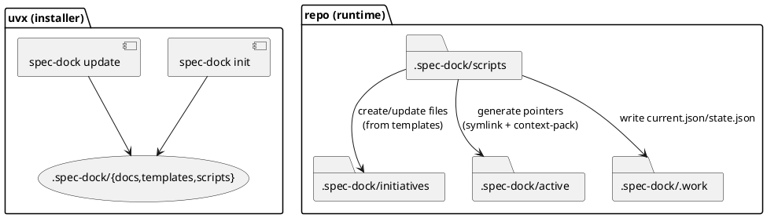

# 設計書: v2 ローカルスクリプト運用への再設計（追加対応）

## 全体方針（役割分担）
### 1) インストーラ（uvx で実行される `spec-dock` パッケージ）
- 役割: `.spec-dock/` の scaffold を **配置**・**更新**する
- 提供コマンド: `init` / `update`（基本これだけ）
- `.spec-dock/initiatives/**`（仕様本体）には触れない
- `.spec-dock/.work/` と `.spec-dock/active/` は **生成物**として扱い、更新では破壊しない

### 2) ランタイム（リポジトリ内のローカルスクリプト）
- 役割: 日常の仕様ツリー操作（作成/active/sync/validate）を行う
- 配置: `.spec-dock/scripts/spec-dock`（単一エントリ）
- 実装: 依存最小の Python スクリプト（標準ライブラリ中心）
  - ネットワーク不要（`sync --github` のみ `gh` を呼ぶ）
  - `.spec-dock/templates/` を参照してファイル生成する

## コマンド設計（ローカルスクリプト）
`./.spec-dock/scripts/spec-dock <command> ...`

- `new initiative --title ... [--id init-0001] [--slug ...] [--github-issue 123]`
- `new epic --initiative init-0001 --title ... [--id epic-0001] ...`
- `new issue --epic epic-0001 --title ... [--id iss-0001] [--github-issue 456] ...`
- `new adr --initiative|--epic|--issue <id> --title ... [--id adr-0001] ...`
- `active set --issue iss-0001`
- `active show`
- `active clear`
- `sync [--github] [--gh-limit N]`
- `validate`

## パス設計
- 仕様ツリー本体（Git 管理）: `.spec-dock/initiatives/**`
- 現在地（生成物 / gitignore）:
  - SSOT: `.spec-dock/.work/current.json`
  - ポインタ: `.spec-dock/active/{initiative,epic,issue}`（symlink）
  - 入口: `.spec-dock/active/context-pack.md`（生成）
- 状態集計（生成物 / gitignore）:
  - `.spec-dock/.work/state.json`

## 更新（update）と破壊防止
- `update` は `.spec-dock/{docs,templates,scripts}` を上書き更新する
- `.spec-dock/initiatives/**` は **絶対に削除しない**
- `.spec-dock/.work/` と `.spec-dock/active/` は **原則維持**
  - scripts 更新によって `active` の再生成が必要なら、利用者が `active set` / `sync` を実行して復旧できる

## 実装上のポイント
### 1) 既存実装の再利用
- 既存の `src/spec_dock/cli.py` にある node 操作ロジック（slugify, meta, scan, active, sync, validate）はローカルスクリプトへ移植する
- uvx CLI 側は init/update に絞り、運用ロジックは持たない（または持っても docs からは外す）

### 2) ローカルスクリプトの “repo root 探索”
- スクリプトは実行ディレクトリに依存しないよう、`cwd` から上方向に `.spec-dock/` を探索して project root を決める
- 見つからない場合はエラー（init 未実行）

### 3) symlink 生成のフォールバック
- 原則: symlink（mac/linux）
- 失敗時: `active/issue.path` のような pathfile を置く fallback（最低限 “どこが active か” が分かる）

## PlantUML（概念図）

