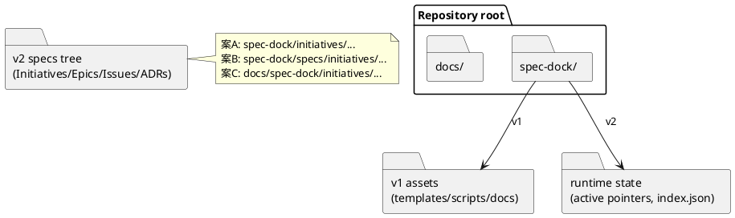

# シート01: 仕様ツリー本体の「置き場所・名前」を決める

目的: `spec-dock v2` のディレクトリ設計における **最上位（ルート）** を確定し、  
以降のテンプレ/CLI/Skill/AGENTS 導線がブレない状態にする。

> 注: 音声入力の影響で「回想構造」と書かれていましたが、文脈上は **「階層構造」** と解釈しています。

---

## 0. このシートで決めること（結論を1つにする）

- **仕様ツリー本体（Initiative→Epic→Issue…）を、プロジェクト内のどのパスに常置するか**
- **その最上位ディレクトリ名を何にするか**（`work` を避けたい要望を含む）
- 既存 `spec-dock v1` の生成物（`.spec-dock/current|completed`）との関係（互換 or 破壊）

この決定は次に強く影響します:
- `spec-dock new ...` が作るパス
- `spec-dock sync` が走査する範囲
- skill/AGENTS から「読むべき仕様」を指す固定パス
- 既存ユーザー向けの移行難易度（migrate の要否）

---

## 1. 背景（なぜ決める必要があるか）

### 1.1 v1 の前提（現状）
`spec-dock v1` は「作業中の1単位」を `.spec-dock/current/` に持ち、完了時に `.spec-dock/completed/` へ移動する運用でした。
このため `.spec-dock/current/` は **作業場**であり、そこが主戦場になります。

### 1.2 v2 のゴール（あなたの要望）
v2 は「大量の Issue を含む階層ツリー」を **常置**し、ファイル移動で状態を表さず、
`current initiative / current epic / current issue` をポインタで明示し、
進捗などの集計メタは「人間/エージェントが編集しない」＝自動生成したい。

→ つまり v2 の主戦場は **“階層ツリー本体”** です。  
その置き場所が曖昧だと、以降の設計が全部ブレます。

---

## 2. 評価軸（選ぶための物差し）

以下の軸で比較すると、あとで後悔しにくいです。

1) **人間の直感**: どこに何があるか迷わないか  
2) **エージェントの導線**: 固定パスで参照しやすいか（Skill/AGENTS から）  
3) **“閉じる/見せる”のバランス**: `spec-dock/` に閉じて良いのか、`docs/` に見せたいのか  
4) **リポジトリ汚染リスク**: 既存の `docs/` / `spec/` と衝突しないか  
5) **移行コスト**: v1 既存ユーザーをどのくらい守るか  
6) **将来拡張**: 生成物（dashboards/index.json 等）と混ざらないか

---

## 3. 代表的な配置案（候補）

ここでは「ツリー本体のルート」を 3 案に整理します。

### 案A: `spec-dock/initiatives/`（“ツール配下に閉じる”）

例:
```text
spec-dock/
  initiatives/
    INIT-0001-.../
      epics/
      discussions/
```

**意味**
- `spec-dock` が管理する仕様資産は `spec-dock/` 以下にまとまる
- プロジェクトの `docs/` とは分離される

**Pros**
- ツールの責務が明確（「spec-dock の資産はここ」）
- 既存 `docs/` と衝突しにくい
- v1 から v2 への移行が単純（ディレクトリ名の差分だけ）

**Cons**
- `spec-dock/` がリポジトリ直下に見えるため、見た目が気になる人もいる
- 既存の v1 構成（`current/`, `templates/` 等）と同居するため、命名設計が雑だと混乱する

**向いている**
- 仕様書は “内部運用資産” と割り切れる
- `spec-dock` が生成/管理するものを一箇所に閉じたい

---

### 案B: `spec-dock/specs/initiatives/`（“配下に置くが、意味名を付ける”）

例:
```text
spec-dock/
  specs/
    initiatives/
```

**Pros**
- `spec-dock/` の下でも「これは仕様ツリー本体」という区別がつく
- `spec-dock/active`（ポインタ）や `spec-dock/.agent`（生成物）と衝突しにくい

**Cons**
- ディレクトリが1段深くなり、パスが長くなる

**向いている**
- `spec-dock/` に閉じたいが、`initiatives/` 直下に色々増える未来が不安

---

### 案C: `docs/spec-dock/initiatives/`（“仕様を docs として表に出す”）

例:
```text
docs/
  spec-dock/
    initiatives/
```

**Pros**
- ドキュメントとして見つけやすい（人間の直感が強い）
- “仕様書は docs” というチームの文化に合う

**Cons**
- プロジェクトの `docs/` が既にある場合、衝突/混在リスクがある
- ツールが `docs/` を勝手に触ることに抵抗が出やすい
- `spec-dock/`（ツール管理領域）と物理的に離れるため、境界を明確に定義しないと運用が崩れる

**向いている**
- docs を中心に運用しており、仕様を “表のドキュメント” として扱う
- `spec-dock/` に仕様を置きたくない

---

## 4. 追加論点: v2 では「work」は何を指すのが良いか？

あなたの懸念は正しく、`work` は抽象的です。
ただし、v2 において “work” に相当する概念は 2 つあります。

1) **仕様ツリー本体**（長期保管・履歴資産）  
2) **現在地/状態/集計などの“ワークスペース状態”**（ローカル・生成物・gitignore）

この2つを同じ単語で呼ぶと、ほぼ確実に混乱します。

そのため、命名の原則として:
- 仕様ツリー本体: `initiatives/`（または `specs/initiatives/`）
- ワークスペース状態: `.agent/`（または `.runtime/`, `.cache/`）
のように **用途語**を分けるのが安定します。

---

## 5. UML（配置案の俯瞰）

どこに何を置くかの「見取り図」です（ディレクトリをコンポーネントとして表現）。



---

## 6. 実装への影響（開発担当者向けメモ）

ルートを決めると、以下が固定されます。

- `spec-dock new initiative` が作るパス
  - 例: `<ROOT>/INIT-0001-<slug>/...`
- `spec-dock sync` の走査起点
  - 例: `<ROOT>/` のみ走査すれば良い、等
- `spec-dock validate` の必須検査
  - 例: `INIT-*/meta.*` の存在、など

v1 互換を残すなら:
- `layout: legacy|tree` を設定（例: `spec-dock/spec-dock.config.json`）
- 既存ユーザーは legacy を維持、v2 新規は tree デフォルト
が “破壊的変更” を避ける現実解です。

---

## 7. ユーザー回答欄（ここを埋めてください）

### 7.1 選択
- [x] 案A: `spec-dock/initiatives/`
- [ ] 案B: `spec-dock/specs/initiatives/`
- [ ] 案C: `docs/spec-dock/initiatives/`
- [ ] その他（具体パス）: ______________________________

### 7.2 その理由（評価軸に沿って短く）
- 人間の直感:  
- エージェント導線:  
- 既存 `docs/` との関係:  
- v1 互換/移行の考え:  
- その他の制約（会社/チーム文化、CI制約等）:  

### 7.3 `spec-dock/`（ドット無し）について
- `spec-dock/` に仕様を置くことに抵抗はありますか？（はい/いいえ、理由）

いいえ

## 8. 結論（決まったら記入）

- 仕様ツリー本体ルート: `spec-dock/initiatives/`（案A）
- ディレクトリ命名ルール（例: `ID-slug`）: `init-0001-<slug>` 形式。**全て小文字**（macOS のケース非区別FS対策）
- v1 互換方針（legacy を残す/捨てる）: **捨てる**
