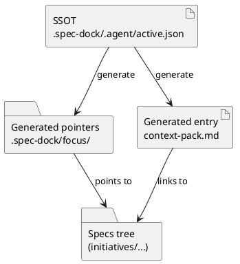

# シート02: 「current initiative / epic / issue」を固定パスで明示する（ポインタ設計）

目的: 大量の Issue がある前提で、**“今これをやっている”** を人間にもエージェントにも明確にし、  
Codex CLI / skill / AGENTS から **必ず同じ入口**に到達できる設計を確定する。

---

## 0. このシートで決めること

- “現在地” を表す **固定パス**をどこに置くか（例: `.spec-dock/current/` をどう扱うか）
- symlink 方式を採用するか、採用するならフォールバックをどうするか
- “current を切り替える”運用の事故（文脈混入）をどう防ぐか

---

## 1. 背景（なぜ current を再設計するのか）

### 1.1 v1 の current は「作業場」だった
v1 の `.spec-dock/current/` は、テンプレからコピーされた “一時作業ディレクトリ” であり、  
完了時には `.spec-dock/completed/` へ移動されます。

### 1.2 v2 の current は「ポインタ（ショートカット）」にしたい
v2 では仕様ツリー本体が常置されるため、`current` は “編集対象の場所” ではなく、
**現在取り組む対象（initiative/epic/issue）へ一瞬で飛ぶための固定入口**になります。

つまり、`current` は **参照のための安定した導線**であり、
そこに “状態や仕様の実体” を置くと破綻します。

---

## 2. 原則（壊れにくい設計のコア）

### 原則A: Single Source of Truth（SSOT）を 1 つにする
symlink を真実にすると、切れたり、環境差で壊れたり、差し替えミスが起きます。  
よって、真実は **manifest（例: `active.json` / `active.yml`）** に寄せるのが安全です。

### 原則B: “入口1枚” を固定パスで提供する
エージェントは毎回探索させると迷います。  
固定パスに `context-pack.md`（自動生成）を置き、そこから読むべき仕様を列挙します。

### 原則C: current を切り替えるなら “文脈混入” を防ぐ仕組みが必要
同じ作業ディレクトリで current だけ切り替えると、人間もエージェントも混線します。  
対策は次の優先順が堅いです。

1) **worktree で作業場所を分離**（最も事故が少ない）  
2) current 切替時は **セッションを切り替える**（Codex の文脈混入を避ける）  
3) `spec-dock current set` に **確認プロンプト/強制フラグ**を付ける（実装難易度低）

---

## 3. 設計案（候補）: “どこに current を置くか”

ここでは “固定入口ディレクトリ名” をどうするかを比較します。

### 案A: `.spec-dock/current/` を継続利用（意味を「作業場」→「ポインタ」に変更）

例:
```text
.spec-dock/current/
  initiative -> <real path>
  epic       -> <real path>
  issue      -> <real path>
  context-pack.md  (generated)
```

**Pros**
- 既存の Skill やドキュメントが `.spec-dock/current` を前提にしているため、移行が楽
- “current という概念” が既に浸透している

**Cons**
- v1 ユーザーの感覚（current=作業場）と衝突しやすい
- 既存の `spec-dock-close`（current を移動させる）と概念が真逆になる

**向いている**
- v2 を “v1 の自然進化” として扱い、既存導線を極力壊したくない

---

### 案B: `.spec-dock/focus/` や `.spec-dock/active/` に新設（`current` は legacy 専用にする）

例:
```text
.spec-dock/focus/
  initiative -> ...
  epic       -> ...
  issue      -> ...
  context-pack.md
```

**Pros**
- v1 の `current` と概念が混ざらない（大事）
- “今フォーカスしている対象”が言葉として強い（人間の認知が上がる）

**Cons**
- 既存 skill/ガイドの更新が必要（ただし v2 では必ず更新する想定なら問題は小さい）

**向いている**
- v1 と v2 を併存（`layout: legacy|tree`）させたい
- “current=作業場” の意味を守りたい

---

### 案C: `.spec-dock/current/` と `.spec-dock/focus/` を両方作る（互換エイリアス）

**Pros**
- 既存導線を壊さず v2 の意味名も得られる

**Cons**
- “どっちが正？” が再発する（SSOT を壊しやすい）
- 生成/更新が二重になりやすい

**向いている**
- 移行期間だけの暫定。恒久運用には注意が必要

---

## 4. 設計案（候補）: “何を SSOT にするか”

### SSOT案1: `active.json`（gitignore） + symlink 生成（推奨）

```
.spec-dock/
  .agent/              (gitignore)
    active.json        (SSOT)
    index.json         (generated)
    tree.json          (generated)
  focus/               (gitignore, generated)
    issue -> ...
    context-pack.md
```

**Pros**
- symlink が壊れても SSOT は残る（再生成可能）
- Windows など symlink 制限がある環境でも、SSOT をテキストとして扱える

**Cons**
- “まず manifest を読む” という仕組みが必要（ただし `spec-dock current show` が担える）

---

### SSOT案2: symlink 自体を SSOT にする（非推奨）

**Cons（致命）**
- 壊れた時に復旧根拠がない
- 差し替えミスが silent failure になりやすい

---

## 5. `context-pack.md`（固定入口1枚）の仕様案

`context-pack.md` は “その時点の current” から必ず生成し、以下を含めます。

- 現在の initiative/epic/issue の ID と実パス
- 読むべき順序（上位→下位）
- 実行コマンド（`spec-dock` コマンド含む）
- ガードレール（例: 「スコープ外は followups に起票」）

例（雰囲気）:
```markdown
# Context Pack (generated)

## Current
- initiative: INIT-0001 (…)
- epic: EPIC-0010 (…)
- issue: ISS-0123 (…)

## Read order
1) <initiative README>
2) <epic README>
3) <issue README>
4) <issue requirements/design/plan>

## Commands
- spec: spec-dock sync --github
- test: ...

## Guardrails
- 契約変更時は ADR を追加
```

この 1 枚があると、Skill/AGENTS は「まずこれを読め」で済みます。

---

## 6. UML（manifest → ポインタ生成 → エージェント参照）



---

## 7. 実装への影響（開発担当者向けメモ）

必要になる CLI/ロジック（最小）:
- `spec-dock current set --issue ISS-0123`
  - SSOT（`active.json`）更新
  - ポインタ（symlink or fallback）生成
  - `context-pack.md` 生成
- `spec-dock current show`
  - SSOT を表示（人間向け）
- `spec-dock current clear`
  - SSOT を空にしてポインタを消す/無効化

フォールバック設計:
- `pointers.mode = symlink | copy | pathfile`
- `symlink` 不可なら `copy`/`pathfile` に自動降格

---

## 8. ユーザー回答欄（ここを埋めてください）

### 8.1 固定入口ディレクトリ名（どれが良い？）
- [ ] 案A: `.spec-dock/current/` をポインタにする
- [x] 案B: `.spec-dock/active/`新設する
- [ ] 案C: 両方（移行期間だけ）
- [ ] その他: ______________________________

### 8.2 “current” という単語の意味（重要）
あなたのチーム/運用で `current` は何を意味しますか？
- [x] いま作業している対象（ポインタ）
- [ ] いま作業している作業場（テンプレのコピー）
- [ ] どちらでもよい
- [ ] その他: ______________________________

### 8.3 symlink の扱い
- 開発環境（OS）: mac, linux
- symlink が使えない/使いたくない事情はありますか？（はい/いいえ、理由）
いいえ

### 8.4 current 切替の運用
- “同一作業ディレクトリで current を頻繁に切替” をしたいですか？
  - [ ] はい（対策が必要）
  - [x] いいえ（基本は worktree/別作業ディレクトリで分離する）

---

## 9. 結論（決まったら記入）

- 固定入口ディレクトリ: `.spec-dock/active/`（案B）
- SSOT（manifest）: `.spec-dock/.agent/active.json`
- pointers.mode（デフォルト）: `symlink`（mac/linux 前提、symlink 不可事情なし）
- current 切替の事故対策（worktree/セッション/確認）: **基本は worktree / 別作業ディレクトリで分離**（同一作業ディレクトリでの頻繁切替はしない）
