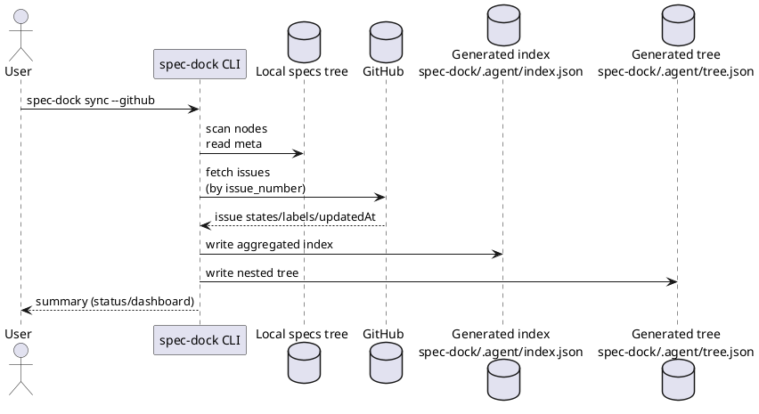

# シート03: 状態の正（Source of Truth）と `sync` の深さ（GitHub 連携）

目的: 「完了/進捗/状態」を誰が管理するか（人間/エージェント/自動生成/GitHub）を確定し、  
大量 Issue でも **乖離が起きない** 状態管理を設計する。

---

## 0. このシートで決めること

- “状態の正” を **GitHub に寄せるか / ローカルに寄せるか / ハイブリッドか**
- `spec-dock sync` がどこまで GitHub から情報を取るか（Issue/Labels/Project Status）
- ネットワークや認証が無い環境でもツールを動かすか（オフライン方針）

---

## 1. 背景（あなたの懸念の整理）

あなたの懸念は正しいです:
- Issue が進むたびに Epic/Initiative のメタ（進捗など）を手で更新すると、ほぼ確実に乖離する
- エージェントに上位メタを編集させると事故る（状態と実体がズレる）

したがって v2 の基本方針は:
- **永続メタ（ID/title/親子/リンク）は Git 管理**（最小・不変）
- **状態/進捗/集計は Git 管理しない生成物**（`sync` で更新）
に分離するのが堅いです。

---

## 2. 用語の整理（混乱を避ける）

### 2.1 “永続メタ” と “集計メタ”

- 永続メタ: ノードの同一性を保つ情報（例: `id`, `title`, `parent`, `github_issue_number`）
  - これは Git 管理に置く（レビュー可能・履歴が残る）
- 集計メタ: 状態・進捗・配下の数・未着手一覧など（例: `done/total`, `in_progress`）
  - これは生成物にする（編集禁止）

### 2.2 “状態の正（SSOT）” の候補

1) GitHub（Issue/Project）  
2) ローカル（ファイル内容や report/checklist）  
3) ハイブリッド（GitHub を正にしつつ、ローカルの補助信号を使う）

---

## 3. 状態の正: 候補比較（結論を出すための表）

| 候補 | SSOT | Pros | Cons | 向いている |
|---|---|---|---|---|
| A | GitHub Issue（open/closed + labels） | シンプル / 自然 / PR と連動 | Project の状態までは分からない | 個人開発〜小チーム |
| B | GitHub Projects の Status まで | “今何をしているか” が取れる | Projects の取得が難しい/権限が要る | 中規模以上 / プロセス重視 |
| C | ローカル（report/チェックリスト等） | オフライン可能 / Git だけで完結 | 推定が増え精度が落ちる | GitHub を使わない運用 |
| D | ハイブリッド（GitHub を正 + ローカル補助） | 精度と可用性のバランス | 実装が複雑化しやすい | 現実解（段階導入） |

実務のおすすめは **D（段階的に）** です:
- デフォルトはローカルスキャン（動作保証）
- `--github` を付けた時だけ GitHub で enrich（状態の正を GitHub に寄せる）

---

## 4. `sync` の深さ（GitHub から何を取るか）

### レベル0（ローカルのみ）
取得:
- ツリー走査（Initiative/Epic/Issue/ADR の存在）
- 永続メタ読み込み（`meta.*`）
生成:
- `spec-dock/.agent/index.json`（index: フラット索引 + 集計 “不明/未取得” を含む）
- `spec-dock/.agent/tree.json`（tree: initiative→epic→issue のネスト表示）

用途:
- オフラインでも `status` / `validate` が動く

---

### レベル1（GitHub Issue: open/closed + title + labels）
取得:
- `github_issue_number` を持つノードだけ GitHub から情報取得
- open/closed / updatedAt / labels / title

生成:
- index.json に `github.state` を付与
- initiative/epic の進捗（done/total）を算出

用途:
- “完了/未完了” が最小コストで一致する

---

### レベル2（GitHub Projects: Status/フィールド）
取得:
- Project の Status（Todo/In Progress/Done 等）
- Priority/Iteration などのフィールド（必要なら）

注意:
- 実装が急に難しくなる（GraphQL や `gh project`、権限）
- リポジトリ/組織によって Projects の使い方が違う

用途:
- 大規模で “open/closed だけでは足りない” 場合

---

## 5. オフライン/認証の方針（重要な割り切り）

現実的な落としどころ:
- `spec-dock sync`（ローカルのみ）は必ず成功する（依存ゼロ）
- `spec-dock sync --github` は optional（`gh` が無い/未認証なら warning で degrade）

こうすると:
- ツール導入のハードルが低い（CI/ローカルで確実に動く）
- GitHub がある環境では状態が強化される

---

## 6. UML（`sync --github` のデータフロー）

---

## 7. 実装への影響（開発担当者向けメモ）

### 7.1 生成物（gitignore）
- `spec-dock/.agent/index.json`（機械可読）
- `spec-dock/.agent/tree.json`（ネスト表示）
- `spec-dock/.agent/dashboard.md`（人間向け、任意）
- `spec-dock/.agent/cache/`（GitHub 結果キャッシュ、任意）

### 7.2 GitHub 取得手段（現実的な順）
1) `gh` CLI を利用（最短。ユーザーが既に使っていることが多い）
2) 直接 API（requests など）だが、認証/レート/設定が重い

### 7.3 “状態”を編集させないためのガード
- 生成物は `.gitignore` に入れる（誤コミット防止）
- `validate` で “生成物が古い” を検出して警告する

---

## 8. ユーザー回答欄（ここを埋めてください）

### 8.1 状態の正（SSOT）
- [ ] A: GitHub Issue（open/closed + labels）
- [ ] B: GitHub Projects（Status まで）
- [ ] C: ローカルのみ
- [x] D: ハイブリッド（段階導入）

### 8.2 `sync` の深さ（まずどこまで必要？）
- [ ] レベル0: ローカルのみで十分
- [x] レベル1: GitHub Issue まで欲しい
- [ ] レベル2: Projects の Status まで必要

### 8.3 オフライン方針
- [ ] ネットワーク無しでも必ず動く必要がある
- [x] GitHub 前提で良い（認証必須でも良い）

### 8.4 Projects を使っていますか？
- [ ] はい（どのフィールドを SSOT にしたい？）: ____________________
- [x] いいえ / 未定

---

## 9. 結論（決まったら記入）

- 状態の正（SSOT）: **ハイブリッド（段階導入）**（GitHub Issue を正として enrich する）
- `sync` のデフォルト挙動: ローカルスキャンで `index.json`（index）と `tree.json`（tree）を生成（`--github` で GitHub Issue 状態を付与）
- GitHub 取得（手段/必須度）: `gh` CLI 前提（認証必須でも良い）。Projects は未使用/未定のため対象外
