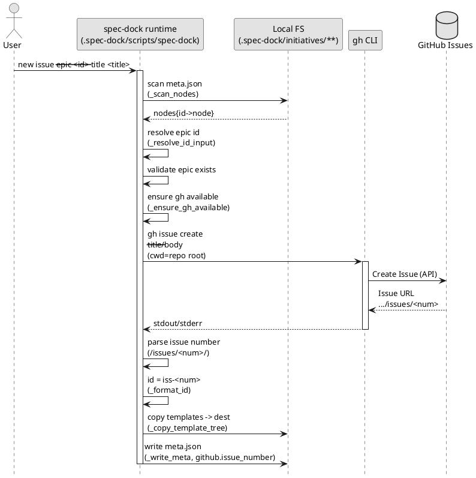
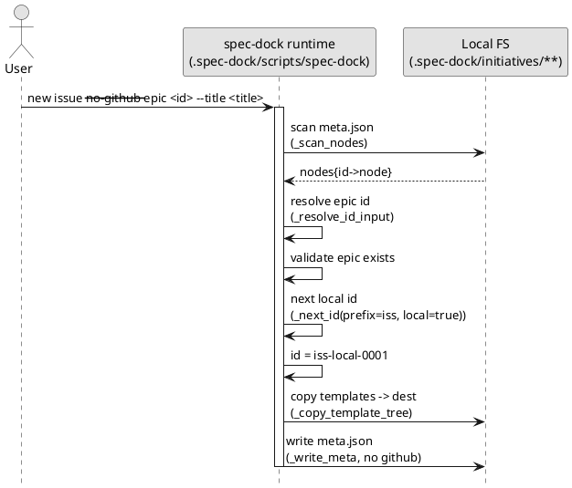
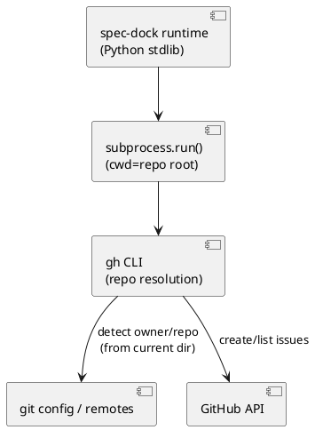

# GitHub Issue 作成（`gh` 連携）の内部仕様メモ（spec-dock v2）

対象:
- ランタイムスクリプト: `.spec-dock/scripts/spec-dock`（導入先リポジトリに配置される）
- このリポジトリ上の実体: `src/spec_dock/assets/spec_dock/scripts/spec-dock`

目的:
- `new initiative/epic/issue` が **どのように GitHub Issue を作成するか**
- その際に **どのリポジトリ（owner/repo）が対象になるか**（どこから取得しているか）
- 内部で使用している **技術/ツール/ライブラリ** と、失敗パターン

---

## 結論（短く）

- GitHub Issue の作成は **GitHub CLI（`gh`）をサブプロセス実行**して行っています。
  - Python から GitHub API を直接叩いたり、SDK/ライブラリを使ったりはしていません。
- リポジトリ名（owner/repo）やリポジトリIDは **spec-dock 側で取得・推測しません**。
  - `subprocess.run(..., cwd=<repo_root>)` で **実行ディレクトリだけ指定**し、以降は `gh` の「リポジトリ解決ロジック」に完全に委譲します。
  - つまり「どのリポジトリに Issue が作られるか」は **`gh` の解釈**（カレントディレクトリの Git 設定 / `GH_REPO` 等）で決まります。

---

## 1) どのコマンドを内部的に実行しているか

### 1.1 Issue 作成（デフォルト動作）

`./.spec-dock/scripts/spec-dock new {initiative,epic,issue} ...` は、デフォルトで以下を実行します:

```bash
gh issue create --title "<title>" --body "<body>"
```

- `--title` と `--body` を **必ず付ける**（非対話で確実に作れるようにする）
- `cwd`（実行ディレクトリ）は **導入先リポジトリの root**（`<repo>/.spec-dock/..`）に固定
- `gh` の出力（stdout/stderr）に含まれる URL から `/issues/<number>` を正規表現で抽出して Issue 番号を得る
- 得られた番号をそのまま ID に使う
  - 例: GitHub #123 → `iss-0123`
  - initiative/epic も同様に #123 → `init-0123` / `epic-0123`

### 1.2 sync の GitHub enrich（任意）

`./.spec-dock/scripts/spec-dock sync --github` は、GitHub 側の状態（OPEN/CLOSED 等）を enrich するために:

```bash
gh issue list --state all --limit <N> --json number,state,title,labels,updatedAt,url
```

を実行し、取得した一覧を `issue_number -> issue_json` の辞書にして使います。

ポイント:
- `sync` の「骨格」は常に **ローカル `.spec-dock/initiatives/**/meta.json` 走査**です
- `--github` はあくまで **状態の補強**（読み取り）で、GitHub に書き込みはしません

---

## 2) 「どのリポジトリに Issue を作るか」はどう決まるか

spec-dock は `gh issue create` 実行時に `--repo owner/repo` を指定していません。
そのため、対象リポジトリは **`gh` が決めます**。

spec-dock が行うのは次の 1 点だけです:

- `cwd` を「導入先リポジトリ root」にして `gh ...` を実行する

`gh` は一般に（代表例として）以下の情報を元に「対象リポジトリ」を解決します:

- カレントディレクトリが Git リポジトリであること
- `git remote`（例: `origin`）の URL（GitHub の owner/repo を含む）
- （必要に応じて）環境変数 `GH_REPO` による明示
- `gh auth`（ログイン/トークン）状況と権限

つまり spec-dock 観点の要点は:

- **導入先リポジトリが GitHub の git remote を持っていない**（または Git 管理されていない）と、`gh` が失敗し、結果として `new` はエラーになります
- 複数 remote / fork / organization 等の解決は `gh` の仕様に従います（spec-dock は介入しません）

> なお、spec-dock は「数値のリポジトリID」を使う場面がないため、リポジトリIDの取得も行いません。

---

## 3) 例外（`--no-github`）と ID 衝突回避

GitHub を使わない場合は `--no-github` を明示します。

```bash
./.spec-dock/scripts/spec-dock new issue --no-github --epic 1 --title "..."
```

このモードでは:
- `gh` は一切呼びません（GitHub が無い/オフライン/権限無しでも動く）
- ID は衝突回避のため `*-local-*` 名前空間になります
  - `iss-local-0001` / `epic-local-0001` / `init-local-0001`
- ローカル連番は `.spec-dock/initiatives/**/meta.json` を走査し、
  - 同じ prefix（iss/epic/init）の
  - `*-local-*` の最大値 + 1
  を採番します

理由:
- GitHub の Issue 番号（`iss-0123`）とローカル連番（`iss-0001`）が混ざると、後から GitHub と連携したときに **番号衝突**が起こり得るため
- `*-local-*` なら GitHub 番号と構文上明確に区別でき、衝突しません

---

## 4) 内部処理フロー（PlantUML）

### 4.1 `new issue`（デフォルト: GitHub）シーケンス



### 4.2 `new issue --no-github`（ローカル）シーケンス



### 4.3 リポジトリ解決（spec-dock は「cwd を渡すだけ」）



---

## 5) 使用している技術 / ツール / ライブラリ

### 5.1 Python（標準ライブラリのみ）

ランタイムスクリプトは依存を増やさない方針で、主に以下を使います:

- `argparse`: CLI パース（`new/active/sync/validate`）
- `pathlib.Path`: パス/ディレクトリ操作
- `json`: `meta.json`, `.work/current.json`, `.work/state.json`
- `json`: `meta.json`, `.work/current.json`, `.work/state.json`, `.work/tree.json`
- `subprocess`: `gh` の実行
- `re`: ID パース、`gh` 出力から Issue 番号抽出
- `shutil`, `os`: コピー、symlink、存在確認等

### 5.2 外部ツール

- `gh`（GitHub CLI）
  - Issue 作成: `gh issue create`
  - Issue 一括取得: `gh issue list --json ...`
  - 認証/対象リポジトリ解決/HTTP 通信は `gh` に委譲

> spec-dock 自体は GitHub API トークンや HTTP クライアントを保持しません。

---

## 6) 代表的な失敗パターンとメッセージの意味

### 6.1 `gh` が無い

- エラー: `'gh' CLI not found...`
- 対処:
  - GitHub CLI をインストールする
  - もしくは `--no-github` を付ける

### 6.2 GitHub リポジトリとして解決できない / 認証できない

`gh issue create` が失敗します（stderr が表示されます）。

よくある原因:
- 対象ディレクトリが Git リポジトリではない
- remote が GitHub を指していない / remote が未設定
- `gh auth login` 未実施 / 権限不足

対処:
- GitHub リポジトリを正しく設定した上で再実行
- もしくは `--no-github` でローカル運用に切り替える

---

## 7) 追加で改善できる余地（必要になったら）

要望次第で、次の拡張が自然です:

- `new ... --repo owner/repo` を追加し、`gh --repo ... issue create` で明示指定できるようにする
- `link` コマンドを追加し、`iss-local-0001` を後から `iss-0123` に連携（または GitHub issue number を meta.json に追記）できるようにする
  - ただし ID/ディレクトリ名の変更が入るので、履歴/リンク/active の扱いは設計が必要
