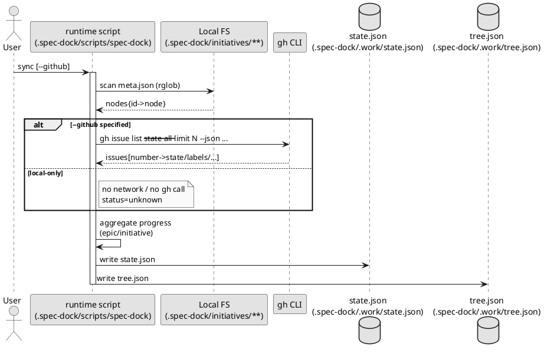
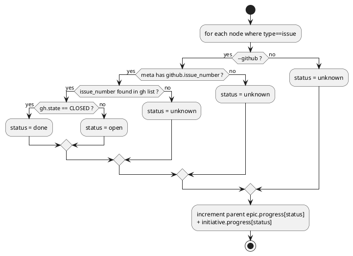

# Sync（状態集計）の仕組み解説（spec-dock v2 / ローカルスクリプト）

対象スクリプト: `.spec-dock/scripts/spec-dock`  
対象コマンド: `./.spec-dock/scripts/spec-dock sync [--github] [--gh-limit N]`

## 0. 結論（質問への答え）

`sync` の集計は **ローカルの仕様ツリー（`.spec-dock/initiatives/**`）を正として必ず走査**します。  
その上で、`--github` を付けた場合だけ **GitHub Issue の状態を `gh` CLI で取得して enrich（補強）**します。

- デフォルト（`sync`）: **ローカル集計のみ**  
  - issue の open/done は GitHub を見ないため、状態は `unknown` 扱い（集計でも `unknown` に入る）
- `sync --github`: **ローカル集計 + GitHub enrich**  
  - `meta.json` に `github.issue_number` がある issue だけ、GitHub から `open/done` を判定して集計

## 1. 何を入力として、何を出力するか

### 入力（ローカル）
- `.spec-dock/initiatives/**/meta.json`
  - initiative/epic/issue ノードの **永続メタ**（ID/親/所属など）
- `.spec-dock/.work/current.json`（存在すれば）
  - active（今作業中）の SSOT（Single Source of Truth）

### 入力（GitHub, 任意）
- `gh issue list ...` の結果（`--github` の時だけ）
  - issue の state（OPEN/CLOSED）, labels, updatedAt, url など

### 出力（生成物 / git 管理しない）
- `.spec-dock/.work/state.json`
  - 全ノードのフラットな索引 + 親子関係 + initiative/epic の進捗集計 + active（current）を含む
- `.spec-dock/.work/tree.json`
  - initiative→epic→issue のネスト表示（軽量。`state.json` の全情報は重複させない）

## 2. 集計の前提データ（meta.json の役割）

`sync` は “ローカルファイルの更新日時” や “report.md の記入状況” では進捗を判定しません。  
集計は **`meta.json` の関係性** と、（任意で）**GitHub の Issue state** のみで行います。

重要なフィールド（概念）:

- `id`: `init-0123`（GitHub #123）/ `init-local-0001`（`--no-github`）のような小文字 ID
- `type`: `initiative | epic | issue`
- `parent_id`: 親ノード（epic→initiative / issue→epic）
- `initiative_id`, `epic_id`: issue が所属する上位（集計に使用）
- `github.issue_number`（任意）: GitHub Issue と紐づけるための番号

## 3. sync の内部処理（ステップ別）

以下は実装上の処理順です（実体は `.spec-dock/scripts/spec-dock` 内の `_sync()`）。

### Step 1: ローカルツリーを走査してノード辞書を作る（必須）
1. `.spec-dock/initiatives/` 配下を再帰走査して `meta.json` を全取得
2. `id -> node` の辞書（インメモリ）を構築
3. `parent_id` を元に、`親 -> 子ID一覧` の索引も作る（state.json の `children` 用）

この時点で「initiative/epic/issue が何個あるか」「親子がどう繋がるか」は確定します。  
つまり **sync の骨格はローカルだけで完結**します。

### Step 2: （任意）GitHub Issue 一覧を取得する（`--github` の時だけ）
`--github` が付いている場合のみ、`gh` を呼びます。

- 実行コマンド（概念）:
  - `gh issue list --state all --limit <N> --json number,state,title,labels,updatedAt,url`
- 取得結果を `issue_number -> issue_json` の辞書に正規化して保持

注意:
- `--gh-limit` が小さすぎると、古い issue がリストに載らず `unknown` 扱いになります（後述）。

### Step 3: initiative/epic の “進捗” を集計する
進捗は **initiative と epic に対してのみ**生成します（issue 自体の進捗率は作りません）。

- 集計対象: `type == issue` のノード
- 集計キー: issue の `epic_id` と `initiative_id`（両方に加算）
- status 判定:
  - `--github` なし: `status = unknown`
  - `--github` あり + `github.issue_number` があり + GH 一覧で見つかった:
    - `CLOSED` → `done`
    - それ以外（OPEN）→ `open`
  - 上記に該当しない場合: `unknown`

結果として、initiative/epic の `progress` は以下のカウントになります:

- `total`: 配下 issue の総数
- `done`: GitHub で CLOSED と判定できた数
- `open`: GitHub で OPEN と判定できた数
- `unknown`: GitHub で状態が取れなかった数（`--github` なし/紐づけ無し/limit 漏れ等）

### Step 4: state.json（index）と tree.json（tree）を生成して書き出す
最後に `.spec-dock/.work/state.json`（index）と `.spec-dock/.work/tree.json`（tree）を生成します。

含まれるもの:
- `generated_at`: 生成時刻
- `root`: ツリーのルート（`.spec-dock/initiatives`）
- `active`: `.spec-dock/.work/current.json` があればその内容
- `nodes`（state.json）: 全ノードの辞書
  - `children`: 子ノードIDの配列（親子参照を簡単にするため）
  - `progress`: initiative/epic にだけ付与
  - `github`: `github.issue_number` がある場合のみ。`--github` 時は enrich 追加
- `tree`（tree.json）: 人間向けに initiative→epic→issue のネストを保持したツリー表示（最小フィールド）

## 4. PlantUML（内部処理の流れ）

### 4.1 シーケンス図（sync の実行フロー）


### 4.2 アクティビティ図（status 判定と加算）


## 5. 重要な注意点（想定外を避ける）

### 5.1 `sync` は “ローカルの状態” で完結するが、進捗の意味は変わる
- `sync`（ローカルのみ）でも `total` は出ます（配下 issue 数のカウント）
- ただし `open/done` が分からないので `unknown` が増えます
  - 「GitHub が正」の運用なら、`sync --github` を標準にすると分かりやすいです

### 5.2 `--github` は “紐づいた issue だけ” 判定できる
- `meta.json` に `github.issue_number` が無い issue は常に `unknown`
- `--gh-limit` が小さいと一覧に載らず `unknown` になる（特に古い issue）

### 5.3 Project 状態（In Progress など）は見ていない
現状は GitHub Projects のカスタム Status 等は参照しません。  
“OPEN/CLOSED” の二値で `open/done` を集計します（単純で壊れにくい代わりに情報は粗い）。

### 5.4 ローカルに issue はあるが、GitHub Issue を作成していない場合
ローカルの issue ディレクトリ（例: `.../issues/iss-local-0007-.../`）が存在しても、
その `meta.json` に `github.issue_number` が無い場合は **GitHub 側と未連携**です。

このときの挙動は以下です:

- `sync`（ローカルのみ）
  - issue の状態は判定できないため、その issue は `unknown` として集計されます
- `sync --github`（GitHub enrich あり）
  - **GitHub から状態を取るためのキー（issue_number）が無い**ので、やはり `unknown` のままです
  - つまり `--github` を付けても、未連携 issue が勝手に `open/done` になったりはしません

> 重要: `sync --github` は **読み取り（enrich）だけ**です。  
> GitHub 上に issue を作成したり、ローカル issue を GitHub に登録したりはしません。

#### 例（progress の見え方）
Epic 配下に issue が 3 つあるとして:

- `iss-0101`（GitHub #101 に連携済み / OPEN）
- `iss-local-0001`（GitHub 未作成 / 未連携）
- `iss-0102`（GitHub #102 に連携済み / CLOSED）

`sync --github` の結果、epic の progress は概ねこうなります:

- `total=3`
- `open=1`
- `done=1`
- `unknown=1`（= 未連携の `iss-local-0001`）

### 5.5 後から GitHub Issue を作った場合（どうやって反映されるか）
後から GitHub Issue を作った場合、`meta.json` に `github.issue_number` を追加しない限り、
`sync --github` はその対応関係を知ることができません（なので `unknown` のままです）。

運用としては次のいずれかになります:

- GitHub で issue を作った後、ローカル issue の `meta.json` に `github.issue_number` を追記する
- 先に GitHub issue を作って番号を確定し、ローカル issue を作る時点で `--github-issue` を渡す

（補足）将来的に “手編集を減らす” なら、
`./.spec-dock/scripts/spec-dock link --issue iss-local-0001 --github-issue 123` のような
「連携だけ行うコマンド」を追加するのが自然です（現状は未実装）。

## 6. state.json（index）の最小イメージ

```json
{
  "schema_version": 1,
  "generated_at": "2026-02-05T12:34:56+09:00",
  "root": ".spec-dock/initiatives",
  "active": { "...": "..." },
  "nodes": {
    "init-0123": {
      "type": "initiative",
      "children": ["epic-0124"],
      "progress": { "total": 2, "done": 0, "open": 1, "unknown": 1 }
    },
    "epic-0124": {
      "type": "epic",
      "children": ["iss-0125", "iss-local-0001"],
      "progress": { "total": 2, "done": 0, "open": 1, "unknown": 1 }
    },
    "iss-0125": {
      "type": "issue",
      "github": { "issue_number": 123, "state": "OPEN", "labels": ["bug"] }
    },
    "iss-local-0001": {
      "type": "issue"
    }
  }
}
```

## 7. tree.json（tree）の最小イメージ

```json
{
  "schema_version": 1,
  "generated_at": "2026-02-05T12:34:56+09:00",
  "root": ".spec-dock/initiatives",
  "active": { "...": "..." },
  "tree": [
    {
      "id": "init-0123",
      "title": "Auth platform",
      "progress": { "total": 2, "done": 0, "open": 1, "unknown": 1 },
      "epics": [
        {
          "id": "epic-0124",
          "title": "JWT auth",
          "progress": { "total": 2, "done": 0, "open": 1, "unknown": 1 },
          "issues": [
            { "id": "iss-0125", "title": "Add refresh token", "github": { "issue_number": 123, "state": "OPEN" } },
            { "id": "iss-local-0001", "title": "..." }
          ]
        }
      ]
    }
  ]
}
```
