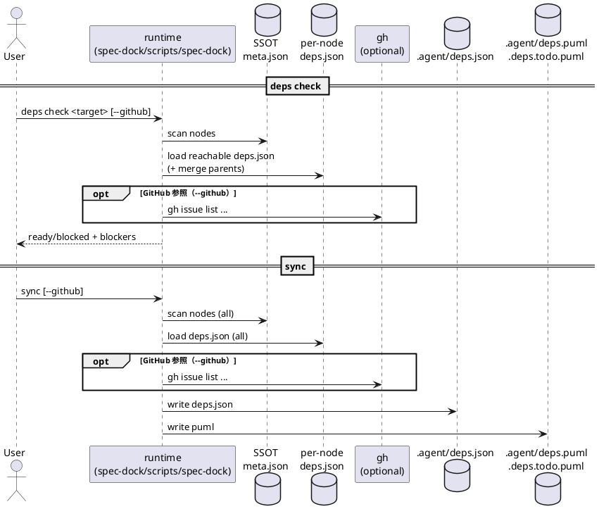

# iss-00009 Issue/Epic/Initiative の依存関係管理（実行可能判定・PlantUML可視化・active setガード） — 実装計画（TDD: Red → Green → Refactor）

## この計画で満たす要件ID (必須)
- 対象AC: AC-001〜AC-011（`spec-deps/completed/20260228T140046Z-issue-queue-iss-00009/requirement.md`）
- 対象EC: EC-001〜EC-011（`spec-deps/completed/20260228T140046Z-issue-queue-iss-00009/requirement.md`）
- 対象制約:
  - `meta.json` は変更しない（依存は `deps.json` に分離）
  - runtime script は stdlib のみ（外部依存追加なし）
  - GitHub Issue を更新しない（ラベル/クローズ/本文編集などは禁止）

## ステップ一覧（観測可能な振る舞い） (必須)
- [ ] S01: `sync --github`（成功/部分取得/失敗）をテストで再現できる（`gh issue list` stub + ベースライン固定）
- [ ] S02: `deps check <target>` が動作し、ready/blocked と終了コード（0/3/1）を返す（MVP: 依存なし）
- [ ] S03: `deps.json` のパース/スキーマ検証（EC-001/002/007）を実装し、エラーはパス+理由つきで失敗する
- [ ] S04: 依存参照の解決（node id / GH番号、canonicalize、EC-006）を実装し、解決不能/曖昧は失敗する
- [ ] S05: 実効依存の継承/マージ（issue: self+epic+init、epic: self+init）を実装し、順序は決定的になる（AC-002）
- [ ] S06: 自己依存/循環依存の検出（EC-003/004）を実装する（`sync`=全体、`deps check`/`active set`=到達範囲）
- [ ] S07: GitHub state を使った Done/Unknown と ready 判定（AC-003/EC-005/008、ADR-00006）を実装する（warn code を安定化）
- [ ] S08: `active set` を依存でガードし、`--force` で例外化する（AC-004/005）。派生物の上書き事故を防ぐ
- [ ] S09: `sync` で `.agent/deps.json` と PlantUML（全体/todo-only）を生成する（AC-006/007/008）
- [ ] S10: docs を更新し、運用/コマンド/生成物をリファレンス化する
- [ ] S11: 親→配下（descendant）依存を fail-fast で検出し、deps.json パス+依存先 id を含む構造エラーにする（EC-009）
- [ ] S12: `sync --force` は deps 構造エラー時も index/tree を更新し、deps 派生物は削除し、warn code を安定化する（EC-010）
- [ ] S13: 追加仕様（EC-009/010、state/ready の補足）を docs に反映する
- [ ] S14: `new` の GitHub デフォルトを ADR-00006 に合わせて変更し、wrapper 導線を整備する（AC-009〜AC-011）
- [ ] S15: epic/initiative の state/Done を配下 issue から導出し、`.agent/deps.json` に `progress` を追加する（EC-011、AC-006）
- [ ] S16: `deps check` / `active set` 非`--github`時は `.agent/index.json` を参照して状態を扱う（AC-001/003、EC-005/008）
- [ ] S17: ADR-00006 反映の docs 追補（`guide.md` / `reference_github.md` / `reference_sync.md` など）
- [ ] S18: `deps.puml` のノードラベルに `ready=false` を追記し、done+ready=false を図上で識別できるようにする（AC-007）
- [ ] S19: `active set/clear` は `sync` を自動実行せず、既存 `.agent/{index,tree}.json` の active のみをbest-effortで更新する
- [ ] S20: `sync --force` の tree preflight forced fail 時も deps 派生物を削除して stale を防止する
- [ ] S21: docs 追補（`reference_deps.md` の PlantUML ラベルに `ready=false` を明記する）

### 終了コード（契約） (必須)
- `0`: ready（実行可能）
- `3`: blocked（依存未解決/Unknown を含む）
- `1`: 構造エラー（deps.json 不正、解決不能参照、自己依存、cycle など）
- `2`: 引数エラー（`argparse`。reserved）

### UML（任意） (任意)

### 要件 ↔ ステップ対応表 (必須)
- AC-001 → S02〜S07, S16
- AC-002 → S05
- AC-003 → S01, S07
- AC-004 → S08, S19
- AC-005 → S08, S19
- AC-006 → S09, S15
- AC-007 → S09, S18, S21
- AC-008 → S09
- AC-009 → S14
- AC-010 → S14
- AC-011 → S14
- EC-001 → S03
- EC-002 → S03
- EC-003 → S06
- EC-004 → S06
- EC-005 → S07, S16
- EC-006 → S04
- EC-007 → S03
- EC-008 → S01, S07, S09
- EC-009 → S11
- EC-010 → S12, S20
- EC-011 → S15
- 非交渉制約（stdlib/meta不変更/GitHub更新禁止）→ S02〜S21（全ステップで維持し、テスト/差分で検証）

---

## 実装ステップ（各ステップは“観測可能な振る舞い”を1つ） (必須)

### 共通品質ゲート（各ステップ末尾） (必須)
- Red/Green 中は、追加・変更したテストケースを個別に実行してよい
- ただし「ステップ末尾（省略しない）」では必ず `python -m unittest discover -v` を実行し、**全テスト**が成功していること
- ステップ末尾でレビュアー（マルチエージェント）にレビューを依頼し、指摘を反映して承認を得ること

### S01 — `sync --github` をテストで再現できる（gh stub） (必須)
- 対象: AC-003 / EC-008（テスト基盤として）
- 設計参照:
  - 対象IF/API: `_gh_issue_index()` / `sync --github --gh-limit`
  - 対象テスト:
    - `tests/test_cli.py::test_sync_github_populates_issue_statuses`
    - `tests/test_cli.py::test_sync_github_passes_gh_limit_to_gh`（任意: 引数伝播の固定）
    - `tests/test_cli.py::test_sync_github_index_incomplete_warns_and_marks_unknown`（部分取得）
    - `tests/test_cli.py::test_sync_github_fetch_failure_warns_and_continues`（完全失敗）
- このステップで「追加しないこと（スコープ固定）」:
  - deps コマンドや deps 派生物の生成はまだ追加しない（テスト基盤のみ）

#### update_plan（着手時に登録） (必須)
- [ ] `update_plan` に、このステップの作業ステップ（調査/Red/Green/Refactor/品質ゲート/報告/コミット）を登録した

#### 期待する振る舞い（テストケース） (必須)
- Given: `gh issue list` を返す stub が PATH 先頭にある
- When: `sync --github --gh-limit N` を実行する
- Then: 既存 `index.json` の issue `status` が OPEN/CLOSED に従って `open/done` になる
- 追加で:
  - `--gh-limit` 不足で取得漏れがある場合、取得できない issue は Unknown として扱い warn を出しつつ継続する（EC-008）
  - `gh` 取得が完全に失敗した場合も warn を出しつつ継続し、GitHub state は Unknown として扱う（EC-008）
- 観測点: `.agent/index.json`、stderr（warn + 復旧ヒント）、終了コード（0）

#### Red（失敗するテストを先に書く） (任意)
- 期待する失敗:
  - stub が無いと `gh` 取得で失敗する（非 determinism の排除）

#### Green（最小実装） (任意)
- 変更予定ファイル:
  - Modify: `tests/test_cli.py`（`gh issue list` stub 追加）
- 実装方針:
  - stub は `gh issue list` のみを実装し、最小 JSON を返す
  - 併せて、テスト側に「spec ツリー生成（init/epic/issue）」「deps.json 配置」「--json 出力のパース」ヘルパーを追加し、以降の重複を抑える

#### Refactor（振る舞い不変で整理） (任意)
- 目的:
  - 以降の deps テストで `gh` を安定的にスタブできるようにする

#### ステップ末尾（省略しない） (必須)
- [ ] `python -m unittest discover -v` を実行し、全テストが成功した
- [ ] レビュアーにレビューを依頼し、指摘を反映して承認を得た
- [ ] `./spec-dock/active/issue/report.md` に実行コマンド/結果/変更ファイルを記録した
- [ ] `update_plan` を更新し、このステップの作業ステップを完了にした
- [ ] コミットした（エージェント）

---

### S02 — `deps check` が動作し、ready/blocked と終了コードを返す（依存なし） (必須)
- 対象: AC-001 / EC-001
- 設計参照:
  - 対象IF/API: CLI 契約（`deps check`）/ 終了コード実装メモ
  - 対象テスト:
    - `tests/test_cli.py::test_deps_check_no_deps_is_ready`
    - `tests/test_cli.py::test_deps_check_missing_target_is_argparse_exit_2_not_blocked`
    - `tests/test_cli.py::test_deps_check_accepts_github_number_forms_and_urls`
    - `tests/test_cli.py::test_deps_check_json_stdout_only`（stdout=JSON 固定）
    - `tests/test_cli.py::test_deps_commands_do_not_mutate_meta_json`
- このステップで「追加しないこと（スコープ固定）」:
  - `deps.json` の厳密バリデーション（次ステップ）
  - GitHub state を使った Done 判定（S07）

#### update_plan（着手時に登録） (必須)
- [ ] `update_plan` に登録した

#### 期待する振る舞い（テストケース） (必須)
- Given: 依存定義ファイルが存在しない（deps 未定義）
- When: `spec-dock deps check <target>` を実行する
- Then: `ready=true`（実効依存が空）で exit=0
- 観測点:
  - 終了コード
  - `--json` の stdout が JSON のみ（stderr は空）
  - `meta.json` が変更されないこと

#### Red（失敗するテストを先に書く） (任意)
- 期待する失敗:
  - `deps` サブコマンドが存在しない（argparse error）

#### Green（最小実装） (任意)
- 変更予定ファイル:
  - Modify: `src/spec_dock/assets/spec_dock/scripts/spec-dock`
  - Modify: `tests/test_cli.py`
- 追加する概念（このステップで導入する最小単位）:
  - `deps check` サブコマンド（argparse + ハンドラ）
  - `--json` 時の stdout=JSON 固定（warnings は常に `[]`）
  - 終了コード（0/3/1）の返却経路（`main()` の返り値尊重）
- 実装方針:
  - 依存未定義は空として扱い、まず “動く入口” を作る（機能は次ステップで拡張）

#### Refactor（振る舞い不変で整理） (任意)
- 目的:
  - 以降の deps 実装を差し込みやすい関数境界に整える

#### ステップ末尾（省略しない） (必須)
- [ ] `python -m unittest discover -v` を実行し、全テストが成功した
- [ ] レビュアーにレビューを依頼し、指摘を反映して承認を得た
- [ ] report 更新
- [ ] update_plan 更新
- [ ] コミット

---

### S03 — `deps.json` のパース/スキーマ検証を実装する (必須)
- 対象: EC-001 / EC-002 / EC-007
- 設計参照:
  - 対象IF/API: IF-001（`_load_deps_json`）/ ERR-001/ERR-002
  - 対象テスト:
    - `tests/test_cli.py::test_deps_check_missing_deps_json_is_empty`
    - `tests/test_cli.py::test_deps_json_parse_error_fails_with_path`
    - `tests/test_cli.py::test_deps_json_schema_error_fails_with_reason`
- このステップで「追加しないこと（スコープ固定）」:
  - ref 解決（次ステップ）

#### update_plan（着手時に登録） (必須)
- [ ] `update_plan` に登録した

#### 期待する振る舞い（テストケース） (必須)
- Given: 壊れた JSON / schema_version 不正 / depends_on の型不正
- When: `deps check <target>` を実行する
- Then: exit=1 で失敗し、stderr に「deps.json のパス + 理由」が含まれる

#### Red（失敗するテストを先に書く） (任意)
- 期待する失敗:
  - 壊れた JSON を黙殺してしまう、または理由/パスが出ない

#### Green（最小実装） (任意)
- 変更予定ファイル:
  - Modify: `src/spec_dock/assets/spec_dock/scripts/spec-dock`
  - Modify: `tests/test_cli.py`
- 実装方針:
  - `deps.json` 不在は `depends_on=[]` として扱う
  - 不明キーは無視（将来拡張）

#### ステップ末尾（省略しない） (必須)
- [ ] `python -m unittest discover -v` を実行し、全テストが成功した
- [ ] レビュアーにレビューを依頼し、指摘を反映して承認を得た
- [ ] report 更新
- [ ] update_plan 更新
- [ ] コミット

---

### S04 — 依存参照の解決（node id / GH番号、canonicalize） (必須)
- 対象: EC-006
- 設計参照:
  - 対象IF/API: IF-002（`_resolve_dep_ref`）/ ERR-003
  - 対象テスト:
    - `tests/test_cli.py::test_deps_unresolved_ref_reports_ref_and_deps_path`
    - `tests/test_cli.py::test_deps_canonicalizes_width_variants`
    - `tests/test_cli.py::test_deps_github_number_requires_imported_node`
    - `tests/test_cli.py::test_deps_ambiguous_github_number_reference_fails_with_ref_and_path`（任意）
- このステップで「追加しないこと（スコープ固定）」:
  - 親依存のマージ（次ステップ）

#### update_plan（着手時に登録） (必須)
- [ ] `update_plan` に登録した

#### 期待する振る舞い（テストケース） (必須)
- Given: `deps.json` が存在し、depends_on に存在しない node id / 未 import の GitHub issue number が含まれる
- When: `deps check <target>` を実行する
- Then: exit=1。stderr に ref と定義元 `deps.json` のパスが含まれる

#### Green（最小実装） (任意)
- 実装方針:
  - node id は spec ツリー内の id と **完全一致**で解決する（数値抽出で “それっぽく” 正規化しない）
  - GitHub issue number は spec ツリー内の 1 node に一意に解決できない場合はエラー

#### ステップ末尾（省略しない） (必須)
- [ ] `python -m unittest discover -v` を実行し、全テストが成功した
- [ ] レビュアーにレビューを依頼し、指摘を反映して承認を得た
- [ ] report 更新
- [ ] update_plan 更新
- [ ] コミット

---

### S05 — 実効依存の継承/マージ（親の依存を含める） (必須)
- 対象: AC-002
- 設計参照:
  - 対象IF/API: IF-003（`_effective_depends_on`）
  - 対象テスト:
    - `tests/test_cli.py::test_deps_effective_depends_on_merges_parents_and_dedups`
    - `tests/test_cli.py::test_deps_effective_depends_on_merges_epic_and_initiative`（epic=self+init）
- このステップで「追加しないこと（スコープ固定）」:
  - cycle 検出（次ステップ）

#### update_plan（着手時に登録） (必須)
- [ ] `update_plan` に登録した

#### 期待する振る舞い（テストケース） (必須)
- Given: issue 自身/親 epic/親 initiative がそれぞれ deps を持つ
- When: issue を `deps check` する
- Then: 実効依存が和集合になり、重複が除かれ、順序が決定的である

#### Green（最小実装） (任意)
- 実装方針:
  - 解決後（canonicalize 後）に重複排除し、node id の決定的 sort を適用

#### ステップ末尾（省略しない） (必須)
- [ ] `python -m unittest discover -v` を実行し、全テストが成功した
- [ ] レビュアーにレビューを依頼し、指摘を反映して承認を得た
- [ ] report 更新
- [ ] update_plan 更新
- [ ] コミット

---

### S06 — 自己依存/循環依存の検出（scope 付き） (必須)
- 対象: EC-003 / EC-004
- 設計参照:
  - 対象IF/API: IF-004（scope: `sync`=全体 / `deps check`/`active set`=到達範囲）
  - 対象テスト:
    - `tests/test_cli.py::test_deps_self_dependency_fails`
    - `tests/test_cli.py::test_deps_cycle_detected_in_reachable_graph`
    - `tests/test_cli.py::test_deps_check_ignores_unreachable_cycle`
    - `tests/test_cli.py::test_sync_fails_on_cycle_anywhere_in_graph`（sync=全体検査）
- このステップで「追加しないこと（スコープ固定）」:
  - GitHub Done 判定（次ステップ）

#### update_plan（着手時に登録） (必須)
- [ ] `update_plan` に登録した

#### 期待する振る舞い（テストケース） (必須)
- Given: cycle が存在する
- When: `deps check <target>` / `sync` を実行する
- Then:
  - reachable cycle は exit=1 で失敗し、`A -> B -> ... -> A` が出力される
  - unreachable cycle は `deps check <target>` の失敗要因にしない
  - ただし `sync` は全体検査なので、到達不能でも cycle があれば失敗する

#### ステップ末尾（省略しない） (必須)
- [ ] `python -m unittest discover -v` を実行し、全テストが成功した
- [ ] レビュアーにレビューを依頼し、指摘を反映して承認を得た
- [ ] report 更新
- [ ] update_plan 更新
- [ ] コミット

---

### S07 — GitHub state 連携の ready 判定と warnings（安定化） (必須)
- 対象: AC-003 / EC-005 / EC-008
- 設計参照:
  - ADR-00002（状態モデル）/ ADR-00006（epic/initiative Done・GitHubポリシー）/ WARN-001/002（warning code）
  - 対象テスト:
    - `tests/test_cli.py::test_deps_check_exit_codes_ready_blocked_error`（exit code の分離）
    - `tests/test_cli.py::test_deps_check_github_ready_and_blocked`
    - `tests/test_cli.py::test_deps_github_fetch_failure_warns_and_blocks`
    - `tests/test_cli.py::test_deps_github_index_incomplete_warns_and_blocks`
    - `tests/test_cli.py::test_deps_github_index_incomplete_is_scoped_to_evaluated_issues`（負例: 無関係な欠落で warn しない）
    - `tests/test_cli.py::test_deps_check_passes_gh_limit_to_gh`（任意: 引数伝播）
    - `tests/test_cli.py::test_deps_check_json_stdout_only_and_warnings_on_stderr`
    - `tests/test_cli.py::test_deps_check_json_includes_effective_depends_on_blockers_and_nodes`
    - `tests/test_cli.py::test_deps_check_github_treats_local_only_dep_as_unknown_and_blocks`（EC-005: local-only）
- このステップで「追加しないこと（スコープ固定）」:
  - `active set` ガード（次ステップ）
  - `sync` の deps 生成（S09）

#### update_plan（着手時に登録） (必須)
- [ ] `update_plan` に登録した

#### 期待する振る舞い（テストケース） (必須)
- Given: 依存先の GitHub state が取得できる（stub）
- When: `deps check <target> --github` を実行する
- Then: 依存先がすべて Done なら ready/exit=0、未Done（OPEN/Unknown 等）があれば blocked/exit=3
- 追加で:
  - gh 取得失敗: warn（`warnings[]` に `gh_fetch_failed`）+ Unknown 扱い + blocked
  - gh-limit 不足: warn（`warnings[]` に `gh_index_incomplete`）+ missing を Unknown 扱い
  - warn には原因と復旧ヒント（例: `sync --github` / `--gh-limit` / `gh auth status`）が含まれる

#### ステップ末尾（省略しない） (必須)
- [ ] `python -m unittest discover -v` を実行し、全テストが成功した
- [ ] レビュアーにレビューを依頼し、指摘を反映して承認を得た
- [ ] report 更新
- [ ] update_plan 更新
- [ ] コミット

---

### S08 — `active set` の依存ガード + `--force` + 派生物上書き事故の回避 (必須)
- 対象: AC-004 / AC-005
- 設計参照:
  - `active set` 契約（exit=3、`--force`、`--github`）/ IF-007（派生物 active patch）
  - 対象テスト:
    - `tests/test_cli.py::test_active_set_blocked_does_not_mutate_active_json_without_force`
    - `tests/test_cli.py::test_active_set_force_updates_active_and_emits_warn`
    - `tests/test_cli.py::test_active_set_force_does_not_bypass_deps_structural_errors`
    - `tests/test_cli.py::test_active_set_github_allows_when_deps_done`（`--github` 伝播）
    - `tests/test_cli.py::test_active_set_passes_gh_limit_to_gh`（`--gh-limit` 伝播）
    - `tests/test_cli.py::test_active_set_updates_index_tree_active_only`
    - `tests/test_cli.py::test_active_set_does_not_mutate_meta_json`
- このステップで「追加しないこと（スコープ固定）」:
  - `sync` の deps 生成（次ステップ）

#### update_plan（着手時に登録） (必須)
- [ ] `update_plan` に登録した

#### 期待する振る舞い（テストケース） (必須)
- Given: target が blocked
- When: `active set <target>` を実行する
- Then: exit=3、active.json は不変、blockers が表示される
- When: `active set <target> --force` を実行する
- Then: exit=0、active.json が更新され、warn が出る
- When: 構造エラー（cycle / 不正 deps.json / 解決不能参照など）が存在する状態で `active set <target> --force` を実行する
- Then: exit=1 で失敗し、`--force` でも構造エラーは回避できない
- When: `active set <target> --github [--gh-limit N]` を実行する
- Then: `deps check --github` 相当の判定が行われ、GitHub state により ready/blocked が変化する
- 回帰防止:
  - `sync --github` で enrich 済みの `.agent/index.json`/`.agent/tree.json` が、`active set` により local モードで上書きされない（`active` のみ更新）

#### ステップ末尾（省略しない） (必須)
- [ ] `python -m unittest discover -v` を実行し、全テストが成功した
- [ ] レビュアーにレビューを依頼し、指摘を反映して承認を得た
- [ ] report 更新
- [ ] update_plan 更新
- [ ] コミット

---

### S09 — `sync` が deps 派生物（json/puml）を生成する (必須)
- 対象: AC-006 / AC-007 / AC-008
- 設計参照:
  - MODEL-002/003（最小契約）/ IF-005/006 / `sync --force` と deps エラーの関係
  - 対象テスト:
    - `tests/test_cli.py::test_sync_generates_deps_json_and_puml`
    - `tests/test_cli.py::test_sync_github_fetch_failure_warns_and_still_generates_deps_outputs`
    - `tests/test_cli.py::test_sync_github_index_incomplete_warns_and_still_generates_deps_outputs`
    - `tests/test_cli.py::test_sync_deps_puml_contains_legend_and_state_colors`
    - `tests/test_cli.py::test_sync_todo_puml_excludes_done_nodes`
    - `tests/test_cli.py::test_sync_does_not_mutate_meta_json`
- このステップで「追加しないこと（スコープ固定）」:
  - UI/TUI 等の編集機能は追加しない

#### update_plan（着手時に登録） (必須)
- [ ] `update_plan` に登録した

#### 期待する振る舞い（テストケース） (必須)
- When: `sync` を実行する
- Then:
  - `.agent/deps.json` が生成され、`schema_version/generated_at/nodes[<id>].state/ready/effective_depends_on/blockers` を含む（`nodes` は id-keyed dict）
    - `progress` は S15 で追加する（このステップでは未要求）
  - `.agent/deps.puml` が生成され、凡例と state 色分けがある
  - `.agent/deps.todo.puml` は done ノード/edge を除外する
- 追加で:
  - deps 構造エラーは `sync`（非`--force`）では exit=1
    - `sync --force` の扱い（exit=0 で継続、deps 派生物削除、warn code）は S12/EC-010 に従う
  - `sync --github` の gh 取得失敗は warn して Unknown 扱いで継続（生成物は出る）

#### ステップ末尾（省略しない） (必須)
- [ ] `python -m unittest discover -v` を実行し、全テストが成功した
- [ ] レビュアーにレビューを依頼し、指摘を反映して承認を得た
- [ ] report 更新
- [ ] update_plan 更新
- [ ] コミット

---

### S10 — docs 更新（運用・コマンド・生成物） (必須)
- 対象: ドキュメント整備（要件の観測点/運用を支える）
- 設計参照:
  - 変更計画（docs）/ CLI 契約 / 生成物一覧
- 変更予定ファイル:
  - Add: `src/spec_dock/assets/spec_dock/docs/reference_deps.md`（依存定義/コマンド/生成物）
  - Modify: `src/spec_dock/assets/spec_dock/docs/reference_sync.md`（deps 出力追記）
  - Modify: `src/spec_dock/assets/spec_dock/docs/guide.md`（導線追加）
- このステップで「追加しないこと（スコープ固定）」:
  - 仕様変更（AC/EC の追加）は行わない

#### update_plan（着手時に登録） (必須)
- [ ] `update_plan` に登録した

#### 期待する振る舞い（テストケース） (必須)
- Given: ユーザー/エージェントが docs を読む
- Then: `deps.json` の書式、`deps check`、`sync` の生成物、`active set` ガード/`--force` が迷わず分かる

#### ステップ末尾（省略しない） (必須)
- [ ] `python -m unittest discover -v` を実行し、全テストが成功した
- [ ] レビュアーにレビューを依頼し、指摘を反映して承認を得た
- [ ] 変更差分をレビューし、整合している
- [ ] report 更新
- [ ] update_plan 更新
- [ ] コミット

---

## 未確定事項（TBD） (必須)
- 該当なし（`spec-deps/completed/20260228T140046Z-issue-queue-iss-00009/requirement.md` / ADR で決定済み）

---

## 追加修正（手動テストフィードバック対応） (必須)

### 位置づけ（この追補の目的）
- 手動テスト（2026-02-24）の指摘で判明した「運用上の落とし穴」と「仕様解釈差分」を、追加のTDDステップとして取り込む。
- 既存 S01〜S10 の実施記録は残しつつ、本追補（S11〜S13）で差分を上書きする。
  - 注意: 既存ステップ内の `sync --force` に関する記述は、本追補の EC-010（S12）で定義した契約が優先される。

### 対象（追加で満たす要件）
- EC-009: 親→配下（descendant）依存は構造エラーで fail-fast
- EC-010: `sync --force` は deps 構造エラー時も index/tree 更新を継続し、deps 派生物は削除、warn code を出す

### S11 — 親→配下（descendant）依存を fail-fast で検出する (必須)
- 対象: EC-009
- 目的:
  - 親（initiative/epic）の `deps.json` が配下ノードを参照した場合、循環検出の副作用ではなく **直接の構造エラー** として分かりやすく落とす
  - エラーには `deps.json` パスと依存先 id（canonical id）を含める
- 対象テスト（例）:
  - `tests/test_cli.py::test_deps_descendant_dependency_fails`
- 実装方針（例）:
  - direct deps 解決（`_resolved_direct_depends_on`）段階で「dep が node の descendant か」を判定し、`RuntimeError` で fail-fast
- 観測点（必須）:
  - 終了コード == `1`
  - stderr に `deps.json` のパスと依存先 id（canonical id）が含まれる

#### ステップ末尾（省略しない） (必須)
- [ ] `python -m unittest discover -v` を実行し、全テストが成功した
- [ ] レビュアーにレビューを依頼し、指摘を反映して承認を得た
- [ ] report 更新
- [ ] update_plan 更新
- [ ] コミット

---

### S12 — `sync --force` の deps 構造エラー時の継続（index/tree 更新 + deps 派生物削除） (必須)
- 対象: EC-010
- 目的:
  - `sync --force` でも deps 構造エラーで全体が止まらず、index/tree が最新化される（手動テスト期待）
  - deps 派生物は削除して古い参照を防ぎ、warn code `deps_preflight_failed` を安定化する
- 対象テスト（例）:
  - `tests/test_cli.py::test_sync_force_skips_deps_on_deps_error`
- 実装方針（例）:
  - `_sync` の deps 解析（effective deps 構築 + cycle 検出）を `try/except` で囲み、`--force` の場合は warn して継続
  - 継続時は `.agent/deps*.{json,puml}` を削除（存在すれば）
- 観測点（必須）:
  - 終了コード == `0`
  - stderr に warn code `deps_preflight_failed` が含まれる
  - `.agent/index.json` / `.agent/tree.json` は更新される
  - `.agent/deps.json` / `.agent/deps.puml` / `.agent/deps.todo.puml` は存在しない（削除される）

#### ステップ末尾（省略しない） (必須)
- [ ] `python -m unittest discover -v` を実行し、全テストが成功した
- [ ] レビュアーにレビューを依頼し、指摘を反映して承認を得た
- [ ] report 更新
- [ ] update_plan 更新
- [ ] コミット

---

### S13 — docs の追補（EC-009/010 と state/ready の読み方） (必須)
- 目的:
  - 運用上の落とし穴（親→配下依存、`sync --force` の deps 派生物削除）と、`state`/`ready` の解釈を docs に反映する
- 変更対象（例）:
  - `src/spec_dock/assets/spec_dock/docs/reference_sync.md`
  - `src/spec_dock/assets/spec_dock/docs/reference_deps.md`
- 補足:
  - ここでは仕様追加ではなく、S11/S12 で確定した挙動をリファレンスに落とし込む

#### ステップ末尾（省略しない） (必須)
- [ ] `python -m unittest discover -v` を実行し、全テストが成功した
- [ ] レビュアーにレビューを依頼し、指摘を反映して承認を得た
- [ ] 変更差分をレビューし、整合している
- [ ] report 更新
- [ ] update_plan 更新
- [ ] コミット

---

### S14 — `new` の GitHub デフォルト変更（initiative/epic は local-only、issue は GitHub）+ wrapper 整備 (必須)
- 対象: AC-009 / AC-010 / AC-011（ADR-00006）
- 目的:
  - initiative/epic を作成しても GitHub Issue を増殖させない（デフォルト local-only、`gh` 非依存）
  - issue は “実作業単位” のため GitHub デフォルトを維持する（親 epic が local-only でも）
  - wrapper（`new-epic` / `new-issue`）が親 local を誤って伝播しない
- 対象テスト（例）:
  - `tests/test_cli.py::test_new_initiative_default_is_local_only_without_gh`
  - `tests/test_cli.py::test_new_epic_default_is_local_only_without_gh`
  - `tests/test_cli.py::test_new_issue_default_creates_github_even_with_local_parent`
  - `tests/test_cli.py::test_new_flags_are_mutually_exclusive`（排他）
- 実装方針（例）:
  - runtime:
    - `new initiative` / `new epic` のデフォルト分岐を local-only に反転し、`--create-github-issue` / `--github-issue <n>` は opt-in
    - `new issue` は GitHub デフォルト維持（`--no-github` は例外）
  - wrapper:
    - `templates/initiative/epics/new-epic`: epic は常に local-only デフォルトで作る（`--no-github` の明示 or デフォルト依存を固定）
    - `templates/epic/issues/new-issue`: 親 epic が local-only でも `--no-github` を自動付与しない（GitHub デフォルト維持）
- 観測点（必須）:
  - AC-009/010: `gh` 不在でも exit=0、生成された `meta.json` に `github.issue_number` が無い/空
  - AC-011: `gh` stub ありで exit=0、生成された `meta.json` に `github.issue_number` が設定される

#### ステップ末尾（省略しない） (必須)
- [ ] `python -m unittest discover -v` を実行し、全テストが成功した
- [ ] レビュアーにレビューを依頼し、指摘を反映して承認を得た
- [ ] report 更新
- [ ] update_plan 更新
- [ ] コミット

---

### S15 — epic/initiative の state/Done 導出（親 GitHub CLOSED 無視）+ `.agent/deps.json` に `progress` 追加 (必須)
- 対象: EC-011 / AC-006（`nodes[].progress`）
- 目的:
  - initiative/epic の Done/state を配下 issue の集計で導出し、親 GitHub state の二重管理を排除する（ADR-00006）
  - `done(empty)` を機械判定できるよう `.agent/deps.json` に `progress={total,open,done,unknown}` を追加する
- 対象テスト（例）:
  - `tests/test_cli.py::test_epic_total_zero_is_done_by_aggregation`
  - `tests/test_cli.py::test_epic_ignores_own_github_closed_for_done`
  - `tests/test_cli.py::test_deps_check_blocks_when_dependency_epic_has_open_descendants_even_if_own_github_closed`
  - `tests/test_cli.py::test_sync_deps_json_includes_progress_fields`
  - （任意）`tests/test_cli.py::test_deps_puml_marks_done_empty_distinctly`
- 実装方針（例）:
  - `_build_deps_state` を単一の評価関数として、`sync`/`deps check` で共通利用する
  - epic/initiative:
    - progress は常に全 descendant issue で集計する（deps check の到達範囲に限定しない）
    - Done 条件: `open==0 && unknown==0`（`total==0` も Done）
    - 自身が `github.issue_number` を持っていても OPEN/CLOSED は state 判定に使わない
  - issue:
    - progress は `{total:1, open|done|unknown のいずれかが 1}`（または `null`）
- 観測点（必須）:
  - `.agent/deps.json` に `nodes[<id>].progress` が含まれる
  - EC-011 の条件で epic/initiative が `done` にならない
  - 依存元ノードの `deps check --github` が blocked になり、blockers に当該 epic/initiative が含まれる（ready も阻害される）

#### ステップ末尾（省略しない） (必須)
- [ ] `python -m unittest discover -v` を実行し、全テストが成功した
- [ ] レビュアーにレビューを依頼し、指摘を反映して承認を得た
- [ ] report 更新
- [ ] update_plan 更新
- [ ] コミット

---

### S16 — `deps check` / `active set` 非`--github`時の state 取得（`.agent/index.json` 参照） (必須)
- 対象: AC-001（deps check）/ EC-005（Unknown=blocked）/ 状態取得仕様（`spec-deps/completed/20260228T140046Z-issue-queue-iss-00009/requirement.md`）
- 目的:
  - `--github` なしでは GitHub へアクセスせず、可能なら `.agent/index.json`（最後の `sync`）を参照して ready/blocked を判定できるようにする
  - `.agent/index.json` が無い/不足の場合は Unknown に倒して安全側にする
- 対象テスト（例）:
  - `tests/test_cli.py::test_deps_check_without_github_uses_cached_index_when_available`
  - `tests/test_cli.py::test_deps_check_without_github_without_index_is_unknown_and_blocks`
  - `tests/test_cli.py::test_active_set_without_github_uses_cached_index_when_available`
  - `tests/test_cli.py::test_active_set_without_github_without_index_is_unknown_and_blocked`
- 実装方針（例）:
  - `deps check` / `active set` は `--github` 指定時のみ `gh` を呼ぶ
  - `--github` なし:
    - `.agent/index.json` があれば issue の open/done/unknown を参照する
    - 無ければ Unknown として扱う
- 観測点（必須）:
  - `--github` なしで `gh` を呼ばない（stub 不在でも動作する）
  - `.agent/index.json` がある場合、ready/blocked がキャッシュに従って変化する

#### ステップ末尾（省略しない） (必須)
- [ ] `python -m unittest discover -v` を実行し、全テストが成功した
- [ ] レビュアーにレビューを依頼し、指摘を反映して承認を得た
- [ ] report 更新
- [ ] update_plan 更新
- [ ] コミット

---

### S17 — ADR-00006 反映の docs 追補（導線/ポリシー/状態の読み方） (必須)
- 目的:
  - “new は GitHub デフォルト” の前提を、initiative/epic と issue で分離した新ポリシーに更新する
  - epic/initiative の state/Done が配下 issue 由来であること、`progress` の意味、`done(empty)` の読み方を docs に反映する
- 変更対象（例）:
  - `README.md`（入口導線の更新漏れ防止）
  - `src/spec_dock/assets/spec_dock/docs/guide.md`
  - `src/spec_dock/assets/spec_dock/docs/README.md`（docs index）
  - `src/spec_dock/assets/spec_dock/docs/reference_github.md`
  - `src/spec_dock/assets/spec_dock/docs/reference_sync.md`
  - `src/spec_dock/assets/spec_dock/docs/reference_deps.md`

#### ステップ末尾（省略しない） (必須)
- [ ] `python -m unittest discover -v` を実行し、全テストが成功した
- [ ] レビュアーにレビューを依頼し、指摘を反映して承認を得た
- [ ] 変更差分をレビューし、整合している
- [ ] report 更新
- [ ] update_plan 更新
- [ ] コミット

---

### S18 — `deps.puml` で `ready=false` をラベル表示する (必須)
- 対象: AC-007（state/ready の二軸）
- 目的:
  - `state=done` でも `ready=false` になりうるため、依存図（`deps.puml`）上で誤解が起きないよう明示する
- 対象テスト（例）:
  - `tests/test_cli.py::test_sync_generates_deps_json_and_plantuml`
- 実装方針（例）:
  - `_render_deps_puml` の node label に `ready=false` を追記する（`ready` が `False` の場合のみ）
- 観測点（必須）:
  - `.agent/deps.puml` の `state=done` ノードの label に `ready=false` が含まれる（例: `Done\\nready=false`）
  - `.agent/deps.todo.puml` は Done 除外の仕様どおり（Done ノード自体は出ない）

#### ステップ末尾（省略しない） (必須)
- [ ] `python -m unittest discover -v` を実行し、全テストが成功した
- [ ] レビュアーにレビューを依頼し、指摘を反映して承認を得た
- [ ] report 更新
- [ ] update_plan 更新
- [ ] コミット

---

### S19 — `active set/clear` は `sync` を自動実行せず active のみをbest-effortで反映する (必須)
- 対象: AC-004/005（active set の運用安全性）
- 目的:
  - `active set` の成功/失敗が、無関係な `sync` の失敗（global deps cycle など）に引きずられないようにする
  - `sync` による派生物の再生成ではなく、既存 `.agent/{index,tree}.json` の `active` フィールドのみを更新して整合させる
- 対象テスト（例）:
  - `tests/test_cli.py::test_active_set_ignores_unreachable_cycle_and_does_not_run_sync`
- 実装方針（例）:
  - `_patch_agent_state_active_fields` を導入し、read/shape/write 失敗は warn して継続（best-effort）
- 観測点（必須）:
  - 到達不能な cycle が存在しても `active set` は成功する
  - `.agent/index.json` / `.agent/tree.json` が存在する場合、`active` だけが更新される

#### ステップ末尾（省略しない） (必須)
- [ ] `python -m unittest discover -v` を実行し、全テストが成功した
- [ ] レビュアーにレビューを依頼し、指摘を反映して承認を得た
- [ ] report 更新
- [ ] update_plan 更新
- [ ] コミット

---

### S20 — `sync --force` の tree preflight forced fail 時も deps 派生物を削除する (必須)
- 対象: EC-010（stale 派生物の誤用防止）
- 目的:
  - `sync --force` で tree preflight（`_validate_nodes`）が失敗した場合も、deps 派生物が stale のまま残る事故を防ぐ
- 対象テスト（例）:
  - `tests/test_cli.py::test_sync_force_continues_when_tree_is_invalid`
- 実装方針（例）:
  - forced preflight validate 失敗でも deps 派生物削除の分岐に入るようフラグを立てる
- 観測点（必須）:
  - index/tree は更新される
  - deps 派生物（`.agent/deps*.{json,puml}`）は削除される

#### ステップ末尾（省略しない） (必須)
- [ ] `python -m unittest discover -v` を実行し、全テストが成功した
- [ ] レビュアーにレビューを依頼し、指摘を反映して承認を得た
- [ ] report 更新
- [ ] update_plan 更新
- [ ] コミット

---

### S21 — docs 追補（PlantUML の `ready=false` ラベル規約） (必須)
- 目的:
  - 図（色=state）だけで誤認しないよう、`ready=false` がラベルで判別できる契約を docs に明記する
- 変更対象（例）:
  - `src/spec_dock/assets/spec_dock/docs/reference_deps.md`

#### ステップ末尾（省略しない） (必須)
- [ ] `python -m unittest discover -v` を実行し、全テストが成功した
- [ ] レビュアーにレビューを依頼し、指摘を反映して承認を得た
- [ ] report 更新
- [ ] update_plan 更新
- [ ] コミット

## 完了条件（Definition of Done） (必須)
- 対象AC/ECがすべて満たされ、テストで保証されている
- MUST NOT / OUT OF SCOPE を破っていない
- 品質ゲート（テスト等）が満たされている

## 省略/例外メモ (必須)
- 該当なし
