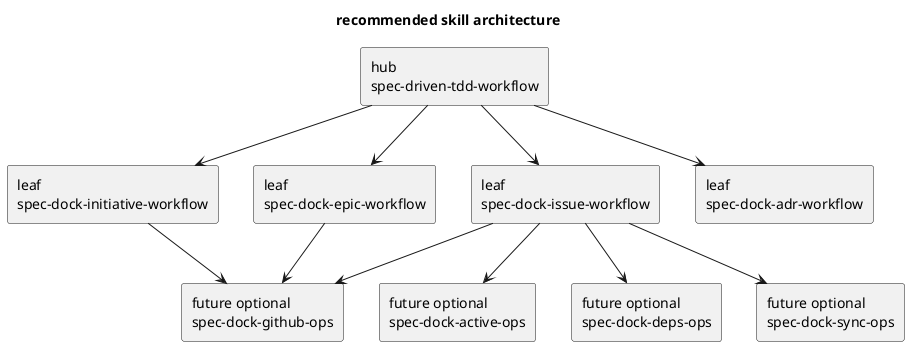

# skill 分割戦略の検討メモ

## 1. 結論

現時点のベストプラクティス案は、**1本の巨大 skill を維持する案でも、いきなり多数の micro-skill へ分割する案でもなく、`hub + leaf` の 2層構成へ段階移行すること**です。

推奨構成:

- hub:
  - `spec-driven-tdd-workflow`
- leaf:
  - `spec-dock-initiative-workflow`
  - `spec-dock-epic-workflow`
  - `spec-dock-issue-workflow`
  - `spec-dock-adr-workflow`
- 将来の optional ops skills:
  - `spec-dock-active-ops`
  - `spec-dock-github-ops`
  - `spec-dock-deps-ops`
  - `spec-dock-sync-ops`

要点:

- **今すぐ必要なのは「役割単位の leaf 分割」まで**で十分
- `deps/github/active/sync` は、今すぐ独立 skill にせず、**hub/leaf から参照される docs/reference として保持**
- そのうえで利用頻度・事故率・説明量が閾値を超えたものだけ、後から ops skill として独立させる

---

## 2. repo から確認できる現状

### 2.1 事実

- skill は現在 1 本のみ
  - `src/spec_dock/assets/codex_skills/spec-driven-tdd-workflow/SKILL.md`
- ただし docs はすでに役割別に分かれている
  - `src/spec_dock/assets/spec_dock/docs/workflow_initiative.md`
  - `src/spec_dock/assets/spec_dock/docs/workflow_epic.md`
  - `src/spec_dock/assets/spec_dock/docs/workflow_issue.md`
  - `src/spec_dock/assets/spec_dock/docs/workflow_adr.md`
- `spec-driven-tdd-workflow` は、実質的に
  - 共通の安全注意
  - active issue 前提の入口制御
  - issue 実装ワークフロー
  - initiative/epic/adr 参照導線
  - discussions / report / sync などの運用要素
  を 1 本で抱えている

### 2.2 解釈

- **情報の自然な分割単位は、すでに docs 側に現れている**
- にもかかわらず skill 側が 1 本のため、**Codex CLI にとっての入口は一本化されすぎている**
- つまり今の問題は「情報が足りない」よりも、**情報構造が docs と skill でズレている**こと

### 2.3 補足

- ルート `README.md` には旧運用の記述がまだ残っており、導入 docs / skill / README の整合は今後の改善対象
- したがって skill 分割は、単なるファイル分割ではなく、**“どこを正本にするか” の整理**とセットで進めるべき

---

## 3. 相談観点（consultation lenses）

今回の相談は、以下の 3 観点で整理した。

1. **architecture lens**
   - skill 増減が構造として妥当か
   - hub と leaf の責務境界をどこに置くか
2. **onboarding / ux lens**
   - Codex CLI が「今どの skill を使うべきか」で迷わないか
   - 初回導入時とセッション中の読書コストがどう変わるか
3. **maintenance lens**
   - docs と skill の重複更新コスト
   - 将来 `deps/github/active/sync` を増やす余地
   - テストしやすさ

結論として、この 3 観点はほぼ同じ方向を向いている。

- **1本巨大化は限界が近い**
- **ただし細かすぎる分割は時期尚早**
- よって **hub + role leaf** が最もバランスが良い

---

## 4. 比較表

| 案 | 概要 | usability | maintenance | 拡張性 | 総合判断 |
|---|---|---:|---:|---:|---|
| A | 1本 skill を維持し、説明を足す | △ | △ | △ | 当面延命はできるが、肥大化が続く |
| B | hub 1本 + role leaf（initiative/epic/issue/adr） | ◎ | ◎ | ◎ | **推奨** |
| C | role + ops まで最初から多数分割 | △ | △ | ○ | 将来形としてはあり得るが、今やると運用負債になりやすい |

### 案A: 1本維持

利点:

- discoverability は最も高い
- 導入実装が最も簡単

欠点:

- 手順・注意・例外が 1 本に集まり続ける
- Initiative と Issue の文脈が混ざる
- Codex CLI に毎回広い文脈を読ませることになりやすい

### 案B: hub + role leaf

利点:

- 入口は hub 1 本で迷わない
- 実作業では必要な leaf だけを読む運用にできる
- 既存 docs 構造（initiative/epic/issue/adr）と自然に一致する
- 今後 ops 系を追加しても tree が崩れにくい

欠点:

- skill 間リンク設計が必要
- hub と leaf の重複を意識して設計しないと中途半端になる

### 案C: 最初から多数分割

利点:

- 各 skill は短く保てる
- 専門タスクへの最短導線を作りやすい

欠点:

- “どれを使うか” の判断コストが高い
- docs と skill の整合管理が難しい
- init/update で導入される assets の QA コストが増える

---

## 5. 推奨アーキテクチャ

## 5.1 基本原則

### rule-01: skill は「行動の入口」を持つ

skill に書くべきもの:

- いつ使うか
- 最初に何を確認するか
- 安全上の注意
- 最短コマンド列
- 次に参照すべき docs / leaf skill

### rule-02: 詳細仕様は docs/reference を正本にする

docs/reference に置くべきもの:

- 全手順の詳細
- オプション一覧
- 例外ケース
- 仕様上の制約
- reference 的な説明（GitHub, naming, deps, sync など）

### rule-03: skill は “routing + checklist”、docs は “knowledge base”

これを崩すと、

- skill が巨大化し
- docs も重複し
- 更新漏れが起きやすくなる

---

## 5.2 推奨 skill tree

### hub の責務

- 最初の入口
- 共通 safety notes
- active context の基本導線
- 「今の作業は initiative / epic / issue / adr のどれか」を判断させる routing

### leaf の責務

- その role で最初にやること
- 必須の preflight
- 品質ゲート
- 参照すべき docs/reference

### optional ops skills の責務

- 頻出だが role をまたぐ操作
- 例:
  - `active set`
  - GitHub import/new/sync の注意
  - `deps check`
  - `sync` の見方

---

## 6. docs と skills の責務分担

## 6.1 skill に置くべき情報

- セッション開始時の短い行動手順
- 事故率が高い注意
- “このケースではこの workflow を読め” という routing
- 実務でよく使う最短コマンド

### 例

- issue skill:
  - `active show`
  - `active set`
  - `active/issue/{requirement,design,plan}.md` を読む
  - `report.md` を追記

## 6.2 docs に置くべき情報

- 完全な操作ガイド
- 分岐パターン
- import/new の詳細ルール
- GitHub 連携・deps・sync などの reference
- 背景説明・判断理由

### 重要

**“skill を詳しくする” のではなく、“skill は短く、docs を正本に寄せる”** のがメンテしやすい。

---

## 7. テスト・品質保証の扱い

skill 分割を進めるなら、品質保証は少なくとも 3 層に分けるべき。

### 7.1 scaffold 配布保証

- `init/update` 後に必要な skill ファイルが導入されること
- 不要な skill が混入しないこと

### 7.2 導線整合保証

- hub から leaf / docs へのリンクが切れていないこと
- leaf が参照する docs パスが正しいこと

### 7.3 内容一貫性保証

- 重要な safety note が hub と leaf で矛盾しないこと
- `README` / docs / skill で旧構成の記述が残っていないこと

### 現実的な QA ルール

- unit test:
  - skill ファイルの存在
  - 主要リンク文字列
  - init/update 後の生成物
- manual test:
  - Codex CLI 利用想定で「初回にどこを読むか」が迷わないか
  - issue / initiative / epic の開始導線が 1 分以内に見つかるか

---

## 8. メンテナンス上の主リスク

### risk-01: hub と leaf の重複

症状:

- 同じ safety note が複数ファイルにコピーされる

対策:

- 共通事項は hub のみに置く
- leaf には「必要なら hub を見る」と書く

### risk-02: docs と skills の二重正本化

症状:

- docs と skill の説明がズレる

対策:

- 詳細仕様は必ず docs に寄せる
- skill は要約と routing だけにする

### risk-03: 過剰分割

症状:

- どの skill を読めばよいか分からない

対策:

- 初期段階では role 4 本まで
- ops skill は usage signal が十分出てから追加

---

## 9. 拡張ロードマップ

## phase 1: 今すぐやるとよい

- hub を残す
- role leaf 4 本を追加する
  - initiative
  - epic
  - issue
  - adr
- docs/README/skill の役割分担を明文化する

## phase 2: 整合性を固める

- `README.md` / generated docs / skills の旧記述を整理する
- tests に skill 導入と主要リンクの検証を追加する
- manual QA で onboarding の迷いを観測する

## phase 3: 利用実績ベースで ops skill を追加

次のいずれかに当てはまったものだけ独立を検討する:

- hub/leaf から毎回参照される
- 事故率が高い
- コマンド分岐が多い
- “読まないと危ない” 事項が多い

候補:

- `active-ops`
- `github-ops`
- `deps-ops`
- `sync-ops`

---

## 10. 分割すべきタイミングのシグナル

以下の 1 つでも強く当てはまるなら、skill 分割のタイミング。

- 1 skill の冒頭で「まず A を読み、場合によって B/C/D」への分岐が増え続ける
- role ごとに読むべき手順が既に docs で独立している
- safety notes が role によって異なる
- issue 作業と initiative/epic 作業で必要コンテキストが明らかに違う
- 手動テストやレビューで「どこを読めばよいか分からない」が繰り返し出る

逆に、まだ分割を急がなくてよいシグナルは次の通り。

- role ごとの差分が薄い
- docs 側の構成がまだ安定していない
- hub のサイズがまだ短く保てている

---

## 11. 最終提案

### 推奨

- **案B: hub + role leaf** を採用する

### 理由

1. 既存 docs 構造と最も整合する
2. Codex CLI の入口を失わずに、文脈サイズだけ減らせる
3. 将来 `deps/github/active/sync` を増やす余地を確保できる
4. 1本巨大化と過剰分割の両方を避けられる

### 直ちに避けるべきこと

- まず skill を 1 本巨大化させ続けること
- 逆に、最初から micro-skill を大量追加すること
- docs と skill の両方に詳細仕様を書くこと

### 実務的な次の一歩

1. role leaf 4 本の責務定義を先に決める
2. hub から各 leaf / docs への routing を設計する
3. 旧 README / 旧説明を整理してから実装する

