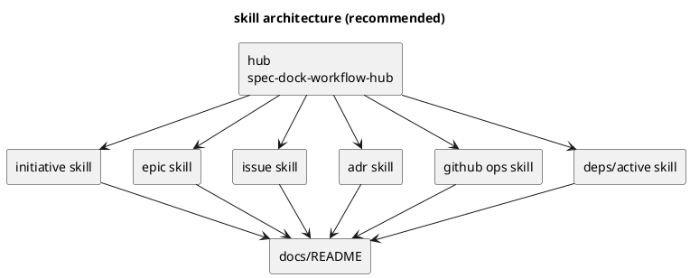

# discussion: codex skills architecture and onboarding ux

- date: 2026-03-06
- topic: `spec-dock` における Codex CLI 用 skill の情報設計 / onboarding UX
- status: draft

## 1. 問題設定

現状、導入される skill は `spec-driven-tdd-workflow` の 1本のみである。  
一方で repo には、すでに以下の workflow docs が分離して存在する。

- `src/spec_dock/assets/spec_dock/docs/workflow_initiative.md`
- `src/spec_dock/assets/spec_dock/docs/workflow_epic.md`
- `src/spec_dock/assets/spec_dock/docs/workflow_issue.md`
- `src/spec_dock/assets/spec_dock/docs/workflow_adr.md`

つまり、**docs は分かれているが skill は 1本**という非対称な状態にある。

この結果、Codex CLI 観点では次の課題が出やすい。

1. 最初に読む skill が長くなり、毎回の読解コストが高い  
2. 「いま自分は initiative をしたいのか / issue 実装をしたいのか」で入口が曖昧  
3. docs と skill の責務境界が曖昧で、将来的に drift が起きやすい  
4. root `README.md` には旧運用（wrapper / `adrs/` / `artifacts/`）由来の記述がまだ残っており、情報源が増えるほど不整合リスクが上がる

## 2. repo から確認できる事実

### 2.1 現状 skill
- `src/spec_dock/assets/codex_skills/spec-driven-tdd-workflow/SKILL.md`
  - 初回に `guide.md` と workflow docs 群を読むよう促している
  - 実質的には **hub + index** の役割を既に持っている

### 2.2 現状 docs
- `src/spec_dock/assets/spec_dock/docs/README.md`
  - 目的別ショートカットがあり、initiative / epic / issue / ADR への分岐はすでに存在する
- 各 `workflow_*.md`
  - エンティティ別の操作・品質ゲート・注意点が既に分離済み

### 2.3 構造上の示唆
- skill を entity / task ごとに分けるための **土台はすでに docs 側にある**
- したがって今後の論点は「新しい知識を増やすか」ではなく、**既存知識をどの粒度で skill に昇格させるか** である

## 3. 相談観点ごとの整理

### 観点A: onboarding UX
- 1本巨大 skill は「最初に全部教える」設計になりやすく、Codex CLI では文脈負荷が高い
- 一方、最初から skill を細かく分けすぎると「どの skill を使えばよいか」で逆に迷う
- よって UX 的には **hub 1本 + leaf 複数** が最も自然

### 観点B: 保守性 / drift 耐性
- docs 側はすでに分割済みなので、skill まで同じ粒度に寄せると責務がそろう
- ただし、各 leaf skill に詳細手順を書きすぎると docs と二重管理になる
- よって保守性の観点では、**skill は短く、docs を正本にする** ルールが必要

### 観点C: 現実的な移行コスト
- 今すぐ完全分割しても、ユーザー入口が変わりすぎると混乱する
- 既存の `spec-driven-tdd-workflow` は破棄せず、まず **dispatcher / hub** として再定義するのが安全
- そこから leaf skill を追加する段階移行が最小リスク

## 4. 選択肢

### option 1: 1 skill giant を維持

**概要**
- `spec-driven-tdd-workflow` だけを維持し、docs 参照を整理して延命する

**利点**
- 実装コストが最小
- 入口が1つで分かりやすい

**欠点**
- skill が肥大化しやすい
- Codex CLI に毎回同じ長文を読ませやすい
- initiative / epic / issue の違いが skill では見えにくい

**評価**
- 短期延命策としては可
- 中長期の best practice にはなりにくい

### option 2: hub skill + leaf docs

**概要**
- skill は 1本のままにし、実体は docs への案内役に寄せる

**利点**
- skill 自体は短くできる
- docs への導線が明確になる

**欠点**
- Codex CLI が task-specific guidance を skill として持てない
- 「initiative を作る skill を呼ぶ」のような操作性は得られない

**評価**
- 現状改善としては良い
- ただしユーザーが期待している「粒度の合った skill」までは届かない

### option 3: hub skill + leaf skills + docs（推奨）

**概要**
- hub skill を入口として残しつつ、initiative / epic / issue / ADR を leaf skill として追加する
- docs は正本、skill は入口・判断補助・最短手順に限定する

**利点**
- ユーザーは task に合わせて短い skill を読める
- 入口の迷いは hub で吸収できる
- docs 分割と skill 分割の粒度が揃う
- 今後 `deps` / `github` / `active-set` など横断 skill も増やしやすい

**欠点**
- skill ファイル数が増える
- 命名と責務を明確にしないと分割しすぎになる

**評価**
- UX / 保守性 / 拡張性のバランスが最も良い

## 5. 推奨アーキテクチャ

### 結論

**`1 skill giant` は卒業し、`hub skill + leaf skills + docs as source of truth` に移行するのがベスト。**

### 推奨 skill 構成

#### hub
- `spec-dock-workflow-hub`
  - 役割:
    - 入口案内
    - どの leaf skill を使うべきかの分岐
    - 最低限の安全注意（GitHub副作用、active set、title/slug 制約）

#### leaf（core）
- `spec-dock-initiative-workflow`
- `spec-dock-epic-workflow`
- `spec-dock-issue-workflow`
- `spec-dock-adr-workflow`

#### leaf（将来の横断 optional）
- `spec-dock-github-operations`
- `spec-dock-deps-and-readiness`
- `spec-dock-active-set-and-context`

## 6. docs と skills の責務分担ルール

### skills に書くもの
- いつ使うか
- 最初に確認するもの
- 最短の手順
- 危険操作 / stop conditions
- 次に開く docs / files / commands

### docs に書くもの
- 完全な操作説明
- 詳細な例
- 例外系 / edge cases
- 品質ゲート
- 背景知識 / rationale / reference

### ルール
- **詳細は docs、skills は要約と誘導**
- skill に workflow 本文をコピペしない
- 1つの事実は1か所だけを正本にする

## 7. 最小変更案

### すぐやる案（最小）
1. 既存 `spec-driven-tdd-workflow` を **hub 化**する
   - 長文の手順を減らし、「どの task ならどの doc / skill を見るか」に集中させる
2. core leaf として次の 4 本を追加
   - initiative
   - epic
   - issue
   - adr
3. `src/spec_dock/assets/spec_dock/docs/README.md` から hub / leaf の対応表を明示する

**効果**
- 入口は維持
- 体験の迷いは減る
- 実装コストも抑えられる

## 8. 理想形案

### 中期の理想
hub + core leaf + cross-cutting leaf の二層構成にする。

**考え方**
- entity workflow（initiative/epic/issue/adr）を core
- GitHub / deps / active set は横断 concern として後から分離

## 9. アンチパターン

- skill を entity ごとに分けたうえで、各 skill に docs 全文を複製する
- command ごとに skill を切る（`new-issue skill`, `sync skill`, `validate skill` など）
- hub を消して leaf のみ配置し、入口判断をユーザーへ丸投げする
- docs と skill で異なる truth を持つ

## 10. 推奨判断

### 今決めるべきこと
- 1本巨大 skill のまま行くか、二層構成へ移るか
- もし移るなら、第一弾の leaf を何本にするか

### 推奨
- **採用方針: option 3**
- **第一弾: hub + 4 core leaf**
- **第二弾: GitHub / deps / active-set を横断 skill として必要に応じて追加**

## 11. 一言でまとめると

**「skill を増やす」こと自体が目的ではなく、`入口は1つ、実務の単位は複数` に再設計するのが本質。**  
そのため、best practice は **hub 1本 + core leaf 4本 + docs を正本** である。
