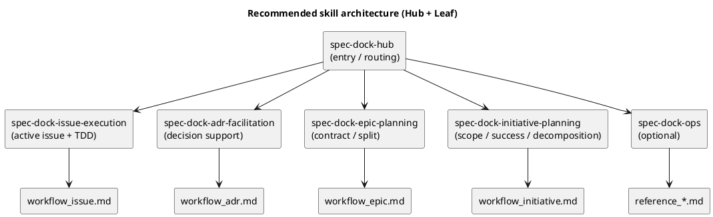

# Codex Skills 構成の見直し案（1本維持 vs 分割 vs Hub + Leaf）

関連:
- 現行 skill: `src/spec_dock/assets/codex_skills/spec-driven-tdd-workflow/SKILL.md`
- 導入 docs: `src/spec_dock/assets/spec_dock/docs/README.md`
- workflow docs:
  - `src/spec_dock/assets/spec_dock/docs/workflow_initiative.md`
  - `src/spec_dock/assets/spec_dock/docs/workflow_epic.md`
  - `src/spec_dock/assets/spec_dock/docs/workflow_issue.md`
  - `src/spec_dock/assets/spec_dock/docs/workflow_adr.md`

---

## 0. 問題意識

現状、導入される Codex skill は **`spec-driven-tdd-workflow` 1本のみ**である。  
一方で、実際の運用はすでに以下のように分かれている。

- Initiative の作成/運用
- Epic の作成/運用
- Issue の active 化 / TDD 実装
- ADR の作成/意思決定
- `new/import/active/sync/validate` などの操作系コマンド

つまり **運用責務は分かれているのに、skill 入口だけが1本に集約されたまま**になっている。  
このため、Codex CLI にとっては次の問題が起こりやすい。

- どの作業でも毎回広い文脈を読ませがち
- Initiative/Epic/Issue の責務境界が skill では曖昧
- docs は分かれているのに、skill は分かれていないため情報設計が中途半端
- 一部 `README` / docs に旧運用（wrapper / `adrs` / `artifacts` 前提）が残っており、入口の整合性が崩れやすい

---

## 1. 現状の事実

### 1.1 実装状況

- skill は 1本のみ:
  - `src/spec_dock/assets/codex_skills/spec-driven-tdd-workflow/SKILL.md`
- ただし docs はすでに role/scope ごとに分割済み:
  - `workflow_initiative.md`
  - `workflow_epic.md`
  - `workflow_issue.md`
  - `workflow_adr.md`
- したがって、現状は **「1本 skill + 複数 docs」** のハイブリッド構成である

### 1.2 現行 skill の性格

現行 `spec-driven-tdd-workflow` は、実態として次の両方を担っている。

1. **入口ルーター**
   - まず `guide.md` / `workflow_issue.md` を読む
   - 必要なら initiative / epic / adr docs へ分岐する
2. **実行ガイド**
   - active set / docs 読み順 / ADR 作成 / report 記録 / sync などを案内する

このため、現行 skill はすでに **Hub 的役割**を持ちながら、同時に **Issue 実行 skill 的役割**も持っている。

### 1.3 現状のズレ

- docs 側はすでに分割されている
- skill 側は 1本のまま
- root `README.md` には古い wrapper / `adrs` / `artifacts` 記述がまだ残る

結論として、問題は単純に「skill が 1本しかない」だけではなく、  
**docs / skill / README の責務分担が未整理なこと**にある。

---

## 2. consultant 見解の要約

### 2.1 consultant A（Descartes）

結論:
- **全面分割ではなく `hub + leaf` へ段階移行**が最適

主張:
- docs はすでに半分分割済みなので、skill も同じ責務境界へ寄せるべき
- ただし一気に分割すると metadata と trigger が不安定になる
- まず現行 skill を薄い hub にし、`issue` と `adr` から leaf を追加するのがよい
- skill 分割より先に、旧記述が残る docs/README の現行化が必要

### 2.2 consultant B（Locke）

結論:
- skill は **完全な手順書ではなく、セッション開始時の判断と誘導**に絞るべき

主張:
- docs の責務は正本（概念/仕様/副作用/詳細手順）
- skill の責務は「今なにをするか」を判定して docs へ誘導すること
- 分割しすぎると入口過多・記述重複・更新漏れが起きる
- 現実的な最小変更は、現行 skill を hub 化し、まず `issue` leaf を足すこと

### 2.3 総合所見

2つの consultant の意見は一致している。

- **1本巨大 skill のままは限界がある**
- **ただし全面細分化も早すぎる**
- 最適解は **Hub + Leaf を段階的に導入**する案である

---

## 3. 比較案

| 案 | 内容 | 利点 | 欠点 | 評価 |
|---|---|---|---|---|
| A | 1本維持（現状） | 導入が簡単 / skill 配布が単純 | 肥大化 / 役割混在 / 毎回広い文脈を読む | 非推奨 |
| B | `hub + leaf` | 入口を維持しつつ責務分割できる / docs 分割と整合する | 初期設計が必要 / 命名設計が必要 | **推奨** |
| C | 全面分割（scope + ops + refs まで細分化） | 各 skill を非常に短くできる | 入口過多 / trigger 不安定 / メンテ負荷増 | 時期尚早 |

---

## 4. 推奨アーキテクチャ

### 4.1 結論

推奨は **Hub + Leaf 構成**。

ただし、「initiative を作る skill」「epic を作る skill」「issue を作る skill」という **“作成コマンド中心” の分け方**より、  
**“責務中心” の分け方**の方が良い。

理由:
- Initiative/Epic/Issue は、単に作るだけでなく、記述・依存・品質ゲート・active・ADR 連携まで含む
- したがって `new initiative` だけを 1 skill にすると、実務のまとまりより粒度が細かすぎる

### 4.2 推奨 skill 群

#### Hub

- `spec-dock-hub`
  - 役割: 入口 / 作業判定 / 読むべき leaf と docs の案内
  - 中身: 最小限の判断表と安全注意

#### Leaf（優先度順）

- `spec-dock-issue-execution`
  - active issue を前提に requirement → design → plan → TDD → report を回す
  - 現行 skill の中核

- `spec-dock-adr-facilitation`
  - ADR を起こす判断、叩き台作成、Decision TBD → accepted 反映
  - issue / epic / initiative 横断で使える

- `spec-dock-epic-planning`
  - Epic の requirement/design/plan、契約、移行、観測性、Issue 分割

- `spec-dock-initiative-planning`
  - Initiative の目的、成功条件、スコープ、Epic 分解

#### Optional leaf（後で判断）

- `spec-dock-ops`
  - `new/import/active/sync/validate` と GitHub 副作用の注意点
  - 操作事故が多いなら分離価値が高い

---

## 5. docs と skills の責務分担ルール

### 5.1 docs に置くもの

docs は **永続的な正本**にする。

- 概念
- 用語
- コマンド仕様
- 副作用
- 詳細手順
- 例
- 注意事項
- workflow / reference

### 5.2 skills に置くもの

skills は **セッション開始時のルーター**にする。

- 何の作業かを判定する
- どの docs を読むべきか示す
- 危険操作の注意を短く出す
- そのセッションで必要なチェックリストだけ持つ

### 5.3 置いてはいけないもの

- skill に完全手順書を全部再掲すること
- docs と同じコマンド説明を重複記載すること
- reference をそのまま skill 化すること

---

## 6. 分割しすぎのアンチパターン

### 6.1 `workflow_*.md` と 1:1 で全部 skill 化する

問題:
- reference まで skill 化したくなり、入口が増えすぎる
- どの skill を呼ぶべきか迷う

### 6.2 `create-initiative`, `create-epic`, `create-issue` のようにコマンド中心で切る

問題:
- 実作業は「作成」で終わらない
- 記述 / active / ADR / report / quality gate が別に必要で、skill が不自然に分断される

### 6.3 現行 docs の旧記述を残したまま分割する

問題:
- 誤案内が複数の skill / docs から再生産される

---

## 7. 導入順序（最小変更 → 理想形）

### Step 0. docs / README の現行化

まずやるべきこと:
- `README.md` の古い wrapper / `adrs` / `artifacts` 記述を整理する
- `spec-dock/docs/*` と skill の導線を最新仕様に統一する

これは skill 分割の前提条件である。

### Step 1. 現行 skill を Hub 化する

`spec-driven-tdd-workflow` を薄くし、次のような役割に寄せる。

- 今やる作業の判定
- `workflow_issue.md` / `workflow_epic.md` / `workflow_initiative.md` / `workflow_adr.md` への振り分け
- 危険操作の短い注意

### Step 2. 最初の leaf を 1〜2本だけ追加する

推奨順:

1. `spec-dock-issue-execution`
2. `spec-dock-adr-facilitation`

理由:
- 利用頻度が高い
- 現行 1本 skill の負荷の中心を最も下げられる
- 横断性と実務価値が高い

### Step 3. 上流 skill を追加する

次点:

- `spec-dock-epic-planning`
- `spec-dock-initiative-planning`

### Step 4. ops skill は必要性ベースで追加する

以下のシグナルが出たら追加を検討:

- `new/import/active/sync` の誤操作が頻発する
- GitHub 副作用の確認漏れが多い
- support / QA / docs で同じ説明を何度も書いている

---

## 8. 見取り図

---

## 9. ベストプラクティス案（提案）

結論として、次を推奨する。

1. **いまは 1本巨大 skill を卒業する**
2. ただし **全面分割はしない**
3. **Hub + Leaf** へ段階移行する
4. 最初の leaf は **Issue** と **ADR**
5. `README` / docs の旧記述解消を **skill 分割より先**にやる
6. skill は「ルーター」、docs は「正本」として責務を分ける

---

## 10. 次アクション案

この discussion を実装に落とすなら、次の順がよい。

- Phase 1:
  - 現行 docs/README の旧記述棚卸し
  - skill / docs / README の責務表を作る
- Phase 2:
  - `spec-driven-tdd-workflow` を hub 化する設計
  - `spec-dock-issue-execution` の草案
- Phase 3:
  - `spec-dock-adr-facilitation` を追加
  - 利用感を見て epic / initiative / ops の順に拡張判断

一言で言うと、**「今すぐ全部割る」のではなく、「今ある 1本を hub に変え、最も価値の高い leaf から足す」**のが最も安全で効果が大きい。
