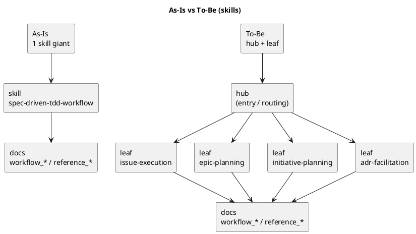

# disc-00001 Codex skills 再編に向けた現状理解と To-Be 論点整理

## 議題 (必須)
- `spec-dock` が導入する Codex skills を、現状の 1 本構成のままにするべきか、`hub + leaf` へ再編するべきかを議論する。
- 要件定義に入る前提として、現在の実装状況・docs 導線・installer/test 影響・ユーザー体験上の課題を整理する。
- requirement.md を起こす前に、ユーザーに確認すべき論点を明確化する。

## 背景 (必須)
- 現在導入される skill は `src/spec_dock/assets/codex_skills/spec-driven-tdd-workflow/SKILL.md` の 1 本のみ。
- しかし docs はすでに `workflow_initiative.md` / `workflow_epic.md` / `workflow_issue.md` / `workflow_adr.md` に分割されている。
- 現行 skill は「入口ルーター」と「Issue 実行ガイド」の両方を兼ねており、責務が広い。
- installer 実装 `src/spec_dock/cli.py` は `_install_skill()` で単一 skill だけを `.agents/skills/spec-driven-tdd-workflow/SKILL.md` にコピーする前提になっている。
- tests も `tests/test_cli.py` で単一 skill 導入前提を検証している。
- root `README.md` には一部旧記述（`adrs/new-adr`, `artifacts/_template.md` など）が残っており、docs / skill / README の整合はまだ完全ではない。
- 想定利用者は Codex CLI であり、「今何をすべきか」を素早く判断できる入口設計が重要。

## 現状理解（As-Is） (任意)

### A. コード/導入の現状
- 単一 skill 前提:
  - `src/spec_dock/cli.py`
  - `_install_skill()` が `spec-driven-tdd-workflow/SKILL.md` のみをコピー
- 単一 skill を前提にした導入テスト:
  - `tests/test_cli.py`
  - `.agents/skills/spec-driven-tdd-workflow/SKILL.md` の存在を直接検証
- `--no-skill` も単数形で設計されている

### B. docs / onboarding の現状
- docs 側の役割分割は既にある:
  - `src/spec_dock/assets/spec_dock/docs/README.md`
  - `workflow_initiative.md`
  - `workflow_epic.md`
  - `workflow_issue.md`
  - `workflow_adr.md`
- ただし skill からの入口は 1 本なので、Codex CLI は毎回広い文脈を読みやすい
- root `README.md` と一部 docs に旧運用の残存があるため、入口設計の正本が分散気味

### C. 利用体験の現状
- 現行 skill は issue 実装には有効だが、initiative / epic / adr の相談でも同じ入口を通る
- scope 名（initiative/epic/issue/adr）と、実際にやる作業（planning / execution / facilitation）が 1:1 ではない
- そのため「skill を scope で切るべきか、責務で切るべきか」が requirement 前の重要論点になっている

## あるべき状態（To-Be 仮説） (任意)
- skills は **セッション開始時のルーター**として機能する
- docs は **永続的な正本**として、概念/仕様/詳細手順/副作用を保持する
- Codex CLI は「いまのタスクに必要な粒度」だけを読む構成になっている
- skill 分割は、ユーザーが迷わない範囲に留める
- installer / update / test が複数 skill 構成を自然に扱える

### UML（任意） (任意)

## 選択肢 (必須)
- Option A: 現行の 1 skill を維持し、内容だけ追記/整理する
  - Pros:
    - installer / tests / docs 変更が最小
    - 導入方法を変えなくてよい
  - Cons:
    - 責務肥大化が続く
    - Codex CLI で毎回広い文脈を読ませやすい
    - 今後の機能追加時にさらに重くなる

- Option B: `hub + leaf` へ段階移行する
  - Pros:
    - 入口の分かりやすさと責務分離のバランスがよい
    - 既存 docs の分割と整合しやすい
    - 段階導入しやすく、効果測定もしやすい
  - Cons:
    - installer / update / tests / docs 導線の設計が必要
    - どの leaf から切るかを決める必要がある

- Option C: initiative / epic / issue / adr / ops などへ一気に全面分割する
  - Pros:
    - 各 skill は短くできる
    - 長期的には責務が明確になる可能性がある
  - Cons:
    - 入口が増えすぎる
    - trigger / discoverability が不安定になりやすい
    - docs/README の不整合を抱えたまま複雑化しやすい

## consultant 見解の要約 (任意)
- 既存 consultant の一致点:
  - `hub + leaf` が最有力
  - docs は正本、skill はルーターに寄せるべき
  - いきなり全面分割は早い
- 差分/論点:
  - 最初の leaf は `issue + adr` が良いという意見と、`issue + epic` が良いという意見がある
  - leaf 名は `issue/epic/...` の scope 名より、`issue-execution` / `epic-planning` のような責務名の方が良い、という意見が優勢
  - hub の名前は、まずは既存 `spec-driven-tdd-workflow` を残して中身を hub 化する案が優勢

## 推奨案 (必須)
- 現時点の推奨は **Option B: `hub + leaf` への段階移行**。
- ただし requirement 前提として、以下はまだユーザー確認が必要:
  1. leaf を最初から全部導入するか、段階導入にするか
  2. leaf の粒度を scope 名で切るか、責務名で切るか
  3. hub の名称を当面維持するか
  4. installer がデフォルトで全 skill を入れるか、最小セットだけにするか
  5. docs / README の現行化を同一 issue に含めるか

## requirement 前に固定したい論点 (任意)
- skill の命名規則
  - 例: `spec-dock-issue-execution` / `spec-dock-epic-planning`
- installer の責務
  - 全 skill を配るのか、bundle を選ぶのか
- update の挙動
  - 旧 single-skill 構成からどう更新するか
- tests の責務
  - 単一 skill 導入確認から、複数 skill 導入確認へどう変えるか
- docs との境界
  - skill に持たせる最小情報をどこまでにするか

## 未決事項 (任意)
- Q1. 最初の leaf は何本から始めるべきか
  - 仮説: `issue + adr`
  - 対案: `issue + epic`
- Q2. leaf 名は scope 名か責務名か
  - 仮説: 責務名
- Q3. hub 名は旧名維持か、新名導入か
  - 仮説: 旧名維持（中身だけ hub 化）
- Q4. docs / README 現行化は今回 issue に含めるべきか
  - 仮説: 含める（少なくとも skill と矛盾する導線は同時解消）

## 次アクション (必須)
- ユーザーに上記 4 つの未決事項を確認する
- 回答を反映して requirement.md の目的 / スコープ / MUST / MUST NOT / AC を起こす
- 必要なら追加 consultant を実装影響（installer/tests/update）に絞って再投入する
