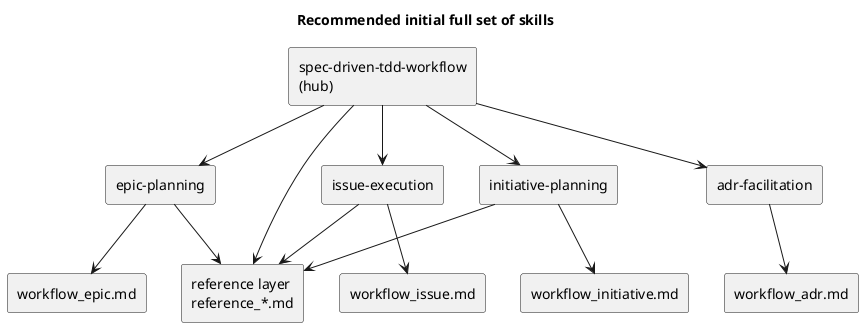

# disc-00002 Codex skills の full set 構成案（初期導入対象の絞り込み）

## 議題 (必須)
- `spec-dock` の skill 再編において、**現時点で必要な skill を最初から full 導入する**とした場合、どの skill 構成が最適かを決める。
- 「1本維持 vs 段階導入」の議論ではなく、**今このツールに本当に必要な責務は何か**を洗い出し、初期導入セットを定める。

## 背景 (必須)
- ユーザー判断:
  - 1本構成維持は選ばない
  - 現時点で必要なものは最初から full 導入する
  - 将来必要になったものだけ追加する
  - hub 名は当面 `spec-driven-tdd-workflow` を維持する
  - `README.md` の旧記述整理も今回 scope に含める
  - `--no-skill` は廃止し、skill は常時導入前提とする
- したがって本論点は、**「いま必要な skill は何本で、どう切るべきか」** である。

## 現状の repo facts (任意)

### 1. 実装/導入
- installer は単一 skill 前提:
  - `src/spec_dock/cli.py` の `_install_skill()` が `.agents/skills/spec-driven-tdd-workflow/SKILL.md` だけを導入
- tests も単一 skill 前提:
  - `tests/test_cli.py`
- `--no-skill` により skill 導入自体を無効化できる

### 2. docs の責務分解
- workflow docs:
  - `workflow_initiative.md`
  - `workflow_epic.md`
  - `workflow_issue.md`
  - `workflow_adr.md`
- reference docs:
  - `reference_github.md`
  - `reference_deps.md`
  - `reference_sync.md`
  - `reference_naming.md`

### 3. 現在の実務責務
- 入口/オンボーディング
- Initiative planning
- Epic planning
- Issue execution
- ADR facilitation
- 共通運用リファレンス
  - `new/import`
  - GitHub 連携
  - `active set`
  - `deps check`
  - `sync`
  - `validate`

## consultant 見解の統合 (任意)
- 一致点:
  - `hub + leaf` が最適
  - leaf 名は scope 名より責務名がよい
  - hub 名は当面 `spec-driven-tdd-workflow` を残すのが安全
- 見直した論点:
  - 以前は `runtime-operations` を独立 skill とする案が有力だった
  - しかし今回の再分析では、操作系は独立した仕事の入口ではなく、**複数 workflow を横断する共通ルール**として扱う方が一貫すると判断した

## 責務棚卸し（いま skill 化が必要か） (任意)

| 責務 | 現在の複雑さ | Codex CLI での重要度 | docs だけで足りるか | 初期 full set に含めるべきか |
|---|---|---|---|---|
| Hub / 入口ルーティング | 高 | 高 | いいえ | **Yes** |
| Initiative planning | 中 | 中 | いいえ | **Yes** |
| Epic planning | 高 | 高 | いいえ | **Yes** |
| Issue execution | 非常に高 | 非常に高 | いいえ | **Yes** |
| ADR facilitation | 中 | 高 | いいえ | **Yes** |
| 共通運用ルール / safety | 高 | 高 | **はい（ただし hub/leaf から強く参照させる）** | **No** |
| reference 詳細（naming 単体など） | 中 | 中 | はい | No |

### ここでの重要な発見
- `initiative / epic / issue / adr` だけでは、**操作系の高リスク領域**をどう案内するかが論点になる
- ただし以下は「独立した仕事の入口」というより、**複数 workflow から参照される共通運用ルール**である
  - `new issue` の GitHub 副作用
  - `import` の URL 解釈
  - `active set --checkout`
  - `deps check` / `sync --force` の前提
- よって、これらは standalone skill 化するより、**reference docs を正本にしつつ hub/leaf から必要箇所へ誘導する**方が、責務境界が明確で保守しやすい

## 選択肢 (必須)
- Option A: Hub + 4 core leaf + reference layer
  - 構成:
    - `spec-driven-tdd-workflow`（hub）
    - `spec-dock-initiative-planning`
    - `spec-dock-epic-planning`
    - `spec-dock-issue-execution`
    - `spec-dock-adr-facilitation`
    - `reference_*.md`（共通運用ルールの正本）
  - Pros:
    - scope / planning / execution の主経路はカバーできる
    - skill 数を抑えつつ、共通ルールは docs 正本へ集約できる
    - `runtime-operations` のような抽象 skill を増やさずに済む
  - Cons:
    - hub / leaf から reference docs への導線設計が甘いと、重要ルールが見落とされる

- Option B: Hub + 5 leaf（ops を含む）
  - 構成:
    - `spec-driven-tdd-workflow`（hub）
    - `spec-dock-initiative-planning`
    - `spec-dock-epic-planning`
    - `spec-dock-issue-execution`
    - `spec-dock-adr-facilitation`
    - `spec-dock-runtime-operations`
  - Pros:
    - すべてを skill 入口として見せられる
    - Issue execution と操作系 safety を分離できる
  - Cons:
    - installer / tests / docs 変更量は A より増える
    - `runtime-operations` という名前が抽象的で、いつ使うべきか曖昧
    - 実態が reference docs の再包装になりやすく、責務重複が起きやすい

- Option C: Hub + 6 以上（ops をさらに細分化）
  - 構成例:
    - `active-and-sync-operations`
    - `github-linking`
    - ...
  - Pros:
    - 各 skill を短くできる
  - Cons:
    - 入口が増えすぎる
    - 現段階では過分割
    - maintainability と discoverability のバランスが崩れやすい

## 推奨案 (必須)
- **Option A: Hub + 4 core leaf + reference layer** を採用する。

### 推奨理由
1. 現在の repo では、`workflow_*` と `reference_*` がすでに分離されており、**操作系は workflow ではなく reference layer として整理されている**
2. `active set`, `deps check`, `sync`, `new issue`, `import` は重要だが、独立した仕事の単位ではなく **複数 workflow を横断する共通ルール**である
3. `runtime-operations` を立てると hub と leaf の間に第三の抽象入口が増え、Codex CLI にとって選択基準がかえって曖昧になる
4. 高リスク操作の重要性自体は高いため、skill 化ではなく **hub/leaf から reference docs へ強制的に導線を張る** 方が、正本の一元化と安全性を両立しやすい

## 推奨 full set (任意)

### Hub
- `spec-driven-tdd-workflow`
  - 役割: 入口 / task routing / 共通 safety / 参照 docs の決定
  - 備考: 名前は当面維持し、中身を hub 化する

### Leaf
- `spec-dock-initiative-planning`
  - 目的 / 成功条件 / スコープ / Epic 分解

- `spec-dock-epic-planning`
  - 契約 / 移行 / 観測性 / Issue 分割

- `spec-dock-issue-execution`
  - active issue 前提の requirement → design → plan → TDD → report

- `spec-dock-adr-facilitation`
  - ADR 起票判断 / 叩き台 / Decision 反映 / discussions 連携

### Reference layer
- `reference_github.md`
- `reference_deps.md`
- `reference_sync.md`
- `reference_naming.md`
  - 役割: `new/import/active/deps/sync/validate`、GitHub 副作用、naming / checkout / force / warning の safety を正本として管理する
  - 備考: hub / leaf から必要箇所へ案内するが、独立 skill にはしない

### routing 最低契約
- 以下で列挙する direct references は、**trigger group ごとの最小完全集合**として扱う
- hub:
  - 常に 4 つの leaf 全てを列挙し、どの作業でどれを使うかを 1 行ずつ案内する
  - 共通運用ルールが必要になった場合の参照先として `reference_github.md`, `reference_deps.md`, `reference_sync.md`, `reference_naming.md` を列挙する
- `spec-dock-initiative-planning`:
  - 常に `workflow_initiative.md` を主要導線として案内する
  - GitHub 連携 / import / naming / sync が必要なときは `reference_github.md`, `reference_sync.md`, `reference_naming.md` を直接案内する
- `spec-dock-epic-planning`:
  - 常に `workflow_epic.md` を主要導線として案内する
  - GitHub 連携 / import / naming / sync が必要なときは `reference_github.md`, `reference_sync.md`, `reference_naming.md` を直接案内する
- `spec-dock-issue-execution`:
  - 常に `workflow_issue.md` を主要導線として案内する
  - `active set`, `deps check`, `sync`, `validate`, issue GitHub 操作が必要なときは `reference_deps.md`, `reference_sync.md`, `reference_github.md`, `reference_naming.md` を直接案内する
- `spec-dock-adr-facilitation`:
  - 常に `workflow_adr.md` を主要導線として案内する
  - ADR の配置 / 命名 / 親ノードとの関係を確認する必要があるときは、作業中の親 workflow と `reference_naming.md` を参照させる

## docs と skills の責務分担 (任意)
- skills:
  - いつ使うか
  - 最短手順
  - 危険操作の入り口
  - 次に読む docs
- docs:
  - 概念 / 正式仕様 / 例 / reference / 詳細手順

### 境界ルール
- `workflow_*` は leaf skill の正本 docs
- `reference_*` は hub / leaf が参照する共通ルールの正本 docs
- hub は詳細仕様を再掲しない

## 命名方針（暫定） (任意)
- scope 名ではなく **責務名** を推奨
  - `issue-execution`
  - `epic-planning`
  - `initiative-planning`
  - `adr-facilitation`

理由:
- Codex CLI は「今なにをしたいか」で発火しやすい
- `issue` だけでは create / active / execute / report のどれか曖昧
- `runtime-operations` は広すぎて、仕事の入口名としては曖昧

## 反対案とその棄却理由 (任意)
- 「ops は docs/reference に残せばよい」
  - **採用**
  - 採用理由:
    - 現時点でも GitHub / active / deps / sync は複雑だが、独立 task というより共通ルールである
    - hub と leaf から適切に参照させれば、monolith skill に戻さず正本を一元化できる

- 「initiative/epic/issue/adr だけで十分」
  - 棄却理由:
    - 危険操作の重要性は高い
    - ただしそれは独立 skill の必要性ではなく、reference layer の明確化を意味する

## PlantUML（推奨 full set） (任意)

## 決定事項（ユーザー回答反映） (任意)
- D1. `runtime-operations` は **独立 skill にしない**
- D2. full set は **デフォルト導入** とする
- D3. root `README.md` を含む、skill 導線と矛盾する記述は **同じ issue で同時修正** する
- D4. leaf 名は scope 名ではなく **責務名** で固定する
- D5. hub 名は当面 **`spec-driven-tdd-workflow` を維持** する
- D6. `--no-skill` は **廃止する**

### 採用する初期 full set
- Hub:
  - `spec-driven-tdd-workflow`
- Leaf:
  - `spec-dock-initiative-planning`
  - `spec-dock-epic-planning`
  - `spec-dock-issue-execution`
  - `spec-dock-adr-facilitation`

### 既存 `--no-skill` repo の扱い
- `--no-skill` は過去仕様としてのみ存在する
- 既存 `--no-skill` repo に対して `update` を実行した場合は、**hub + 4 leaf を新たに導入する**
- 今回の方針では「skill 常時導入」が正規状態であり、no-skill 状態の維持互換は持たない

### `update` の所有境界
- `spec-dock` が管理対象として上書き・差し替え・削除してよいのは、**spec-dock が配布する skill 名に一致するディレクトリ**に限る
- 具体的には、今回の target set（hub + 4 leaf）と、過去に spec-dock が配布していた legacy skill ディレクトリが管理対象となる
- `.agents/skills/` 配下に利用者が独自追加した未知の skill ディレクトリは、`update` で削除しない
- 旧 spec-dock 管理 skill が target set に含まれなくなった場合は、`update` で除去してよい
- 途中失敗時は自動 rollback を持たなくてもよいが、`spec-dock update` の再実行で target state に収束することを前提とする

## 次アクション (必須)
- この決定事項を requirement.md の MUST / MUST NOT / スコープ / AC に落とし込む
- installer / tests / docs / README まで含む変更範囲を requirement 上で固定する
