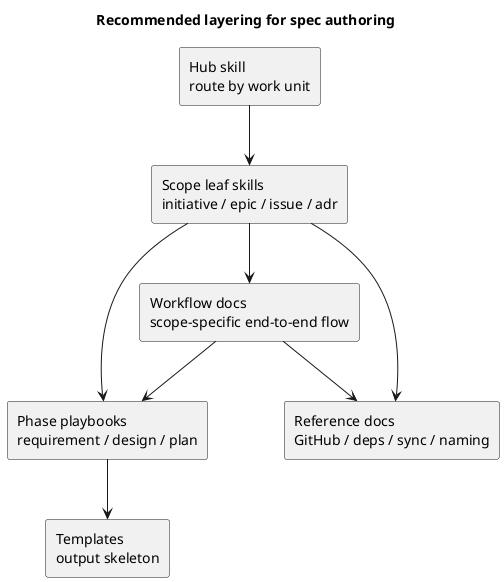

# 結論（先に）

- **現時点では `scope × phase` の top-level skill 分割は採用しない。**
- user-facing な skill 構成は **hub + 4 leaf**（initiative / epic / issue / adr）を維持する。
- 再利用したいのは skill ではなく、**`requirement` / `design` / `plan` の作り方そのもの**である。
- したがって、次に追加すべきものは top-level skill ではなく、**shared phase playbook**（要件定義書 playbook / 設計書 playbook / 実装計画書 playbook）である。
- skill の役割は引き続き **routing / reminder / mandatory pause** に留め、作成手順・質問・承認条件・テンプレ参照は docs/playbook 側に置く。

## 背景

今の運用では、要件定義書・設計書・実装計画書の作成にかなり濃いプロセスが含まれる。

- 徹底的な調査と分析
- discussion sheet の作成
- 必要なら ADR の作成
- ユーザーへのヒアリング
- review / fix / re-review による承認ゲート
- UML やテンプレートを使った構造化

この「作り方」自体を再利用可能にしたい、というのが今回の問題意識である。

## 現状観測

- 現在の skill は `spec-driven-tdd-workflow` を hub として、以下の 4 leaf に分かれている。
  - `spec-dock-initiative-planning`
  - `spec-dock-epic-planning`
  - `spec-dock-issue-execution`
  - `spec-dock-adr-facilitation`
- 現行の skill はいずれも concise であり、`docs = source of truth` を明示している。
- initiative / epic の leaf は、すでに requirement / design / plan 更新を責務に含めている。
- issue 側では、workflow と template に review loop / docs impact / final quality gate がかなり明文化された。
- 一方で、initiative / epic 側には「ヒアリング」「深掘り分析」「review approval」「phase ごとの exit criteria」の明文化をさらに強める余地がある。

## 問い

「要件定義書作成」「設計書作成」「実装計画書作成」の複雑な作業そのものを再利用可能にしたいとき、どの単位で skill 化するのが最適か。

候補は大きく 3 つある。

### 選択肢A: 現行の hub + 4 leaf を維持し、足りないところは docs / template 強化で吸収する

- 長所:
  - skill 数が増えない
  - routing が単純
  - drift リスクが小さい
- 短所:
  - 「要件定義書の作り方」自体の再利用性は弱い
  - initiative / epic 側の guidance が相対的に薄いまま残る

### 選択肢B: `scope × phase` の top-level skill を増やす

例:

- `initiative-requirement`
- `initiative-design`
- `initiative-plan`
- `epic-requirement`
- `epic-design`
- `epic-plan`
- `issue-requirement`
- `issue-design`
- `issue-plan`

- 長所:
  - 入口が非常に具体的になる
  - 「今まさに何を書くか」が明示しやすい
- 短所:
  - skill 数が一気に増える
  - `scope` と `phase` の二軸 routing になり、学習コストが上がる
  - docs / template / skill の重複と drift が起きやすい
  - user-facing skill としては過分割になりやすい

### 選択肢C: user-facing skill は hub + 4 leaf のまま維持し、phase ごとの shared playbook を導入する

- 長所:
  - routing は scope 軸のまま維持できる
  - 要件定義書 / 設計書 / 計画書の作り方は再利用できる
  - docs / template / review gate を playbook に集約できる
  - skill は concise なまま保てる
- 短所:
  - playbook の設計が甘いと、結局 docs の断片が増える
  - 「どの playbook をいま参照すべきか」を leaf がうまく案内する必要がある

## consultant からの示唆

### consultant A（情報設計 / skill 粒度）

- `scope-first` は維持すべき
- `scope × phase` の全面展開はまだ早い
- 追加するなら、まず 1 つだけ pilot を置くべき
- skill を増やす前に、「独立入口性 / 固有リスク / 固有参照先 / 単独効果」の基準を固定すべき

### consultant B（agent UX / onboarding）

- 今の hub + 4 leaf は「どの仕事単位を引き受けるか」を決めるには十分
- 真の不足は skill 数ではなく、initiative / epic 側で interview / analysis / approval gate が issue ほど明文化されていないこと
- top-level skill を増やすより、shared phase playbook を作る方が onboarding と自律性の両立に効く

### consultant C（運用ガバナンス / 保守性）

- skill 境界は「独立した入口」と「固有の safety 条件」がある時だけ増やすべき
- `initiative-requirement` のような細分化は、routing complexity と review cost を急増させる
- 最適な layering は以下:
  - `skill = routing / reminder`
  - `workflow = scope ごとの end-to-end governance`
  - `phase playbook = interview / analysis / review gate / DoD`
  - `template = 実行フォーム`
  - `reference = 横断制約`

## 私の分析

私は **選択肢C** が最も自然だと考える。

理由は 3 つある。

1. 今ほしいのは「要件定義書を書く専用の入口」ではなく、**要件定義書を高品質に作る手順の再利用**である。
2. 入口を `scope × phase` に増やすと、agent は便利になるどころか「どの skill を最初に取るべきか」で迷いやすくなる。
3. すでに repo は `docs 正本 / skill concise / template 骨子` という良い構造に寄っているため、次の拡張もその layering に揃える方が一貫する。

つまり、**再利用したい単位は skill ではなく playbook** である。

## 推奨アーキテクチャ

### 1. user-facing skill は現行の hub + 4 leaf を維持する

- hub は仕事の単位を見て leaf に route する
- leaf は scope ごとの workflow に案内する
- leaf は「今どの phase か」を判定し、必要な phase playbook を示す

### 2. shared phase playbook を docs として追加する

候補:

- `phase_requirement.md`
- `phase_design.md`
- `phase_plan.md`

各 playbook に置くべき内容:

- 目的 / 出力物 / 非ゴール
- 事前調査の進め方
- ユーザーヒアリングで確認すべき論点
- discussion sheet を作る条件
- ADR を作る条件
- reviewer に渡す前の quality gate
- reviewer 指摘の解消と再レビューのループ
- template のどこに何を書くか
- UML の使いどころ（design / plan 中心）

### 3. template は成果物の骨子として維持する

- requirement / design / plan template は「空欄の型」である
- playbook は「どう埋めるか」である
- skill は「いま何を見るべきか」である

### 4. workflow docs は scope ごとの end-to-end flow を保持する

たとえば initiative workflow には以下を追加する余地がある。

- requirement phase では、まず discovery とヒアリングを行う
- design phase では、構造を UML で可視化する
- plan phase では、review gate / docs impact / quality gate を意識する

## 推奨 layering

## ベストプラクティス案

### まず採用する方針

- top-level skill は **増やさない**
- shared phase playbook を **3 本追加する**
- initiative / epic workflow に issue と同様の approval gate / interview gate を順次明文化する
- leaf skill には「どの phase playbook をいま参照すべきか」を 1〜2 行だけ足す

### skill を追加してよい条件

新しい skill は、次の条件をすべて満たす時だけ検討する。

1. 固有の入力がある
2. 固有の出力がある
3. 固有のレビューゲートがある
4. 単独の skill として切り出すことで失敗率が明確に下がる
5. 既存 workflow + playbook 参照では吸収しきれない

### 避けるべきパターン

- `initiative-requirement` などの top-level skill を一気に量産する
- SKILL.md に長い interview script や template 本文を埋め込む
- playbook と template と workflow で同じ規範を重複記載する
- skill を source of truth 化する

## 段階的な次の一手

### Step 1

- `phase_requirement.md` / `phase_design.md` / `phase_plan.md` の 3 本を設計する

### Step 2

- initiative / epic / issue の workflow docs から phase playbook へ導線を張る

### Step 3

- leaf skill に「phase 判定 → 対応 playbook 参照」の短い reminder を追加する

### Step 4

- 実運用で 3〜5 回試し、まだ phase 判定で迷いが多い場合のみ、internal な phase skill を再検討する

## 最終提案

今回のテーマに対する最適解は、

- **scope で route し**
- **phase playbook で作り方を再利用し**
- **template で成果物を固定し**
- **review gate で品質を保証する**

という 4 層構成である。

つまり、

- **initiative / epic / issue / adr は skill**
- **requirement / design / plan は playbook**

として切り分けるのが、現時点のベストプラクティスだと考える。
