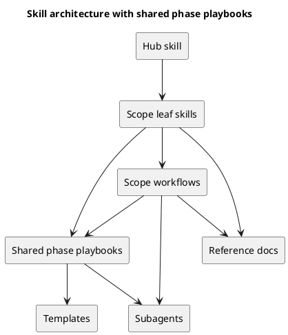

# 目的

Anthropic 公式 guidance と複数 consultant の客観分析を踏まえて、spec-dock の skill 設計についてベストプラクティス方針を再評価する。

## 前提

- 現行構成は `hub + 4 leaf`
  - `spec-driven-tdd-workflow`
  - `spec-dock-initiative-planning`
  - `spec-dock-epic-planning`
  - `spec-dock-issue-execution`
  - `spec-dock-adr-facilitation`
- docs は source of truth
- skill は concise な routing / reminder
- template は成果物の実行フォーム

## 外部一次情報から見えること

`research-00003` の要点は次の通り。

- skill は task-specific な再利用 workflow である
- skills は progressive disclosure 前提で、`SKILL.md` は薄く保つべき
- 広すぎる skill、似すぎた skill、trigger 条件が曖昧な skill は bad pattern
- 詳細は `references/`, `assets/`, `scripts/` に逃がすべき
- skill と subagents は役割が違う
- skill は job boundary に沿って作り、重い探索や隔離実行は subagents に任せるのが自然

## consultant の論点整理

### consultant 1

- `scope-first` を維持すべき
- `scope × phase` の全面 skill 化は routing complexity を上げる
- まずは phase playbook を抽出し、必要があれば pilot で検証すべき

### consultant 2

- 現行の hub + 4 leaf は「どの単位の仕事を引き受けるか」には十分
- 問題は skill 数ではなく、initiative / epic 側で phase governance が issue ほど明文化されていないこと
- top-level skill を増やすより shared playbook の方が onboarding に効く

### consultant 3

- skill 増加は drift / review cost / docs 重複を生みやすい
- 最適 layering は:
  - skill = routing / reminder
  - workflow = scope flow
  - playbook = phase guidance
  - template = execution form
  - reference = cross-cutting constraints

## 私の統合判断

Anthropic 公式 guidance と consultant 3 名の見解は、かなり一貫している。

**一気に `scope × phase` の top-level skill を量産するのは採らない方がよい。**

理由:

1. job boundary ではなく phase boundary で top-level skill を切ると、trigger の差分が小さくなりすぎる
2. skill 数が増えるほど discoverability と routing clarity が下がる
3. `SKILL.md` に interview / template / review gate を書き込みたくなり、公式が推奨する concise design から外れる
4. 今回再利用したい本体は「skill」ではなく「作法」である

つまり、解くべき問題は「phase-specific skill が足りない」ではなく、**phase guidance の reusable asset がない**ことである。

## 推奨方針

### 方針1: user-facing skill は hub + 4 leaf を維持する

- route は scope ベース
- phase は leaf の中で扱う

### 方針2: requirement / design / plan の shared phase playbook を追加する

候補:

- `phase_requirement.md`
- `phase_design.md`
- `phase_plan.md`

想定内容:

- 目的 / 出力 / 非ゴール
- 深掘り調査の進め方
- ヒアリング質問の型
- discussion sheet を起こす条件
- ADR を起こす条件
- reviewer に渡す前の exit criteria
- reviewer 指摘の解消ループ
- template の使い方
- UML の推奨ポイント

### 方針3: scope workflow から phase playbook へ導線を張る

例:

- initiative workflow -> requirement/design/plan の各 playbook
- epic workflow -> requirement/design/plan の各 playbook
- issue workflow -> requirement/design/plan の各 playbook

### 方針4: leaf skill には最小限の phase reminder だけを置く

skill に置くのは、

- いま何の scope か
- 次にどの workflow を読むか
- どの phase playbook を参照すべきか
- mandatory pause（ヒアリング必須 / review 必須など）

までに留める。

## 推奨 layering

## NG パターン

- `initiative-requirement`, `initiative-design`, `initiative-plan` を top-level skill として一気に増やす
- `SKILL.md` に長い interview script を埋め込む
- playbook と workflow と template で同じ規範を重複させる
- skill を source of truth にして docs を薄くする
- skill 追加基準を決めずに、困った局面ごとに skill を増やす

## skill 追加基準（提案）

新しい skill を足してよいのは、次をすべて満たす時だけ。

1. 独立した trigger がある
2. 固有の入力がある
3. 固有の出力がある
4. 固有のレビューゲートがある
5. 既存 workflow + playbook 参照では吸収しきれない
6. top-level に増やすことで実際に trigger quality が上がる

## 最小実行可能な次の一手

### Step 1

- `research-00003` を前提に、phase playbook 導入を requirement に落とす

### Step 2

- `phase_requirement.md`, `phase_design.md`, `phase_plan.md` の 3 本を設計する

### Step 3

- initiative / epic / issue workflow に phase playbook 導線を追加する

### Step 4

- leaf skill に short reminder を追加する

### Step 5

- その運用で本当に迷いが減らない場合のみ、internal な phase skill の pilot を検討する

## 結論

現時点のベストプラクティスは、

- **skill は仕事単位で切る**
- **phase の作法は playbook として共通化する**
- **template は成果物の型に徹する**
- **subagents は重い分析・客観レビュー・並列調査に使う**

である。

したがって、spec-dock の次の拡張方針は

- **`scope × phase` の top-level skill 化ではなく**
- **shared phase playbook の導入**

を採るのが最も自然である。
