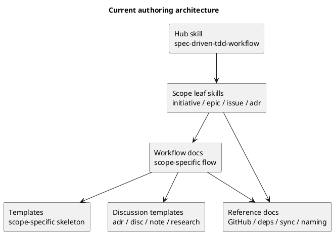
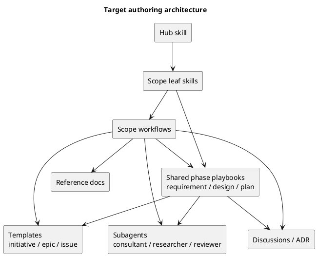

# 目的

spec-dock の現行 skill 構成を維持したまま、

- Initiative / Epic / Issue の **要件定義書**
- Initiative / Epic / Issue の **設計書**
- Initiative / Epic / Issue の **実装計画書**

をより再利用しやすく、高品質に作成できる authoring workflow を整理する。

今回の問いは、「skill を増やすべきか」よりも、**どの知識をどのドキュメント層に置くと最も再利用しやすく、drift しにくいか**である。

## 入力に使った材料

- repo 現状の workflow docs / templates / skills
- `research-00003-anthropic-skills-best-practice.md`
- `disc-00004-phase-playbooks-vs-scope-phase-skills.md`
- `disc-00005-official-guidance-and-consultant-synthesis-for-skill-architecture.md`
- consultant の客観分析（routing / onboarding / governance / maintenance 観点）

## 現状（As-Is）

### 1. すでに良い土台はかなりある

- user-facing skill は `hub + 4 leaf` に整理されている
- docs は `workflow_*` と `reference_*` に分かれている
- templates は initiative / epic / issue ごとに requirement / design / plan / report を持っている
- discussions / ADR の格納ルールも `discussions/` に統一されている

### 2. template 自体はかなり豊かである

現行 template にはすでに次の要素がある。

- UML の差し込みポイント
- TBD 欄
- Always / Ask / Never
- DoR / DoD
- review gate
- Issue では `S90 docs refresh`, `S99 final diff review quality gate`

つまり「書く場所」はかなり整っている。

### 3. いま不足しているのは “書き方の共通ガイド” である

不足しているのは template そのものではなく、次のような **authoring playbook** である。

- どの順番で調査するか
- どのタイミングでユーザーにヒアリングするか
- どの条件で discussion sheet を起こすか
- どの条件で ADR に切り出すか
- どの状態になれば reviewer に渡してよいか
- UML をどこで使うと理解が進むか

### 4. scope workflow に phase governance の濃淡がある

- Issue workflow は review loop / docs impact / final gate まで比較的明文化されている
- Initiative / Epic workflow は全体フローと成果物の説明はあるが、phase ごとの interview / analysis / approval gate はまだ薄い

### 5. したがって、問題は “skill 不足” ではない

現状の本質的な課題は、

- skill の数が少なすぎることではなく
- **requirement / design / plan の作り方が共通 knowledge として十分に抽出されていないこと**

である。

## 現状アーキテクチャの整理

## 現状の強み

- routing は scope 単位でわかりやすい
- docs が source of truth という方針は明確
- template は既に十分に構造化されている
- discussions / ADR / review の文化が workflow に組み込まれ始めている

## 現状の弱み

- requirement / design / plan の **共通 authoring method** が docs として独立していない
- scope ごとに似た guidance を書き足すと drift しやすい
- Initiative / Epic 側では「何をどの順序で深掘りするか」が Issue ほど明文化されていない
- template は rich だが、「どう埋めるか」を補助する playbook がない

## 理想状態（To-Be）

### 中核方針

- user-facing skill は **hub + 4 leaf を維持**
- requirement / design / plan の **shared phase playbook** を docs として追加
- scope workflow から phase playbook へ導線を張る
- template は skeleton の役割に徹する
- skill は concise reminder / routing に徹する

## 理想状態の document set

### A. 維持するもの

- hub skill
- 4 つの scope leaf skill
- `workflow_initiative.md`
- `workflow_epic.md`
- `workflow_issue.md`
- `workflow_adr.md`
- 各 scope の requirement / design / plan template
- `reference_*` docs

### B. 追加したいもの

- `phase_requirement.md`
- `phase_design.md`
- `phase_plan.md`

必要なら将来的に検討:

- `workflow_common.md` または `governance_common.md`
  - review gate
  - docs impact
  - ADR branching rule
  - common approval semantics

### C. 各 playbook に入れるべき内容

#### `phase_requirement.md`

- discovery の目的
- 現状理解の進め方
- ヒアリング項目の型
- スコープ整理 / 境界設定
- discussion sheet を作る条件
- ADR が必要になる条件
- requirement reviewer に渡す前の exit criteria

#### `phase_design.md`

- design の入力（requirement / discussion / ADR）
- 構造化の観点（構造 / flow / interface / data / risk）
- UML を使う場面
- 既存実装理解の順番
- trade-off の書き方
- design reviewer に渡す前の exit criteria

#### `phase_plan.md`

- 実装計画の粒度
- step の切り方
- review gate / docs impact / final gate の扱い
- commit / report / test の基本ルール
- plan reviewer に渡す前の exit criteria

## 理想状態アーキテクチャ

## ベストプラクティス提案

### 1. skill は “何をする仕事か” だけを解く

- initiative なのか
- epic なのか
- issue なのか
- ADR なのか

この判定を skill が担う。

### 2. playbook は “どう作るか” を担う

- requirement の作り方
- design の作り方
- plan の作り方

この部分を shared 化する。

### 3. workflow は “scope の end-to-end flow” を担う

- どの phase があり
- どこで discussion / ADR / review が入るか
- どの playbook をいつ参照するか

を scope ごとに示す。

### 4. template は “どこに何を書くか” の型に徹する

template に rules を詰め込みすぎると drift しやすい。

template は:

- 見出し
- 最低限の checklist
- 書く欄

に寄せるのが基本である。

### 5. 重い分析や客観レビューは subagents を前提にする

playbook には次のような delegation guidance を組み込む価値がある。

- 外部事実確認は researcher
- repo 内部構造理解は repo_analyst
- options 比較は consultant
- 仕様レビューは spec_reviewer
- 実装レビューは code_reviewer

## 提案する document inventory

最小セットとして、次を推奨する。

1. `phase_requirement.md`
2. `phase_design.md`
3. `phase_plan.md`
4. scope workflow から各 playbook への導線追記
5. leaf skill に phase 参照 reminder を 1〜2 行だけ追加

## 実装順の提案

### Step 1

- この議論を requirement に落とす

### Step 2

- `phase_requirement.md` の設計から始める

理由:

- requirement は最初の phase であり
- ヒアリング / discussion / ADR branching / スコープ整理の影響が最も大きく
- 今回の問題意識に最も直結している

### Step 3

- 次に `phase_design.md`

### Step 4

- 最後に `phase_plan.md`

Issue の plan governance はすでに比較的成熟しているので、導入順としては requirement -> design -> plan が自然である。

## 最終結論

現状の spec-dock は、

- skill 構成
- docs 正本の思想
- template の構造
- discussions / ADR の運用

まではかなり良い形に来ている。

次に必要なのは skill の増殖ではなく、**authoring knowledge の抽出と共通化**である。

したがって、理想状態は

- **scope は skill / workflow**
- **phase は playbook**
- **成果物は template**

という 3 層を明確に分けることで実現する。

この方針が、現状資産を活かしつつ、最小の追加で最大の再利用性を得るベストプラクティスだと考える。
