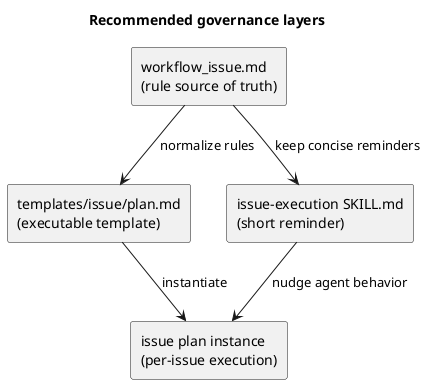

# research-00002 issue 実装計画テンプレートの governance 強化に関する調査

## 目的
- issue 実装計画テンプレートに、`step review -> fix -> re-review` の標準ループ、docs refresh step、最終品質ゲートをどのように組み込むべきかを整理する。
- 人間と coding agent の双方が守りやすい運用として、何を template / docs / skill に置くべきかを明確化する。

## 調査対象
- `src/spec_dock/assets/spec_dock/templates/issue/plan.md`
- `src/spec_dock/assets/spec_dock/docs/workflow_issue.md`
- `spec-deps/current/plan.md`
- `spec-deps/completed/iss-00014/plan.md`
- `src/spec_dock/assets/codex_skills/spec-driven-tdd-workflow/SKILL.md`
- `src/spec_dock/assets/codex_skills/spec-dock-issue-execution/SKILL.md`

## 現状観測（As-Is）

### 1. 汎用 template は review governance が弱い
- `templates/issue/plan.md` には `update_plan` / TDD / quality gate / report / commit はある。
- ただし、各 step 末尾に **review 依頼 / 指摘修正 / 再レビュー / 承認** が共通必須として明示されていない。
- 最終品質ゲートも template には独立 step として存在しない。

### 2. 実運用では template を毎回拡張している
- `spec-deps/current/plan.md` では、各 step 末尾に `code_reviewer` 依頼・修正・再レビューが明記されている。
- 同じく、`S04 docs alignment` と `S05 final quality gate` が独立 step として存在する。
- `iss-00014` の完了済み計画でも、同種の運用強化が見られる。

### 3. docs / skill の責務分担はすでに明確化されつつある
- hub skill は「docs が SSOT、skill は concise」という方針を持つ。
- issue-execution skill も active issue の入口と最小限の agent-facing guidance を持つ。
- したがって、governance も **docs を正本、template を実行器、skill は短い reminder** として置くのが自然。

## 問題の本質
- 現在の強い運用は **template 標準ではなく、実運用 plan の都度追加** になっている。
- そのため、issue ごとに plan 品質がぶれ、agent が「毎回同じ運用補強を設計し直す」必要がある。
- 特に欠けやすいのは次の 3 点:
  1. step ごとの reviewer 承認ループ
  2. docs 陳腐化を防ぐ explicit step
  3. `main...HEAD` を対象にした branch 全体の final diff gate

## consultant から得た論点

### consultant A（Parfit）
- 各実装 step は `Red -> Green -> Refactor -> step-local quality gate -> review -> fix -> re-review -> report -> commit` を基本順序にすべき。
- docs refresh は「必ず docs を書く」ではなく、**docs impact を判定し、必要時だけ実施する step** とすべき。
- 最終品質ゲートは step review の代替ではなく、cross-step 整合性を見る独立 gate であるべき。

### consultant B（Wegener）
- `plan upfront approval` と `step result approval` は分けるべき。
- `1 step = 1 observable behavior` を template の強い前提にするべき。
- `S90 docs refresh` と `S99 final quality gate` のような予約 step は、運用を落としにくい。
- `exactly 1 commit per step` は危険で、**step-scoped commit 1件以上** か **no-op 記録** が現実的。

## 比較検討

### Option A: 現状どおり、必要時に plan を手で強化する
- Pros:
  - template 変更が少ない
  - 軽量に見える
- Cons:
  - 毎 issue で同じ設計を繰り返す
  - plan 品質がばらつく
  - agent が運用を取りこぼしやすい

### Option B: template に review loop だけ追加する
- Pros:
  - 最低限の品質向上
  - 変更範囲が比較的小さい
- Cons:
  - docs refresh と final gate が運用依存のまま残る
  - 差分全体レビューの欠落は解消しない

### Option C: template / docs / skill を役割分担つきで同時更新する
- Pros:
  - 運用規範、実行手順、agent reminder が揃う
  - issue ごとの plan 追加設計が減る
  - docs 陳腐化と最終 gate の取りこぼしを防げる
- Cons:
  - 変更面積はやや広い
  - wording の一貫性設計が必要

## 推奨結論
- **Option C** を採るべき。
- ただし、過度に儀式化しないため、次の分担にする:
  - docs: ルールの正本
  - template: 実行可能なチェックリスト
  - skill: 短い reminder

## 推奨する rule set（調査結論）

### 全 step 共通
- `1 step = 1 observable behavior`
- `対象 AC/EC`、`観測点/テスト`、`この step で追加しないこと` を必須化
- step 完了条件に **review -> fix -> re-review -> approved** を含める
- step 完了後は report 更新と step-scoped commit を行う
- 実差分がない場合は report に no-op を記録する

### 終盤固定 step
- `docs impact resolution` を final gate 前に置く
- ここでは docs 更新の有無を必ず判定し、必要なら update、不要なら no-op 理由を記録する
- `whole diff final quality gate` を最後の必須 step にする
- スコープは `git diff <base>...HEAD` 相当の branch 全体

### 判定語彙
- reviewer verdict は少なくとも次に固定するのが望ましい
  - `approved`
  - `changes_requested`
  - `waived_by_user`

## 配置方針
- `workflow_issue.md`
  - governance の正本
  - 順序、例外、docs refresh、final quality gate の意味を書く
- `templates/issue/plan.md`
  - 実行ルール、共通末尾 checklist、固定終盤 step を書く
- `spec-dock-issue-execution/SKILL.md`
  - 「docs-impact step と final gate を飛ばさない」程度の短い reminder を置く
- hub skill
  - issue work は issue-execution skill を使うことだけを案内する

## アンチパターン
- review を最後に 1 回だけ行う
- docs 更新を毎 step の気分任せにする
- final diff review を最後の feature step に埋め込む
- template / docs / skill に同じ長文ルールを重複して書く
- `1 step = exactly 1 commit` を強制する
- `承認レベル` のような曖昧語だけで判定条件を書かない

## 見取り図

## 次の推奨アクション
- 次フェーズでは、この調査結果をもとに `workflow_issue.md` / `templates/issue/plan.md` / `spec-dock-issue-execution/SKILL.md` の具体差分へ落とす。
- その際、`docs impact` の表現は `none / user-facing / shipped-assets / workflow` など、二値より少し細かい分類で検討する価値がある。
