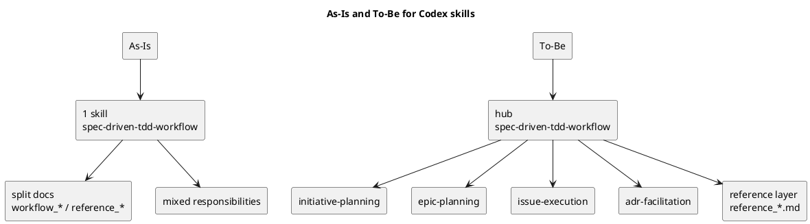

# iss-00016 Codex skills を hub + leaf 構成へ再編する — 要件定義（WHAT / WHY）

## 目的（ユーザーに見える成果 / To-Be） (必須)
- `spec-dock` を導入したリポジトリで、Codex CLI が **作業の種類に応じた skill** を選びやすくし、現在の 1 本巨大 skill に依存しない運用へ移行する。
- 現時点で必要な skill は **最初から full set で導入**し、`README` / docs / installer / tests を含めて一貫した入口を提供する。
- hub は既存名 `spec-driven-tdd-workflow` を維持しつつ、責務を「入口 / routing」に絞り、詳細実務は leaf に分離する。
- 共通運用ルール（GitHub / deps / sync / active など）は独立 skill 化せず、reference docs を正本として hub / leaf から案内する。
- あわせて、issue 実装計画の governance を標準化し、各 step の reviewer 承認ループ、docs impact 判定、branch 全体の最終品質ゲートを template / docs / skill に一貫して反映する。
- さらに、現行の skill 構成は維持したまま、Initiative / Epic / Issue の requirement / design / plan を高い再現性で作成できるよう、shared phase playbook と authoring rulebook を docs 側へ導入する。

## 背景・現状（As-Is / 調査メモ） (必須)
- 現状の挙動（事実）:
  - 導入される skill は `src/spec_dock/assets/codex_skills/spec-driven-tdd-workflow/SKILL.md` の 1 本のみ
  - installer は `src/spec_dock/cli.py` の `_install_skill()` で単一 skill を `.agents/skills/spec-driven-tdd-workflow/SKILL.md` にコピーする
  - tests は `tests/test_cli.py` で単一 skill 導入を前提に検証している
  - docs はすでに `workflow_initiative.md`, `workflow_epic.md`, `workflow_issue.md`, `workflow_adr.md` に分割済み
  - 参照 docs も `reference_github.md`, `reference_deps.md`, `reference_sync.md`, `reference_naming.md` に分かれている
  - root `README.md` には skill 再編後と整合しない旧記述（単一 skill 前提、旧 wrapper / `artifacts` 記述）が残っている
- 現状の課題（困っていること）:
  - skill だけが 1 本で、docs は分割済みという **責務のねじれ**がある
  - Codex CLI にとって、Issue 実装と Initiative/Epic/ADR が同じ入口に集約され、読解コストが高い
  - `active set`, `deps check`, `sync`, `import`, GitHub 副作用などの高リスク操作が、workflow skill と docs のどこで扱うか曖昧で、案内がぶれやすい
  - docs / skill / README の入口整合が崩れているため、誤案内が再発しやすい
  - initiative / epic / issue の template は豊富だが、「どう埋めるか」「いつ discussion / ADR / ヒアリング / review を挟むか」という共通 authoring guidance が shared playbook として抽出されていない
- 再現手順（最小で）:
  1) `src/spec_dock/assets/codex_skills/` を見ると `spec-driven-tdd-workflow` 1 本しかない
  2) `src/spec_dock/assets/spec_dock/docs/` を見ると workflow / reference は複数責務に分割されている
  3) `README.md` / `src/spec_dock/assets/spec_dock/docs/README.md` / installer / tests を横断すると、導入と案内の前提が単一 skill 前提に寄っている
- 観測点（どこを見て確認するか）:
  - FS: `src/spec_dock/assets/codex_skills/**`, 導入先 `.agents/skills/**`
  - Docs: `README.md`, `src/spec_dock/assets/spec_dock/docs/**`
  - Installer: `src/spec_dock/cli.py`
  - Tests: `tests/test_cli.py`
- 実際の観測結果（貼れる範囲で）:
  - Input/Operation: skill / docs / installer / tests を調査
  - Output/State: skill は 1 本、docs は複数責務に分割、installer/tests は単一 skill 前提
- 情報源（ヒアリング/調査の根拠）:
  - Issue/チケット: `#16`
  - ドキュメント:
    - `spec-deps/current/discussions/disc-00001-skills-rearchitecture-discovery.md`
    - `spec-deps/current/discussions/disc-00002-skills-full-set-composition.md`
    - `spec-deps/current/discussions/20260306-skills-architecture-options.md`
    - `spec-deps/current/discussions/20260306-skills-architecture-and-onboarding-ux.md`
    - `spec-deps/current/discussions/20260306-skill-splitting-strategy.md`
  - コード:
    - `src/spec_dock/cli.py`
    - `src/spec_dock/assets/codex_skills/spec-driven-tdd-workflow/SKILL.md`
    - `tests/test_cli.py`
    - `README.md`
    - `src/spec_dock/assets/spec_dock/docs/README.md`

## 対象ユーザー / 利用シナリオ (任意)
- 主な利用者（ロール）:
  - Codex CLI を使って `spec-dock` 導入済み repo で要件整理・設計・実装・運用を行うエージェント/開発者
- 代表的なシナリオ:
  - Initiative の立案を始めるので、planning に必要な docs と注意点だけを読みたい
  - active issue を前提に TDD 実装を始めるので、Issue 実行に必要な skill だけを使いたい
  - `active set` / `deps check` / `sync` / `import` のような高リスク操作を安全に実行したい
  - ADR を切るべきか迷っており、ADR 用の導線だけを取り出したい

### UML（任意） (任意)

## スコープ（暴走防止のガードレール） (必須)
- MUST（必ずやる）:
  - skill 構成を **hub + full set leaf** に再編する
  - hub 名は **`spec-driven-tdd-workflow` を維持**する
  - 初期導入 skill は full set を **デフォルト導入**する
  - 初期 full set は **以下の 5 skill に固定**する
    - `spec-driven-tdd-workflow`（hub）
    - `spec-dock-initiative-planning`
    - `spec-dock-epic-planning`
    - `spec-dock-issue-execution`
    - `spec-dock-adr-facilitation`
  - leaf 名は **scope 名ではなく責務名**で固定する
  - installer / update / package assets / tests を複数 skill 前提に更新する
  - `README.md` / 配布 docs / skill 導線の整合を同じ issue で取る
  - docs は正本、skill はルーターという責務分担を成立させる
  - `reference_github.md`, `reference_deps.md`, `reference_sync.md`, `reference_naming.md` を共通 reference layer として扱い、hub / leaf から必要箇所へ案内する
  - `--no-skill` を廃止し、skill 常時導入前提の CLI / docs / tests へ揃える
  - hub / leaf ごとの必須参照先と参照トリガーを固定する
  - `update` 時の `.agents/skills/` 所有境界を固定する
  - issue 実装計画 template に、各 step 共通の `review -> fix -> re-review -> report -> commit` governance を標準化する
  - `workflow_issue.md` に issue execution governance の正本ルールを追加する
  - docs impact を判定し、必要時だけ docs refresh step を final quality gate 前に置く運用を標準化する
  - `git diff <base>...HEAD` を対象にした branch 全体の final diff review quality gate を標準 step として定義する
  - top-level skill は `hub + 4 leaf` を維持したまま、shared phase playbook `phase_requirement.md`, `phase_design.md`, `phase_plan.md` を docs として追加する
  - Initiative / Epic / Issue の workflow docs から、対応する phase playbook へ導線を張る
  - phase playbook に、調査・分析・ユーザーヒアリング・discussion sheet・ADR 分岐・review / re-review・subagent 活用・template の使い方を再利用可能な rulebook として整理する
  - leaf skill には phase-specific top-level routing を増やさず、必要な phase playbook への短い reminder のみを持たせる
  - requirement 承認前に design へ進まず、design 承認前に plan へ進まない phase-to-phase approval gate を rulebook と workflow の両方に定義する
- MUST NOT（絶対にやらない／追加しない）:
  - 1 本巨大 skill 構成へ戻さない
  - 現時点で必要な skill を「後で追加」で先送りしない
  - reference docs をそのまま大量の micro-skill に分割しない
  - scope 名だけの曖昧な leaf 名（`spec-dock-issue` など）へ寄せない
  - `runtime-operations` のような責務境界が曖昧な抽象 skill を初期導入しない
  - review ループの規範を skill だけに閉じ込めない
  - docs refresh を「毎 step 必ず全件更新」のような儀式化したルールにしない
  - `initiative-requirement` / `epic-design` / `issue-plan` のような `scope × phase` top-level skill を追加しない
  - interview script / review gate / template 本文を `SKILL.md` に長文複製しない
  - workflow / playbook / template / skill の 4 層に同じ規範を重複記載しない
- OUT OF SCOPE:
  - Codex 以外のエージェント向け最適化
  - 将来の plugin/marketplace/skill bundle 選択 UI
  - runtime コマンド体系自体の再設計
  - docs/reference の全面的な情報刷新（skill 導線と矛盾する箇所の修正は scope 内）
  - `scope × phase` skill の pilot 実験

## 境界（Always / Ask / Never） (必須)
- Always（常に守る）:
  - skill 名・配置・docs 導線・installer/test 変更は一貫した構成として扱う
  - 変更判断は「Codex CLI が今何をすべきか迷わないか」を優先する
  - skill には最小限の routing / safety / 次に読む docs を置き、詳細仕様は docs へ寄せる
- Ask（迷ったら相談）:
  - 初期 full set に含める責務の追加/削除
  - hub 名の rename を今回 scope に含めるか
- Never（絶対にしない）:
  - README / docs / skill / tests のどれかだけを更新して前提を食い違わせる
  - 高リスク操作を docs の深い場所へ埋め込んだまま放置する
  - 既存 single-skill 前提を温存したまま full set 導入だけ行う
  - 利用者が独自追加した未知の skill ディレクトリを、spec-dock の `update` が勝手に削除する

## 非交渉制約（守るべき制約） (必須)
- hub 名 `spec-driven-tdd-workflow` は今回維持する
- 初期導入は **full set default install** とする
- `--no-skill` のような skill 一式を無効化する導線は今回廃止対象として扱う
- `README.md` の skill 導線と矛盾する旧記述は同じ issue で修正する
- 既存 docs（`workflow_*`, `reference_*`）を正本として再利用し、skill 側に詳細仕様を複製しない
- `update` が上書き・削除してよいのは、spec-dock 管理対象 skill ディレクトリに限る
- governance の規範本体は docs に置き、template は実行形、skill は短い reminder に留める
- phase playbook は shared docs として設計し、scope ごとの workflow と template の間に置く

## 前提（Assumptions） (必須)
- 現在の主利用者は Codex CLI である
- skill の discoverability と routing 品質が、今の運用体験に直接影響している
- `workflow_*` と `reference_*` は skill 再編後も中核 docs として維持する
- `spec-dock` はまだ本格公開前であり、構造改善を優先できる
- 既存 single-skill 導入済み repo には `update` で新 skill セットを配布する想定である
- issue 実装は multi-agent review を前提に進めるケースが増えており、template 側で reviewer 承認ループを標準化する価値が高い
- Anthropic 公式 guidance でも、skill は concise な task-specific workflow に保ち、詳細 guidance は references / assets / scripts に逃がす設計が推奨されている

## 判断材料/トレードオフ（Decision / Trade-offs） (任意)
- 論点: 共通運用ルールを独立 skill にするか
  - 選択肢A: `runtime-operations` として独立 skill 化する
    - Pros:
      - 高リスク操作を 1 か所に集約できる
    - Cons:
      - 抽象度が高く、いつ使うべきか曖昧
      - 実態が reference docs の再包装になりやすい
  - 選択肢B: reference layer として docs 正本へ残し、hub / leaf から案内する
    - Pros:
      - 責務境界が明確
      - 共通ルールを 1 つの正本へ保ちやすい
      - workflow skill を task 起点の導線として保ちやすい
    - Cons:
      - hub / leaf の参照設計が甘いと見落とされる
  - 決定: B
  - 理由: 操作系は重要だが独立 task ではなく共通ルールであり、reference layer 化が最も一貫する
- 論点: leaf 名は scope 名か責務名か
  - 選択肢A: scope 名
  - 選択肢B: 責務名
  - 決定: B
  - 理由: Codex CLI では「何をしたいか」で導線を切る方が明確で、scope 名だけでは責務が広すぎる
- 論点: `update` は `.agents/skills/` の何を管理するか
  - 選択肢A: `.agents/skills/` 配下を全面的に spec-dock 管理として揃える
    - Pros:
      - 常に完全一致へ揃えやすい
    - Cons:
      - 利用者独自の skill を破壊しうる
  - 選択肢B: spec-dock 配布 skill 名と legacy 管理名のみ管理し、未知の skill は保持する
    - Pros:
      - 破壊的更新を避けやすい
      - ownership boundary が明確
    - Cons:
      - `.agents/skills/` 全体の完全一致は前提にできない
  - 決定: B
  - 理由: spec-dock 管理物の整合性は保ちつつ、利用者の独自 skill を壊さない境界が必要

## routing 契約（skill -> docs 導線） (必須)
- 以下で列挙する direct references は、**trigger group ごとの最小完全集合**である。部分集合だけを列挙して requirement を満たしたことにはしない。
- hub（`spec-driven-tdd-workflow`）:
  - Initiative / Epic / Issue / ADR の 4 leaf を常に列挙する
  - 各 leaf について「どの作業で使うか」を 1 行で説明する
  - 共通運用ルールの参照先として `reference_github.md`, `reference_deps.md`, `reference_sync.md`, `reference_naming.md` を列挙する
- `spec-dock-initiative-planning`:
  - 常に `workflow_initiative.md` を主要導線として案内する
  - GitHub 連携 / import / naming / sync が必要なときは `reference_github.md`, `reference_sync.md`, `reference_naming.md` を直接案内する
- `spec-dock-epic-planning`:
  - 常に `workflow_epic.md` を主要導線として案内する
  - GitHub 連携 / import / naming / sync が必要なときは `reference_github.md`, `reference_sync.md`, `reference_naming.md` を直接案内する
- `spec-dock-issue-execution`:
  - 常に `workflow_issue.md` を主要導線として案内する
  - `active set`, `deps check`, `sync`, `validate`, issue GitHub 操作が必要なときは `reference_deps.md`, `reference_sync.md`, `reference_github.md`, `reference_naming.md` を直接案内する
- `spec-dock-adr-facilitation`:
  - 常に `workflow_adr.md` を主要導線として案内する
  - ADR の配置 / 命名 / 親ノードとの関係を確認する必要があるときは、作業中の親 workflow と `reference_naming.md` を参照させる

## update 所有境界（`.agents/skills/`） (必須)
- spec-dock が上書き・差し替え・削除してよいのは、**spec-dock が配布する skill 名に一致するディレクトリ**と、過去に spec-dock が配布していた legacy skill ディレクトリに限る
- 今回の target set は以下の 5 skill である
  - `spec-driven-tdd-workflow`
  - `spec-dock-initiative-planning`
  - `spec-dock-epic-planning`
  - `spec-dock-issue-execution`
  - `spec-dock-adr-facilitation`
- target set に含まれない **spec-dock 管理対象の旧 skill** は `update` で除去してよい
- `.agents/skills/` 配下の **未知の skill ディレクトリ**（spec-dock 配布名に一致しないもの）は `update` で削除しない
- skill 同期が途中失敗しても、`spec-dock update` の再実行で target state に収束できることを受け入れ条件に含める

## リスク/懸念（Risks） (任意)
- R-001: skill 数増加で入口が増え、逆に discoverability が下がる
  - 影響: Codex CLI が適切な skill を選びにくくなる
  - 対応: hub を唯一の入口とし、leaf は hub 配下で明確に案内する
- R-002: installer / tests / docs の更新漏れで構成が不整合になる
  - 影響: 導入先 repo が壊れる / docs と実装が食い違う
  - 対応: requirement で対象範囲を固定し、導入テストを複数 skill 前提へ更新する
- R-003: 共通運用ルールが reference docs 側へ退避した結果、hub / leaf から辿れず見落とされる
  - 影響: 高リスク操作で誤用が起きる
  - 対応: hub / issue / initiative / epic 各 skill に、参照すべき `reference_*` を明示する
- R-004: root `README.md` の旧記述が残り、ユーザーが古い導線を辿る
  - 影響: skill 再編の効果が薄れる
  - 対応: 同一 issue で skill 導線と矛盾する箇所を必ず修正する
- R-005: `update` が `.agents/skills/` の custom skill まで削除し、利用者運用を壊す
  - 影響: 破壊的変更になる
  - 対応: spec-dock 管理対象 skill のみを更新対象とする所有境界を requirement で固定する

## 受け入れ条件（観測可能な振る舞い） (必須)
- AC-001:
  - Actor/Role: `spec-dock` 導入先 repo の利用者
  - Given: `spec-dock init` を通常モードで実行する
  - When: `.agents/skills/` を確認する
  - Then: hub 1 つ + leaf 4 つの **合計 5 skill のみ**がデフォルト導入されている
  - 観測点（UI/HTTP/DB/Log など）: ファイルシステム（`.agents/skills/**/SKILL.md`）
- AC-002:
  - Actor/Role: 既存の single-skill 構成を持つ repo の利用者
  - Given: 旧構成の repo に対して `spec-dock update` を実行する
  - When: `.agents/skills/` と docs を確認する
  - Then: 新しい full set 構成へ更新され、導線が整合している
  - 観測点: ファイルシステム、更新後 docs
- AC-002b:
  - Actor/Role: 過去に `--no-skill` で初期化した repo の利用者
  - Given: skill が存在しない旧 repo に対して `spec-dock update` を実行する
  - When: `.agents/skills/` と docs を確認する
  - Then: hub 1 つ + leaf 4 つの **合計 5 skill** が導入され、no-skill 状態は維持されない
  - 観測点: ファイルシステム、更新後 docs
- AC-003:
  - Actor/Role: Codex CLI
  - Given: hub skill を読む
  - When: Initiative / Epic / Issue / ADR のいずれかを始める
  - Then: 4 つの leaf 全てと、4 つの `reference_*` が直接列挙され、各 leaf について「どの作業で使うか」の説明が 1 行ずつ存在する
  - 観測点: `spec-driven-tdd-workflow/SKILL.md` の記述
- AC-004:
  - Actor/Role: Codex CLI
  - Given: `spec-dock-issue-execution` を読む
  - When: active issue を前提に実装フローへ入る
  - Then: `workflow_issue.md` が直接案内され、`active/deps/sync/validate` と issue GitHub 操作の参照先として `reference_deps.md`, `reference_sync.md`, `reference_github.md`, `reference_naming.md` が直接列挙されている
  - 観測点: skill 内容、参照先 docs
- AC-005:
  - Actor/Role: Codex CLI / 利用者
  - Given: `spec-dock-initiative-planning` または `spec-dock-epic-planning` を読む
  - When: GitHub 連携 / import / naming / sync が必要になる
  - Then: `workflow_initiative.md` / `workflow_epic.md` に加えて、`reference_github.md`, `reference_sync.md`, `reference_naming.md` が直接列挙されている
  - 観測点: skill 内容、参照先 `reference_*`
- AC-005b:
  - Actor/Role: Codex CLI / 利用者
  - Given: `spec-dock-adr-facilitation` を読む
  - When: ADR の配置 / 命名 / 親ノードとの関係を確認する
  - Then: `workflow_adr.md` と `reference_naming.md`、および親 workflow へ戻る導線が直接列挙されている
  - 観測点: skill 内容、参照先 docs
- AC-006:
  - Actor/Role: 利用者
  - Given: root `README.md` と `spec-dock/docs/README.md` を読む
  - When: skill 入口と関連コマンドを確認する
  - Then: single-skill 前提や旧 skill 導線と矛盾しない説明になっている
  - 観測点: `README.md`, `src/spec_dock/assets/spec_dock/docs/README.md`
- AC-007:
  - Actor/Role: 開発者
  - Given: テストを実行する
  - When: skill 導入関連のテストを確認する
  - Then: hub + full set leaf 前提の導入/更新が検証される
  - 観測点: `tests/test_cli.py`
- AC-008:
  - Actor/Role: 利用者
  - Given: `spec-dock init` または `spec-dock update` のヘルプ/ドキュメントを確認する
  - When: skill 導入オプションを探す
  - Then: `--no-skill` のような skill 無効化導線は存在しない
  - 観測点: CLI help, README, tests
- AC-009:
  - Actor/Role: 利用者
  - Given: `.agents/skills/` に spec-dock 管理対象外の custom skill が存在する repo に対して `spec-dock update` を実行する
  - When: 更新後の `.agents/skills/` を確認する
  - Then: spec-dock 管理対象の skill は target set に揃い、未知の custom skill は保持される
  - 観測点: `.agents/skills/` の更新前後差分
- AC-010:
  - Actor/Role: 利用者
  - Given: `update` 中に managed skill 同期が途中失敗し、一時的に部分更新状態になる
  - When: `spec-dock update` を再実行する
  - Then: hub + 4 leaf の target set に収束し、未知の custom skill は保持される
  - 観測点: `.agents/skills/` の再実行後状態
- AC-011:
  - Actor/Role: issue 実装を行う開発者 / coding agent
  - Given: `templates/issue/plan.md` から issue plan を起こす
  - When: 各 step を記述する
  - Then: 各 step 共通の review loop、docs impact 判定、report 更新、step-scoped commit/no-op 記録が template として用意されている
  - 観測点: `src/spec_dock/assets/spec_dock/templates/issue/plan.md`
- AC-012:
  - Actor/Role: issue 実装を行う開発者 / coding agent
  - Given: `workflow_issue.md` を読む
  - When: issue 実装の進め方を確認する
  - Then: plan upfront approval、step result approval、docs refresh step、final diff review quality gate の役割が正本として明記されている
  - 観測点: `src/spec_dock/assets/spec_dock/docs/workflow_issue.md`
- AC-013:
  - Actor/Role: Codex CLI
  - Given: `spec-dock-issue-execution` を読む
  - When: active issue の plan に従って作業する
  - Then: docs が SSOT であること、docs impact step と final quality gate を飛ばさないことが短い reminder として案内されている
  - 観測点: `src/spec_dock/assets/codex_skills/spec-dock-issue-execution/SKILL.md`
- AC-014:
  - Actor/Role: reviewer / 開発者
  - Given: branch 全体の実装差分を評価する
  - When: issue plan の最終 step を確認する
  - Then: `git diff <base>...HEAD` を対象にした final diff review quality gate が独立 step として定義されている
  - 観測点: `src/spec_dock/assets/spec_dock/templates/issue/plan.md`, `workflow_issue.md`
- AC-015:
  - Actor/Role: initiative / epic / issue の仕様書を作成する開発者 / coding agent
  - Given: requirement / design / plan の作成方法を確認したい
  - When: docs を参照する
  - Then: shared phase playbook `phase_requirement.md`, `phase_design.md`, `phase_plan.md` が存在し、phase ごとの作法を共通 guidance として参照できる
  - 観測点: `src/spec_dock/assets/spec_dock/docs/phase_requirement.md`, `src/spec_dock/assets/spec_dock/docs/phase_design.md`, `src/spec_dock/assets/spec_dock/docs/phase_plan.md`
- AC-016:
  - Actor/Role: initiative / epic / issue の仕様書を作成する開発者 / coding agent
  - Given: scope workflow doc を読んでいる
  - When: requirement / design / plan のいずれかの phase に進む
  - Then: 各 workflow の phase 節から対応する phase playbook への**直接リンク**が存在し、scope 固有ノートは workflow 側、phase の共通作法は playbook 側に残る
  - 観測点: `src/spec_dock/assets/spec_dock/docs/workflow_initiative.md`, `src/spec_dock/assets/spec_dock/docs/workflow_epic.md`, `src/spec_dock/assets/spec_dock/docs/workflow_issue.md`
- AC-017:
  - Actor/Role: Codex CLI
  - Given: scope leaf skill を読んで作業に入る
  - When: requirement / design / plan のどこを進めるか判断する
  - Then: skill は concise なまま、必要な phase playbook への reminder を持ち、playbook 本文は docs 側へ委ねている
  - 観測点: `src/spec_dock/assets/codex_skills/spec-dock-initiative-planning/SKILL.md`, `src/spec_dock/assets/codex_skills/spec-dock-epic-planning/SKILL.md`, `src/spec_dock/assets/codex_skills/spec-dock-issue-execution/SKILL.md`
- AC-018:
  - Actor/Role: requirement / design / plan を作成する開発者 / coding agent
  - Given: phase playbook を使って仕様書を作成する
  - When: 情報不足や論点が存在する
  - Then:
    - playbook は、追加調査、ユーザーヒアリング、discussion sheet 作成、必要なら ADR 起票、review / re-review のループ、適切な subagent 活用を促す rulebook として機能する
    - requirement は reviewer 合格前に design へ進まず、design は reviewer 合格前に plan へ進まない
    - phase ごとに exit criteria と next-phase entry 条件が明示される
  - 観測点: `src/spec_dock/assets/spec_dock/docs/phase_requirement.md`, `src/spec_dock/assets/spec_dock/docs/phase_design.md`, `src/spec_dock/assets/spec_dock/docs/phase_plan.md`

### 入力→出力例 (任意)
- EX-001:
  - Input: `spec-dock init /repo`
  - Output: `/repo/.agents/skills/spec-driven-tdd-workflow/SKILL.md` と 4 つの leaf skill が存在する
- EX-002:
  - Input: `spec-dock update /repo`
  - Output: `.agents/skills/` と docs が新構成へ更新され、hub / leaf / docs の導線が整合している
- EX-003:
  - Input: 過去に `--no-skill` で初期化した `/repo` に対して `spec-dock update /repo`
  - Output: `/repo/.agents/skills/` に hub + 4 leaf が生成される

## 例外・エッジケース（仕様として固定） (必須)
- EC-001:
  - 条件: 導入先 repo が旧 single-skill 構成のままで update される
  - 期待: 新 full set 構成へ更新され、旧前提に依存しない
  - 観測点: `.agents/skills/`, docs, update 後のファイル構成
- EC-001b:
  - 条件: 導入先 repo が過去の `--no-skill` 運用により `.agents/skills/` を持たない
  - 期待: `update` 後は no-skill 状態を維持せず、hub + 4 leaf を導入する
  - 観測点: `.agents/skills/`, docs, update 後のファイル構成
- EC-002:
  - 条件: `reference_*` は更新されたが、hub / leaf 側の導線が不足している
  - 期待: その状態は受け入れない（共通運用ルールへ辿れる導線が必要）
  - 観測点: 各 skill の参照先記述
- EC-003:
  - 条件: docs には更新が入るが root `README.md` の旧導線が残る
  - 期待: その状態は受け入れない（同一 issue で整合が取れている必要がある）
  - 観測点: `README.md`, 配布 docs
- EC-004:
  - 条件: `runtime-operations` のような抽象 skill を追加してしまう
  - 期待: その状態は受け入れない（task 起点の leaf と reference layer の構成を守る）
  - 観測点: skill 構成、命名、docs 参照
- EC-005:
  - 条件: `update` が spec-dock 管理対象外の custom skill を削除する
  - 期待: その状態は受け入れない（ownership boundary 違反）
  - 観測点: `.agents/skills/` の更新前後差分
- EC-006:
  - 条件: `update` の途中失敗後、再実行しても target state へ収束しない
  - 期待: その状態は受け入れない（migration safety 違反）
  - 観測点: `.agents/skills/` の再実行後状態
- EC-007:
  - 条件: issue plan に review loop がなく、step 完了後に reviewer 承認を経ずに次 step へ進めてしまう
  - 期待: その状態は受け入れない（governance 標準化違反）
  - 観測点: `templates/issue/plan.md`, `workflow_issue.md`
- EC-008:
  - 条件: docs impact があるのに docs refresh step が存在しない
  - 期待: その状態は受け入れない（docs 陳腐化リスク）
  - 観測点: `templates/issue/plan.md`, `workflow_issue.md`
- EC-009:
  - 条件: final gate が最後の feature step に埋め込まれ、branch 全体 diff review が独立していない
  - 期待: その状態は受け入れない（cross-step 整合性を保証できない）
  - 観測点: `templates/issue/plan.md`, `workflow_issue.md`
- EC-010:
  - 条件: `scope × phase` top-level skill を追加しないと playbook 導入要件を満たせない設計になっている
  - 期待: その状態は受け入れない（routing 軸を二重化してはならない）
  - 観測点: skill 構成、docs 入口、workflow 導線
- EC-011:
  - 条件: 同じ規範が playbook / workflow / template / skill の複数レイヤへ複製され、どこが正本か判断できない
  - 期待: その状態は受け入れない（playbook は作法、template は型、skill は reminder、workflow は scope flow に責務分離されている必要がある）
  - 観測点: `docs/phase_*.md`, `templates/**`, `codex_skills/**/SKILL.md`
- EC-012:
  - 条件: requirement / design / plan の authoring を進める際、論点が残っているのに discussion sheet / user hearing / review loop へ進む pause が playbook に存在しない
  - 期待: その状態は受け入れない（再現可能な rulebook になっていない）
  - 観測点: `docs/phase_*.md`

## 用語（ドメイン語彙） (必須)
- TERM-001: hub skill = 入口 / task routing / 共通 safety を担う skill
- TERM-002: leaf skill = 特定責務に特化した実行用 skill
- TERM-003: full set = 現時点で必要と判断した skill 群を最初から全部導入する方針
- TERM-004: reference layer = `new/import/active/deps/sync/validate` と GitHub safety を支える共通運用 docs 群
- TERM-005: docs impact = 実装差分により README / workflow / distributed docs / skill reminder の更新要否を判定するための分類
- TERM-006: final diff review quality gate = `git diff <base>...HEAD` を対象に、tests / packaging / docs / diff 全体を reviewer が確認する最終 step
- TERM-007: phase playbook = requirement / design / plan の「どう作るか」を共通 guidance として定義する docs
- TERM-008: authoring rulebook = 調査、ヒアリング、discussion sheet、ADR、review gate、subagent 活用を再現可能にする作法の集合

## 未確定事項 / 要確認 (任意)
- 現時点では、主要な判断はユーザー確認済みである。
- design では requirement に定義済みの routing 契約と ownership boundary を変更せず、具体的なファイル構成・記述方式・テスト手段へ落とし込む。

## Definition of Ready（着手可能条件） (必須)
- [x] 目的が 1〜3行で明確になっている
- [x] MUST/MUST NOT/OUT OF SCOPE が書けている
- [x] Always/Ask/Never が書けている
- [x] AC/EC が観測可能（テスト可能）な形になっている
- [x] 観測点（FS/docs/tests）が明記されている
- [x] 未確定事項が「質問/選択肢/推奨案/影響範囲」で整理されている

## 完了条件（Definition of Done） (必須)
- hub + full set leaf の構成が requirement / design / plan / 実装 / tests / docs で一貫している
- installer / update / tests / README / docs の整合が取れている
- `runtime-operations` を独立 skill にせず、reference layer として hub / leaf から辿れる
- `--no-skill` 廃止方針が CLI / docs / tests に反映されている
- issue 実装 governance が docs / template / skill に一貫して反映されている
- final diff review quality gate と docs refresh step が issue execution の標準運用として定義されている
- shared phase playbook が docs に追加され、scope workflow から参照されている
- requirement / design / plan の authoring rulebook が skill を増やさず docs / workflow / template に分離して定義されている
- MUST NOT / OUT OF SCOPE を破っていない

## 省略/例外メモ (必須)
- 該当なし
