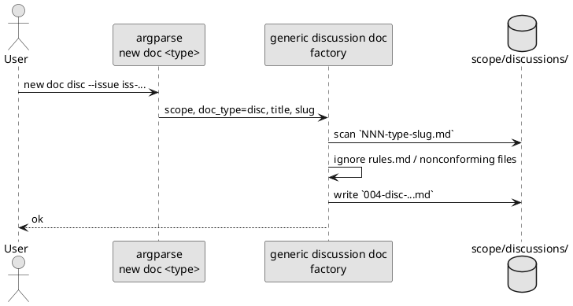
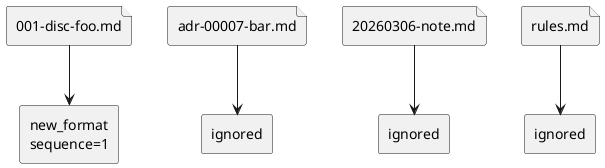
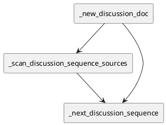

# iss-00019 discussions 配下の資料命名を時系列順に並ぶ形式へ統一し、全種別を共通採番できるようにする — 設計（HOW）

## 目的・制約（要件から転記・圧縮） (必須)
- 目的:
  - `discussions/` 配下の資料命名を `<nnn>-<type>-<slug>.md` へ統一し、名前順がそのまま作成順になるようにする
  - primary interface を `new doc <type>` に統一し、`adr`, `disc`, `research`, `note` を同じ entrypoint で生成できるようにする
  - 互換経路を持たない単純な新ロジックとして runtime / docs / tests に一貫反映する
- MUST:
  - `new doc <type>` が番号計算・衝突検出・type 判定を保証する
  - `new doc adr` でも `new doc disc|research|note` でも同じ採番器を通す
  - 採番対象は `NNN-type-slug.md` に一致するファイルだけとし、`rules.md` と非準拠ファイルは数えない
  - `rules.md` / templates / shipped docs / runtime reference docs / skill assets / tests / `spec-deps/current/discussions/rules.md` / `spec-deps/README.md` を新ルールに揃える
  - `999` 超過時は 4 桁へ進まずエラー停止する
- MUST NOT:
  - `discussions/` を type ごとのサブディレクトリへ分割しない
  - 既存ユーザー repo の discussion 資料を自動 rename しない
  - `new adr`, `new disc`, `new research`, `new note` などの per-type command や legacy filename parse を残さない
  - public interface に explicit sequence override を持ち込まない
- 非交渉制約:
  - primary interface は `new doc <type>` だけで、`type` は位置引数
  - 採番対象は新標準命名だけであり、旧命名互換は提供しない
  - 新規 path は lowercase を維持する
  - 依存追加を前提にしない
- 前提:
  - runtime の中心は `src/spec_dock/assets/spec_dock/scripts/spec_dock_runtime/app.py`
  - shipped docs は `src/spec_dock/assets/spec_dock/docs/**`、scaffold rules は `src/spec_dock/assets/spec_dock/templates/**/discussions/rules.md` にある

---

## 既存実装/規約の調査結果（As-Is / 99.9%理解） (必須)
- 参照した規約/実装（根拠）:
  - [requirement.md](/srv/mount/spec-dock/spec-deps/current/requirement.md): 今回の契約正本
  - [disc-00001-discussions-naming-analysis-and-target-state.md](/srv/mount/spec-dock/spec-deps/current/discussions/disc-00001-discussions-naming-analysis-and-target-state.md): As-Is / To-Be の判断根拠
  - [disc-00002-non-adr-supported-workflow-options.md](/srv/mount/spec-dock/spec-deps/current/discussions/disc-00002-non-adr-supported-workflow-options.md): `new doc <type>` 採用の判断履歴
  - [app.py](/srv/mount/spec-dock/src/spec_dock/assets/spec_dock/scripts/spec_dock_runtime/app.py): runtime の parser / dispatch / `_new_adr()` 実装
  - [templates/README.md](/srv/mount/spec-dock/src/spec_dock/assets/spec_dock/templates/README.md): 現行 template 出力先説明
  - [reference_naming.md](/srv/mount/spec-dock/src/spec_dock/assets/spec_dock/docs/reference_naming.md): 現行命名ルールの正本
  - [scripts/README.md](/srv/mount/spec-dock/src/spec_dock/assets/spec_dock/scripts/README.md): runtime command examples
  - [workflow_adr.md](/srv/mount/spec-dock/src/spec_dock/assets/spec_dock/docs/workflow_adr.md): ADR 導線の正本
  - [workflow_issue.md](/srv/mount/spec-dock/src/spec_dock/assets/spec_dock/docs/workflow_issue.md): issue workflow からの導線
  - [workflow_epic.md](/srv/mount/spec-dock/src/spec_dock/assets/spec_dock/docs/workflow_epic.md): epic workflow からの導線
  - [workflow_initiative.md](/srv/mount/spec-dock/src/spec_dock/assets/spec_dock/docs/workflow_initiative.md): initiative workflow からの導線
  - [phase_requirement.md](/srv/mount/spec-dock/src/spec_dock/assets/spec_dock/docs/phase_requirement.md): discussion 資料導線の playbook
  - [phase_design.md](/srv/mount/spec-dock/src/spec_dock/assets/spec_dock/docs/phase_design.md): discussion 資料導線の playbook
  - [phase_plan.md](/srv/mount/spec-dock/src/spec_dock/assets/spec_dock/docs/phase_plan.md): discussion 資料導線の playbook
  - [guide.md](/srv/mount/spec-dock/src/spec_dock/assets/spec_dock/docs/guide.md): tree 図と例示
  - [spec-driven-tdd-workflow/SKILL.md](/srv/mount/spec-dock/src/spec_dock/assets/codex_skills/spec-driven-tdd-workflow/SKILL.md): hub skill の command example
  - [tests/test_cli.py](/srv/mount/spec-dock/tests/test_cli.py): current regression coverage
- 観測した現状（事実）:
  - parser は `new initiative|epic|issue|adr` を持つが、`new doc` はない
  - `_new_adr()` は `discussions/adr-*.md` のみを走査し、type ローカル連番 `adr-00001` 形式で採番する
  - rules / docs / templates は `adr-00001-...`, `disc-00001-...`, `research-00001-...` の例を保持している
  - `reference_naming.md` は `new adr` を title/slug 制約の例外として扱っている
  - `scripts/README.md` と hub skill は `new adr --issue ...` を公開例として持っている
  - テストは `adr-00001-*.md` / `adr-00002-*.md` を前提にしている
- 採用するパターン:
  - parser 追加 + shared helper 追加で `new doc <type>` を本命経路にする
  - 採番器は new-format only に限定し、非準拠ファイルは一律 ignore する
  - `unittest` ベースで temp dir を使う既存テスト流儀を維持する
- 採用しない/変更しない:
  - issue / epic / initiative 作成コマンド体系自体は変更しない
  - `discussions/` の階層構造は変えない
  - 既存 `spec-deps/completed/**` を一括 rename しない
- 影響範囲:
  - runtime:
    - [app.py](/srv/mount/spec-dock/src/spec_dock/assets/spec_dock/scripts/spec_dock_runtime/app.py)
  - templates:
    - [templates/README.md](/srv/mount/spec-dock/src/spec_dock/assets/spec_dock/templates/README.md)
    - [initiative rules](/srv/mount/spec-dock/src/spec_dock/assets/spec_dock/templates/initiative/discussions/rules.md)
    - [epic rules](/srv/mount/spec-dock/src/spec_dock/assets/spec_dock/templates/epic/discussions/rules.md)
    - [issue rules](/srv/mount/spec-dock/src/spec_dock/assets/spec_dock/templates/issue/discussions/rules.md)
  - docs:
    - [reference_naming.md](/srv/mount/spec-dock/src/spec_dock/assets/spec_dock/docs/reference_naming.md)
    - [scripts/README.md](/srv/mount/spec-dock/src/spec_dock/assets/spec_dock/scripts/README.md)
    - [workflow_adr.md](/srv/mount/spec-dock/src/spec_dock/assets/spec_dock/docs/workflow_adr.md)
    - [workflow_issue.md](/srv/mount/spec-dock/src/spec_dock/assets/spec_dock/docs/workflow_issue.md)
    - [workflow_epic.md](/srv/mount/spec-dock/src/spec_dock/assets/spec_dock/docs/workflow_epic.md)
    - [workflow_initiative.md](/srv/mount/spec-dock/src/spec_dock/assets/spec_dock/docs/workflow_initiative.md)
    - [phase_requirement.md](/srv/mount/spec-dock/src/spec_dock/assets/spec_dock/docs/phase_requirement.md)
    - [phase_design.md](/srv/mount/spec-dock/src/spec_dock/assets/spec_dock/docs/phase_design.md)
    - [phase_plan.md](/srv/mount/spec-dock/src/spec_dock/assets/spec_dock/docs/phase_plan.md)
    - [README.md](/srv/mount/spec-dock/src/spec_dock/assets/spec_dock/docs/README.md)
    - [guide.md](/srv/mount/spec-dock/src/spec_dock/assets/spec_dock/docs/guide.md)
  - skill assets:
    - [spec-driven-tdd-workflow/SKILL.md](/srv/mount/spec-dock/src/spec_dock/assets/codex_skills/spec-driven-tdd-workflow/SKILL.md)
  - tests:
    - [tests/test_cli.py](/srv/mount/spec-dock/tests/test_cli.py)
  - repo current guidance:
    - [rules.md](/srv/mount/spec-dock/spec-deps/current/discussions/rules.md)
    - [spec-deps/README.md](/srv/mount/spec-dock/spec-deps/README.md)

## 主要フロー（テキスト：AC単位で短く） (任意)
- Flow for AC-002 / AC-003:
  1) 利用者が `./spec-dock/scripts/spec-dock new doc <type> --{initiative|epic|issue} ...` を実行する
  2) parser が `type` と scope を解釈し、generic discussion doc generator を呼ぶ
  3) generator が `discussions/` を走査し、新標準命名に一致する資料だけから次番号を算出する
  4) `NNN-type-slug.md` を書き出す
- Flow for AC-004:
  1) templates / rules / docs / tests / skill assets / current guidance の命名例と command 例を `new doc <type>` と `NNN-type-slug.md` へ更新する
  2) `new adr` や旧命名例を current guidance から除去する
- Flow for AC-005:
  1) `discussions/` に `rules.md` や旧命名ファイルが残っていても rename はしない
  2) `new doc <type>` はそれらを採番対象外として無視する

### UML（任意） (任意)


## データ・バリデーション（必要最小限） (任意)
- MODEL-001: DiscussionDocumentRef
  - Fields:
    - `path`
    - `filename`
    - `doc_type`
    - `sequence`
    - `source_kind` (`new_format | ignored`)
  - Constraints/Validation:
    - new format は `^(?P<num>[0-9]{3})-(?P<type>adr|disc|research|note)-(?P<slug>[a-z0-9]+(?:-[a-z0-9]+)*)\\.md$`
    - `rules.md` は常に ignored
    - non-matching file は常に ignored
- MODEL-002: NewDocRequest
  - Fields:
    - `scope_prefix` (`init | epic | iss`)
    - `scope_id`
    - `doc_type` (`adr | disc | research | note`)
    - `title`
    - `slug`
  - Constraints/Validation:
    - `doc_type` は固定語彙のみ
    - `slug` は kebab-case
- MODEL-003: NextSequenceDecision
  - Fields:
    - `max_new_format`
    - `next_sequence`
    - `overflow`
  - Constraints/Validation:
    - `next_sequence = max_new_format + 1`
    - `next_sequence > 999` なら error

### UML（任意） (任意)


## 判断材料/トレードオフ（Decision / Trade-offs） (任意)
- 論点: `new doc <type>` を新設するか
  - 選択肢A: primary interface として `new doc <type>` を新設
    - Pros: 利用者導線が明確、docs/test の主語が揃う
    - Cons: parser surface が増える
  - 選択肢B: hidden helper のみ
    - Pros: 表面 CLI が増えない
    - Cons: requirement で固定した public contract が弱くなる
  - 決定: A
  - 理由: 要件の primary interface 契約に合う
- 論点: 旧命名・旧 command との互換を持つか
  - 選択肢A: 互換 parser と alias を残す
    - Pros: 過去資産を継ぎやすい
    - Cons: 採番器と docs が複雑化する
  - 選択肢B: 新標準だけを扱う
    - Pros: 実装と docs が最も単純
    - Cons: legacy は自動吸収しない
  - 決定: B
  - 理由: ユーザー判断として後方互換は不要であり、単純な新ロジックを優先する

## インターフェース契約（ここで固定） (任意)
### CLI
- CLI-001: `./spec-dock/scripts/spec-dock new doc <type> (--initiative <id> | --epic <id> | --issue <id>) --title "<title>" [--slug <slug>]`
  - Request:
    - `type`: `adr | disc | research | note`
    - scope: mutually exclusive
    - `--title`: required
    - `--slug`: optional
  - Response:
    - stdout success line with created path
    - file path `<scope>/discussions/<nnn>-<type>-<slug>.md`
  - Errors:
    - unknown type
    - invalid slug
    - duplicate sequence
    - overflow > 999
- CLI-002:
  - Contract:
    - `new adr`, `new disc`, `new research`, `new note` などの per-type discussion command は提供しない
    - legacy explicit id / legacy filename compatibility は提供しない

### 関数・クラス境界（重要なものだけ）
- IF-001: [app.py](/srv/mount/spec-dock/src/spec_dock/assets/spec_dock/scripts/spec_dock_runtime/app.py) `::_new_discussion_doc(specdock_dir: Path, *, scope_id: str, scope_prefix: str, doc_type: str, title: str, slug: str | None) -> None`
  - Input:
    - scope, type, title, optional slug
  - Output:
    - discussion markdown file creation
  - Errors/Exceptions:
    - invalid scope
    - invalid type
    - invalid slug
    - duplicate sequence
    - overflow
- IF-002: [app.py](/srv/mount/spec-dock/src/spec_dock/assets/spec_dock/scripts/spec_dock_runtime/app.py) `::_scan_discussion_sequence_sources(discussions_dir: Path) -> list[DiscussionDocumentRef]`
  - Input:
    - scope discussions dir
  - Output:
    - recognized new format sources
  - Errors/Exceptions:
    - none (nonconforming files are ignored)
- IF-003: [app.py](/srv/mount/spec-dock/src/spec_dock/assets/spec_dock/scripts/spec_dock_runtime/app.py) `::_next_discussion_sequence(discussions_dir: Path) -> int`
  - Input:
    - scope discussions dir
  - Output:
    - next sequence 1..999
  - Errors/Exceptions:
    - overflow

### UML（任意） (任意)


### クラス/インターフェース詳細設計（主要なもの） (任意)
- Function: `_new_discussion_doc`
  - Responsibility（責務）:
    - `new doc <type>` の共通生成処理
  - Invariants（不変条件）:
    - output filename is always `NNN-type-slug.md`
    - only allowed types are accepted
    - rules.md and nonconforming files do not consume sequence
  - Collaboration（協調関係）:
    - `_slugify`, `_validate_slug`
    - `_scan_discussion_sequence_sources`, `_next_discussion_sequence`
- Helper: `_scan_discussion_sequence_sources`
  - Responsibility（責務）:
    - new format / ignored の分類
  - Contract（契約）:
    - parser is strict for recognized format
    - ignored files never raise

### 例外/エラー契約（重要なものだけ） (任意)
- ERR-001: invalid doc type
  - 発生条件:
    - `new doc <type>` の `type` が `adr|disc|research|note` 以外
  - 呼び出し元への返し方:
    - RuntimeError / non-zero exit
  - ログ/監視:
    - stderr に allowed types を表示
- ERR-002: duplicate discussion sequence
  - 発生条件:
    - 計算された `NNN` を持つ new-format file が既に存在する
  - 呼び出し元への返し方:
    - RuntimeError / non-zero exit
- ERR-003: sequence overflow
  - 発生条件:
    - next sequence > 999
  - 呼び出し元への返し方:
    - RuntimeError / non-zero exit
    - message includes follow-up issue guidance

## 変更計画（ファイルパス単位） (必須)
- 追加（Add）:
  - なし（新規恒久ファイルは不要）
- 変更（Modify）:
  - [app.py](/srv/mount/spec-dock/src/spec_dock/assets/spec_dock/scripts/spec_dock_runtime/app.py):
    - `new doc <type>` parser 追加
    - generic discussion doc generator 追加
    - `_new_adr` / `new adr` route を削除
    - new-format only の sequence scanner 追加
  - [templates/README.md](/srv/mount/spec-dock/src/spec_dock/assets/spec_dock/templates/README.md):
    - output 命名例を `NNN-type-slug` へ更新
    - `new doc <type>` を primary guidance として記載
  - [reference_naming.md](/srv/mount/spec-dock/src/spec_dock/assets/spec_dock/docs/reference_naming.md):
    - discussion 資料の命名規則を `new doc <type>` と `NNN-type-slug` に一本化
    - overflow guidance と nonconforming files ignored を明記
  - [scripts/README.md](/srv/mount/spec-dock/src/spec_dock/assets/spec_dock/scripts/README.md):
    - runtime examples を `new doc <type>` 基準へ更新
    - `new adr` example を除去
  - [initiative rules](/srv/mount/spec-dock/src/spec_dock/assets/spec_dock/templates/initiative/discussions/rules.md):
    - 3 桁命名と `new doc <type>` を反映
  - [epic rules](/srv/mount/spec-dock/src/spec_dock/assets/spec_dock/templates/epic/discussions/rules.md):
    - 同上
  - [issue rules](/srv/mount/spec-dock/src/spec_dock/assets/spec_dock/templates/issue/discussions/rules.md):
    - 同上
  - [workflow_adr.md](/srv/mount/spec-dock/src/spec_dock/assets/spec_dock/docs/workflow_adr.md):
    - ADR 作成 command を `new doc adr` に変更
  - [workflow_issue.md](/srv/mount/spec-dock/src/spec_dock/assets/spec_dock/docs/workflow_issue.md):
    - non-ADR 作成導線を `new doc disc|research|note` に変更
  - [workflow_epic.md](/srv/mount/spec-dock/src/spec_dock/assets/spec_dock/docs/workflow_epic.md):
    - 同上
  - [workflow_initiative.md](/srv/mount/spec-dock/src/spec_dock/assets/spec_dock/docs/workflow_initiative.md):
    - 同上
  - [phase_requirement.md](/srv/mount/spec-dock/src/spec_dock/assets/spec_dock/docs/phase_requirement.md):
    - discussion 資料導線を `new doc <type>` 基準に揃える
  - [phase_design.md](/srv/mount/spec-dock/src/spec_dock/assets/spec_dock/docs/phase_design.md):
    - 同上
  - [phase_plan.md](/srv/mount/spec-dock/src/spec_dock/assets/spec_dock/docs/phase_plan.md):
    - 同上
  - [README.md](/srv/mount/spec-dock/src/spec_dock/assets/spec_dock/docs/README.md):
    - summary command examples 更新
  - [guide.md](/srv/mount/spec-dock/src/spec_dock/assets/spec_dock/docs/guide.md):
    - tree illustration と command examples 更新
  - [spec-driven-tdd-workflow/SKILL.md](/srv/mount/spec-dock/src/spec_dock/assets/codex_skills/spec-driven-tdd-workflow/SKILL.md):
    - hub skill の ADR example を `new doc adr` へ更新
  - [rules.md](/srv/mount/spec-dock/spec-deps/current/discussions/rules.md):
    - current guidance を新ルールへ更新
  - [spec-deps/README.md](/srv/mount/spec-dock/spec-deps/README.md):
    - current guidance 参照の整合
  - [tests/test_cli.py](/srv/mount/spec-dock/tests/test_cli.py):
    - `new doc <type>` parser/behavior tests
    - nonconforming files ignored tests
    - per-type discussion commands 非提供テスト
    - help / asset-set / overflow / unknown type / duplicate tests
- 削除（Delete）:
  - なし
- 移動/リネーム（Move/Rename）:
  - なし
- 参照（Read only / context）:
  - [requirement.md](/srv/mount/spec-dock/spec-deps/current/requirement.md): 契約確認
  - [disc-00001-discussions-naming-analysis-and-target-state.md](/srv/mount/spec-dock/spec-deps/current/discussions/disc-00001-discussions-naming-analysis-and-target-state.md): 背景整理
  - [disc-00002-non-adr-supported-workflow-options.md](/srv/mount/spec-dock/spec-deps/current/discussions/disc-00002-non-adr-supported-workflow-options.md): command 統一の判断履歴

## マッピング（要件 → 設計） (必須)
- AC-001 → rules/docs/template examples 更新, `new doc <type>` primary guidance
- AC-002 → CLI-001 + IF-001/002/003
- AC-003 → CLI-001 + generic generator for non-ADR types
- AC-004 → docs/templates/tests/current guidance 全面更新
- AC-005 → scanner ignore policy + no rename policy
- AC-006 → filename output rule `NNN-type-slug`
- EC-001 → duplicate sequence detection in IF-001
- EC-002 → overflow check in IF-003 + docs guidance in reference/workflow assets
- EC-003 → scanner ignore rule for `rules.md` / nonconforming files
- EC-004 → parser/docs から legacy command / legacy compatibility を除去
- EC-005 → parser type choices + runtime validation
- 非交渉制約（primary interface only / lowercase / no auto rename） → parser design + docs policy + no filesystem migration logic

## テスト戦略（最低限ここまで具体化） (任意)
- 追加/更新するテスト:
  - Unit:
    - `tests/test_cli.py::test_new_doc_adr_uses_shared_sequence_across_discussion_types`
    - `tests/test_cli.py::test_new_doc_disc_increments_after_adr`
    - `tests/test_cli.py::test_new_doc_rejects_unknown_type`
    - `tests/test_cli.py::test_new_doc_ignores_nonconforming_files_for_sequence`
    - `tests/test_cli.py::test_new_doc_fails_on_duplicate_sequence`
    - `tests/test_cli.py::test_new_doc_fails_on_sequence_overflow`
    - `tests/test_cli.py::test_per_type_discussion_commands_are_not_available`
    - `tests/test_cli.py::test_help_exposes_only_new_doc_discussion_entrypoint`
    - `tests/test_cli.py::test_help_does_not_expose_discussion_sequence_override_options`
    - `tests/test_cli.py::test_new_doc_rejects_unexpected_sequence_override_option`
    - `tests/test_cli.py::test_init_scaffolds_discussion_guidance_without_legacy_examples_across_asset_set`
    - `tests/test_cli.py::test_update_refreshes_discussion_guidance_without_legacy_examples_across_asset_set`
    - `tests/test_cli.py::test_current_guidance_documents_match_discussion_numbering_contract`
  - Spec verification:
    - asset-set review 対象は `templates/README.md`, `templates/{initiative,epic,issue}/discussions/rules.md`, `docs/reference_naming.md`, `docs/workflow_{adr,issue,epic,initiative}.md`, `docs/phase_{requirement,design,plan}.md`, `docs/README.md`, `docs/guide.md`, `scripts/README.md`, `codex_skills/spec-driven-tdd-workflow/SKILL.md`, `spec-deps/current/discussions/rules.md`, `spec-deps/README.md` の全件とする
  - Integration:
    - なし
- どのAC/ECをどのテストで保証するか:
  - AC-002 → `test_new_doc_adr_uses_shared_sequence_across_discussion_types`
  - AC-003 → `test_new_doc_disc_increments_after_adr`
  - AC-004 → `test_init_scaffolds_discussion_guidance_without_legacy_examples_across_asset_set` + `test_update_refreshes_discussion_guidance_without_legacy_examples_across_asset_set` + `test_current_guidance_documents_match_discussion_numbering_contract`
  - AC-005 / EC-003 → `test_new_doc_ignores_nonconforming_files_for_sequence`
  - EC-001 → `test_new_doc_fails_on_duplicate_sequence`
  - EC-002 → `test_new_doc_fails_on_sequence_overflow` + scaffold docs guidance assertions
  - EC-004 → `test_per_type_discussion_commands_are_not_available` + `test_help_exposes_only_new_doc_discussion_entrypoint` + `test_help_does_not_expose_discussion_sequence_override_options` + `test_new_doc_rejects_unexpected_sequence_override_option`
  - EC-005 → `test_new_doc_rejects_unknown_type`

### テストマトリクス（AC/EC → テスト） (任意)
- AC-001:
  - Unit: docs/rules text assertions
- AC-002:
  - Unit: shared sequence test for `new doc adr`
- AC-003:
  - Unit: `new doc disc|research|note` path assertions
- AC-004:
  - Unit: init/update asset-set assertions across templates, shipped docs, runtime docs, skill assets
  - Unit: current guidance documents assertions
- AC-005:
  - Unit: nonconforming files ignored test
- EC-001:
  - Unit: duplicate sequence failure test
- EC-002:
  - Unit: overflow failure test + `reference_naming.md` / workflow guidance assertions
- EC-003:
  - Unit: rules.md / nonconforming files ignored in sequence scan
- EC-004:
  - Unit: per-type discussion commands unavailable test + help surface assertion + override-absence tests
- EC-005:
  - Unit: unknown type parser/runtime failure
- 非交渉制約（requirement.md）をどう検証するか:
  - 制約: primary interface is `new doc <type>` only
    - 検証方法: parser help / docs examples / asset-set assertions / scripts README / skill example / per-type command unavailable tests / behavior tests
  - 制約: no auto rename of nonconforming files
    - 検証方法: existing file set before/after command fixture
- 実行コマンド:
  - `python -m unittest -v tests.test_cli`
  - `python -m unittest discover -v`

## リスク/懸念（Risks） (任意)
- R-001: docs 更新漏れで旧命名や `new adr` が残る
  - 影響: 利用者混乱
  - 対応: affected docs list を fixed scope として review/test する
- R-002: nonconforming file を誤って採番対象に含める
  - 影響: sequence jump や ordering 崩れ
  - 対応: regex を新標準だけに限定し、非準拠は一律 ignore する
- R-003: `999` 超過時の運用が未整理だと将来の桁拡張が場当たり化する
  - 影響: 命名規約崩壊
  - 対応: overflow failure と follow-up guidance を docs に固定する

## 未確定事項（TBD） (必須)
- なし

---

## ディレクトリ/ファイル構成図（変更点の見取り図） (任意)
```text
/srv/mount/spec-dock/
├── spec-deps/
│   ├── README.md                                 # Modify
│   └── current/
│       ├── requirement.md                        # Read only
│       ├── design.md                             # Modify (this file)
│       └── discussions/
│           ├── rules.md                          # Modify
│           ├── disc-00001-...                    # Read only
│           └── disc-00002-...                    # Read only
├── src/spec_dock/assets/spec_dock/
│   ├── scripts/spec_dock_runtime/app.py          # Modify
│   ├── scripts/README.md                         # Modify
│   ├── templates/README.md                       # Modify
│   ├── templates/initiative/discussions/rules.md # Modify
│   ├── templates/epic/discussions/rules.md       # Modify
│   ├── templates/issue/discussions/rules.md      # Modify
│   └── docs/
│       ├── reference_naming.md                   # Modify
│       ├── workflow_adr.md                       # Modify
│       ├── workflow_issue.md                     # Modify
│       ├── workflow_epic.md                      # Modify
│       ├── workflow_initiative.md                # Modify
│       ├── phase_requirement.md                  # Modify
│       ├── phase_design.md                       # Modify
│       ├── phase_plan.md                         # Modify
│       ├── README.md                             # Modify
│       └── guide.md                              # Modify
├── src/spec_dock/assets/codex_skills/
│   └── spec-driven-tdd-workflow/SKILL.md         # Modify
└── tests/test_cli.py                             # Modify
```

## 省略/例外メモ (必須)
- 既存 user repo / `spec-deps/completed/**` / 既存 discussion markdown 本体は rename 対象に含めない
- legacy discussion 資料は「非準拠ファイルとして無視する」で固定し、設計上の互換契約は持たない
