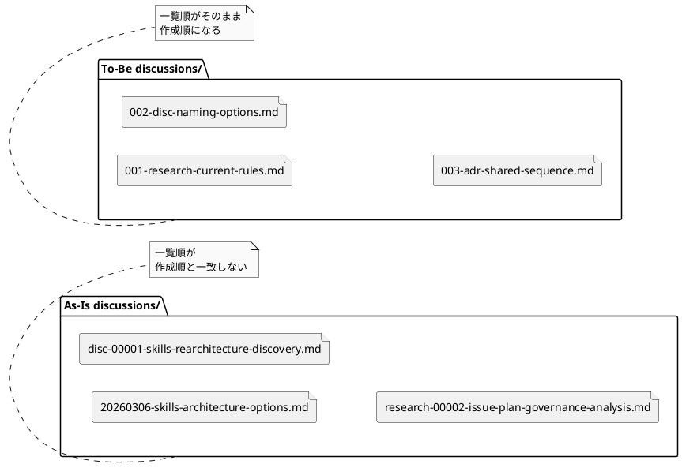
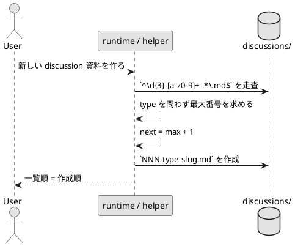

# disc-00001 discussions 命名規約の現状分析と To-Be 提案

## 議題 (必須)
- `discussions/` 配下の資料を、名前順で見たときに作成順で並ぶ命名へ統一する。
- ADR だけではなく `disc` / `research` / `note` を含む全種別を、同一ディレクトリ内の共通連番で管理する。
- 日時 prefix と連番 prefix、type の置き場所、3桁幅、既存ファイル移行方針を整理し、要件定義前の推奨案を固定する。

## 背景 (必須)
- 現在の `discussions/rules.md` は `<type>-00001-<slug>.md` を規約としている。
- 実際の履歴では、type 連番だけでなく `20260306-...` のような日付先頭ファイルも混在している。
- ランタイムで自動採番されるのは ADR のみで、しかも `adr-*.md` だけを走査する実装になっている。
- ユーザー要求は「ファイル一覧を名前順で見たときに、資料が自然に時系列順へ並ぶこと」であり、type ごとの独立連番では要件を満たしきれない。
- ユーザー意向として、日時 prefix は長く可読性が低いため不採用、`001-adr-foo.md` のような 0 埋め 3 桁連番を採用する。

## 現状分析（As-Is） (必須)

### 1. 規約と実態がずれている
- 規約:
  - `spec-deps/current/discussions/rules.md`
  - `src/spec_dock/assets/spec_dock/templates/{initiative,epic,issue}/discussions/rules.md`
  - いずれも `<type>-00001-<slug>.md` を前提としている。
- 実態:
  - `spec-deps/completed/20260309T041052Z-issue-iss-00016/discussions/` には次が混在している。
  - `20260306-skills-architecture-options.md`
  - `disc-00001-skills-rearchitecture-discovery.md`
  - `research-00002-issue-plan-governance-analysis.md`
- 観測結果:
  - 当該ディレクトリの資料 11 件の内訳は `date-prefix=3`, `disc=6`, `research=2`。
  - つまり「名前順 = 作成順」も「type ごとの整列」も、現状では中途半端に崩れている。

### 2. 自動化が ADR にだけ偏っている
- `src/spec_dock/assets/spec_dock/scripts/spec_dock_runtime/app.py` の `_new_adr()` は `discussions/adr-*.md` を走査して採番している。
- 同ファイルの `_next_id(..., prefix=\"adr\")` も `rglob(\"discussions/adr-*.md\")` を使う。
- 非 ADR は `rules.md` 上でテンプレートの手動コピー運用であり、共通採番器が存在しない。
- そのため、ADR だけは機械的に増える一方、`disc` / `research` / `note` は命名が人間依存になりやすい。

### 3. 現行規約では type 横断の時系列整列ができない
- `adr-00003-...` と `disc-00001-...` は、それぞれの type 内では整列しても、ディレクトリ全体では作成順を表現できない。
- 日付先頭ファイルを混ぜると、一部だけ時系列っぽく見えるが、type 連番ファイルとの整合が崩れる。
- 結果として `discussions/` を 1 ディレクトリに統一した利点が、一覧性の面で十分に活きていない。

### 4. テストと docs が新ルールをまだ守らせていない
- `tests/test_cli.py` は `discussions/rules.md` の存在までは確認しているが、非 ADR の命名・type 横断採番・一覧順は固定していない。
- `workflow_adr.md`, `workflow_issue.md`, `workflow_epic.md`, `workflow_initiative.md`, `phase_requirement.md`, `phase_design.md`, `phase_plan.md`, `guide.md`, `README.md`, `templates/README.md` は現行命名の説明を含む。
- したがって今回の変更は、規約文書だけでなく runtime / docs / templates / tests を一貫更新しないと崩れる。

## こうあるべき状態（To-Be） (必須)
- `discussions/` 配下の全資料は、ファイル名先頭に 0 埋め 3 桁連番を置く。
- 命名形式は `<nnn>-<type>-<slug>.md` とする。
- 例:
  - `001-note-kickoff.md`
  - `002-research-current-rules.md`
  - `003-disc-naming-options.md`
  - `004-adr-shared-discussions-sequence.md`
- 採番は type ごとではなく、各 `discussions/` ディレクトリ単位で共通連番とする。
- 作成日時はファイル名ではなく frontmatter や本文メタデータに保持し、閲覧時は短い連番を優先する。
- ADR だけでなく、`disc` / `research` / `note` の作成導線も同じ採番原則に従う。
- `rules.md`, templates, runtime, workflow docs, tests がすべて同じ命名規約を前提にする。

### PlantUML: As-Is と To-Be の比較

## 判断材料 (必須)

### A. 日時 prefix vs 連番 prefix
- 日時 prefix の長所:
  - 一見して日付が分かる。
  - ツールなしでも大まかな作成時期が読める。
- 日時 prefix の短所:
  - `YYYYMMDD` や `YYYYMMDDTHHMMSSZ` は長く、差分が末尾に寄るため視認性が悪い。
  - 同日複数作成時に時刻まで含める必要があり、さらに読みにくくなる。
  - 安定した参照 ID として扱いにくい。
- 連番 prefix の長所:
  - 一覧性が高く、短い。
  - type 横断で 1 本の採番器に寄せやすい。
  - 会話・レビュー・要件/設計から参照しやすい。
- 連番 prefix の短所:
  - 並行作業で採番競合の設計が必要。
  - 上限管理の方針を決めないと桁あふれ時に困る。
- 結論:
  - この repo の目的は「ファイル一覧で作成順を追えること」なので、日時より連番が適する。
  - 作成日時はファイル名から外し、frontmatter に寄せるのがよい。

### B. `type-first` vs `sequence-first`
- `adr-001-...` の長所:
  - type ごとの一覧には強い。
- `adr-001-...` の短所:
  - ディレクトリ全体の作成順を失う。
- `001-adr-...` の長所:
  - 名前順がそのまま作成順になる。
  - 同一ディレクトリ運用と相性が良い。
- `001-adr-...` の短所:
  - type を起点に grep したい場合は prefix より一段弱い。
- 結論:
  - 今回の最優先は type 横断の時系列整列なので、`sequence-first` を採るべき。

### C. 2桁 vs 3桁
- 2桁の長所:
  - 最短で一覧できる。
  - 小規模運用では十分に見える。
- 2桁の短所:
  - 99 件上限が早い。
  - 100 件到達時に桁拡張 migration が必要になり、途中で lexicographical order を崩しやすい。
- 3桁の長所:
  - 999 件まで安全で、深い議論にも余裕がある。
  - 先頭に `0` が 1 つ増えるだけで可読性低下は限定的。
  - 途中拡張の必要が大きく下がる。
- 3桁の短所:
  - 2桁よりわずかに長い。
- 結論:
  - ユーザー判断を反映し、標準は 3 桁とする。
  - 深い議論に備える安心感のほうが、1 文字分の短さより価値が高い。

## 推奨案 (必須)
- 採用案:
  - 命名規約を `<nnn>-<type>-<slug>.md` へ変更する。
  - `nn` は `001` から始まる 0 埋め 3 桁連番。
  - type は `adr | disc | research | note` の固定語彙を維持する。
  - 採番スコープは `discussions/` ディレクトリ単位の全種別共通連番とする。
- 補助ルール:
  - `rules.md` 自体は採番対象外とする。
  - 日時はファイル名に入れず、frontmatter の `最終更新` や必要なら `作成日` で保持する。
  - 連番は再利用しない。
  - 明示 `--id` を許す場合も、type 単位ではなくディレクトリ全体で重複禁止にする。
  - legacy 混在ディレクトリでは、旧 `<type>-00001-...` 形式の数字は次番号計算に含め、日付先頭ファイルは採番基準に含めない。
- 運用ガードレール:
  - 次番号が `800` 以上になったら、4 桁移行か archive 方針を検討する follow-up issue を起こす。
  - `1000` 到達後の無秩序な桁混在は許容しない。

### PlantUML: 目標の採番フロー

## 反論と回答 (任意)
- 反論: 2桁でも十分ではないか。
  - 回答: 現時点では十分でも、100 件到達時の桁拡張が中途半端に起こるほうが後から痛い。今回は 3 桁にして、早い段階での再移行を避ける。
- 反論: 既存ファイルも今すぐ全部 rename して揃えるべきではないか。
  - 回答: ユーザー repo の既存資料まで自動 rename するとリンク切れ・履歴ノイズ・レビュー負荷が大きい。まずは「新規から新ルール」を基本とし、repo 管理下のサンプルや current docs は必要に応じて限定的に揃えるのが安全。
  - 補足: その代わり legacy 混在 dir の新規採番ルールは固定し、旧 type-local 番号だけは次番号計算に含めて連続性を持たせる。
- 反論: type-first のほうが分類しやすい。
  - 回答: type はファイル名中段と frontmatter で十分判別できる。今回の主目的は分類ではなく、1 ディレクトリ内の時系列一覧性である。

## 実装に向けた示唆 (任意)
- 主要変更箇所:
  - `src/spec_dock/assets/spec_dock/scripts/spec_dock_runtime/app.py`
  - `src/spec_dock/assets/spec_dock/templates/{initiative,epic,issue}/discussions/rules.md`
  - `src/spec_dock/assets/spec_dock/templates/README.md`
  - `src/spec_dock/assets/spec_dock/docs/{workflow_adr,workflow_issue,workflow_epic,workflow_initiative,phase_requirement,phase_design,phase_plan,README,guide}.md`
  - `tests/test_cli.py`
  - `spec-deps/README.md`
- 実装論点:
  - ADR だけでなく非 ADR も同じ採番器に寄せるか。
  - `new adr` の既存 `adr-*.md` 走査を `NNN-type-slug` 前提へ更新するか。
  - 非 ADR の作成導線を手動コピーのままにするか、共通 helper/command を持つか。

## 次アクション (必須)
- このシートを前提に、`requirement.md` で次を固定する。
  - 0 埋め 3 桁連番を正式採用すること
  - `discussions/` 単位の全種別共通採番であること
  - `rules.md` / templates / runtime / docs / tests を一貫更新対象に含めること
  - 既存資料の移行方針を「自動一括 rename しない」を基本にすること
  - 999 件上限への対応方針を TBD ではなく制約または edge case として明記すること

## 参考（References） (任意)
- Internal:
  - `spec-deps/current/discussions/rules.md`
  - `spec-deps/completed/iss-00014/design.md`
  - `src/spec_dock/assets/spec_dock/scripts/spec_dock_runtime/app.py`
  - `src/spec_dock/assets/spec_dock/docs/workflow_adr.md`
- External:
  - Nygard ADR article
  - MADR naming guidance
  - adr-tools
  - ISO 8601
