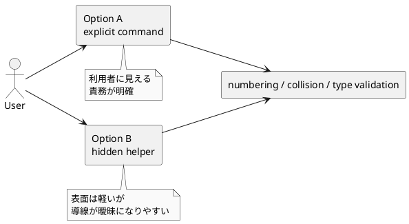

# disc-00002 非 ADR discussion 資料の supported workflow 公開方式を決める

## 議題 (必須)
- `disc` / `research` / `note` を新命名規約 `001-<type>-<slug>.md` で作るとき、利用者にどの操作を公開するかを決める。
- requirement の `Q-001` に回答し、design へ渡せるようにする。

## 背景 (必須)
- `iss-00019` の requirement では、非 ADR も `spec-dock` 側が番号計算・衝突検出・type 判定を保証することを固定した。
- 一方で、利用者にその機能をどう見せるかは未確定であり、現在の選択肢は次の 2 つに集約される。
- Option A:
  - `new doc` 相当の明示 command を用意する
- Option B:
  - 既存導線や wrapper から内部 helper を呼び、利用者には最小の導線だけ見せる
- この論点は、CLI の discoverability、docs の説明負荷、テストの観測粒度、将来の拡張性に効く。

## 現状整理 (必須)
- ADR はすでに `./spec-dock/scripts/spec-dock new adr --{issue|epic|initiative} ...` という明示 command がある。
- 非 ADR はテンプレートの手動コピー運用であり、利用者は自分でファイル名を決める必要がある。
- 今回の issue では、非 ADR も system-managed な採番へ寄せるので、「人間が自力で正しい番号を付ける」前提は維持できない。
- したがって、少なくとも内部には共通 helper か同等の採番・検証ロジックが必要になる。

## 選択肢 (必須)

### Option A: `new doc` 相当の明示 command を公開する
- 例:
  - `./spec-dock/scripts/spec-dock new doc --issue iss-00123 --type disc --title "..."`
  - `./spec-dock/scripts/spec-dock new doc --epic epic-00123 --type research --title "..."`
- Pros:
  - 利用者に分かりやすい
  - docs に書きやすい
  - テストが書きやすい
  - type 判定、採番、衝突検出の責任境界が明確
  - 将来 `note` / `disc` / `research` 以外を増やす時も拡張しやすい
- Cons:
  - CLI surface が増える
  - `new adr` と `new doc` の二本立てになる
  - 命名だけの issue に対しては実装がやや大きく見える

### Option B: 内部 helper を既存導線から呼び、公開導線は最小にする
- イメージ:
  - docs や wrapper が内部 helper を使う
  - 利用者には「discussion sheet を作る」導線だけ見せる
- Pros:
  - CLI surface を増やさずに済む
  - 既存利用者の mental model を壊しにくい
  - 実装を内部 API として閉じやすい
- Cons:
  - 利用者からは操作が見えにくい
  - docs の説明が抽象化しやすく、結局「どう作るのか」が分かりにくくなる
  - helper の入口が散ると、回帰テストの主対象が曖昧になる
  - 将来の type 拡張時に導線の一貫性を保ちにくい

## 比較観点 (任意)
- 利用者が迷わないか
- docs で短く正確に案内できるか
- テストが観測可能か
- 今回 issue のスコープに対して過剰設計でないか
- 将来 `type` が増えても破綻しにくいか

### PlantUML: 導線比較

## 推奨案 (必須)
- 推奨は Option A。
- 理由:
  - requirement で固定した「system-managed な採番と衝突検出」を、最も素直にユーザーへ伝えられる。
  - `new adr` がすでに明示 command なので、非 ADR にも対称性がある。
  - docs と tests の主語を揃えやすく、review 時に曖昧さが残りにくい。
- 補足:
  - 過剰な CLI 増加を避けるため、`new note`, `new disc`, `new research` の3コマンドに増やすのではなく、`new doc --type ...` の1コマンドにまとめるのが良い。

## ユーザー回答（2026-03-09） (必須)
- Option A を採用する。
- 公開インターフェイスは `new doc --type ...` ではなく、`new doc <type>` のように **種類を位置引数で指定する1本のコマンド** にする。
- 想定する形:
  - `new doc adr`
  - `new doc note`
  - `new doc research`
  - `new doc disc`
- 理由:
  - ドキュメント生成は Initiative / Epic / Issue の作成と別レイヤーとして扱いたい。
  - `adr`, `newnote`, `newresearch` のように個別コマンドを増やすより、1本の明示インターフェイスのほうが理解しやすい。

## 結論 (必須)
- `iss-00019` の design は、discussion 資料の公開インターフェイスを `new doc <type>` として検討する。
- `type` は option ではなく位置引数とする。
- `new doc` は discussion docs layer の入口であり、initiative / epic / issue の生成コマンドとは別の責務として扱う。

## ユーザーに決めてほしいこと (必須)
- 1. 公開導線は `new doc --type ...` のような明示 command にするか
- 2. それとも内部 helper ベースで、利用者向けの入口は最小限に留めるか
- 3. 明示 command を採る場合、`new doc` の1本にまとめるか

## 次アクション (必須)
- `requirement.md` の `Q-001` を解消し、正式方針として反映する。
- design で `new doc <type>` の公開インターフェースと内部 helper の責務を固定する。
