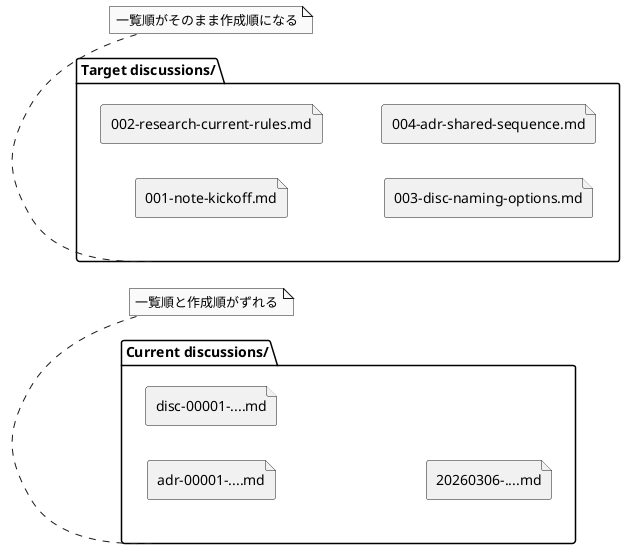

# iss-00019 discussions 配下の資料命名を時系列順に並ぶ形式へ統一し、全種別を共通採番できるようにする — 要件定義（WHAT / WHY）

## 目的（ユーザーに見える成果 / To-Be） (必須)
- Initiative / Epic / Issue の各 `discussions/` ディレクトリで、ADR / 議論 / 調査 / メモのファイルが名前順のまま作成順に並ぶ。
- `discussions/` に置かれる全種別の資料が、`001-adr-...`, `002-disc-...` のような 3 桁ゼロ埋め共通連番で管理される。
- rules / templates / runtime / docs / tests が同じ命名規約を共有し、discussion 資料の公開インターフェイスとして `new doc <type>` を提供する。

## 背景・現状（As-Is / 調査メモ） (必須)
- 現状の挙動（事実）:
  - `spec-deps/current/discussions/rules.md` と `src/spec_dock/assets/spec_dock/templates/{initiative,epic,issue}/discussions/rules.md` は、`<type>-00001-<slug>.md` を規約としている。
  - `src/spec_dock/assets/spec_dock/scripts/spec_dock_runtime/app.py` の `_new_adr()` は `discussions/adr-*.md` のみを走査し、ADR だけを type ローカル連番で自動作成している。
  - 非 ADR（`disc` / `research` / `note`）はテンプレートのコピー運用であり、共通採番器がない。
  - 実例として `spec-deps/completed/20260309T041052Z-issue-iss-00016/discussions/` には、日付先頭ファイルと `disc-00001-...`, `research-00002-...` が混在している。
  - `tests/test_cli.py` は `discussions/rules.md` と `adr-00001-*.md` / `adr-00002-*.md` を前提にしている。
- 現状の課題（困っていること）:
  - type ごとの連番では、`discussions/` 1 ディレクトリ全体を名前順で見ても作成順にならない。
  - ADR だけが自動採番され、非 ADR は人間依存で命名がぶれやすい。
  - rules / templates / runtime / docs / tests が別々の前提を持つため、変更箇所を揃えないと回帰しやすい。
  - 旧命名や日付先頭ファイルへの互換を持たせると、採番ロジックと docs の説明が不必要に複雑になる。
- 再現手順（最小で）:
  1) `spec-deps/current/discussions/rules.md` を開くと `<type>-00001-<slug>.md` が規約になっている。
  2) `src/spec_dock/assets/spec_dock/scripts/spec_dock_runtime/app.py` の `_new_adr()` を見ると `discussions/adr-*.md` のみを走査している。
  3) 過去 `discussions/` 実例を名前順で見ると、type 先頭命名や日付先頭命名が混在し、全体の作成順には見えない。
- 観測点（どこを見て確認するか）:
  - FS:
    - `src/spec_dock/assets/spec_dock/scripts/spec_dock_runtime/app.py`
    - `src/spec_dock/assets/spec_dock/templates/**/discussions/rules.md`
    - `src/spec_dock/assets/spec_dock/templates/README.md`
    - `src/spec_dock/assets/spec_dock/docs/{reference_naming,workflow_adr,workflow_issue,workflow_epic,workflow_initiative,phase_requirement,phase_design,phase_plan,README,guide}.md`
    - `src/spec_dock/assets/spec_dock/scripts/README.md`
    - `src/spec_dock/assets/codex_skills/spec-driven-tdd-workflow/SKILL.md`
    - `tests/test_cli.py`
    - `spec-deps/current/discussions/rules.md`
    - `spec-deps/README.md`
- 情報源（ヒアリング/調査の根拠）:
  - Issue/チケット:
    - `#19`
  - ドキュメント:
    - `spec-deps/current/discussions/disc-00001-discussions-naming-analysis-and-target-state.md`
    - `spec-deps/current/discussions/disc-00002-non-adr-supported-workflow-options.md`
  - コード:
    - `src/spec_dock/assets/spec_dock/scripts/spec_dock_runtime/app.py`
    - `tests/test_cli.py`

## 対象ユーザー / 利用シナリオ (任意)
- 主な利用者（ロール）:
  - `spec-dock` を導入した repo で要件整理・設計検討・ADR 作成を行う利用者
  - `spec-dock` の runtime / templates / docs / tests を保守する開発者
- 代表的なシナリオ:
  - Issue の `discussions/` に note → research → disc → adr を順に置き、一覧順だけで思考の流れを追いたい
  - `new doc adr` で、他 type を含めた最後尾の番号が自動採番されてほしい
  - 非 ADR の資料も `new doc disc|research|note` で同じ並び順で作りたい
  - `init` / `update` 後の配布 docs と templates が、古い命名例や旧公開導線を primary interface として含まない状態で揃っていてほしい

### UML（任意） (任意)

## スコープ（暴走防止のガードレール） (必須)
- MUST（必ずやる）:
  - `discussions/` 配下の命名規約を `<nnn>-<type>-<slug>.md` に統一する
  - `nnn` は `001` から始まる 3 桁ゼロ埋め連番とする
  - 採番スコープを type ごとではなく、各 `discussions/` ディレクトリ単位の全種別共通連番へ変更する
  - discussion 資料の公開インターフェイスを `new doc <type>` に統一する
  - `type` は位置引数とし、`adr | disc | research | note` を指定できる
  - `new doc <type>` が、同一 `discussions/` 内で新標準命名に一致する資料だけを見て次番号を決めるようにする
  - `new doc <type>` を含む `spec-dock` 提供の supported workflow が番号計算・衝突検出・許容 type 判定を保証する
  - rules / templates / runtime / docs / tests / `spec-deps/current/discussions/rules.md` / `spec-deps/README.md` を新ルールへ整合させる
  - 3 桁上限（999）を超える場合は、4 桁へ進まず明示的に失敗し、follow-up issue で archive または桁拡張を判断する契約に固定する
  - 新標準に一致しない既存ファイルは自動 rename せず、そのまま残す
- MUST NOT（絶対にやらない／追加しない）:
  - 日時 prefix を新標準として採用しない
  - type ごとの独立連番を残したまま「時系列に並ぶ」と見なさない
  - `discussions/` を type ごとのサブディレクトリへ再分割しない
  - `new adr`, `new note`, `new research` のような discussion 資料ごとの個別公開コマンドを提供しない
  - `<type>-00001-...` や日付先頭ファイルへの後方互換ロジックを採番器に持ち込まない
  - `init` / `update` 時に、既存ユーザー repo の discussion 資料を自動一括 rename しない
  - 3 桁と 4 桁を無秩序に混在させない
- OUT OF SCOPE:
  - `discussions/` 以外のファイル命名規約変更
  - Initiative / Epic / Issue ノード本体の ID 体系変更
  - `spec-dock` の GitHub 連携や deps 機能の再設計
  - 既存 legacy discussion 資料を新標準へ移行する自動ツールの提供
  - `spec-deps/completed/**` の既存履歴を一括 rename して全面移行すること

## 境界（Always / Ask / Never） (必須)
- Always（常に守る）:
  - 変更判断は「一覧順がそのまま作成順になるか」を最優先にする
  - 1 ディレクトリ運用は維持し、分類は file type と frontmatter で担保する
  - rules / templates / runtime / docs / tests を一つの契約として扱う
  - 採番器は新標準命名だけを対象にする
- Ask（迷ったら相談）:
  - なし
- Never（絶対にしない）:
  - 一部の docs や templates だけを更新して runtime / tests と食い違わせる
  - 互換性のために旧命名の parse や旧公開 command を温存する
  - uppercase を含む新しい file / dir path を増やす

## 非交渉制約（守るべき制約） (必須)
- 標準命名は `001-adr-...`, `002-disc-...` のような 3 桁ゼロ埋め + type + slug とする
- type は `adr`, `disc`, `research`, `note` を基本語彙として維持する
- discussion 資料の公開インターフェイスは `new doc <type>` とし、`type` は位置引数とする
- 採番は `discussions/` ディレクトリ単位の全種別共通連番とする
- `rules.md` は採番対象外とする
- `new doc <type>` を含む `spec-dock` 提供の supported workflow が番号計算・衝突検出・type 判定を保証する
- 採番対象は `^[0-9]{3}-(adr|disc|research|note)-<slug>.md$` に一致するファイルだけとする
- 新標準に一致しないファイルは、自動 rename せず、採番にも使用しない
- 日時はファイル名ではなく frontmatter / 本文に保持する
- 連番は再利用しない
- 新規/変更する path は lowercase を維持し、`A-Z` を含む新規 path を作らない
- `999` 超過時は 4 桁へ進まず失敗する
- `new adr` などの互換 alias や旧命名互換は提供しない
- 明示的な番号 override を public interface に含めない
- Python 標準ライブラリ主体の現行 runtime 方針を崩さず、不要な依存追加を前提にしない

## 前提（Assumptions） (必須)
- `discussions/` は引き続き 1 ディレクトリに ADR / 議論 / 調査 / メモを共置きする
- 一覧性の主戦場はファイルブラウザや `ls` / `find` / editor tree での名前順表示である
- この機能はまだ本格運用前であり、旧命名・旧コマンドへの後方互換は要求されない
- repo 管理下の docs / templates / tests はこの issue の中で更新できる
- repo 管理下の現行ガイダンス資料として `spec-deps/current/discussions/rules.md` と `spec-deps/README.md` は更新対象に含める
- 3 桁で当面の議論深度には十分で、999 を超えるケースは例外として扱える

## 判断材料/トレードオフ（Decision / Trade-offs） (任意)
- 論点: 日時 prefix か連番 prefix か
  - 選択肢A: 日時 prefix
    - Pros: 日付が一見で分かる
    - Cons: 長い、同日複数件で時刻が必要、一覧の可読性が落ちる
  - 選択肢B: 連番 prefix
    - Pros: 短い、一覧性が高い、時系列整列に強い
    - Cons: 上限管理が必要
  - 決定: B
  - 理由: 今回の主目的は「一覧順 = 作成順」であり、可読性と安定参照の両面で連番が優位
- 論点: 2 桁か 3 桁か
  - 選択肢A: 2 桁
    - Pros: 最短
    - Cons: 99 で頭打ちしやすい
  - 選択肢B: 3 桁
    - Pros: 999 まで余裕があり、深い議論に耐える
    - Cons: 1 文字分だけ長い
  - 決定: B
  - 理由: 深い議論への備えを優先する
- 論点: 旧命名互換を持つか
  - 選択肢A: 旧命名や旧 command との互換を持つ
    - Pros: 既存利用者への影響が小さい
    - Cons: 採番・docs・tests が複雑になる
  - 選択肢B: 新標準だけを採用する
    - Pros: 実装と docs が単純で一貫する
    - Cons: 旧命名は自動継承されない
  - 決定: B
  - 理由: 現時点で後方互換は不要であり、単純な新ロジックを優先する

## リスク/懸念（Risks） (任意)
- R-001: docs / templates / runtime / tests の更新漏れで旧命名や旧 command が残る
  - 影響: 利用者が誤った手順を参照する
  - 対応: AC-004 で配布正本と current guidance の両方を観測対象に固定する
- R-002: `999` 超過時の扱いを曖昧にすると、将来 4 桁混在へ流れる
  - 影響: 一覧順の規約が崩れる
  - 対応: overflow failure を仕様として固定する
- R-003: `discussions/` に非準拠ファイルを手動で置くと、一覧全体の見え方は完全には揃わない
  - 影響: supported workflow 外のファイルは視覚的に混在しうる
  - 対応: 採番対象は新標準だけと明示し、supported workflow の責務範囲を限定する

## 受け入れ条件（観測可能な振る舞い） (必須)
- AC-001:
  - Actor/Role: `spec-dock` 利用者
  - Given: 新しい Initiative / Epic / Issue scope に `discussions/` がある
  - When: `rules.md` と配布 docs / templates を参照する
  - Then: 命名規約が一貫して `<nnn>-<type>-<slug>.md` と説明され、例が `001-...` 形式になっている
  - 観測点（UI/HTTP/DB/Log など）: `discussions/rules.md`, `templates/README.md`, `docs/reference_naming.md`, `docs/workflow_*.md`, `docs/phase_*.md`, `docs/guide.md`, `docs/README.md`
- AC-002:
  - Actor/Role: `spec-dock` 利用者
  - Given: ある scope の `discussions/` に `001-note-...`, `002-research-...` が既に存在する
  - When: `new doc adr` を実行する
  - Then: 生成される ADR ファイル名は `003-adr-<slug>.md` となる
  - 観測点（UI/HTTP/DB/Log など）: FS 上の生成ファイル名, runtime stdout/stderr, 回帰テスト
- AC-003:
  - Actor/Role: `spec-dock` 利用者
  - Given: ある scope の `discussions/` に `003-adr-...` までの資料が存在する
  - When: `new doc disc|research|note` のいずれかを実行する
  - Then: 追加されるファイル名は次の共通番号（例: `004-disc-...`）となる
  - 観測点（UI/HTTP/DB/Log など）: FS 上の生成ファイル名, runtime stdout/stderr, 回帰テスト
- AC-004:
  - Actor/Role: `spec-dock` メンテナ
  - Given: リポジトリで `init` / `update` / テストを実行する
  - When: scaffold と package assets と docs を確認する
  - Then: 古い命名例（`adr-00001-...`, `<type>-00001-...`, 日時先頭例）や旧公開導線（`new adr` など）が、配布正本と現行ガイダンス資料では現行ルールとして残らず、テストも `new doc <type>` 前提の新ルールを観測している
  - 観測点（UI/HTTP/DB/Log など）: templates, shipped docs, runtime assets, skill assets, `spec-deps/current/discussions/rules.md`, `spec-deps/README.md`, `tests/test_cli.py`
- AC-005:
  - Actor/Role: `spec-dock` 利用者
  - Given: ある scope の `discussions/` に `002-disc-current-rules.md`, `rules.md`, `adr-00001-legacy.md`, `20260306-legacy-note.md`, `memo.md` が存在する
  - When: `new doc note` を実行する
  - Then: 新規作成ファイルは `003-note-<slug>.md` となり、非準拠ファイルは rename も採番消費もされない
  - 観測点（UI/HTTP/DB/Log など）: FS 上の生成ファイル名, 既存ファイルがそのまま残ること, 回帰テスト
- AC-006:
  - Actor/Role: `spec-dock` 利用者 / メンテナ
  - Given: ある `discussions/` ディレクトリが新ルールで運用されている
  - When: 新標準に一致する資料だけを名前順で確認する
  - Then: `001`, `002`, `003` ... の順で並び、思考の時系列を名前順だけで追える
  - 観測点（UI/HTTP/DB/Log など）: FS の一覧順, docs に記載された例, 回帰テスト

### 入力→出力例 (任意)
- EX-001:
  - Input:
    - existing:
      - `001-note-kickoff.md`
      - `002-research-current-rules.md`
    - operation:
      - `new doc adr`
  - Output:
    - `003-adr-shared-sequence.md`
- EX-002:
  - Input:
    - existing:
      - `001-note-kickoff.md`
      - `002-research-current-rules.md`
      - `003-adr-shared-sequence.md`
    - operation:
      - `new doc disc`
  - Output:
    - `004-disc-migration-options.md`

## 例外・エッジケース（仕様として固定） (必須)
- EC-001:
  - 条件: supported workflow が生成しようとする番号と同じ `nnn` を持つ discussion 資料が既に存在する
  - 期待: 重複を許容せず、明示的に失敗する。既存ファイルを上書きしない
  - 観測点（UI/HTTP/DB/Log など）: runtime stderr/stdout, FS 差分なし, 回帰テスト
- EC-002:
  - 条件: 次番号が `999` を超える
  - 期待: 無秩序に 4 桁へ進まず、supported workflow は明示的なエラーで停止する。docs は「follow-up issue で archive または桁拡張を判断する」と案内する
  - 観測点（UI/HTTP/DB/Log など）: runtime stderr/stdout, docs / guidance
- EC-003:
  - 条件: `rules.md` や命名規約外ファイルが `discussions/` に存在する
  - 期待: `rules.md` と命名規約外ファイルは採番対象外であり、supported workflow は番号消費に含めない
  - 観測点（UI/HTTP/DB/Log など）: FS, runtime behavior, tests
- EC-004:
  - 条件: 利用者が旧公開導線や旧命名互換を期待する
  - 期待: supported workflow は `new doc <type>` のみを案内し、legacy command / legacy explicit id / legacy 採番互換は提供しない
  - 観測点（UI/HTTP/DB/Log など）: docs, help, runtime behavior, tests
- EC-005:
  - 条件: `disc`, `research`, `note`, `adr` 以外の未知 type を扱おうとする
  - 期待: `new doc <type>` が許容 type を検証し、未知 type は明示的に失敗する
  - 観測点（UI/HTTP/DB/Log など）: rules/docs, runtime stderr

## 用語（ドメイン語彙） (必須)
- TERM-001: `discussion 資料` = `discussions/` 配下に置く ADR / 議論 / 調査 / メモの総称
- TERM-002: `supported workflow` = `spec-dock` が提供・案内する資料作成手順。本 issue の primary interface は `new doc <type>` であり、番号計算・衝突検出・type 判定をシステムが保証する
- TERM-003: `非準拠ファイル` = `rules.md` または `^[0-9]{3}-(adr|disc|research|note)-...` に一致しない discussion 配下ファイル
- TERM-004: `共通連番` = `discussions/` ディレクトリ単位で、type を問わず共有する `001`, `002`, `003` ... の順序番号

## 未確定事項（TBD / 要確認） (必須)
- なし
- 2026-03-09 にユーザー回答として、公開インターフェイスは `new doc <type>`（`type` は位置引数）に確定した。
- 2026-03-09 にユーザー追加回答として、legacy 命名の採番互換と `new adr` 互換は不要であり、新標準のみを採用する方針に確定した。

## Definition of Ready（着手可能条件） (必須)
- [x] 目的が 1〜3行で明確になっている
- [x] MUST/MUST NOT/OUT OF SCOPE が書けている
- [x] Always/Ask/Never が書けている
- [x] AC/EC が観測可能（テスト可能）な形になっている
- [x] 観測点または確認方法が明記されている
- [x] 未確定事項が解消済みである

## 完了条件（Definition of Done） (必須)
- すべての AC / EC を満たす実装・docs・tests が揃う
- 3 桁ゼロ埋め + type + slug の命名規約が、rules / templates / runtime / docs / tests で矛盾なく共有される
- `new doc <type>` を primary interface とする supported workflow で番号計算・衝突検出・type 判定が保証される
- 旧命名や旧 command への互換ロジックを持ち込まず、単純な新ロジックとして一貫している
- `999` 超過時は失敗して停止する契約が docs / runtime / tests で一致している
- 非準拠ファイルは自動 rename されず、採番にも使われない
- `new doc <type>` の公開方針が docs / runtime / tests / design 入力で一致している
- MUST NOT / OUT OF SCOPE を破っていない

## 省略/例外メモ (必須)
- legacy discussion 資料の扱いは「放置して無視する」で固定し、互換採番や自動移行は本 issue に含めない
