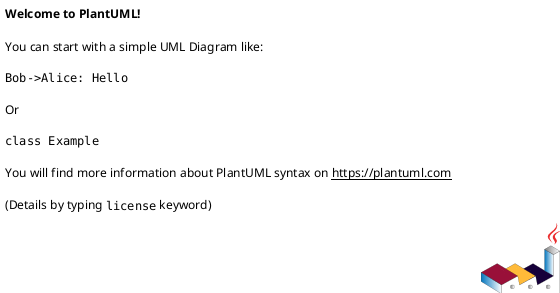

# iss-00021 initiative epic issue テンプレートと playbook の責務を再構築する — 実装計画（TDD: Red → Green → Refactor）

## この計画で満たす要件ID (必須)
- 対象AC: AC-001, AC-002, ...
- 対象EC: EC-001, ...
- 対象制約（該当があれば）: ...

## ステップ一覧（観測可能な振る舞い） (必須)
- [ ] S01: ...
- [ ] Sxx: ... (任意: 必要に応じて追加)

### UML（任意） (任意)

### 要件 ↔ ステップ対応表 (必須)
- AC-001 → S01
- AC-___ → Sxx (任意: 必要に応じて追加)
- EC-___ → Sxx (任意: 必要に応じて追加)
- （任意）非交渉制約 → Sxx（どのステップで担保/検証するか）

---

## 実行ルール（全ステップ共通） (必須)
- plan 全体は実装着手前に承認する。
- 各ステップは 1 つの観測可能な振る舞いを単位とする。
- 各ステップは **Red → Green → Refactor → review → fix → re-review → report → commit/no-op** の順で完了する。
- reviewer の blocking 指摘が残っている間は、そのステップを完了扱いにしない。
- 実差分があるステップは、承認済み状態を step-scoped commit として記録する。
- 実差分がないステップは、commit の代わりに no-op 理由を `report.md` に記録する。
- docs impact を issue ごとに判定し、必要なら `S90 docs impact resolution / docs refresh` を final quality gate 前に置く。
- 最後に `git diff <base>...HEAD` を対象に `S99 final diff review quality gate` を実施し、reviewer が承認するまで終了しない。

---

## 実装ステップ（各ステップは“観測可能な振る舞い”を1つ） (必須)

### S01 — <観測可能な振る舞い> (必須)
- 対象: AC-___ / EC-___
- 設計参照:
  - 対象IF/API: IF-___ / API-___
  - 対象テスト: `<test_file_path>::<test_name>`
- このステップで「追加しないこと（スコープ固定）」:
  - ...

#### update_plan（着手時に登録） (必須)
- [ ] `update_plan` に、このステップの作業ステップ（調査/Red/Green/Refactor/品質ゲート/報告/コミット）を登録した
- 登録例:
  - （調査）既存挙動/影響範囲の確認、設計参照の確認
  - （Red）失敗するテストの追加/修正
  - （Green）最小実装
  - （Refactor）整理
  - （レビュー）review / fix / re-review
  - （品質ゲート）format/lint/test / docs impact 判定
  - （報告）`./spec-dock/active/issue/report.md` 更新
  - （コミット）このステップの区切りで commit または no-op 記録

#### 期待する振る舞い（テストケース） (必須)
- Given: ...
- When: ...
- Then: ...
- 観測点（UI/HTTP/DB/Log など）: ...
- 追加/更新するテスト: `<test_file_path>::<test_name>`

#### Red（失敗するテストを先に書く） (任意)
- 期待する失敗:
  - ...

#### Green（最小実装） (任意)
- 変更予定ファイル:
  - Add: `<path/...>`
  - Modify: `<path/...>`
- 追加する概念（このステップで導入する最小単位）:
  - ...
- 実装方針（最小で。余計な最適化は禁止）:
  - ...

#### Refactor（振る舞い不変で整理） (任意)
- 目的:
  - ...
- 変更対象:
  - ...

#### ステップ末尾（省略しない） (必須)
- [ ] step diff を reviewer にレビュー依頼した
- [ ] blocking 指摘を解消した、または no-op / 却下理由を `./spec-dock/active/issue/report.md` に記録して承認された
- [ ] reviewer verdict を `./spec-dock/active/issue/report.md` に記録した
- [ ] 期待するテスト（必要ならフォーマット/リンタ）を実行し、成功した
- [ ] docs impact を確認し、必要なら `S90` の対象へ追加した
- [ ] `./spec-dock/active/issue/report.md` に実行コマンド/結果/変更ファイルを記録した
- [ ] `update_plan` を更新し、このステップの作業ステップを完了にした
- [ ] 実差分がある場合は step-scoped commit を作成し、実差分がない場合は no-op を記録した

---

### Sxx — <追加の観測可能な振る舞い> (任意)
- （上の S01 と同じ構成で記載する。update_plan / 期待する振る舞い / ステップ末尾 は省略しない）
  ...

---

### S90 — docs impact resolution / docs refresh を行う (条件付き必須)
- 条件: docs impact が `none` でない
- 対象: 関連する docs / workflow / shipped assets / skill reminder
- Given: この issue で変更した CLI / API / workflow / template / 配布 assets
- When: 対象 docs を更新する、または no-op 理由を明記する
- Then: 利用者向け説明と配布物の文面が現行挙動と一致する
- ステップ末尾:
  - [ ] docs impact の判定結果を `report.md` に記録した
  - [ ] 必要な docs / shipped assets を更新した、または no-op 理由を記録した
  - [ ] reviewer に確認を依頼し、承認レベルに達した

### S99 — final diff review quality gate を通す (必須)
- 対象: このブランチの差分全体
- Given: 実装ステップと必要な docs refresh が完了している
- When:
  - `python -m unittest discover -v` など全体テストを実行する
  - packaging / shipped asset check を行う
  - `git diff <base>...HEAD` を reviewer が確認する
- Then:
  - test / packaging / docs / diff 全体で blocking finding が残っていない
  - reviewer が承認するまで修正と再レビューを反復する
- ステップ末尾:
  - [ ] 全体テストと必要な packaging check が成功した
  - [ ] reviewer の最終 verdict を `report.md` に記録した
  - [ ] 修正があれば commit し、修正がなければ no-op を記録した

---

## 未確定事項（TBD） (必須)
- Q-001:
  - 質問: TBD ...
  - 選択肢:
    - A: ...
    - B: ...
  - 推奨案（暫定）: ...
  - 影響範囲: S__ / AC-__ / EC-__ / `design.md` / ...
- Q-002:
  - 質問: TBD ...
  - 選択肢:
    - A: ...
    - B: ...
  - 推奨案（暫定）: ...
  - 影響範囲: ...

## 完了条件（Definition of Done） (必須)
- 対象AC/ECがすべて満たされ、テストで保証されている
- MUST NOT / OUT OF SCOPE を破っていない
- 品質ゲート（フォーマット/リント/テストのうち該当するもの）が満たされている
- docs impact が解決され、必要な docs refresh が完了している
- `S99 final diff review quality gate` で reviewer 承認レベルに達している

## 省略/例外メモ (必須)
- 該当なし
