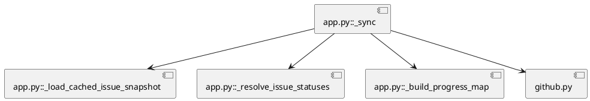
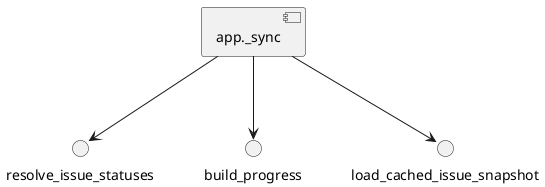

# iss-00023 runtime CLI の責務分割と sync 状態導出をリファクタリングする — 設計（HOW）

## 目的・制約（要件から転記・圧縮） (必須)
- 目的:
  - `sync` 周辺の状態導出を巨大関数から切り離し、読みやすく再利用しやすい構造へ整理する
  - README と CLI 実装契約を一致させる
- MUST:
  - runtime CLI の外部挙動を大きく壊さずに整理する
  - cache 利用の意味をコード上で明示する
- MUST NOT:
  - installer CLI の大規模仕様変更
  - 無関係な command の全面再設計
- 非交渉制約:
  - unittest green
  - lowercase path 維持
  - shipped assets の docs/tests 同期
- 前提:
  - issue 単位で workflow を再現し、Initiative/Epic は使わない

---

## 既存実装/規約の調査結果（As-Is / 99.9%理解） (必須)
- 参照した規約/実装（根拠）:
  - `src/spec_dock/assets/spec_dock/scripts/spec_dock_runtime/app.py`: runtime CLI 契約と `_sync()` の仕様が集中している
  - `src/spec_dock/assets/spec_dock/scripts/spec_dock_runtime/github.py`: GitHub 連携の adapter 境界
  - `README.md`: 利用者向け CLI 契約
  - `tests/test_cli.py`: 既存の回帰仕様
- 観測した現状（事実）:
  - `_sync()` は validation、GitHub fetch、cache 読み込み、status/progress/deps 導出、artifact 書き込みを一括処理している
  - GitHub 未接続時は cached status を読み戻すが、その由来が局所変数レベルに埋もれている
  - README の ADR 作成例が実装されていない `new adr` を指している
- 採用するパターン（命名/責務/例外/DI/テストなど）:
  - `app.py` 内で pure helper を先に抽出し、`_sync()` を orchestration 層として薄くする
  - `app.py` は orchestration と command routing を中心に残す
  - 既存 JSON shape は維持し、source は internal helper / internal representation で扱う
- 採用しない/変更しない（理由）:
  - 全 command の全面再編は今回のスコープを超える
  - GitHub adapter の全面刷新は今回の目的から外れる
- 影響範囲（呼び出し元/関連コンポーネント）:
  - `sync`
  - `deps check`（主対象ではなく互換確認対象）
  - `active set`（主対象ではなく互換確認対象）
  - README
  - `tests/test_cli.py`

## 主要フロー（テキスト：AC単位で短く） (任意)
- Flow for AC-001:
  1) nodes / issue index / cached snapshot を収集する
  2) issue status と source を helper で導出する
  3) `sync` は導出結果を使って progress / artifact を組み立てる
- Flow for AC-002:
  1) GitHub 利用有無と cached snapshot の有無を判定する
  2) source を `github`, `cache`, `unknown` 相当で区別する
  3) status 値と source をテスト可能な単位で返す
- Flow for AC-003:
  1) runtime `--help` の command 体系を確認する
  2) README の誤った例を実装済み command に置き換える

### UML（任意） (任意)


## データ・バリデーション（必要最小限） (任意)
- MODEL-001: issue status resolution result
  - Fields:
    - `status`
    - `source`
    - `github_payload` or cached payload reference as needed
  - Constraints/Validation:
    - `status` は `done|open|unknown`
    - `source` は `github|cache|unknown` 相当

## 判断材料/トレードオフ（Decision / Trade-offs） (任意)
- 論点: source を artifact に露出するか、内部だけに留めるか
  - 選択肢A: 内部 helper の責務として閉じる
  - 選択肢B: artifact に新フィールドを追加する
  - 決定: A を採用し、artifact schema は変更しない
  - 理由: requirement で既存 shape 維持が確定しているため

## インターフェース契約（ここで固定） (任意)
### 関数・クラス境界（重要なものだけ）
- IF-001: `app._resolve_issue_statuses(...) -> issue_status_map`
  - Input: nodes, github flag, GitHub issue index, cached snapshot
  - Output: issue ごとの status/source 情報
  - Errors/Exceptions: 入力不整合は呼び出し側で validation 済み前提
- IF-002: `app._build_progress_map(...) -> progress_map`
  - Input: nodes, issue status map
  - Output: initiative/epic progress 集計
- IF-002b: `app._load_cached_issue_snapshot(...) -> cached_snapshot`
  - Input: specdock_dir, github flag
  - Output: cached status map と cached github payload map
- IF-003: `app._sync(...)`
  - Input: 既存 CLI 引数
  - Output: 既存 artifact と CLI 出力
  - Errors/Exceptions: 既存契約維持

### UML（任意） (任意)


### 例外/エラー契約（重要なものだけ） (任意)
- ERR-001: GitHub fetch failure
  - 発生条件:
    - `gh issue list` が失敗する
  - 呼び出し元への返し方:
    - 既存どおり warning を出し、unknown 扱いへフォールバック
  - ログ/監視:
    - `gh_fetch_failed` warning

## 変更計画（ファイルパス単位） (必須)
- 追加（Add）:
  - 該当なし
- 変更（Modify）:
  - `src/spec_dock/assets/spec_dock/scripts/spec_dock_runtime/app.py`: `_sync()` から導出ロジックを in-file helper へ委譲する
  - `README.md`: ADR/doc 作成例を実装と一致させる
  - `tests/test_cli.py`: status/source 導出、`deps check` / `active set` の互換確認、README 契約変更に伴う回帰テストを追加/調整する
- 削除（Delete）:
  - 該当なし
- 移動/リネーム（Move/Rename）:
  - 原則なし
- 参照（Read only / context）:
  - `src/spec_dock/assets/spec_dock/scripts/spec_dock_runtime/github.py`
  - `src/spec_dock/cli.py`

## マッピング（要件 → 設計） (必須)
- AC-001 → IF-001, IF-002, IF-002b, `app.py`
- AC-002 → IF-001, IF-002b, `tests/test_cli.py`
- AC-003 → `README.md`
- AC-004 → `python -m unittest discover -v`
- EC-001 → IF-001, ERR-001
- EC-002 → `README.md`, runtime help
- 非交渉制約 → tests, lowercase path, shipped assets 更新

## テスト戦略（最低限ここまで具体化） (任意)
- 追加/更新するテスト:
  - Unit/Integration:
    - cached status 利用時の source または導出経路を固定するテスト
    - `sync` / `deps check` / `active set` の挙動が互換維持されることを確認するテスト
    - README のコマンド例不一致に関する回帰確認
- どのAC/ECをどのテストで保証するか:
  - AC-001 → `tests/test_cli.py` の `sync` 系テスト
  - AC-002 → cached/GitHub 分岐テスト、`deps check` / `active set` の互換確認テスト
  - AC-003 → 実装との差分確認または関連 help ベースの確認
  - AC-004 → 全体 unittest

## リスク/懸念（Risks） (任意)
- R-001: helper 抽出で shared constant 参照が散らばる
  - 影響: import 依存の複雑化
  - 対応: 最初は `sync` 専用 helper に限定する
- R-002: テストが内部実装依存になりすぎる
  - 影響: 将来の refactor 耐性低下
  - 対応: observable behavior を優先し、内部 source 検証は必要最小限に留める

## 未確定事項（TBD） (必須)
- 該当なし

---

## ディレクトリ/ファイル構成図（変更点の見取り図） (任意)
```text
src/spec_dock/assets/spec_dock/scripts/spec_dock_runtime/
├── app.py                  # Modify
└── github.py               # Read only

README.md                   # Modify
tests/test_cli.py           # Modify
```

## 省略/例外メモ (必須)
- Initiative/Epic 不在のため、issue 単位で完結する設計のみを記載する
