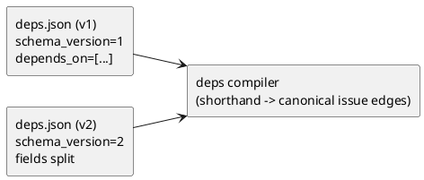

# ADR-00001 deps.json のスキーマ: v1（depends_on 1フィールド）継続 vs v2（フィールド分割）

## 結論（Decision） (必須)
- 決定: **Option A（v1 継続 / `schema_version=1` のまま作り直す）**
  - `schema_version` は **変更しない（1のまま）**。`schema_version=2` は作らない。
  - 依存の入口は **`depends_on` 1フィールド**のままにする（フィールド分割しない）。
  - `schema_version=1` は公開・稼働していない前提のため、**破壊的変更を許容して v1 を作り直す**（既存 v1 との互換維持は必須ではない）。
  - shorthand（initiative/epic 参照）や GitHub issue number の扱いは、v2 の compile（issue→issue 正規化）設計に合わせて定義する。

## 背景（Context） (必須)
deps v2 では、「依存は最終的に issue→issue に還元（compile）して判定する」方針を採用します。  
その入口となる `deps.json` の書式をどうするか（継続/変更）が、実装・運用・互換性・エラー体験を大きく左右します。

現状（deps v1）の事実:
- `deps.json` は `schema_version: 1` 固定で、`depends_on: list[str|int]` を受け付けます（それ以外はエラー）。
  - 実装: `src/spec_dock/assets/spec_dock/scripts/spec-dock` の `_load_deps_json()`（`schema_version must be 1`）
- `depends_on` の要素は、node id（`init-*` / `epic-*` / `iss-*`）と GitHub issue number（int/数字文字列）を混在できます。
  - ドキュメント: `src/spec_dock/assets/spec_dock/docs/reference_deps.md`

ディスカッション目的:
- **shorthand（initiative/epic 参照）**を導入しても、運用が破綻しない “編集しやすさ/分かりやすさ” を確保する。
- `schema_version` を上げずに破壊的変更できる前提で、将来の移行コストと複雑性を最小化する。

### UML（任意） (任意)


## 選択肢（Options considered） (必須)

### Option A: v1 継続（`schema_version=1` + `depends_on` に混在）
概要:
- ファイル形式は維持し、**意味論（compile/判定）だけ v2** にする。
- `depends_on` の要素は prefix で解釈する（`iss-*`/`epic-*`/`init-*`/数字）。

例:
```json
{
  "schema_version": 1,
  "depends_on": ["epic-00020", "iss-00003", 123]
}
```

Pros:
- 既存仕様・既存データとの整合が良く、最小変更で導入できる。
- 実装の差分が小さく、テスト・ドキュメント更新の範囲を抑えられる。
- “まず動くもの” を短いサイクルで出しやすい。

Cons:
- 依存の種類（initiative/epic/issue/番号）が 1 フィールドに混ざり、レビュー時に読みづらい。
- 入力ミス（誤った prefix、意図しない数字文字列）の検出・説明が難しくなる可能性がある。

補助策（Option A を採用する場合のベストプラクティス）:
- `deps check --json` に `effective_refs` / `canonical_issue_edges_count` / warnings を含め、見える化する。
- `sync` の warnings に「shorthand が空へ展開された」等を残す。
- 将来必要になったら v2 schema を追加できるよう、パーサを “拡張前提” で分離しておく。

### Option B: v2 導入（`schema_version=2` + フィールド分割）
概要:
- `schema_version=2` を導入し、依存の種類を分けて明示的に書く。

例:
```json
{
  "schema_version": 2,
  "depends_on_initiatives": ["init-00010"],
  "depends_on_epics": ["epic-00020"],
  "depends_on_issues": ["iss-00030", 123]
}
```

Pros:
- 依存の種類が明確になり、レビュー/編集の事故が減る。
- 将来拡張（条件付き依存、理由、タグ等）を入れやすい。

Cons:
- 現行実装は `schema_version must be 1` で停止するため、破壊的変更になる。
- パーサ/ドキュメント/サンプル/テスト/運用ルールの更新が増える。
棄却理由:
- ユーザー決定により、`schema_version` を上げずに v1 を作り直す方針になったため。
- “フィールド分割” は将来必要になった時に別ADRで再検討できる（今は過剰）。

### Option C: v1+v2 を同時サポート（段階移行）
概要:
- `schema_version=1` と `2` を両方受け付ける。

Pros:
- 既存データを壊さず、新旧を混在できる。

Cons:
- 実装が複雑化し、仕様の “抜け/矛盾” が増える（優先順位・同時指定の扱い等）。
- テストケースが増え、保守コストが上がる。
棄却理由:
- 破壊的変更を許容し、段階移行が不要のため。

## 判断理由（Rationale） (必須)
ユーザー決定により、`schema_version` は上げずに `schema_version=1` を作り直す。  
今回の本質は「shorthand を issue→issue に compile し、Readyボード等で一目瞭然にする」ことであり、フィールド分割は必須ではない。

## 影響（Consequences） (必須)
Positive（良い点）:
- `schema_version` を上げずに導入でき、運用説明がシンプルになる。
- 破壊的変更を許容した上で v1 を作り直せるため、仕様の “歪み” を抱えた互換維持が不要になる。

Negative / Debt（悪い点 / 将来負債）:
- 1フィールド混在の読みづらさは残るため、運用ガイド/警告/説明出力で補う必要がある。

影響範囲（コード/テスト/運用/データ）:
- runtime: `deps.json` ローダの受理条件（schema_version）
- docs: `reference_deps.md` のスキーマ記述
- tests: スキーマ不正のテスト（EC-001）

移行/ロールバック:
- v1 を作り直すため、旧仕様の `deps.json` は破壊的に変わり得る（ただし v1 未公開前提）。

Follow-ups:
- “フィールド分割が必要な痛み” が出たら、別ADRで `schema_version=2`（または別方式）を検討する。

## 参考（References） (任意)
- `spec-deps/current/requirement.md`（決定事項 D-001）
- `spec-deps/current/artifacts/deps-best-practice-issue-normalization.md`
- `src/spec_dock/assets/spec_dock/docs/reference_deps.md`
- `src/spec_dock/assets/spec_dock/scripts/spec-dock`（`_load_deps_json()`）
