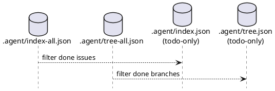

# ADR-00006 sync 生成物の整理: index/tree を all と todo に分割し、todo をデフォルト観測点にする

## 結論（Decision） (必須)
- 決定: `.agent/index.json` / `.agent/tree.json` は **「完了済み（Done）を除いた作業用（todo）」** として扱う。
- 決定: `.agent/index-all.json` / `.agent/tree-all.json` を **「全体（all）」** として新設し、完了済みも含むスナップショットを保持する。
- 目的: “日々の意思決定（次にやる）” の観測点を `index.json` / `tree.json` に固定し、ノイズ（Done）を減らす。

## 背景（Context） (必須)
deps v2 の運用では、multi-agent と人間が `.agent/index.json` / `.agent/tree.json` を見て意思決定します。  
しかし “全件（Done を含む）” が常に混ざると、次に着手できる issue を探すのが難しくなります。

ユーザー要望:
- “すべてが含まれる” ものは `*-all.json` に分離し、通常運用では Done を除いた index/tree を使いたい。
- Readyボード（矢印なしツリー）は、概念的に tree と同じ（包含ツリー + 状態表示）として扱いたい。

### UML（任意） (任意)

## 仕様（ここで固定） (必須)
### 1) all / todo の定義
- all:
  - `index-all.json` / `tree-all.json` は、scan 対象のノード（initiative/epic/issue）を全て含む。
  - issue は Done を含む（監査・説明責任・履歴用途）。
- todo:
  - `index.json` / `tree.json` は、原則として `status=done` の issue を除外する。
  - Unknown は除外しない（安全側・ブロック判定の根拠になるため）。
  - initiative/epic は、配下に todo issue が残る “枝” のみ含める（空の枝は落とす）。

### 2) deps 派生状態との関係
- ADR-00002 の決定どおり、deps 派生状態（ready/blocked/依存リスト）は index/tree に統合する。
  - all/todo のどちらにも同じ規則で付与する（ただし todo では Done 依存が除外されやすい）。

### 3) `sync --force`（deps preflight 失敗時）
- all/todo の index/tree 更新は継続できる（既存の `--force` 方針）。
- deps 派生状態が不正/未確定になる場合は、index/tree で “deps が無効” を観測できるようにする（stale 防止）。

## 判断理由（Rationale） (必須)
- todo-only をデフォルト観測点にすると、**「次にやる」判断が速く**なる（Done がノイズにならない）。
- all を別ファイルに分けることで、**監査・説明責任**（Done を含む全体確認）も失わない。

## 影響（Consequences） (必須)
Positive（良い点）:
- `.agent/index.json` / `.agent/tree.json` を見れば、日次運用の対象が集約される。

Negative / Debt（悪い点 / 将来負債）:
- 破壊的変更（観測点のファイル名変更/追加）になるため、ドキュメントと利用者周知が必要。

影響範囲（コード/テスト/運用/データ）:
- runtime: `sync` の出力ファイル（`index*.json` / `tree*.json`）生成ロジック
- docs: `reference_sync.md`（生成物一覧）
- tests: `sync` の生成物回帰（all/todo 両方）

## 参考（References） (任意)
- `spec-deps/current/requirement.md`（観測点の定義）
- `src/spec_dock/assets/spec_dock/docs/reference_sync.md`（現行の生成物一覧）
