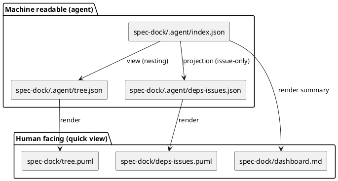

# ADR-00009 人間向け生成物（PlantUML / dashboard）の配置: spec-dock 直下へ移動し .agent は機械可読に限定する

## 結論（Decision） (必須)
- 決定:
  - **機械可読（エージェント主観測点）**は `spec-dock/.agent/` に集約する
    - 例: `spec-dock/.agent/index.json`, `spec-dock/.agent/tree.json`, `spec-dock/.agent/deps-issues.json`
  - **人間向け（可視化・導線）**は `spec-dock/` 直下に生成する（クイックアクセス優先）
    - Readyボード:
      - `spec-dock/tree.puml`（todo）
      - `spec-dock/tree-all.puml`（all）
    - issue-only deps（可視化）:
      - `spec-dock/deps-issues.puml`（todo-only）
    - サマリ導線:
      - `spec-dock/dashboard.md`（todo-only）
  - これらの人間向け生成物は、`spec-dock/.gitignore` で **生成物として一律 ignore** する
    - 目的: `sync` 実行で常に更新される生成物が git 状態を汚さないようにする

## 背景（Context） (必須)
- `.agent/` は「エージェントが読む機械可読スナップショット」として固定したい。
- 人間は `.agent/` を開いて探すより、`spec-dock/` 直下に “すぐ見える” 形で生成物がある方が運用が速い。
- PlantUML / Markdown は人間向けであり、機械判定の主観測点（JSON）と混ぜると “どれを読むべきか” が迷子になりやすい。

## 影響（Consequences） (必須)
- `sync` の生成物パスが変わる（`.agent/*.puml` → `spec-dock/*.puml`、`.agent/dashboard.md` → `spec-dock/dashboard.md`）。
- `sync --force`（deps 無効化）時は、`spec-dock/*.puml` / `spec-dock/dashboard.md` も **無効プレースホルダで上書き**して stale を残さない必要がある。
- `spec-dock/.gitignore` を更新して、上記ファイルが untracked/dirty にならないようにする必要がある。

### UML（任意） (任意)

## 参考（References） (任意)
- `spec-deps/current/requirement.md`（生成物/観測点）
- `spec-deps/current/adrs/adr-00008-sync-artifacts-dashboard-and-issue-only-deps.md`
- `spec-deps/current/adrs/adr-00004-ready-board-artifact-naming.md`
