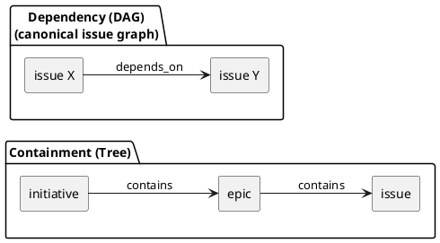
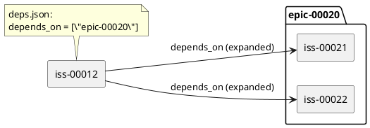
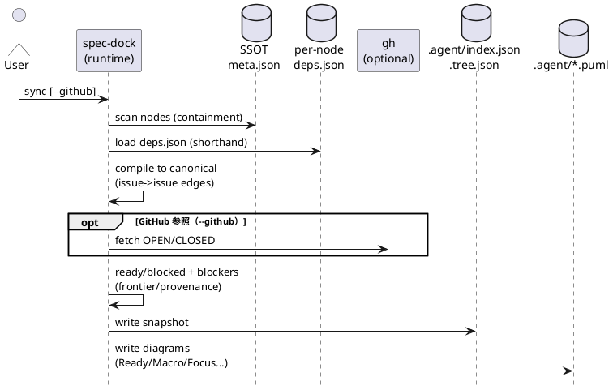
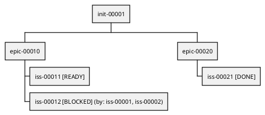
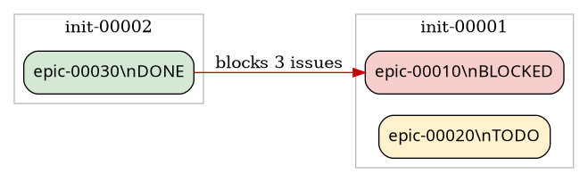
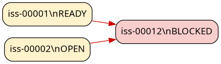
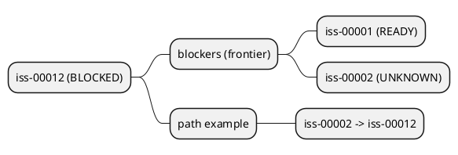

# 依存関係ベストプラクティス案：shorthand（initiative/epic）→ issue 正規化（compile）→ Ready/Blocked の“一目瞭然”可視化

この資料は、依存関係の「書きやすさ（まとめて宣言）」と「判断の速さ（今できる/できない/ブロッカーが一目）」を両立するための**設計案（ベストプラクティス）**です。

---

## 1. 背景と目的

### 背景（観測された課題）
- 概念が2つ混ざって見える:
  - **包含（構造）**: initiative → epic → issue（ツリー）
  - **依存（順序）**: 「A をやるには B が先」（DAG/グラフ）
- 依存を「epic/initiative まで含めたノード」に対して直接描くと、線が増えて毛玉化しやすく、**“今できる issue”** が見えづらい。

### 目的（この資料で提案する最終形）
- 依存は最終的に **issue→issue の依存グラフ（canonical）** に還元して、ready/blocked を判定する。
- ただし宣言は「この epic に依存」「この initiative に依存」のような **shorthand** を許可し、N対Nの手書きを避ける。
- 出力は「全体1枚」で頑張らず、**用途別ビュー（Ready / Explain / Overview）**に分けて“一目瞭然”を作る。

---

## 2. 用語（この資料での定義）

- **shorthand 依存**: `depends_on` に `init-*` / `epic-*` を指定して「その配下 issue 一式へ依存」をまとめて表すこと。
- **canonical 依存**: shorthand を展開した結果の **issue→issue** の依存グラフ（判定の唯一の基盤）。
- **Ready**: その issue の canonical 依存がすべて Done（=完了）で、着手可能な状態。
- **Blocked**: 依存に未完了/unknown/cycle があり、着手できない状態。
- **Frontier blockers（最小説明集合）**: blocked を説明するときに、無駄な中間ノードを省いて「今すぐ手を付けられる/調べるべき」ブロッカーだけに圧縮した集合。

---

## 3. 設計原則（ベストプラクティス）

1) **判定の単位は issue に正規化**する（canonical issue graph）  
→ epic/initiative は「状態の集計」「shorthand 宣言の場所」として扱い、依存の“判定”は issue で完結させる。

2) 依存図は「全部の依存」ではなく **“今ブロックしている依存だけ”** を描く  
→ 矢印がそのままブロッカーになり、読むコストが激減する。

3) “一枚ですべて分かる”を捨て、**Progressive disclosure** を採用する  
→ 入口は Ready、次に Explain（対象の理由）、必要なら Overview（全体の詰まり）へ。

4) **説明可能性（provenance）**を第一級に扱う  
→ shorthand 展開は便利だが、理由が追えないと運用で破綻する。  
「どの deps.json のどの参照が、この依存エッジを生んだか」を追跡可能にする。

### 図：包含（構造）と依存（順序）を分けて扱う


---

## 4. 依存の意味論（shorthand を issue へ還元するルール）

### 4.1 入力（deps.json）の推奨（最小変更）
現状のスキーマ（`schema_version:1` + `depends_on:[]`）のまま運用できます。  
`depends_on` に以下を混在させます（prefixで種類が分かるので、フィールド分割は必須ではありません）。

- issue: `iss-xxxxx`
- epic: `epic-xxxxx` / `epic-local-xxxxx`
- initiative: `init-xxxxx` / `init-local-xxxxx`
- GitHub issue number: `123` / `"123"`

#### 参考：3フィールドに分ける設計（明示性を上げたい場合）
「initiative/epic/issue への依存」を明確に書きたい場合、以下のような分割も可能です。  
ただし、書式が増えるため **ベストプラクティスとしては “必要になってから”**（schema_version を上げて導入）がおすすめです。

```json
{
  "schema_version": 2,
  "depends_on_initiatives": ["init-00010"],
  "depends_on_epics": ["epic-00020"],
  "depends_on_issues": ["iss-00030", 123]
}
```

### 4.2 shorthand の展開（canonical への compile）

#### 展開ルール（正規形）
- `issue A depends_on issue B` → canonical edge: `A -> B`
- `issue A depends_on epic E` → canonical edges: `A -> (issues under E)`（E配下の全 issue）
- `issue A depends_on initiative I` → canonical edges: `A -> (issues under I)`（I配下の全 issue）
- `epic E depends_on X` → **E配下の全 issue** が `X` に依存する（Xは上の規則で展開）
- `initiative I depends_on X` → **I配下の全 issue** が `X` に依存する（Xは上の規則で展開）

#### 空集合（0 issue）の扱い
- epic/initiative に issue が1件も無い場合、展開結果が空集合になります。  
→ 依存としては **ブロックしない（実質 done(empty)）** と解釈できます。
- ただし監査/説明のために「空だった」事実は warnings/summary に残すのが安全です（例: `deps_ref_expanded_to_empty`）。

### 図：shorthand が canonical（issue→issue）へ還元されるイメージ


---

## 5. データモデル案（“新しいSSOT”を増やさずに統合する）

前提整理: SSOTはあくまで
- 構造: `meta.json`
- 依存定義: 各ノード直下 `deps.json`

この方針では、`sync` が作る `.agent/index.json` / `.agent/tree.json` を「観測（スナップショット）」として拡張し、**ready/blocked と canonical issue 依存**を“同じ場所”に載せて扱いやすくします。

### 5.1 推奨：依存エッジ（canonical）はトップレベルに1回だけ保持する
`tree.json` はビュー用にノード情報を複製しがちです。ここに巨大な依存リストを各ノードへ埋め込むと、サイズ/可読性が破綻します。  
ベストプラクティスは、**canonical issue 依存をトップレベルに1回だけ**持ち、ノード側は summary だけを持つことです。

推奨イメージ（概念）:

```json
{
  "schema_version": 2,
  "generated_at": "2026-02-28T00:00:00Z",
  "nodes": { "...": { "...": "..." } },
  "deps": {
    "schema_version": 1,
    "issue_edges": {
      "iss-00010": ["iss-00001", "iss-00002"],
      "iss-00011": []
    },
    "node_ready": {
      "iss-00010": false,
      "iss-00011": true,
      "epic-00002": false,
      "init-00001": false
    },
    "node_blockers_summary": {
      "iss-00010": { "open": 2, "unknown": 0, "cycle": 0 }
    },
    "node_blockers_top": {
      "iss-00010": ["iss-00001", "iss-00002"]
    }
  }
}
```

ポイント:
- `issue_edges` で **issue→issue** の canonical グラフを持つ
- `node_ready` / `node_blockers_*` は**表示・判断用 summary**（tree へ持っていっても軽い）
- full blockers や provenance は `deps explain` / `--json --full` 等で必要時に出す（常時は出さない）

### 5.2 provenance（説明可能性）の保持（推奨）
shorthand 展開は「便利な代わりに、どこ由来か分からなくなる」リスクがあります。  
ベストプラクティスは「エッジの由来」を少なくとも機械可読に残すことです。

例（概念）:

```json
{
  "deps": {
    "issue_edge_provenance": {
      "iss-00010": [
        {
          "depends_on": "iss-00001",
          "via_ref": "epic-00099",
          "declared_in": "iss-00010",
          "inherited_from": null
        },
        {
          "depends_on": "iss-00002",
          "via_ref": "init-00077",
          "declared_in": "init-00077",
          "inherited_from": "epic-00012"
        }
      ]
    }
  }
}
```

これにより、`deps explain` で「この blocked は *どの deps.json のどの shorthand* が原因か」を確実に説明できます。

---

## 6. アルゴリズム（compile → 判定 → 説明）

### 6.1 compile（shorthand → canonical issue graph）
手順（概念）:
1. ツリー走査: initiative/epic/issue を走査し、包含関係（descendant issues）を確定
2. `deps.json` 読み込み: 各ノードの `depends_on` を解決（node id / GitHub番号 → node id）
3. 展開:
   - ref が `iss-*` ならその issue
   - ref が `epic-*` なら **その epic 配下 issue 一式**
   - ref が `init-*` なら **その initiative 配下 issue 一式**
4. 伝播（宣言場所による適用範囲）:
   - issue に書いた依存: その issue のみ
   - epic に書いた依存: その epic 配下 issue 全て
   - initiative に書いた依存: その initiative 配下 issue 全て
5. 正規化: 重複排除・ソート（決定的順序）

### 図：sync が “compile→判定→可視化” を行う流れ


### 6.2 追加バリデーション（必須：永久blockedの早期検知）
- **自己依存**（`iss-X -> iss-X`）は即エラー（展開の副作用で起きやすい）
- **循環依存**は canonical issue グラフ上で検出（SCC で cycle を列挙し、代表サイクルも提示）
- unknown（GitHub未取得/未 import 等）は safe side（blocked）に倒すが、理由分類して見える化する:
  - `unknown`（取得できない/番号未解決）
  - `cycle`（循環）

### 6.3 ready/blocked 判定（issue）
- `ready(iss) = canonical depends_on の全 issue が done`
- `blocked` は `ready=false` の別名（ただし “なぜ blocked か” は unknown/cycle/未完了で区別する）

### 6.4 Frontier blockers（最小説明集合）
blocked issue について「中間の blocked ノード」を省き、次の集合に圧縮するのが読みやすいです:
- `Frontier(T)` = `T` の依存閉包のうち「done ではない」かつ
  - ready（今すぐ着手できる）/ unknown（情報不足）/ cycle（循環）
のいずれかであるノード

これを `deps explain <target>` のデフォルト出力にすると、説明が短くなります。

---

## 7. 出力（CLI）ベストプラクティス案

### 7.1 入口：Ready を最速で出す
人間もエージェントも最初に知りたいのはこれです。
- `deps ready [--scope init|epic] [--github]`
  - 出力: READY issue 一覧（epic/initiative でグルーピング）

### 7.2 対象の説明：winner（=対象issue）を理解する
- `deps explain <target> [--github]`
  - 出力: blocked理由（Frontier blockers + 最短経路）
  - 可能なら provenance を併記（via_ref / declared_in）

### 7.3 全体最適：ブロッカーランキング
- `deps blockers [--top N] [--github]`
  - “何件塞いでいるか” を出す（Frontier impact / downstream size など）

※既存 `deps check` はこの設計の上に置けます（ready/blocked + blockers を返す）。

---

## 8. 可視化（PlantUML）ベストプラクティス案

依存図を「全部」で描くより、用途別に **3枚** に分けるのが最も読みやすいです。

### 8.1 Readyボード（構造ツリー：矢印なし）
包含（initiative/epic/issue）を自然に読める図にし、各 issue の READY/BLOCKED を付与します。



### 8.2 Macro依存（epic中心：エッジは件数で集約）
“ブロッカーの方向”が直感的になるよう、**ブロッカー → ブロックされる側**の矢印にするのが読みやすいです。  
（内部の保存形式はどちらでもよいが、図は `blocks` 方向を推奨）



### 8.3 Leaf（issue→issue：focus / blocked edges のみ）
全体を描かず、対象（winner=target）から upstream/downstream を数ホップに絞って表示します。



### 8.4 Explain（依存ツリー：Frontier強調）
図でも “最小説明集合” を強調すると、エージェント・人間ともに判断が速いです。



---

## 9. “blocked を status に入れるか？”（結論：別軸が安全）

提案として「open/done/unknown に加えて blocking を status に置く」は一見シンプルですが、運用上は混乱しやすいです。

理由:
- `done`（完了）と `blocked`（未着手不可）は**同じ軸に置くと衝突**しやすい（完了していても依存が未完了、など監査観点が発生する）
- `open` は進捗、`blocked` は依存の可否で、意味が違う

ベストプラクティス:
- `status`（進捗）: `open/done/unknown`（既存）
- `ready`（依存可否）: `true/false`
- `blocked_reason`（任意）: `missing/unknown/cycle/open_deps` など

**“新しい管理”ではなく、既存 index/tree を richer にする**という目的は、`ready/blockers` の追加で達成できます。

---

## 10. リスクと対策（必須チェック）

- **暗黙 self-dep / cycle**（shorthand展開で発生）:
  - canonical issue グラフで SCC 検出
  - エラーに provenance（どの deps.json のどの ref が原因か）を含める
- **エッジ爆発**（init→init依存など）:
  - 依存の保持をトップレベルに集約し、ノード側は summary
  - しきい値で warn（`deps_expansion_large`）
  - 可視化は macro（集約）＋ focus（部分）で逃がす
- **stale（古いdepsの誤用）**:
  - `sync --force` など preflight失敗時は deps 部分を `null` にして残さない（誤用防止）

---

## 11. 次アクション（合意して進める順序）

1) 合意: shorthand の意味論（epic/init 参照は “配下 issue 一式” へ展開）  
2) 合意: 生成物の統合方針（index/tree に deps summary + canonical edge を置く／別ファイルは任意）  
3) 実装順（小さく）:
   - compile（canonical issue_edges）+ self-dep/cycle 検出
   - ready/blocked を index/tree に載せる（summary中心）
   - PlantUML 3枚（Readyボード / Macro / Focus）を `sync` で生成
   - `deps explain` の frontier/provenance 出力で運用を成立させる
