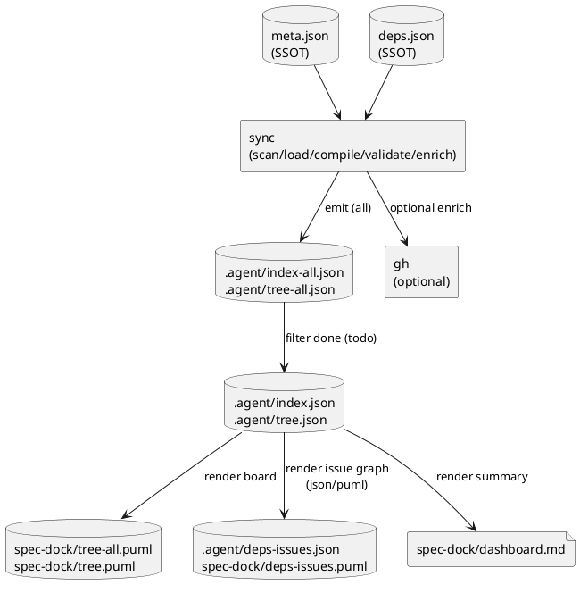

# deps v2: `.agent/*` 生成物（JSON/PlantUML）の整理 叩き台（artifacts）

## 1. 背景と目的
- 現状の `index/tree` が “全件（Done含む）” でノイズになりやすく、「次にやれる issue」の判断が遅くなる。
- 依存の本質は issue→issue の順序であり、initiative/epic（包含）と混ぜた可視化は毛玉化しやすい。
- そのため、**all vs todo** を分離し、さらに **issue-only 依存グラフ**（可視化）を追加して、AI/人間の共通認識を作る。

## 2. 入力情報
- ユーザー要望:
  - `index-all.json` / `tree-all.json`（全件）と、Done を除いた `index.json` / `tree.json`（作業用）を分ける
  - Readyボードは “tree と同義”（包含ツリーに状態を付けたもの）
  - 依存可視化は **initiative/epic を除外**し issue-only で見たい
  - index/tree の issue は **推移依存（closure）**を保持し、Done は除外したい（ADR-00005）
- 既存仕様（参考）:
  - `src/spec_dock/assets/spec_dock/docs/reference_sync.md`（現行の `sync` 生成物）
- コンサルタント所見（Darwin）:
  - all/todo 分離 + Ready/Runnable を 1ファイルで即判定できる派生物が運用に効く
  - issue-only グラフは “今効いているエッジだけ” に寄せると毛玉化しにくい

## 3. 事実（観測結果）
- 現行の `deps.puml` は包含（tree）と依存（矢印）が混ざりやすく、Ready/Blocked が図だけでは追いにくい。
- `sync --force` は deps preflight 失敗時に deps 派生物を削除して stale 誤用を防いでいる（この方針は維持したい）。

## 4. 仮説・検討メモ

### 4.1 生成物セット（叩き台）
> “作業用（todo）” をデフォルト観測点にし、監査用（all）を別名で残す。

#### SSOT（入力）
| 種別 | パス | 目的 |
|---|---|---|
| SSOT | `spec-dock/initiatives/**/meta.json` | initiative/epic/issue の定義 |
| SSOT | `**/deps.json` | 依存宣言（shorthand 含む） |

#### Derived（JSON: all/todo）
| 種別 | パス | 対象 | 目的 |
|---|---|---|---|
| Derived | `spec-dock/.agent/index-all.json` | all | 全件のスナップショット（監査/説明責任） |
| Derived | `spec-dock/.agent/tree-all.json` | all | all のツリー表示 |
| Derived | `spec-dock/.agent/index.json` | todo | Done 除外の作業用索引（意思決定の主観測点） |
| Derived | `spec-dock/.agent/tree.json` | todo | Done 除外の作業用ツリー（Readyボードの母体） |

#### Derived（PlantUML: dashboard / visualization）
| 種別 | パス（案） | 対象 | 目的 |
|---|---|---|---|
| Board | `spec-dock/tree-all.puml` | all | Readyボード（all） |
| Board | `spec-dock/tree.puml` | todo | Readyボード（todo） |
| Viz | `spec-dock/deps-issues.puml` | todo | issue-only 依存グラフ（todo-only） |
| Export | `spec-dock/.agent/deps-issues.json` | todo | issue-only 依存グラフ（構造化 / エージェント向け） |
| Dashboard | `spec-dock/dashboard.md` | todo | ready/blocked/unknown の要約（導線） |

補足:
- `.agent/active.json` は引き続き「現在の作業点」を示す（派生だが運用上重要）。
- `.agent/deps.json`（派生 SSOT）を“主観測点”にしない（ADR-00002）。必要なら debug として限定する。

### 4.2 多段階で Option C（推移依存）を実現する案
issue の closure（Done 除外）を index/tree に載せるための、最小パイプライン案。

1) scan: meta を走査してノード索引を構築  
2) load: per-node `deps.json` をロード  
3) compile: shorthand → canonical issue→issue edges（direct）へ展開  
4) validate: descendant/self-edge/cycle を検出して fail-fast（`--force` の場合は deps 無効扱い）  
5) enrich: `--github` の場合のみ GitHub state を取得し status を補強（失敗は unknown）  
6) prune: Done issue を除外したグラフを作る（todo view）  
7) closure: prune 後グラフで推移依存（closure）を計算し、issue に付与（Done 除外が自然に成立）  
8) emit:
   - JSON（all/todo）
   - tree board（all/todo）
   - issue-only deps graph（todo-only）
   - dashboard（todo-only）

### UML（任意）

## 5. 次アクション
- 生成物セットを ADR で固定: `spec-deps/current/adrs/adr-00008-sync-artifacts-dashboard-and-issue-only-deps.md`
- issue-only deps graph の矢印方向等を ADR で固定: `spec-deps/current/adrs/adr-00007-issue-only-deps-visualization.md`
- 仕様を固定したら、設計書（`spec-deps/current/design.md`）に具体スキーマと生成手順を落とし込む
