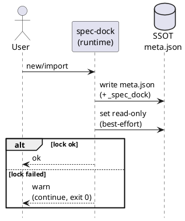

# adr-00001 meta.json の tool-managed 自己記述と read-only 化（ローカル予防）

> NOTE: 本 ADR は、メタファイル名の dotfile 化（`.meta.json`）を採用する意思決定により **adr-00002 に置き換え**られました。  
>（自己記述 `_spec_dock` と read-only 化の方針自体は維持されますが、最新の結論は adr-00002 を参照してください）

## 結論（Decision） (必須)
- `spec-dock/initiatives/**/meta.json` は SSOT であり、コーディングエージェントによる “うっかり編集” を避けるために以下を採用する。
  - `meta.json` に tool-managed を示す自己記述（`_spec_dock`）を追加する（最小スキーマを固定）:
    - `_spec_dock.managed=true`
    - `_spec_dock.do_not_edit=true`
    - `_spec_dock.edit_via=\"spec-dock\"`
  - `spec-dock new/import` が `meta.json` を生成した直後に read-only 化する（best-effort）
  - read-only 化に失敗しても **warn を出して処理継続**する（exit code 0）
- CI / CODEOWNERS / pre-commit 等の「混入防止（マージ防壁）」は本 ADR のスコープ外とする。
- `meta.json` は **ファイル名を変更しない**（dotfile 化や `dontedit` を含むファイル名への変更は採用しない）。

## 背景（Context） (必須)
- 背景/制約:
  - `meta.json` は spec-dock の SSOT であり、破損すると validate/sync の結果が壊れやすい。
  - コーディングエージェントがリポジトリ内の JSON を自動修正してしまうリスクがある。
  - 「完全な編集禁止」は原理的に困難なため、今回はローカルでの事故率を下げる “予防” を優先する。
- 前提:
  - read-only は OS/FS 差で完全保証できない場合があるため best-effort とする。

### UML（任意） (任意)

## 選択肢（Options considered） (必須)
- Option A: 自己記述のみ（`_spec_dock` を追加）
  - Pros: 実装が最小、互換性リスクが低い
  - Cons: エージェントが無視すれば誤編集は普通に起こりうる
- Option B: read-only 化のみ（ファイル属性）
  - Pros: 編集しにくさが増す（事故率を下げる）
  - Cons: OS/FS 差、正当な修正時に摩擦がある
- Option C: 自己記述 + read-only（本採用）
  - Pros: シンプルな Defense in Depth（注意喚起 + 物理ガード）
  - Cons: 完全禁止ではない、環境差が残る
- Option D: CI / CODEOWNERS / pre-commit 等で混入防止
  - Pros: マージ前に確実に検知・停止できる
  - Cons: 今回のスコープ外（運用/設定コスト、ローカル予防ではない）
- Option E: `meta.json` のファイル名を “編集禁止が伝わる名前” に変更（例: `.meta.json` / `metadata.dontedit.json`）
  - Pros: 人間向けに意図が伝わりやすく、事故率が下がる可能性がある
  - Cons:
    - spec-dock は `meta.json` を前提に走査しており、広範な破壊的変更になる
    - エージェントはリポジトリ全体を走査することが多く、抑止効果が限定的になりうる
  - 棄却理由:
    - 効果に対してコストが大きく、本 ADR の「シンプルなローカル予防」方針に合わないため

## 判断理由（Rationale） (必須)
- 要件（ローカルで“編集そのもの”を起きにくくする）に対し、Option C が最もバランスが良い。
- 追加の運用負荷や複雑性を抑えつつ、事故率を下げられる。

## 影響（Consequences） (必須)
- Positive（良い点）:
  - エージェントが `meta.json` を直接編集しにくくなり、SSOT 破損の事故率が下がる
  - JSON 内で “これは tool-managed” と明示され、レビュー/調査時も意図が伝わる
- Negative / Debt（悪い点 / 将来負債）:
  - 正当な理由で `meta.json` を修正する場合に摩擦がある（手動で read-only 解除が必要）
  - read-only は best-effort であり、環境差により効かない場合がある
- 影響範囲（コード/テスト/運用/データ）:
  - `new/import` で生成される `meta.json` の内容とファイル属性
  - テストは OS 差を考慮した設計が必要
- 移行/ロールバック:
  - 生成直後の chmod をやめる（ロールバック）だけで戻せる
  - 既存ノードに後追い適用しないため、既存データ移行は発生しない
- Follow-ups（追加の Epic/Issue/ADR）:
  - 必要になれば `meta unlock/lock` のような導線追加（別 Issue）
  - 必要になれば CI による混入防止（別 Issue）

## 参考（References） (任意)
- Issue:
  - https://github.com/chemitaro/spec-dock/issues/12
- Specs:
  - `spec-deps/current/requirement.md`
  - `spec-deps/current/artifacts/meta-json-guardrails-one-pager.md`
- Code pointers:
  - `src/spec_dock/assets/spec_dock/scripts/spec_dock_runtime/app.py`（`_write_meta`）
  - `src/spec_dock/assets/spec_dock/scripts/spec_dock_runtime/io_json.py`（`_write_json`）
