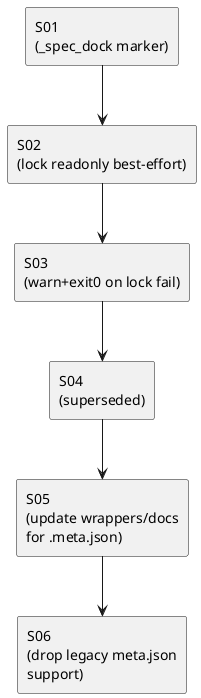

# iss-00012 メタデータ（.meta.json等）をコーディングエージェントから保護するガードレールを追加する — 実装計画（TDD: Red → Green → Refactor）

## この計画で満たす要件ID (必須)
- 対象AC: AC-001, AC-002
- 対象EC: EC-001, EC-002
- 対象制約（Always / 非交渉）:
  - stdlib only（依存追加なし）
  - `.meta.json` は `schema_version=1` を維持し、新バージョンは作らない
  - read-only 化は best-effort（失敗時は warn + exit 0）
  - 既存ノードのメタデータ内容（JSONフィールド）は後追い変更しない（sync/validate 等）
  - レガシー `meta.json` はサポートしない（読み取り/移行/互換を実装しない）

## ステップ一覧（観測可能な振る舞い） (必須)
- [x] S01: `new/import` で生成される `.meta.json` に `_spec_dock` 最小スキーマが含まれる
- [x] S02: `new/import` で生成される `.meta.json` が read-only になる（best-effort / POSIX では write bit が外れる）
- [x] S03: read-only 化に失敗しても warn + exit 0 で継続する（EC-001）
- [x] S04: （Superseded）レガシー `meta.json` の `.meta.json` への移行（互換要件が撤回されたため、以後はS06へ）
- [x] S05: wrapper / shipped docs の `meta.json` 参照が `.meta.json` に更新される
- [x] S06: レガシー `meta.json` のサポートを削除し、`.meta.json` のみに統一する（EC-002）

### UML（任意） (任意)

### 要件 ↔ ステップ対応表 (必須)
- AC-001 → S01, S02, S03
- AC-002 → S01, S02, S03
- EC-001 → S03
- EC-002 → S06
- 非交渉制約（stdlib only / schema_version=1）→ S01..S05（継続監視）

---

## 実装ステップ（各ステップは“観測可能な振る舞い”を1つ） (必須)

### 共通の品質ゲート（全ステップで必須）
- 各ステップ末尾に **全テスト**を実行し成功させる:
  - `python -m unittest discover -v`
- 各ステップ末尾にコミットする（Conventional Commits、日本語、複数行）
- 各ステップ完了ごとに reviewer のレビューを通してから次へ進む（multi-agent 運用）
- 各ステップで **Red → Green → Refactor** を明示して回す（本ドキュメントの S01 構成をテンプレとして、S02 以降も末尾チェックを省略しない）
- 実行記録は `spec-deps/current/report.md` に残す（コマンド/結果/変更ファイル）

### S01 — `new/import` で生成される `.meta.json` に `_spec_dock` 最小スキーマが含まれる (必須)
- 対象: AC-001, AC-002
- 設計参照:
  - 対象IF: IF-001（`_write_meta`）
  - 対象テスト: `tests/test_cli.py`（既存の `new/import` テストに追記）
- このステップで「追加しないこと（スコープ固定）」:
  - read-only 化（S02/S03 で実施）
  - 既存ノードのメタデータ内容の後追い適用（やらないことをテストで固定）

#### update_plan（着手時に登録） (必須)
- [ ] `update_plan` に、このステップの作業ステップ（調査/Red/Green/Refactor/品質ゲート/報告/コミット）を登録した
- 登録例（必須の粒度）:
  - （調査）既存 `.meta.json` の生成箇所と既存テストを確認
  - （Red）`_spec_dock` が無いことをテストで失敗させる
  - （Green）最小実装で `_spec_dock` を出力する
  - （Refactor）命名/責務の最小整理（過剰分割しない）
  - （品質ゲート）`python -m unittest discover -v`
  - （報告）`spec-deps/current/report.md` を更新
  - （コミット）S01 完了コミット

#### 期待する振る舞い（テストケース） (必須)
- Given: `spec-dock init` 済みの repo
- When: `spec-dock new ...` / `spec-dock import ...` でノードを作成する
- Then: 生成された `.meta.json` が `_spec_dock` を含み、最小スキーマを満たす
- 観測点: `spec-dock/initiatives/**/.meta.json` の JSON 内容
- 追加/更新するテスト（案）:
  - `tests/test_cli.py` の既存テストに assert 追加（例: `test_new_initiative_and_epic_default_to_local_even_when_gh_is_available` / `test_import_issue_creates_node_and_runs_sync_without_updating_active`）

#### Red（失敗するテストを先に書く） (任意)
- 期待する失敗:
  - `_spec_dock` が存在しない / キー・値が一致しない

#### Green（最小実装） (任意)
- 変更予定ファイル:
  - Modify: `src/spec_dock/assets/spec_dock/scripts/spec_dock_runtime/app.py`（`_write_meta`）
  - Modify: `tests/test_cli.py`
- 追加する概念:
  - `_spec_dock`（最小スキーマのみ）
- 実装方針:
  - `schema_version` を維持し、既存フィールドは破壊しない（追加のみ）

#### Refactor（振る舞い不変で整理） (任意)
- 目的: `_write_meta` の可読性を崩さない範囲で最小整理
- 変更対象: `_write_meta`（helper 化は必要最小限）

#### ステップ末尾（省略しない） (必須)
- [ ] `python -m unittest discover -v` を実行し、成功した
- [ ] `spec-deps/current/report.md` に実行コマンド/結果/変更ファイルを記録した
- [ ] `update_plan` を更新し、このステップの作業ステップを完了にした
- [ ] コミットした（エージェント）

---

### S02 — `new/import` で生成される `.meta.json` が read-only になる（best-effort / POSIX では write bit が外れる） (必須)
- 対象: AC-001, AC-002
- 設計参照:
  - 対象IF: IF-001（`_write_meta`）, IF-002（`_try_make_readonly`）
  - 対象テスト: `tests/test_cli.py`
- このステップで「追加しないこと（スコープ固定）」:
  - lock 失敗時の warn/exit0（S03 で確定）
  - 既存ノードの後追い適用（やらない）

#### update_plan（着手時に登録） (必須)
- [ ] `update_plan` に、このステップの作業ステップ（調査/Red/Green/Refactor/品質ゲート/報告/コミット）を登録した

#### 期待する振る舞い（テストケース） (必須)
- Given: `spec-dock init` 済みの repo
- When: `spec-dock new ...` / `spec-dock import ...` でノードを作成する
- Then:
  - POSIX では `.meta.json` の write bit が外れている（`chmod a-w` 相当）
  - non-POSIX は best-effort のため、少なくとも処理が成功し（exit 0）、不要な warn を出さない
- 観測点:
  - POSIX: `Path.stat().st_mode & 0o222 == 0`（書き込み不可）
  - non-POSIX: exit code と stderr（warn が無いこと）
- 追加/更新するテスト（案）:
  - `tests/test_cli.py` に read-only の assert を追加（`os.name != \"posix\"` は skip でも可）

#### Red（失敗するテストを先に書く） (任意)
- 期待する失敗:
  - 現状は lock が無いため、POSIX で write bit が残りテストが落ちる

#### Green（最小実装） (任意)
- 変更予定ファイル:
  - Modify: `src/spec_dock/assets/spec_dock/scripts/spec_dock_runtime/io_json.py`（`_try_make_readonly` 追加）
  - Modify: `src/spec_dock/assets/spec_dock/scripts/spec_dock_runtime/app.py`（`_write_meta` から呼び出し）
  - Modify: `tests/test_cli.py`
- 実装方針:
  - POSIX では chmod 後に write bit が外れたか検証し、外れていなければ “失敗扱い” にできるようにする（warn の出力自体は S03 で固定）
  - non-POSIX は “試行できたら成功扱い” とする（例外時のみ失敗）

#### Refactor（振る舞い不変で整理） (任意)
- 目的: I/O 周りを `io_json.py` に寄せて、`app.py` の責務を増やしすぎない

#### ステップ末尾（省略しない） (必須)
- [ ] `python -m unittest discover -v` を実行し、成功した
- [ ] `spec-deps/current/report.md` に実行コマンド/結果/変更ファイルを記録した
- [ ] `update_plan` を更新し、このステップの作業ステップを完了にした
- [ ] コミットした（エージェント）

### S03 — read-only 化に失敗しても warn + exit 0 で継続する（EC-001） (必須)
- 対象: EC-001
- 設計参照:
  - 対象IF: IF-001（`_write_meta`）, IF-002（`_try_make_readonly`）
  - 対象テスト: `tests/test_cli.py`
- このステップで「追加しないこと（スコープ固定）」:
  - 既存ノードの後追い適用（やらない）

#### update_plan（着手時に登録） (必須)
- [ ] `update_plan` に、このステップの作業ステップ（調査/Red/Green/Refactor/品質ゲート/報告/コミット）を登録した

#### 期待する振る舞い（テストケース） (必須)
- Given: `spec-dock init` 済みの repo
- When:
  - テスト内で target repo 側の runtime 実装を一時的に改変し、read-only 化を意図的に失敗させる
  - その状態で `spec-dock new ...`（または import）を実行する
- Then:
  - exit code が 0（成功扱いのまま）
  - stderr に `spec-dock: (warn)` が出る（失敗時のみ）
- 観測点: exit code + stderr
- 追加/更新するテスト（案）:
  - `tests/test_cli.py` に新規テスト追加（runtime の `io_json.py` を一時改変する）

#### Red（失敗するテストを先に書く） (任意)
- 期待する失敗:
  - 現状では read-only 失敗で例外終了する/exit != 0、または warn を出さない

#### Green（最小実装） (任意)
- 変更予定ファイル:
  - Modify: `src/spec_dock/assets/spec_dock/scripts/spec_dock_runtime/app.py`（失敗時 warn + 継続）
  - Modify: `src/spec_dock/assets/spec_dock/scripts/spec_dock_runtime/io_json.py`（失敗理由を返せる設計）
  - Modify: `tests/test_cli.py`
- 実装方針:
  - warn は `_warn()` を使い、prefix `spec-dock: (warn)` を維持する
  - 失敗時は **例外を投げず**（または握りつぶして）、new/import を成功扱いのまま継続する

#### Refactor（振る舞い不変で整理） (任意)
- 目的: warn メッセージが二重に出ないように責務を整理（warn は一箇所）

#### ステップ末尾（省略しない） (必須)
- [ ] `python -m unittest discover -v` を実行し、成功した
- [ ] `spec-deps/current/report.md` に実行コマンド/結果/変更ファイルを記録した
- [ ] `update_plan` を更新し、このステップの作業ステップを完了にした
- [ ] コミットした（エージェント）

### S04 — （Superseded）レガシー `meta.json` の移行（互換要件が撤回されたため実施しない） (必須)
- 本ステップは旧方針（互換/移行）に基づく。
- `adr-00003` により「レガシー `meta.json` はサポートしない」へ意思決定が更新されたため、今後は **実装しない**（既存実装があれば削除する）。
- 後続ステップ: S06（legacy `meta.json` サポート削除）

---

### S05 — wrapper / shipped docs の `meta.json` 参照が `.meta.json` に更新される (必須)
- 対象: UX（メタファイルがユーザー操作ファイルと混ざりにくい）
- 設計参照:
  - `src/spec_dock/assets/spec_dock/templates/**`（wrapper scripts）
  - `src/spec_dock/assets/spec_dock/docs/**`（guide/reference）
- 期待する振る舞い（テストケース）:
  - wrapper のエラーメッセージが `.meta.json` を指す（missing/invalid 等）
  - `init` で生成される guide/reference のツリー図が `.meta.json` を指す
- 品質ゲート:
  - `python -m unittest discover -v`

---

### S06 — レガシー `meta.json` のサポートを削除し、`.meta.json` のみに統一する（EC-002） (必須)
- 対象: EC-002
- 変更内容（要点）:
  - runtime/wrapper/docs/tests から `meta.json` の読み取り/移行/互換を削除する
  - `spec-dock new/import/sync/validate` は、レガシー `meta.json` を検出したら **副作用前にエラーで停止**し、ガイダンス + 該当パスを出す
- 品質ゲート:
  - `python -m unittest discover -v`

## 未確定事項（TBD） (必須)
- なし（requirement.md / design.md / ADR で合意済み）

## 完了条件（Definition of Done） (必須)
- 対象AC/ECがすべて満たされ、テストで保証されている
- MUST NOT / OUT OF SCOPE を破っていない
- 品質ゲート（フォーマット/リント/テストのうち該当するもの）が満たされている

## 省略/例外メモ (必須)
- 該当なし
