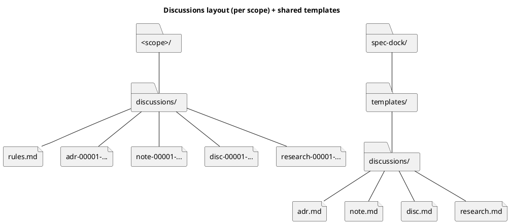

# `discussions/` 運用ベストプラクティス（Option A / 連番 / ラッパ廃止 / 複数テンプレ）

関連:
- Issue: https://github.com/chemitaro/spec-dock/issues/14
- 要件: `spec-deps/current/requirement.md`
- 設計: `spec-deps/current/design.md`

---

## 0. 前提（今回の決定事項）

- 後方互換性は維持しない（破壊的変更OK）
- Initiative/Epic/Issue 配下のディスカッション資料は **`discussions/` 1ディレクトリ**に集約する（Option A）
- `discussions/` 配下にスクリプト（`new-adr` 等のラッパ）を置かない（完全廃止）
- ファイル名は **「種類（prefix）+ 連番」**（ADR以外も日付ではなく連番）
- `discussions/` が空にならないよう、必ず 1ファイル置く（Git管理のため）
- テンプレは **1つのテンプレディレクトリ（複数ファイル）**に集約し、type ごとにコピー運用を採用する（例: `adr/note/disc/research`）

---

## 1. `discussions/` に置く“必須の1ファイル”は何が良いか

結論: **`discussions/rules.md`（小文字）を推奨**。

理由:
- `.keep` より情報価値があり、ディレクトリのSSOT（運用ルール）として機能する
- `README.md`（大文字慣習）に引っ張られず、生成物を小文字に統一しやすい
- 「何を書けばよいか」を rules に固定でき、`discussions/` の“何でも置き場”化を防げる

---

## 2. 命名規約（ファイル名）

### 2.1 推奨形式（typeごと連番）

- ADR: `adr-00001-<slug>.md`
- 非ADR: `<type>-00001-<slug>.md`
  - 例: `note-00001-...`, `disc-00001-...`, `research-00001-...`

推奨理由（typeごと連番）:
- type がファイル名で即判別でき、検索性が落ちにくい
- 連番衝突が減り、次番号が直感的（その type だけ見れば良い）
- ADR が独立系列である以上、全体共通連番のメリットが薄い

### 2.2 ルール（最小）

- 連番は **5桁ゼロ埋め**（`00001`〜）で統一（ソートが安定し、ADRと揃う）
- `<slug>` は **kebab-case・小文字**（省略可だが推奨）
- 連番の振り直しは禁止（参照が壊れる）

---

## 3. テンプレ戦略（type ごとに複数テンプレ）

結論: `spec-dock/templates/discussions/` に **type ごとのテンプレ**を用意し、必要なものだけコピーして使う。

```text
spec-dock/
└── templates/
    └── discussions/
        ├── adr.md
        ├── disc.md
        ├── note.md
        └── research.md
```

### 3.1 type（prefix）とテンプレの対応（最小セット）

最小セットは 4種で開始し、必要が出たら増やす（デフォルトで増殖させない）。

- `adr-`: 意思決定（長期影響がある/不可逆/横断影響のある決定）
- `disc-`: 議論シート（選択肢/Pros/Cons/未決事項を整理し、最終的に推奨案まで置く）
- `research-`: 調査メモ（調査目的・方法・結果・結論・参照リンク/実験ログ）
- `note-`: 軽量メモ（会議メモ/思考メモ/タスクメモ。後で `disc`/`adr` に昇格し得る）

### 3.2 テンプレに入れるべき最小 frontmatter（推奨）

テンプレをコピーする限り frontmatter が常に付く運用にすれば、ツール側での厳格強制は不要。

例（`note`/`disc`/`research` 共通で使える最小）:
```yaml
---
種別: "note | disc | research"
ID: "<type>-00001"
タイトル: "<TITLE>"
状態: "draft | accepted | superseded"
作成者: "<YOUR_NAME>"
最終更新: "YYYY-MM-DD"
親: ["<scope-id>"]
関連: ["#14"]
---
```

---

## 4. `discussions/rules.md` の章立て（最短で回るテンプレ）

`rules.md` は短くて良いが、迷いどころだけは潰す。

1) このディレクトリは何か（置くものの範囲）
2) 種類（type）一覧（推奨セット）
3) 命名規約（`<type>-00001-<slug>.md`）
4) 作り方
   - ADR: `./spec-dock/scripts/spec-dock new adr ...` の例
   - 非ADR: `spec-dock/templates/discussions/<type>.md` をコピーして作成
5) ADRに昇格する基準（ガード）
6) リンク規約（冒頭に「関連:」を置く）
7) 禁止事項（スクリプトを置かない、番号を振り直さない）
8) よくある詰まり（番号衝突時の対応）

---

## 5. 作成導線（スクリプト無し前提）

### 5.1 ADR（意思決定）

`discussions/` 配下にラッパは置かない。代わりに `spec-dock` のコマンドを案内する。

例:
```bash
./spec-dock/scripts/spec-dock new adr --issue iss-00123 --title "token rotation"
```

### 5.2 非ADR（軽量メモ/調査/説明）

例:
```bash
# リポジトリルートで実行（issue scope の例）
cp spec-dock/templates/discussions/note.md spec-dock/initiatives/<initiative-id>-<slug>/epics/<epic-id>-<slug>/issues/<issue-id>-<slug>/discussions/note-00001-dir-layout.md
cp spec-dock/templates/discussions/research.md spec-dock/initiatives/<initiative-id>-<slug>/epics/<epic-id>-<slug>/issues/<issue-id>-<slug>/discussions/research-00001-naming-taxonomy.md
cp spec-dock/templates/discussions/disc.md spec-dock/initiatives/<initiative-id>-<slug>/epics/<epic-id>-<slug>/issues/<issue-id>-<slug>/discussions/disc-00001-doc-types.md
```

（補足）衝突しない運用:
- その type の最大番号を見て +1
- 被ったら次へ繰り上げ

---

## 6. 追加の最適化案（任意）: `spec-dock new doc`

手動コピーだと「連番衝突」が起きやすい。最小の追加コマンドで回避できる。

案:
- `spec-dock new doc --{initiative|epic|issue} <id> --type <type> --title "<title>"`
- 出力: `<scope>/discussions/<type>-00001-<slug>.md`
- 採番: typeごとに `discussions/<type>-*.md` を走査して max+1
- `--type` は自由入力（`^[a-z0-9-]+$` のみ許可）にして、種類追加でCLIを増やさない
- テンプレは `spec-dock/templates/discussions/<type>.md` を優先し、無ければ `note.md` にフォールバック（最小）

採用するかは、実装コスト（小）と運用コスト（中）を比較して決める。

---

## 7. 見取り図（ディレクトリ構成）



---

## 8. 実装タスク（#14 に落とす粒度）

- テンプレ（initiative/epic/issue）: `adrs/` と `artifacts/` を削除し、`discussions/rules.md` を同梱
- テンプレ（共有）: `spec-dock/templates/discussions/{adr,note,disc,research}.md` を追加
- ランタイム: `new adr` の出力先/走査を `discussions/` 前提に変更
- （任意）ランタイム: `new doc` を追加（連番衝突の自動回避）
- docs/tests: 生成物が仕様どおりかを固定（`rules.md` の存在、命名規約）
