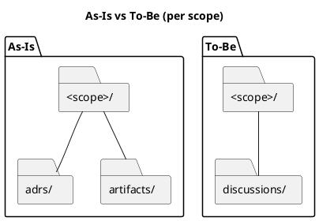
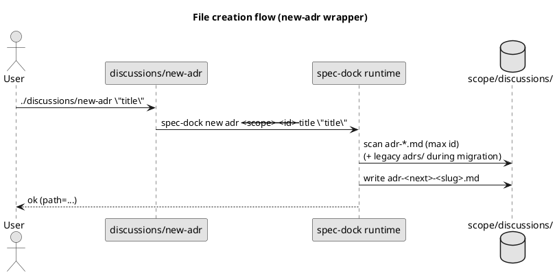
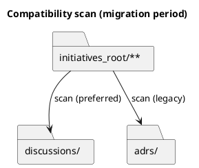

# ディスカッション資料ディレクトリ統合（`adrs/` + `artifacts/` → `discussions/`）検討メモ

> 2026-03-05 追記: 本資料は当初「後方互換（併走/移行）」も含めて検討していましたが、方針が **後方互換なし / ラッパ廃止 / 非ADRも連番 / テンプレ1ファイル** に確定しました。
> 最新のベストプラクティスは `spec-deps/current/artifacts/20260305-discussions-best-practice.md` を参照してください。

目的: Initiative/Epic/Issue 配下のディスカッション関連ディレクトリを **1つ**に統一し、運用と導線（テンプレ/コマンド/探索）をシンプルにする。

関連:
- GitHub Issue: https://github.com/chemitaro/spec-dock/issues/14
- 要件: `spec-deps/current/requirement.md`
- 設計: `spec-deps/current/design.md`

---

## 1. 現状（As-Is / 事実）

- v2 テンプレは各スコープ（initiative/epic/issue）配下に `adrs/` と `artifacts/` を生成している
  - `src/spec_dock/assets/spec_dock/templates/{initiative,epic,issue}/{adrs,artifacts}/`
- ADR はランタイムが `adrs/adr-*.md` を前提に
  - 生成: `_new_adr` が `<scope>/adrs/` に作成
  - 走査/採番: `_next_id(prefix="adr")` が `**/adrs/adr-*.md` を走査
  - `src/spec_dock/assets/spec_dock/scripts/spec_dock_runtime/app.py`
- `artifacts/` はテンプレ `_template.md` をコピーして増やす運用（ランタイム依存は薄い）
  - `spec-deps/current/artifacts/_template.md`

課題（要望）:
- ADR とそれ以外（軽量メモ/調査/説明資料）の「置き場判断」が増える
- ディレクトリが用途別に増えるほど、テンプレ/導線/保守が増える
- Initiative/Epic/Issue すべてで同じ運用をしたい

---

## 2. To-Be（狙い）

- トップレベルは **`discussions/` のみ**（用途別ディレクトリを増やさない）
- ADR（意思決定）も軽量資料も **同じ場所に置く**
- ユーザーが迷わない最低限の規約（分類/命名/導線）を用意する
- 既存ツリー（`adrs/`, `artifacts/`）は破壊しない（段階移行）

### 図: As-Is vs To-Be（per scope）

---

## 3. 選択肢（Options）

### Option A（推奨）: `discussions/` 1本 + ファイル名 prefix 分類（frontmatter は任意〜推奨）
- 例:
  - `adr-00001-<slug>.md`（ADR: 連番維持）
  - `note-YYYYMMDD-<slug>.md`（軽量メモ）
  - `research-YYYYMMDD-<slug>.md`（調査）
  - `log-YYYYMMDD-<slug>.md`（実験ログ/検証ログ。必要なら）
- Pros:
  - 1ディレクトリ制約と探索性（grep/ファイル一覧）を両立しやすい
  - ADR と非ADRが混在しても破綻しにくい
  - 将来の機械集計余地（frontmatter）も残る
- Cons:
  - 命名規約の最低限の教育が必要

### Option B: frontmatter 分類を主にする（ファイル名規約は緩い）
- Pros: ドキュメント単体で完結
- Cons: 記入漏れで分類不能になりやすい（運用依存が強い）

### Option C: `discussions/` 内をサブディレクトリで分類（`discussions/adrs/` 等）
- Pros: 直感的
- Cons: 「トップレベル1ディレクトリ」要望に反する（今回は不採用）

---

## 4. 推奨案（ベストプラクティス提案）

結論: **Option A** を採用する。
- 分類の“正”は **ファイル名 prefix**
- frontmatter は **任意〜推奨**（後から機械で拾える余地を残す）

### 4.1 命名規約（最小ルール）
- ADR: `adr-00001-<slug>.md`（既存の連番ルールを維持）
- 非ADR:
  - `note-YYYYMMDD-<slug>.md`
  - `research-YYYYMMDD-<slug>.md`
  - （任意）`log-YYYYMMDD-<slug>.md`
- すべて小文字 + kebab-case（`-` 区切り）+ `.md`

### 4.2 テンプレ最小セット（“増やしすぎない”）
標準搭載（推奨）:
1) ADR テンプレ（既存 `templates/adr.md` を継続）
2) `discussions/_template.md`（旧 `artifacts/_template.md` 相当の汎用シート）
3) `discussions/rules.md`（または `guide.md`）: ルールを **1ファイル**に固定

最初は同梱しない（必要が出てから追加）:
- meeting/proposal など細分化テンプレ大量同梱（迷いと保守コストが増えるため）

### 4.3 CLI/導線（迷わせない）
- ADR は既存 I/F を維持: `spec-dock new adr ...`
  - 変更は「出力先」だけ（`<scope>/discussions/`）
- ADR以外は 1コマンドに集約（任意）:
  - `spec-dock new doc --type {note|research} ...`
  - 非ADRは **日付ベース**のファイル名にして採番ロジックを増やさない

生成物（各 scope の `discussions/`）に置くラッパ（任意）:
- `discussions/new-adr`: スコープ判定して `spec-dock new adr ...` を呼ぶ
- `discussions/new-doc`（または `discussions/new`）: `spec-dock new doc --type note ...` を呼ぶ

### 図: 作成導線（例: `new-adr`）

---

## 5. 移行戦略（互換性・安全策）

推奨: **「新規は `discussions/` に書く」＋「読み取りは当面 `adrs/` と併走」＋「移行は明示 migrate（dry-run 既定）」**。

### 5.1 互換ポリシー（読み取り併走）
- 対象: `sync` / `validate` / `new adr` の採番走査
- 走査:
  - preferred: `<scope>/discussions/adr-*.md`
  - legacy: `<scope>/adrs/adr-*.md`
- 採番: 両方の最大番号を取り **`max+1`**（衝突回避）
- 混在時の優先:
  - `discussions/` を source of truth として扱う
  - 同一 ADR ID が両方にある場合は危険なので、`validate` で fail し解消を促す（静かに選ばない）

### 5.2 明示 migrate（安全にやる）
- `spec-dock migrate discussions`（案）
  - `--dry-run` が既定（移動予定/衝突/要対応のみ表示）
  - `--apply` で初めて変更
  - `artifacts/` の移動は **既定でやらない**（リンク破壊や衝突の事故が多い）
    - 必要なら `--include-artifacts` の opt-in

### 図: 互換走査（移行期）

---

## 6. 未確定事項（このシートで結論にしたい）

- ディレクトリ名: `discussions/` で確定してよいか（暫定: yes）
- ADR以外の `--type` を最初に何に絞るか（暫定: `note`, `research`）
- `migrate discussions` を初回から入れるか（暫定: yes、dry-run 既定）
- `artifacts/` をいつ/どう扱うか（暫定: 自動移行しない。ガイドで `discussions/` へ寄せる）

---

## 7. 次アクション（実装計画への落とし込み）

- `spec-deps/current/design.md` の「TBD」を埋め、仕様を確定（特に移行方針とテンプレ最小セット）
- 新規テンプレの差分設計（`discussions/` 追加、`adrs/`/`artifacts/` 削除）
- ランタイムの ADR パス前提（生成/採番/走査）を `discussions/` に変更し、legacy 併走を実装
- （任意）`new doc` と `migrate discussions` のコマンド設計とテスト計画を具体化
