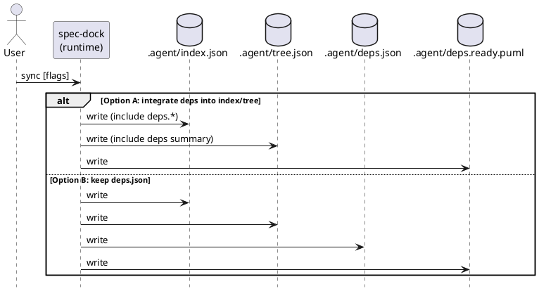

# ADR-00002 deps 派生状態の置き場所: index/tree に統合するか、.agent/deps.json を維持するか

## 結論（Decision） (必須)
- **未決（TBD）**: この ADR はディスカッションのために作成しました。結論はユーザーが最終決定した後に更新します。
- 決定（決定後に記入）:
  - ...

## 背景（Context） (必須)
deps v2 では、Readyボード（矢印なしツリー）を中心に「今できる/できない」を一目で判断できる状態を作ります。  
そのために、`sync` が生成する派生状態（JSON/PlantUML）を **どこに置くか**を決める必要があります。

現状（事実）:
- `sync` は `.agent/index.json` と `.agent/tree.json` を生成します（schema_version=2）。
  - `tree.json` は index のノード形状を複製しつつ、ネスト（initiative→epics→issues）で表示用にしています。
- deps v1 では `.agent/deps.json` と `.agent/deps.puml` / `.agent/deps.todo.puml` を追加生成しています。
  - `sync --force` で deps の preflight が失敗した場合、古い deps 派生物の誤用を防ぐため `.agent/deps*.{json,puml}` を削除します（実装済み）。

ユーザー要望（背景）:
- “新しい管理の仕組み” を増やすより、可能なら **既存の index/tree を richer にして管理したい**。

論点:
- 依存グラフ（canonical issue edges）はサイズが大きくなり得る。
- `sync --force` のとき、stale（古い deps の残存）を絶対に避ける必要がある。

### UML（任意） (任意)

## 選択肢（Options considered） (必須)

### Option A: index/tree に統合（.agent/deps.json は廃止 or 互換のみ）
概要:
- `.agent/index.json` に `deps` セクションを追加して canonical issue 依存（例: `deps.issue_edges`）を保持する。
- `.agent/tree.json` には heavy な依存リストを複製せず、`ready` や blockers summary のみを載せる（ビュー用）。
- `.agent/deps.json` は生成しない（または互換目的で任意生成）。

Pros:
- “見る/使う場所” が一つに寄る（multi-agent が取り回しやすい）。
- `.agent/deps.json` を別途読む/結合する必要が減る。
- ユーザーの「既存の index/tree を richer にしたい」方針に合う。

Cons:
- index/tree のスキーマが変わる（互換性影響）。
- index.json が肥大化しやすい（依存の保持方法の設計が必須）。
- `sync --force` 時の “無効化” を index/tree 内でも表現しないと、stale を防げない。

必須の安全策（Option A 採用時）:
- preflight 失敗（forced）時に `deps: null`（またはフィールド削除）を **必ず書き戻す**。
  - 目的: 「古い deps が index/tree に残る」を防ぐ。
- warnings を index/tree 側にも持てるようにする（例: `warnings: ["deps_preflight_failed"]`）。
- canonical edges は “トップレベルに1回だけ” 保持し、tree へ複製しない（爆発防止）。

### Option B: .agent/deps.json を維持（index/tree は現状維持）
概要:
- deps の SSOT（派生）は `.agent/deps.json` とし、index/tree は現状のまま。
- Readyボード等の PlantUML は deps 生成物として継続生成。

Pros:
- index/tree の互換性を維持できる。
- deps の stale 対策（`--force` で削除）が既に確立している。

Cons:
- “状態が散らばる” ため、利用者が複数ファイルを読む必要がある。
- 「新しい管理を増やしたくない」という要望に反する（ファイルが増える）。

### Option C: ハイブリッド（deps.json 維持 + index/tree に summary も載せる）
概要:
- full は deps.json、summary は index/tree にも載せる。

Pros:
- 便利（人間/エージェントは index/tree だけで “だいたい分かる”）。

Cons:
- 二重管理に見え、矛盾/誤用（stale）が発生しやすい。
- “どっちが正か” の運用説明が必要になる。

## 判断理由（Rationale） (必須)
このADRは「結論未決」です。  
ただし、現時点の暫定推奨は **Option A（統合）** です。

推奨理由（暫定）:
- Readyボード（矢印なしツリー）を中心に運用するなら、tree/index に `ready` が載っていることが最も自然です。
- `.agent/deps.json` を主戦場にすると、「見る場所が増える」問題が残りやすいです。

## 影響（Consequences） (必須)
Positive（良い点）:
- Option A なら、エージェント/人間が参照する JSON が集約され、判断が速い。

Negative / Debt（悪い点 / 将来負債）:
- Option A はスキーマ変更を伴うため、既存利用者がいる場合は周知が必要。

影響範囲（コード/テスト/運用/データ）:
- runtime: `_sync()` の index/tree の schema 拡張、`--force` 時の無効化表現
- docs: `reference_sync.md` / `reference_deps.md` の生成物説明
- tests: `sync --force` の “stale防止” 回帰

移行/ロールバック:
- Option A を採用しつつ、一定期間 `.agent/deps.json` を互換出力として残す案もある（ただし追加コストあり）。

## 参考（References） (任意)
- `spec-deps/current/requirement.md`（Q-002 / AC-001 / AC-010）
- `spec-deps/current/artifacts/deps-best-practice-issue-normalization.md`
- `src/spec_dock/assets/spec_dock/scripts/spec-dock`（`_sync()` / deps preflight と削除ロジック）

