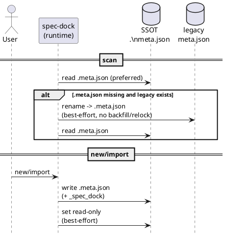

# adr-00002 SSOTメタファイルを dotfile（.meta.json）に統一する

## 結論（Decision） (必須)
- SSOT メタデータのファイル名は **`.meta.json`（dotfile）を正とする**。
  - `spec-dock/initiatives/**/.meta.json` を spec-dock の SSOT として扱う。
  - `spec-dock new/import` は `.meta.json` を生成する。
- 互換性のため、レガシー `meta.json`（旧ファイル名）は best-effort で `.meta.json` に移行（リネーム）する。
  - リネームは **内容（JSONフィールド）を変更しない**。
  - 既存ノードへの後追い `_spec_dock` backfill や read-only 付与は行わない（iss-00012 の非交渉制約を維持）。
  - 同一ノードに `.meta.json` と `meta.json` が共存する場合は、`.meta.json` を正として扱い、`meta.json` は warn して無視/保持する（上書きしない）。
- `_spec_dock` 自己記述と read-only（best-effort）の方針は維持し、`.meta.json` に適用する（adr-00001 の主旨を継承）。

> NOTE: 本 ADR により、adr-00001 の「ファイル名は変更しない」という判断は **Superseded** となる。

## 背景（Context） (必須)
- `.meta.json` は tool-managed な SSOT であり、人間が普段操作する仕様書（`requirement.md` 等）と同階層に置かれる。
- `meta.json`（通常ファイル名）だと、ファイル一覧でユーザー操作ファイルと混ざりやすく、誤操作（開いて編集・補完による自動整形等）の確率が上がる。
- dotfile 化（`.meta.json`）により、視認性の面で “メタデータは特別扱い” を促し、意図しない編集を減らす。

### UML（任意） (任意)

## 選択肢（Options considered） (必須)
- Option A: `meta.json` のまま維持する（現状維持）
  - Pros: 互換性リスク最小、既存コードの変更範囲が小さい
  - Cons: ユーザー操作ファイルと混ざりやすく、誤操作リスクが残る
- Option B: 新規生成のみ `.meta.json`（既存は放置）
  - Pros: 破壊的影響を最小化しつつ新規だけ改善
  - Cons: 既存ノードでは混在が残り、狙い（混ざらない）を満たしにくい
- Option C: `.meta.json` を正とし、レガシー `meta.json` を best-effort で移行（本採用）
  - Pros: 混在を解消しやすく、ユーザー視点のUXを満たす
  - Cons: 実装の変更範囲が広い（scan/new/import/wrapper/docs/tests の更新が必要）

## 判断理由（Rationale） (必須)
- “エージェントの抑止効果は限定的” でも、人間が見る導線では改善効果が高い。
- `.meta.json` は tool-managed であるため、ファイル名の統一は spec-dock 側で一貫して管理できる。
- 互換性は `meta.json` の移行（リネーム）で担保し、運用負荷（手作業移行）を下げる。

## 影響（Consequences） (必須)
- Positive:
  - メタファイルがユーザー操作ファイルと混ざりにくくなり、誤操作リスクが下がる
  - 既存ノードも移行で揃えられる（混在を減らせる）
- Negative / Debt:
  - 変更範囲が広い（runtime scan + wrapper + shipped docs + tests）
  - リネームにより差分（git上のrename）が発生し、PRが大きく見える可能性がある
- 運用上の注意:
  - 外部の独自スクリプト等が `meta.json` を直接参照している場合は壊れる可能性がある（当面は fallback/read を維持して緩和する）

## 参考（References） (任意)
- Issue:
  - https://github.com/chemitaro/spec-dock/issues/12
- Specs:
  - `spec-deps/current/requirement.md`
  - `spec-deps/current/design.md`
  - `spec-deps/current/plan.md`
  - `spec-deps/current/artifacts/meta-json-guardrails-one-pager.md`
