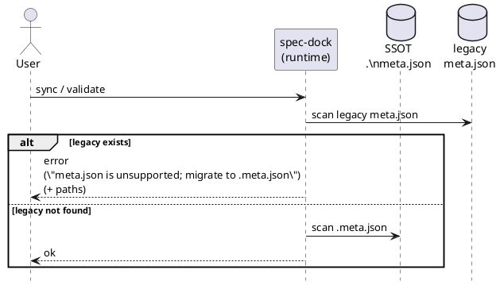

# adr-00003 レガシー meta.json の互換/移行を廃止し .meta.json のみに統一する

## 結論（Decision） (必須)
- SSOT メタデータのファイル名は **`.meta.json` のみをサポート**する。
  - `spec-dock/initiatives/**/.meta.json` を spec-dock の SSOT として扱う。
  - runtime / wrapper / docs / tests から、レガシー `meta.json` の読み取り/移行/互換を削除する。
- `spec-dock sync` / `spec-dock validate` は、`spec-dock/initiatives/**/meta.json`（レガシー）を検出したら **エラーで停止**し、`.meta.json` へ移行が必要である旨と該当パスを提示する。

## 背景（Context） (必須)
- 本プロジェクトはまだ本格稼働しておらず、後方互換性（旧ファイル名 `meta.json` の維持）は要求しない。
- 互換/移行（rename/copy/fallback）を残すと、実装・テスト・ドキュメントが複雑化しやすい。
- “旧 wrapper が `../meta.json` を参照して壊れうる” といった互換性由来の問題は、後方互換を切ることで整理できる。

### UML（任意） (任意)

## 選択肢（Options considered） (必須)
- Option A: 後方互換を維持（`meta.json` を read/fallback する）
  - Pros: 既存 repo / wrapper が壊れにくい
  - Cons: 互換分岐が増え、実装・テスト・運用が複雑化する
- Option B: 移行を実装（`meta.json` → `.meta.json` を rename/copy する）
  - Pros: `.meta.json` への統一を自動化できる
  - Cons: 副作用（ファイル移動）を伴い、互換導線の整理が難しい
- Option C: 後方互換を切る（本採用）
  - Pros: 仕様が単純、テストも単純、予期せぬ副作用が減る
  - Cons: 旧 `meta.json` repo は手動移行が必要（破壊的変更）

## 判断理由（Rationale） (必須)
- 現時点では “互換維持の価値” よりも “仕様と実装の単純性” を優先できる。
- `.meta.json` のみをサポートする方が、コーディングエージェントの誤編集抑止（自己記述 + read-only）という目的に集中できる。

## 影響（Consequences） (必須)
- Positive:
  - runtime/wrapper/docs/tests が単純化し、保守性が上がる
  - 互換性のための副作用（rename/copy）や混在状態の扱いが不要になる
- Negative / Breaking:
  - 旧 `meta.json` のみ存在する repo は `sync/validate` がエラーになる
  - 旧 wrapper（`../meta.json` 前提）は動作しない
- 移行:
  - ユーザーが `meta.json` を `.meta.json` にリネームして解消する（手動対応）

## 参考（References） (任意)
- Issue:
  - https://github.com/chemitaro/spec-dock/issues/12
- Specs:
  - `spec-deps/current/requirement.md`
  - `spec-deps/current/design.md`
  - `spec-deps/current/plan.md`
