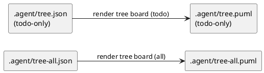
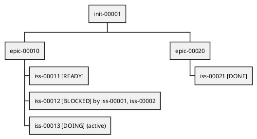

# ADR-00004 Readyボード（矢印なしツリー）の生成物: ファイル名・形式・表示情報

## 結論（Decision） (必須)
- 決定: **Option A**（`tree*.puml` として固定）を採用する。
  - `spec-dock/.agent/tree-all.puml`（all）
  - `spec-dock/.agent/tree.puml`（todo = Done除外）
  - Readyボードは “tree（包含ツリー）に状態ラベルを付けたもの” として扱う。

## 背景（Context） (必須)
Readyボードは「依存矢印を描かない」代わりに、ツリー上で **READY/BLOCKED/DOING/DONE/UNKNOWN** を明示して、  
“次にやれる issue” を一目で見つけることを目的とします。

ただし、運用上は Readyボードは「tree（包含ツリー）に状態ラベルを付けたもの」とほぼ同義であり、  
別名の生成物を増やすより **tree 系の生成物として揃える**方が混乱が少ないです。

この機能を運用で確実に使うためには:
- 生成物の **ファイル名**（観測点）
- PlantUML の **図形式**（WBS/mindmap/dot など）
- 表示する **情報量**（ラベル、色、ブロッカーの出し方）
を固定し、ツール/エージェント/人間の共通言語にする必要があります。

### UML（任意） (任意)

## 選択肢（Options considered） (必須)

### Option A: `tree*.puml` として固定（推奨）
概要:
- Readyボードを tree 表示の成果物として扱い、以下を生成する。
  - `spec-dock/.agent/tree-all.puml`（全体 / all）
  - `spec-dock/.agent/tree.puml`（Done除外 / todo）
- 図形式は `@startwbs` を基本とし、包含ツリー（initiative→epic→issue）をそのまま表現する。

例（イメージ）:

Pros:
- Readyボード＝tree の拡張、という直感に一致する（名称が迷子にならない）。
- `.agent/tree*.json`（all/todo）と対応が取れ、運用の観測点が固定できる。

Cons:
- deps 由来の状態（ready/blocked）であることを docs で明示する必要がある。

### Option B: `ready*.puml` として独立（board専用名）
概要:
- Readyボードを board 専用名として扱い、以下を生成する。
  - `spec-dock/.agent/ready-all.puml`
  - `spec-dock/.agent/ready.puml`（todo）

Pros:
- Ready 目的が名前から明確（board専用）。

Cons:
- tree と “ほぼ同義の図” が別名で増え、観測点が散る可能性がある。

### Option C: 1ファイルのみ（todo-onlyのみ等）に絞る
概要:
- `tree.puml` のみ（todo-only）に絞る、または `tree-all.puml` のみ（all）に絞る、のように生成物を減らす。

Pros:
- 生成物が少なくシンプル。

Cons:
- 「Done を含めた全体を監査したい」ケースと「今やることだけ見たい」ケースの両立が難しい。

## 表示情報（何をラベルに出すか） (必須)
Readyボードは “見ただけで判断できる” ことが最重要なので、ベストプラクティスは次です。

- issue の表示ラベル（必須）:
  - `[DONE]` / `[DOING]` / `[READY]` / `[BLOCKED]` / `[UNKNOWN]`
- blocked の補助情報（任意・上限つき）:
  - `by <top1>, <top2>`（最大2件まで。詳細は `deps check --json` へ）
- epic/initiative の補助情報（任意）:
  - `progress`（open/done/unknown）を括弧で短く表示

## 判断理由（Rationale） (必須)
採用理由:
- Readyボードは tree と同義に扱う方が、運用の観測点が固定され、multi-agent も迷いにくい。
- `.agent/tree*.json`（all/todo）と `.agent/tree*.puml` をペアにすると、JSON と図を行き来しやすい。

## 影響（Consequences） (必須)
Positive（良い点）:
- Ready を探す作業が高速化し、multi-agent の次タスク選定が安定する。

Negative / Debt（悪い点 / 将来負債）:
- 出力ファイルが増える（ただし用途別に分けた方が読みやすい）。

影響範囲（コード/テスト/運用/データ）:
- runtime: `sync` の出力追加（`.agent/*.puml`）
- docs: `reference_sync.md` / `reference_deps.md` の生成物記述
- tests: `sync` 実行で新ファイルが生成されることの回帰

## 参考（References） (任意)
- `spec-deps/current/requirement.md`（Q-004 / AC-006）
- `spec-deps/current/artifacts/deps-best-practice-issue-normalization.md`
