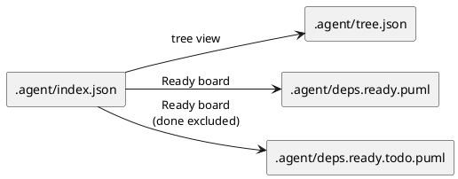
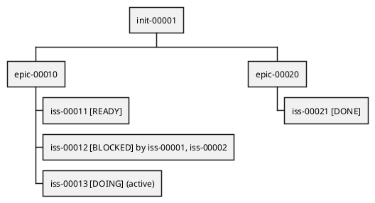

# ADR-00004 Readyボード（矢印なしツリー）の生成物: ファイル名・形式・表示情報

## 結論（Decision） (必須)
- **未決（TBD）**: この ADR はディスカッションのために作成しました。結論はユーザーが最終決定した後に更新します。
- 決定（決定後に記入）:
  - ...

## 背景（Context） (必須)
Readyボードは「依存矢印を描かない」代わりに、ツリー上で **READY/BLOCKED/DOING/DONE/UNKNOWN** を明示して、  
“次にやれる issue” を一目で見つけることを目的とします。

この機能を運用で確実に使うためには:
- 生成物の **ファイル名**（観測点）
- PlantUML の **図形式**（WBS/mindmap/dot など）
- 表示する **情報量**（ラベル、色、ブロッカーの出し方）
を固定し、ツール/エージェント/人間の共通言語にする必要があります。

### UML（任意） (任意)

## 選択肢（Options considered） (必須)

### Option A: `deps.*` 配下として固定（推奨）
概要:
- Readyボードを deps 機能の成果物として扱い、以下を生成する。
  - `spec-dock/.agent/deps.ready.puml`（全体）
  - `spec-dock/.agent/deps.ready.todo.puml`（Done除外）
- 図形式は `@startwbs` を基本とし、包含ツリー（initiative→epic→issue）をそのまま表現する。

例（イメージ）:

Pros:
- deps 機能の出力としてまとまりが良い（既存 `deps.puml` / `deps.todo.puml` と並ぶ）。
- 観測点（パス）が分かりやすく、ドキュメント化しやすい。

Cons:
- “deps の PlantUML は矢印がある” という先入観があると、最初は戸惑う可能性がある。

### Option B: `tree.*` として deps から独立
概要:
- Readyボードを “ツリー表示の拡張” として扱い、以下のような命名にする。
  - `spec-dock/.agent/tree.ready.puml`
  - `spec-dock/.agent/tree.ready.todo.puml`

Pros:
- 「矢印なし=ツリー」という直感に合う。

Cons:
- deps の状態（ready/blocked）を tree 側に寄せるため、概念上の境界がやや曖昧になる（“depsの結果だがtree名”）。

### Option C: 1ファイルのみ（todo-onlyのみ等）に絞る
概要:
- `deps.ready.puml` のみ（Doneも含める）/ もしくは todo-only のみ、のように生成物を減らす。

Pros:
- 生成物が少なくシンプル。

Cons:
- 「Done を含めた全体を監査したい」ケースと「今やることだけ見たい」ケースの両立が難しい。

## 表示情報（何をラベルに出すか） (必須)
Readyボードは “見ただけで判断できる” ことが最重要なので、ベストプラクティスは次です。

- issue の表示ラベル（必須）:
  - `[DONE]` / `[DOING]` / `[READY]` / `[BLOCKED]` / `[UNKNOWN]`
- blocked の補助情報（任意・上限つき）:
  - `by <top1>, <top2>`（最大2件まで。詳細は `deps check --json` へ）
- epic/initiative の補助情報（任意）:
  - `progress`（open/done/unknown）を括弧で短く表示

## 判断理由（Rationale） (必須)
このADRは「結論未決」です。  
ただし、現時点の暫定推奨は **Option A（`deps.ready*.puml`）** です。

推奨理由（暫定）:
- Readyボードは “deps の結果（ready/blocked）” なので、deps 出力としてまとまっている方が運用上迷いにくい。
- `deps.puml`（矢印あり）と `deps.ready.puml`（矢印なし）をペアで扱うと、「順序（DAG）」と「次にやる（Ready）」を行き来しやすい。

## 影響（Consequences） (必須)
Positive（良い点）:
- Ready を探す作業が高速化し、multi-agent の次タスク選定が安定する。

Negative / Debt（悪い点 / 将来負債）:
- 出力ファイルが増える（ただし用途別に分けた方が読みやすい）。

影響範囲（コード/テスト/運用/データ）:
- runtime: `sync` の出力追加（`.agent/*.puml`）
- docs: `reference_sync.md` / `reference_deps.md` の生成物記述
- tests: `sync` 実行で新ファイルが生成されることの回帰

## 参考（References） (任意)
- `spec-deps/current/requirement.md`（Q-004 / AC-006）
- `spec-deps/current/artifacts/deps-best-practice-issue-normalization.md`

