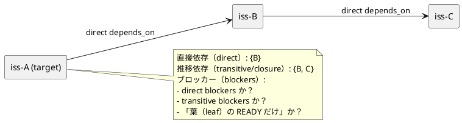

# ADR-00005 index/tree の issue ノードに載せる deps 派生フィールド: 依存リストの粒度（直接/推移/ブロッカー）

## 結論（Decision） (必須)
- **未決（TBD）**: この ADR はディスカッションのために作成しました。結論はユーザーが最終決定した後に更新します。
- 決定（決定後に記入）:
  - ...

## 背景（Context） (必須)
ADR-00002 の決定により、deps の派生状態は `.agent/index.json` / `.agent/tree.json` に統合します。  
その際、issue ノードに “依存の情報” をどこまで載せるか（粒度）を決めないと、multi-agent と人間が判断しづらくなります。

ユーザー要望（確認済み）:
- 依存の入力は `deps.json` に分離して残す。
- `.agent/index.json` / `.agent/tree.json` 上で「その issue が blocked か / 取り組めるか」を判断できるようにしたい。
- index/tree には “依存している issue のリスト” も持ちたい（Done は省略して良い）。
- 直接依存だけでなく、推移（間接）依存も出てくる。どこまで載せるべきか検討したい。

ここでいう “依存” は、shorthand を compile 済みの **canonical issue→issue** の依存（正規化後）です。

### UML（任意） (任意)

## 選択肢（Options considered） (必須)

### Option A: ブロッカーのみ（未完了/unknown の依存 issue）を issue ノードに載せる
概要:
- issue ノードに載せるのは “今 blocked かどうか” と、その根拠となる **blockers の列挙**のみ。
- 依存の詳細（direct/closure）は `deps.issue_edges`（グラフ）から必要に応じて計算する。

Pros:
- 出力が小さく、理解が簡単（Readyボード用途に寄る）。
- Done 依存を省略しやすい（blockers は未完了だけで良い）。

Cons:
- “依存している issue を一覧したい” 需要には弱い（blockers しか残らない）。
- blockers の定義（direct / transitive / leaf）を別途決める必要がある。

### Option B: 直接依存（direct）+ ブロッカーを載せる（推移はグラフから計算）
概要:
- issue ノードに **direct depends_on** と **blockers** を載せる。
- 推移依存（closure）は `deps.issue_edges` から機械計算する（index/tree 側には重複して持たない）。

Pros:
- “依存している issue” を最小コストで保持できる（direct list）。
- 追加情報（closure）が必要なら計算でき、二重管理になりにくい。

Cons:
- closure を “すぐ見たい” 需要には、追加の計算/処理が必要。
- blockers が direct か transitive か（定義）が still 必要。

### Option C: 推移依存（closure）+ ブロッカーを issue ノードに載せる（Done は除外）
概要:
- issue ノードに “依存している issue の全量（closure）” を載せる。
- Done は除外し、現時点で意味のある依存だけを保持する。

Pros:
- index/tree だけ見れば “依存の全体像” が分かる（multi-agent の判断が速い）。

Cons:
- 出力が大きくなりやすい（ただし規模想定は ~100 issue/initiative）。
- closure の再計算・更新の説明が必要（stale/差分の揺れ）。
- 直接依存（direct edge）と混同しやすい（レビューや解釈がズレる）。

### Option D: direct + closure + blockers をすべて載せる（情報過多）
概要:
- すべて載せる（便利だが重い）。

Pros:
- 利用側の計算が要らない。

Cons:
- “何が正か” が分かりづらい（情報過多）。
- 二重管理に見え、運用説明が難しい。

## 判断理由（Rationale） (必須)
このADRは「結論未決」です。  
ただし、現時点の暫定推奨は **Option B（direct + blockers）** です。

暫定推奨理由:
- index/tree は “判断に必要な最小” を載せ、詳細は `deps.issue_edges`（グラフ）から機械計算できる形が、拡張と説明の両方に強い。
- closure は便利だが、出力肥大・差分の揺れ・二重管理の誤解が増えやすい。

## 影響（Consequences） (必須)
Positive（良い点）:
- issue ノードで「blocked か」「何に依存しているか」を一目で扱いやすくなる。

Negative / Debt（悪い点 / 将来負債）:
- blockers の定義（direct/transitive/leaf）を別途固定しないと、表示/説明がブレる。

影響範囲（コード/テスト/運用/データ）:
- runtime: `.agent/index.json` / `.agent/tree.json` のスキーマ拡張
- docs: `reference_sync.md`（出力の説明）、`reference_deps.md`（判定の説明）
- tests: JSON schema 回帰、Readyボード生成の回帰

Follow-ups:
- blockers の定義（direct/transitive/leaf）を別ADRに分ける案もある（必要なら）。

## 参考（References） (任意)
- `spec-deps/current/requirement.md`（Q-005）
- `spec-deps/current/adrs/adr-00002-derived-state-integration.md`
