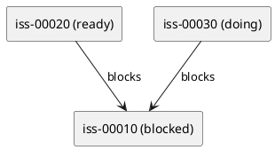

# ADR-00007 issue-only 依存可視化（PlantUML）: 図の形式・矢印方向・生成物

## 結論（Decision） (必須)
- **未決（TBD）**: この ADR はディスカッションのために作成しました。結論はユーザーが最終決定した後に更新します。
- 決定（決定後に記入）:
  - ...

## 背景（Context） (必須)
ユーザーが “本当に欲しいもの” は、initiative/epic の包含ツリーではなく **issue の依存関係（順序）**の可視化です。

期待する見え方（ユーザー要望）:
- initiative/epic は **完全に除外**し、issue のみで依存関係を描く。
- 形は「綺麗な階層ツリー」ではなく、共有依存や分岐があるため基本は **グラフ**（DAG 近似）。
- 図を見れば、
  - **どの issue が “いま実施できる” か**
  - **どの issue が blocked で、何がブロッカーか**
  が視覚的に理解できること。

論点:
- PlantUML のレイアウトは万能ではないため、「全体図」と「ある issue の上流（ブロッカー）に絞った図」を分けるべきか。
- 矢印方向（depends_on の向き）をどう定義すると直感に合うか。

### UML（任意） (任意)

## 選択肢（Options considered） (必須)

### Option A: issue-only の “全体グラフ” を 1枚生成（todo/all）
概要:
- `sync` が issue-only の依存グラフを生成する（Done を除いた todo をデフォルト、all は監査用）。
- ノード色で `[READY/BLOCKED/DOING/DONE/UNKNOWN]` を表現する。

Pros:
- 1枚で全体を俯瞰できる（次にやる候補が見つけやすい）。

Cons:
- issue が多いと毛玉化しやすい（レンダ時間/視認性）。

### Option B: “ある issue の上流（ブロッカー）だけ” のフォーカス図を生成（コマンド/派生物）
概要:
- 例: `deps graph <issue>` で、対象 issue の上流 closure を抽出して PlantUML を出す。

Pros:
- 1枚が読みやすく、blocked 理由の理解に直結する。

Cons:
- “次にやれる issue を探す” 俯瞰用途には別のビュー（tree/ready）が必要。

### Option C: Option A+B を両方用意（推奨候補）
概要:
- 俯瞰（A）と理解（B）で用途を分ける。

Pros:
- 運用事故が減る（毛玉化してもフォーカス図で回避できる）。

Cons:
- 生成物/コマンドが増える（運用説明が必要）。

## 生成物案（ファイル名のたたき台） (必須)
> ADR-00006（all/todo）に合わせ、todo をデフォルト名、all を `-all` suffix とする案。

- 全体（all）:
  - `spec-dock/.agent/deps-issues-all.puml`
- 作業用（todo = Done 除外）:
  - `spec-dock/.agent/deps-issues.puml`
- （任意）フォーカス:
  - `spec-dock/.agent/deps-issues-focus-<iss-id>.puml`（例: `...-iss-00010.puml`）

## 判断理由（Rationale） (必須)
このADRは「結論未決」です。  
ただし、現時点の暫定推奨は **Option C（全体 + フォーカス）** です。

## 影響（Consequences） (必須)
- PlantUML の見やすさは完全には保証できないため、JSON（index/tree）の “機械可読” を主、図は補助とする設計が安全。
- `sync --force`（deps preflight 失敗）時は、誤用防止のために issue-only 図も “最新が無い” 状態を観測可能にする必要がある。

## 参考（References） (任意)
- `spec-deps/current/requirement.md`（AC/観測点）
- `spec-deps/current/adrs/adr-00004-ready-board-artifact-naming.md`（tree 側の図）
- `spec-deps/current/adrs/adr-00006-sync-artifacts-all-vs-todo.md`（all/todo の命名）
