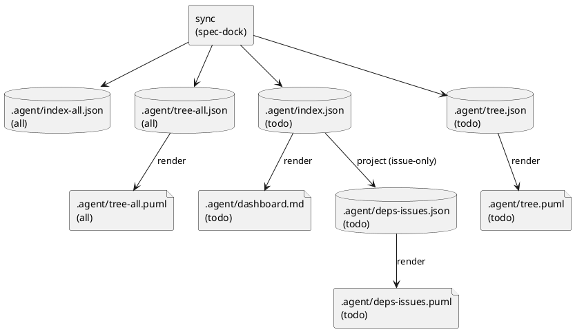

# ADR-00008 sync の出力成果物: dashboard.md の採用 / issue-only deps を todo-only に固定（focus 廃止）

## 結論（Decision） (必須)
以下を採用する。

- `sync` は `.agent/dashboard.md`（todo-only）を生成する
  - 目的: 人間/エージェントが “次にやれる / 詰まり / unknown” を素早く把握できる導線にする
- `sync` は issue-only の依存グラフを **todo-only** として生成する（Done 除外）
  - 構造化（エージェント向け）: `spec-dock/.agent/deps-issues.json`
  - 可視化（人間向け）: `spec-dock/.agent/deps-issues.puml`
- `.agent/focus/**`（例: `spec-dock/.agent/focus/deps-issues-<iss-id>.puml`）の “フォーカス図” は **生成しない**
- コーディングエージェントは **JSON を主に読む**（PlantUML をパースして仕様判断しない）
  - 判断に必要な情報は `index*.json`（および投影である `deps-issues.json`）で完結させる

### UML（任意） (任意)

## 背景（Context） (必須)
- 本 Issue の目的は「次にやれる issue / ブロッカー」を **迷わず**判断できること。
- PlantUML は人間にとって有効だが、レイアウトや表現の揺れにより **機械処理の基盤には不向き**。
- 依存関係の視覚化は重要だが、フォーカス図を常設の生成物として増やすと:
  - 生成物の種類が増えて運用が複雑化する
  - stale（古い図の誤用）/観測点の迷子が起きやすい
- 一方で、人間向けには “overview” が必要であり、`dashboard.md` が導線として有効。

## 選択肢（Options considered） (必須)

### Option A: 全体（todo/all）+ フォーカス（per issue）の図を生成する
- 概要:
  - `deps-issues(-all).puml` と `focus/deps-issues-<iss-id>.puml` を生成する
- Pros:
  - blocked 理由を図だけで追いやすい
- Cons:
  - 生成物が増え、運用が複雑化（stale/迷子リスク）
  - フォーカスは “対象 issue を指定して初めて意味がある” ため、常設生成物としてはコストが高い
- 棄却理由:
  - 本段階では “観測点を増やさない” ことを優先する

### Option B: issue-only は todo-only の全体図のみ + dashboard を生成（採用）
- 概要:
  - `deps-issues.json` / `deps-issues.puml`（todo-only）
  - `dashboard.md`（todo-only）
- Pros:
  - 生成物が少なく、観測点が固定される
  - エージェント（JSON）と人間（Puml/Markdown）の双方に導線ができる
- Cons:
  - “特定 issue の上流だけ” を図で見たい場合は、別手段が必要

### Option C: PlantUML のみ生成（JSON は生成しない）
- 概要:
  - 依存関係の成果物は `*.puml` のみに寄せる
- Pros:
  - ファイル数が少ない
- Cons:
  - エージェントが安定して判断できない（パース困難/将来変更に弱い）
- 棄却理由:
  - multi-agent 運用の判断材料として JSON が必要

## 判断理由（Rationale） (必須)
- “次にやれる” の判断は、エージェントが自動で行える必要があり、**JSON が主**であるべき。
- その上で人間が理解しやすい可視化（PlantUML）と、導線（dashboard）を **最小追加**で提供する。
- フォーカス図は有用だが、常設成果物としては複雑化のデメリットが勝つため、現時点では採用しない。

## 影響（Consequences） (必須)
Positive（良い点）:
- 人間/エージェントが同じ観測点（`.agent/index.json` と `deps-issues.json`）で判断でき、迷子が減る。
- 図の毛玉化は “Readyボード（矢印なし）” と “issue-only 依存グラフ” の二枚看板で緩和できる。

Negative / Debt（悪い点 / 将来負債）:
- `dashboard.md` のフォーマット（最低限の項目/表示粒度）を固定する必要がある。
- “特定 issue の上流だけ見たい” 欲求は CLI 出力（`deps check --json` 等）に寄せる前提になる。

影響範囲（コード/テスト/運用/データ）:
- runtime: `sync` の生成物追加/変更（`deps-issues.json`/`.puml`/`dashboard.md`）
- docs/spec: 生成物一覧、受け入れ条件、運用手順の更新
- tests: `sync` の生成物と整合の回帰テスト追加/更新

Follow-ups（追加の Epic/Issue/ADR）:
- `deps-issues.json` のスキーマ（最低限の互換性）を設計書で確定する
- `dashboard.md` の項目（ready/blocked/unknown の表示）を設計書で確定する

## 参考（References） (任意)
- `spec-deps/current/requirement.md`
- `spec-deps/current/artifacts/output-artifacts-proposal.md`
- `spec-deps/current/adrs/adr-00007-issue-only-deps-visualization.md`
