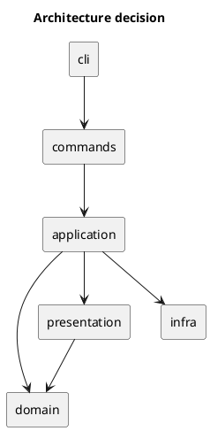
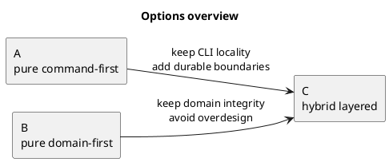
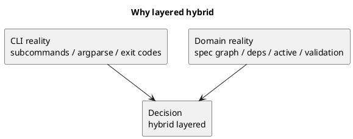
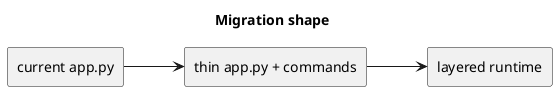
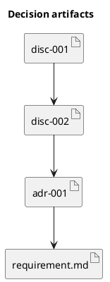

# adr-001 runtime cli は hybrid layered architecture を採用する

## 結論（Decision） (必須)
- **決定**: Issue #25 における runtime CLI 再構成では、`commands / application / domain / infra / presentation` の **hybrid layered architecture** を採用する。
- user-facing な入口は command を維持する。
- ただし第一級の設計境界は command 単位ではなく layer 単位に置く。
- `app.py` は CLI entrypoint と dispatch に縮小し、workflow orchestration は `application`、不変条件は `domain`、外部接続は `infra`、成果物描画は `presentation` に分離する。

## 背景（Context） (必須)
- [app.py](/srv/mount/spec-dock/src/spec_dock/assets/spec_dock/scripts/spec_dock_runtime/app.py) には `new/import/active/sync/deps/validate` の command 実装に加え、tree scan、deps 計算、active 解決、Git/GitHub 呼び出し、JSON/PUML/Markdown 出力が同居している。
- `app.py` を command 単位にだけ分割すると、共通核が command ごとに再埋め込みされ、別ファイルの再モノリスになりやすい。
- 一方、pure domain-first を最初から導入すると、Issue #25 の現実的なスコープに対して過設計になり、`app.py` の薄化と `tests/test_cli.py` の整理より抽象化が主目的になりやすい。
- ユーザーは「レイヤー構造として command / application / domain を主軸にした案」を採用する意向を明示した。

### UML（任意） (任意)

## 選択肢（Options considered） (必須)
- Option A:
  - 概要:
    - pure command-first。top-level を command 群に置き、共有ロジックは都度抽出する。
  - Pros:
    - 現状の関数境界に沿って移行しやすい。
    - CLI の入口はわかりやすい。
  - Cons:
    - `_scan_nodes` `deps` `active` などの共通核が再重複しやすい。
    - `sync` や `active` が別ファイルの god-module になりやすい。
  - 棄却理由（棄却する場合）:
    - 第一級の設計境界としては弱く、長期保守性の改善が不十分。
- Option B:
  - 概要:
    - pure domain-first。top-level を domain 中心に置き、command は薄い adapter とする。
  - Pros:
    - 理論上は最も整った rule 中心設計にしやすい。
    - 再利用性とテスト容易性は高い。
  - Cons:
    - 現行 CLI workflow 中心の実装には重い。
    - Issue #25 の範囲で導入コストが高く、過設計になりやすい。
  - 棄却理由（棄却する場合）:
    - 現時点の課題解決に対して初手が重すぎる。
- Option C:
  - 概要:
    - hybrid layered。入口は command を維持しつつ、設計境界を `commands / application / domain / infra / presentation` に置く。
  - Pros:
    - CLI の現実と domain の現実を両立できる。
    - `app.py` の薄化と shared core の安定化を同時に進められる。
    - 依存方向を固定しやすい。
  - Cons:
    - 命名と責務を曖昧にすると、単に階層が増えるだけになる。
    - `application` を飛ばすと逆に command 側が再肥大化する。
  - 棄却理由（棄却する場合）:
    - 該当なし。採用。

### UML（任意） (任意)

## 判断理由（Rationale） (必須)
- runtime CLI の中心問題は「ファイル数」ではなく「責務境界の欠如」である。
- user-facing な構造は subcommand ベースなので、command は残す必要がある。
- しかし実際の rule は `spec graph` に属し、`Node / ids / deps / active / validation / status derivation` は command を跨いで共有される。
- したがって、command を入口として残しつつ、workflow を `application` に、rule を `domain` に、外界接続を `infra` に、描画を `presentation` に分けるのが最も整合的である。
- この構成は shipped asset である stdlib-heavy Python CLI にも適しており、過度な DDD/hexagonal 導入より軽量で現実的である。

### UML（任意） (任意)

## 影響（Consequences） (必須)
- Positive（良い点）:
  - `app.py` を薄い entrypoint に縮小できる。
  - `sync` `active` `deps` 周辺の共通核を durable な層へ寄せられる。
  - テストを CLI 契約 / use case / domain rule / renderer に再編しやすくなる。
- Negative / Debt（悪い点 / 将来負債）:
  - 初期段階では layer 命名と責務分担の調整コストがかかる。
  - `application` を中途半端に設計すると、単なる pass-through 層になる。
- 影響範囲（コード/テスト/運用/データ）:
  - runtime asset code
  - runtime CLI tests
  - scaffold 更新時の shipped asset 挙動
- 移行/ロールバック:
  - 移行中は `app.py` に薄い互換ラッパーを残し、dispatcher の import 差し替えだけで旧経路へ戻せるようにする。
  - まずは `cli/commands` の骨格を導入し、順次 `application/domain/infra/presentation` へ寄せる段階移行とする。
- Follow-ups（追加の Epic/Issue/ADR）:
  - requirement.md で layer 導入範囲を確定する。
  - design.md で現行関数の layer 帰属と移行順序を確定する。

### UML（任意） (任意)

## 参考（References） (任意)
- 関連仕様（requirement/design/plan/report）:
  - [001-disc-runtime-cli-refactor-analysis.md](/srv/mount/spec-dock/spec-deps/current/discussions/001-disc-runtime-cli-refactor-analysis.md)
  - [002-disc-runtime-cli-architecture-v2.md](/srv/mount/spec-dock/spec-deps/current/discussions/002-disc-runtime-cli-architecture-v2.md)
  - [requirement.md](/srv/mount/spec-dock/spec-deps/current/requirement.md)
- PR/実装:
  - 該当なし
- 外部資料:
  - consultant / repo_analyst synthesis in this session

### UML（任意） (任意)

