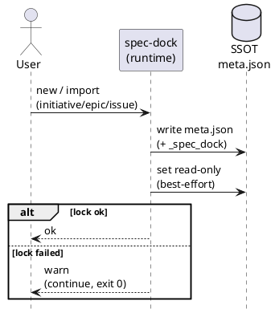

# meta.json Guardrails（Issue #12）— One Pager

## 1. 背景 / なぜ必要か
- `spec-dock/initiatives/**/meta.json` は spec-dock の **SSOT**（Source of Truth）。
- Codex CLI / Claude Code などのコーディングエージェントが `meta.json` を “うっかり” 編集すると、ツリー整合性が壊れてバグの温床になる。

## 2. 目的（To-Be）
- `meta.json` を **うっかり編集できない/しにくい** 状態にして、ローカルでの事故率を下げる。
- 「完全な編集禁止」は狙わない（best-effort の予防策）。

## 3. スコープ（今回やる / やらない）
- 対象:
  - `spec-dock new {initiative,epic,issue}` / `spec-dock import {initiative,epic,issue}` で **新規生成**される `meta.json`
- 対象外（やらない）:
  - CI / CODEOWNERS / pre-commit 等の “混入防止（マージ防壁）”
  - 既存ノードの `meta.json` への後追い適用（マイグレーション）
  - `meta unlock/lock` のような専用コマンド追加（必要なら別 Issue）
  - `meta.json` のファイル名変更（例: dotfile 化 / `dontedit` を含む名前への変更）

## 4. 具体施策（今回の2本柱）
### 施策A: JSON内の自己記述（tool-managed マーカー）
- `meta.json` に `_spec_dock` を追加し、最低限この形に固定する:
  - `_spec_dock.managed = true`
  - `_spec_dock.do_not_edit = true`
  - `_spec_dock.edit_via = "spec-dock"`
- 目的:
  - JSON はコメント不可なので、**自己記述で「これは tool-managed」** を明示してエージェント/人間に伝える。

### 施策B: `meta.json` を read-only 化（best-effort）
- `meta.json` 生成直後に read-only 化を試行する（例: POSIX なら `chmod a-w` 相当）。
- 失敗時の扱い:
  - **warn を出して継続（exit code 0）**
  - warn prefix は `spec-dock: (warn)` を維持する

## 5. どう動くか（フロー）

## 6. 受け入れの要点（観測）
- `new/import` で生成された `meta.json` が `_spec_dock` 最小スキーマを満たす。
- POSIX では write bit が外れている（成功時）。
- read-only 化が失敗した場合のみ warn を出す（exit code 0）。

## 7. 運用メモ（正当な編集が必要になった場合）
- 今回は “公式の解除コマンド” を追加しないため、必要なら手動で write 可能に戻す（例: `chmod u+w meta.json`）。
