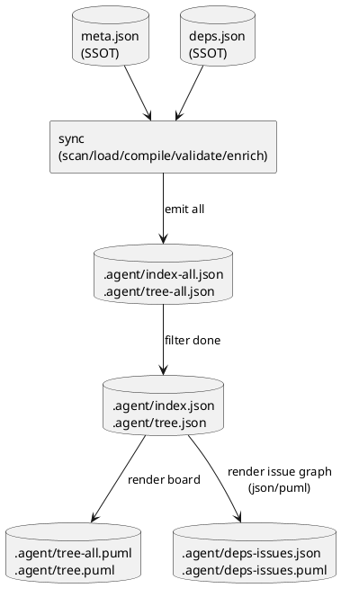

# deps v2: 出力（生成物）ファイル設計案 — file list / naming / keep-or-drop（discussion）

## 1. 目的
人間とコーディングエージェント（Codex CLI 等）が、追加の探索や推測なしに次を判断できる生成物セットを定義する。

- 今なにができるか（runnable/ready）
- 何がブロッキングか（blockers）
- どの順番で進めるべきか（依存順序の把握）
- その判断の根拠がどのファイルにあるか（観測点の固定）

## 2. 設計原則（迷わないためのルール）
### 2.1 “見る場所” を固定する
- 派生状態の主観測点（派生SSOT）は **`spec-dock/.agent/index*.json`** に固定する。
- `tree*.json` / `deps-issues.json` / `*.puml` / `dashboard.md` は **index からのビュー（投影）**に限定する（追加情報は持たせない）。

### 2.2 `todo` をデフォルト、`all` は `-all`
- デフォルト（suffixなし）を「作業用（todo = Done除外）」にする。
- 監査用（全件）を `-all` とする。
  - 例: `index.json`（todo） / `index-all.json`（all）

### 2.3 投影（projection）はハイフンで表す
- 例: `deps-issues` = issue-only の依存グラフ

### 2.4 `deps.json`（入力）と紛らわしい派生名を避ける
- v1 の `.agent/deps.json` は “deps.json（入力）” と衝突して混乱を招くため、v2 では廃止/非推奨に寄せる。

### 2.5 同期の一貫性（取り違え防止）
すべての生成物に共通で以下を入れる（機械検出できるようにする）:
- `generated_at`
- `run_id`（1回の sync を一意に識別）
- `inputs_fingerprint`（deps.json + meta.json + GitHub enrich の有無/gh-limit 等）

### 2.6 コーディングエージェントは JSON を主に読む（PlantUML をパースしない）
- **Codex CLI にとって最も読み取りやすい形式は JSON**（構造が安定・決定的・機械処理が容易）である。
- PlantUML は「人間の視覚化」用途に寄せ、**エージェントが仕様としてパースする前提にしない**（表現の揺れ/レイアウト依存/将来変更の影響が大きい）。
- したがって、依存グラフの “判断に必要な情報” は `index*.json`（およびその投影）で完結させる。

## 3. 出力ファイル一覧（提案）
凡例:
- MUST = 生成必須（運用の観測点）
- SHOULD = あると運用が大幅に楽（推奨）
- MAY = 任意（オンデマンド等）
- DEPRECATE = v2 で廃止候補

| Keep | 生成物（提案パス） | 形式 | スコープ | 生成 | 主な利用者 | 役割 |
|---|---|---|---|---|---|---|
| MUST | `spec-dock/.agent/index.json` | JSON | todo | `sync` | agent/human | **派生の主観測点**（フラット索引＋deps派生＋warnings） |
| MUST | `spec-dock/.agent/index-all.json` | JSON | all | `sync` | agent/human | 監査・説明責任用の全件スナップショット |
| MUST | `spec-dock/.agent/tree.json` | JSON | todo | `sync` | human/agent | `index.json` の表示用ビュー（包含ツリー） |
| MUST | `spec-dock/.agent/tree-all.json` | JSON | all | `sync` | human/agent | all 版ツリー |
| MUST | `spec-dock/.agent/active.json` | JSON | n/a | `active set` / `sync` | agent/human | 現在の作業点（ポインタ） |
| MUST | `spec-dock/.agent/tree.puml` | PlantUML | todo | `sync` | human | Readyボード（矢印なし tree + 状態表示） |
| MUST | `spec-dock/.agent/tree-all.puml` | PlantUML | all | `sync` | human | all 版 Readyボード |
| MUST | `spec-dock/.agent/deps-issues.json` | JSON | todo | `sync` | agent/human | **issue-only 依存グラフ（投影）**（`index.json` から issue のみ抽出したグラフ: edges + closure + ready/blockers） |
| MUST | `spec-dock/.agent/deps-issues.puml` | PlantUML | todo | `sync` | human | **issue-only 依存グラフ（可視化）**（完了済み除外の俯瞰） |
| MUST | `spec-dock/.agent/dashboard.md` | Markdown | todo | `sync` | human/agent | “次にやれる/詰まり/unknown” の要約（indexから生成） |

補足（ユーザー要望反映）:
- issue-only 依存グラフは **todo のみ**を生成する（all は生成しない）。必要なら `index-all.json` から投影で再構築できる。

### v1 生成物の扱い（v2 で落とす/置き換える候補）
| Keep | 生成物 | 理由 |
|---|---|---|
| DEPRECATE | `spec-dock/.agent/deps.json` | 入力 `deps.json` と紛らわしい / 派生SSOTが増える |
| DEPRECATE | `spec-dock/.agent/deps.puml` / `spec-dock/.agent/deps.todo.puml` | 包含と依存が混ざりやすい / v2は issue-only に分離する |

## 4. `index*.json` に載せるべき情報（agent が “迷わず判断” するため）
最小でも issue ノードに以下を持たせる（詳細フィールド名は design で確定）:
- `status`（open/done/unknown）: GitHub enrich or cached snapshot
- `ready`（bool）: deps による着手可否（unknown は false 扱い）
- `deps.depends_on`（list）: **推移依存（closure）**（Done除外）…決定済み（ADR-00005）
- `deps.blockers_summary`（短い文字列 or top N）: human/表示向け
- `warnings`（list）: `gh_fetch_failed`, `gh_index_incomplete`, `deps_preflight_failed` 等

加えて、indexトップレベルに direct edges を 1回だけ保持:
- `deps.issue_edges`（canonical direct issue edges）
- （任意）`deps.edge_provenance`（どの `deps.json` / ref が生んだか）

エージェント運用の推奨:
- Codex CLI は **`index.json`（todo）を第一に読む**（必要な判断材料がすべて入る前提）。
- さらに単純化したい場合のみ、`deps-issues.json`（issue-only 投影）を読む（`index.json` を読むよりフィルタが不要）。
- PlantUML（`*.puml`）は人間の補助として扱い、エージェントのロジック判断には使わない。

## 5. stale（古い生成物の誤用）を防ぐルール
- deps preflight が失敗した場合:
  - `index/tree` は更新できても、deps 派生は **無効**になる
  - 無効状態は `deps_valid=false`（例）等で **index/tree に明示**する
  - `*.puml` は「削除」か「無効プレースホルダで上書き」のどちらかに統一（旧内容を残さない）

## 6. 生成の流れ（実装イメージ）

## 7. 次の議論ポイント（この資料のゴール）
（決定済み）
- focus 図（`spec-dock/.agent/focus/**`）は出力しない
- `dashboard.md` を採用する
- issue-only の依存は `deps-issues.json`（構造化）と `deps-issues.puml`（可視化）を採用する

（残りの議論ポイント）
- `deps-issues.json` のスキーマ詳細（edge の向き、id=spec id/GitHub番号の両方を載せるか、provenance まで載せるか）
- `dashboard.md` の中身（最低限の項目と表示粒度）
