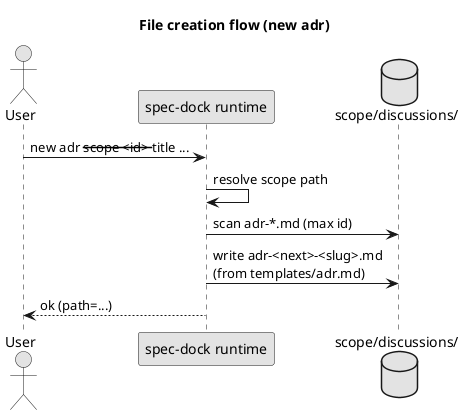
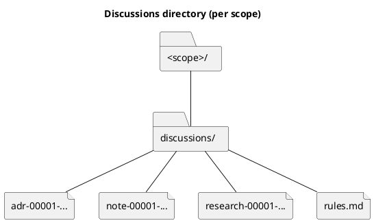
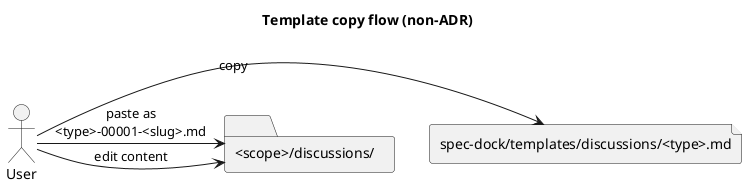
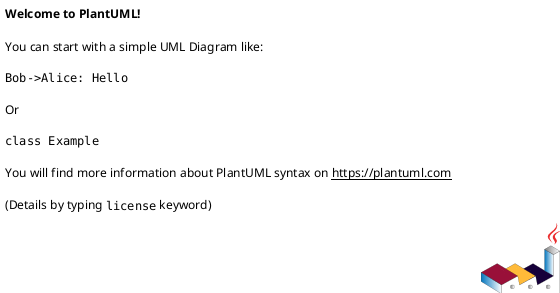

# iss-00014 ディスカッション資料の格納先を discussions/ に統一（adrs/artifacts の統合） — 設計（HOW）

## 目的・制約（要件から転記・圧縮） (必須)
- 目的: `adrs/` + `artifacts/` を `discussions/` に統合し、運用と導線を単純化する
- MUST:
  - 新規生成テンプレートは `discussions/` のみを作る
  - `discussions/` は `rules.md` を必ず含む（空ディレクトリにしない）
  - `spec-dock new adr` は `discussions/` に出力する
  - `discussions/` 配下のファイルは「種類（prefix）+ 連番」で運用する（`adr-00001-...`, `note-00001-...`）
  - テンプレは 1つのテンプレディレクトリ（複数ファイル）に集約し、type ごとのテンプレをコピー運用する旨を `rules.md` に明記する
  - `discussions/` 配下にスクリプト（`new-adr` 等）を置かない（ラッパ廃止）
- MUST NOT:
  - トップレベルの用途別ディレクトリを増やさない（`discussions/` で固定）
  - 後方互換性のための併走サポート・自動移行・レガシー走査を入れない
- 非交渉制約:
  - ADR の採番（`adr-00001-...`）は維持
- 前提:
  - `discussions/` 内の分類は「ファイル名規約」と「frontmatter」のどちらか/併用で成立させる

---

## 既存実装/規約の調査結果（As-Is / 99.9%理解） (必須)
- 参照した規約/実装（根拠）:
  - `src/spec_dock/assets/spec_dock/templates/README.md`: テンプレの出力先マッピング（`adr.md` → `<scope>/adrs/...`）
  - `src/spec_dock/assets/spec_dock/templates/{initiative,epic,issue}/`: 各スコープ配下に `adrs/`, `artifacts/` が存在
  - `src/spec_dock/assets/spec_dock/templates/adr.md`: ADR テンプレ（frontmatter と構成）
  - `src/spec_dock/assets/spec_dock/scripts/spec_dock_runtime/app.py`:
    - `_new_adr`: `scope.path / "adrs"` に出力
    - `_next_id`: `initiatives_root.rglob("adrs/adr-*.md")` で ADR の最大値を走査
- 観測した現状（事実）:
  - `artifacts/` はユーザー運用（テンプレ `_template.md` のコピー）で、ランタイムに強い依存はない
  - ADR は `spec-dock new adr` によって生成され、ランタイムの走査対象になっている
- 採用するパターン（命名/責務/例外/DI/テストなど）:
  - 生成物は小文字ディレクトリ/ファイル名（既存テンプレの規約に合わせる）
  - 後方互換は維持しない（`adrs/` / `artifacts/` のレガシーはサポートしない）
- 採用しない/変更しない（理由）:
  - `discussions/` を type ごとのサブディレクトリに分割（「1ディレクトリ」要望に反する）
- 影響範囲（呼び出し元/関連コンポーネント）:
  - テンプレ: `src/spec_dock/assets/spec_dock/templates/**`
  - ランタイム: `src/spec_dock/assets/spec_dock/scripts/spec_dock_runtime/app.py`
  - ドキュメント/サンプルツリー: `docs/discussion-sheets/**`, `spec-deps/**`（記述更新が必要になる可能性）

## 主要フロー（テキスト：AC単位で短く） (任意)
- Flow for AC-001（新規スコープ作成）:
  1) `new {initiative,epic,issue}` がテンプレをコピー
  2) `discussions/` が生成される（`adrs/`, `artifacts/` は生成しない）
- Flow for AC-002（ADR 作成）:
  1) `new adr` がスコープの `discussions/` を解決
  2) `adr-xxxxx-<slug>.md` を作成（採番は既存走査ロジックを流用）

### UML（任意） (任意)


## データ・バリデーション（必要最小限） (任意)
- 追加データは無し（既存のファイル走査/採番のみ変更）
- バリデーション:
  - `discussions/` のディレクトリ名は固定
  - ADR のファイル名は `adr-*.md` を維持
  - 非ADRのファイル名は `<type>-00001-<slug>.md`（typeごとの連番）を推奨

### UML（任意） (任意)


## 判断材料/トレードオフ（Decision / Trade-offs） (任意)
- 論点: `discussions/` 内の分類をどう担保するか
  - 選択肢A: ファイル名 prefix（`adr-`, `note-`, `research-`, `log-`）で識別（主ルール）
    - Pros: 検索性が高い、ツール側で扱いやすい、混在でも破綻しにくい
    - Cons: 命名規約の教育が必要
  - 選択肢B: frontmatter `種別:` を必須化（主ルールにする）
    - Pros: ドキュメント単体で完結
    - Cons: 記入漏れが起きると分類不能、強制するほど運用負荷が上がる
  - 選択肢C: サブディレクトリで分類（`discussions/adr/`, `discussions/research/`）
    - Pros: 直感的
    - Cons: 「トップレベル1ディレクトリ」要望に反する
  - 決定（推奨）: A（prefix を主）+ frontmatter は “任意〜推奨” として補助的に使う
  - 理由: 1ディレクトリ制約と探索性の両立。将来の機械集計余地も残せる。

## インターフェース契約（ここで固定） (任意)
### API（ある場合）
- N/A（HTTP API は無し。CLI を契約として扱う）

### CLI（ユーザー導線）
- CLI-001: `spec-dock new adr --{initiative|epic|issue} <id> --title "<title>" [--slug <slug>] [--id <adr-id>]`
  - Output: `<scope>/discussions/adr-xxxxx-<slug>.md`
  - Notes:
    - 採番/重複チェックは `discussions/adr-*.md` を走査（後方互換なし）
- CLI-002（任意）: `spec-dock new doc --{initiative|epic|issue} <id> --type {note|research} --title "<title>" [--slug <slug>]`
  - Output: `<scope>/discussions/<type>-00001-<slug>.md`
  - Notes:
    - 非ADRも連番に統一する（typeごとに `00001` から採番）
    - テンプレは `spec-dock/templates/discussions/<type>.md` を用意し、type で選択して生成する（無ければ `note.md` にフォールバック）

### 関数・クラス境界（重要なものだけ）
- IF-001: `spec_dock_runtime.app::_new_adr(...)`
  - Input: scope_id, title, slug, (optional) node_id
  - Output: `<scope>/discussions/adr-...md`
  - Errors/Exceptions: スコープ不存在、重複 id、slug 不正
- IF-002: `spec_dock_runtime.app::_next_id(..., prefix="adr")`
  - Input: specdock_dir, local
  - Output: 次の ADR id（走査パスは `discussions/adr-*.md`）
- IF-003（任意）: `spec_dock_runtime.app::_new_doc(...)`（新設する場合）
  - Input: scope_id, type(note/research), title, slug
  - Output: `<scope>/discussions/<type>-00001-<slug>.md`

### UML（任意） (任意)


### クラス/インターフェース詳細設計（主要なもの） (任意)
> この Issue を “単独の作業単位” として完結させるために、必要な範囲だけ詳細化する。

- Class: `<ClassName>`
  - Responsibility（責務）:
    - ...
  - Public methods（公開メソッド）:
    - `method(arg: Type) -> Return`
  - Invariants（不変条件）:
    - ...
  - Collaboration（協調関係）:
    - `<OtherClass>`（理由: ...）
- Interface / Protocol: `<InterfaceName>`
  - Contract（契約）:
    - ...
  - 実装候補:
    - `<ImplClass>`

#### UML（任意） (任意)


### 例外/エラー契約（重要なものだけ） (任意)
- ERR-001: <エラー名/コード>
  - 発生条件:
    - ...
  - 呼び出し元への返し方（例: 例外/戻り値/HTTP）:
    - ...
  - ログ/監視:
    - ...

## 変更計画（ファイルパス単位） (必須)
- 追加（Add）:
  - `src/spec_dock/assets/spec_dock/templates/{initiative,epic,issue}/discussions/rules.md`:
    - 最小ルール（分類/命名/ADR昇格基準/テンプレの場所）
  - `src/spec_dock/assets/spec_dock/templates/discussions/{note,disc,research}.md`:
    - `discussions/` 用テンプレ（type ごと / 最小セット）
- 変更（Modify）:
  - `src/spec_dock/assets/spec_dock/templates/README.md`: 出力先マッピング（`adrs/`/`artifacts/` → `discussions/`）
  - `src/spec_dock/assets/spec_dock/templates/{initiative,epic,issue}/`:
    - `adrs/`, `artifacts/` を `discussions/` に置換
  - `src/spec_dock/assets/spec_dock/scripts/spec_dock_runtime/app.py`:
    - `_new_adr`: `scope.path / "adrs"` → `scope.path / "discussions"`
    - `_next_id`: `rglob("adrs/adr-*.md")` → `rglob("discussions/adr-*.md")`
    - （任意）`new doc` の追加（共通テンプレ + typeごとの連番採番）
- 削除（Delete）:
  - `src/spec_dock/assets/spec_dock/templates/{initiative,epic,issue}/{adrs,artifacts}/`（新規テンプレからは削除）
- 移動/リネーム（Move/Rename）:
  - `src/spec_dock/assets/spec_dock/templates/adr.md` → `src/spec_dock/assets/spec_dock/templates/discussions/adr.md`
- 参照（Read only / context）:
  - `docs/discussion-sheets/01_tree_root_location.md`: v2 ツリー例に `adrs/` が含まれるため追随が必要
  - `spec-deps/README.md`: v1 の運用説明（`adrs/`, `artifacts/` 記述）

## マッピング（要件 → 設計） (必須)
- AC-001 → テンプレ差し替え（`src/spec_dock/assets/spec_dock/templates/**`）
- AC-002 → `_new_adr`（`app.py`）と `templates/discussions/adr.md`
- AC-003 → `discussions/rules.md` の同梱（テンプレ）+ `rules.md` に導線を固定
- AC-004 → type テンプレ（`templates/discussions/<type>.md`）+ 命名規約（prefix+連番）
- EC-001/EC-002 → 連番衝突時の挙動（採番・エラー）+ rules での手動運用ルール
- 非交渉制約（採番維持） → `_new_adr` の既存ロジック流用（走査パスのみ変更）

## テスト戦略（最低限ここまで具体化） (任意)
- 追加/更新するテスト:
  - Unit: `tests/test_cli.py`（init/update の生成物差分、runtime の新規作成コマンド）
  - Integration: なし（ネットワークなし、`gh` は stub で代替）
- どのAC/ECをどのテストで保証するか:
  - AC-001 → init/update の scaffold 検証（`discussions/` があり `adrs/`/`artifacts/` が無い）
  - AC-002 → `new adr` の生成先・採番（`discussions/adr-*.md`）
  - AC-003 → `discussions/rules.md` が生成される
  - EC-001 → 連番衝突時の挙動（繰り上げ or エラー）をテストで固定

### テストマトリクス（AC/EC → テスト） (任意)
- AC-001:
  - Unit: ...
  - Integration: ...
  - E2E: ...
- EC-001:
  - Unit: ...
  - Integration: ...
  - E2E: ...
- 非交渉制約（requirement.md）をどう検証するか:
  - 制約: ...
    - 検証方法（テスト/計測点/ログ/運用確認など）: ...
- 実行コマンド（該当するものを記載）:
  - ...
- 変更後の運用（必要なら）:
  - 移行手順: N/A（後方互換なし）
  - ロールバック: ...
  - Feature flag: ...

## リスク/懸念（Risks） (任意)
- R-001: <リスク>（影響: ... / 対応: ...）
- R-002: ...

## 未確定事項（TBD） (必須)
- Q-001:
  - 質問: 後方互換性を維持するか
  - 回答: No（決定。破壊的変更を許容）
  - 影響範囲: ランタイム走査/テンプレ/ドキュメント
- Q-002:
  - 質問: ADR 以外の作成導線をどこまで標準搭載するか（CLI vs 手動コピー）
  - 選択肢:
    - A: `spec-dock/templates/discussions/<type>.md` を手動コピーして作成（最小）
    - B: `spec-dock new doc --type {note|research} ...` で生成（採番・衝突回避をツールで担保）
  - 推奨案（暫定）: TBD（コンサルタント意見を踏まえて決定）
  - 影響範囲: ランタイム実装/テスト/運用負荷
- Q-003:
  - 質問: 非ADRドキュメントの連番は「typeごと」か「discussions全体で共通」か
  - 選択肢:
    - A: typeごと（`note-00001`, `research-00001`）: 直感的、衝突が減る
    - B: 共通（`doc-00001` + frontmatter で type）: 作成順で並ぶが識別が弱い
  - 推奨案（暫定）: A
  - 影響範囲: 命名規約/採番ロジック/探索性

---

## ディレクトリ/ファイル構成図（変更点の見取り図） (任意)
```text
<scope>/
├── discussions/                 # Add (new)
│   ├── rules.md                 # Add
│   ├── adr-00001-....md         # New
│   ├── note-00001-....md        # Add (optional)
│   └── research-00001-....md    # Add (optional)
```

## 省略/例外メモ (必須)
- 該当なし
