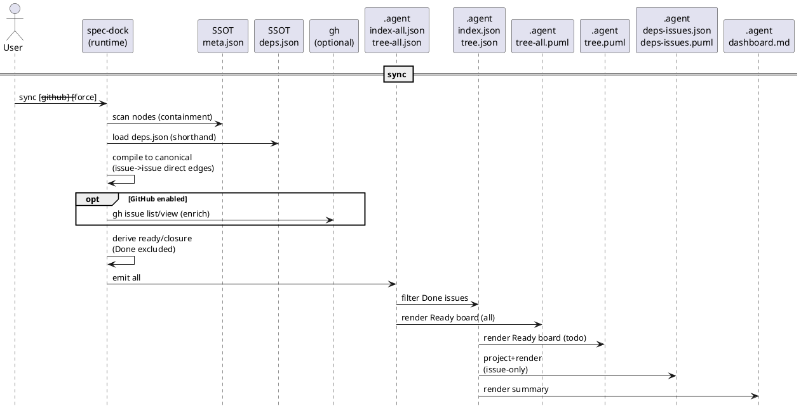
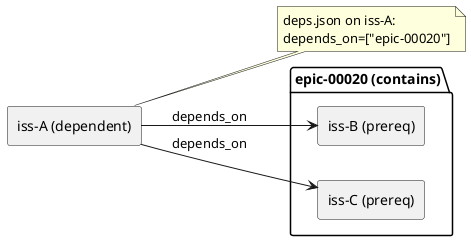
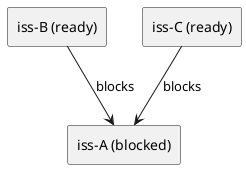
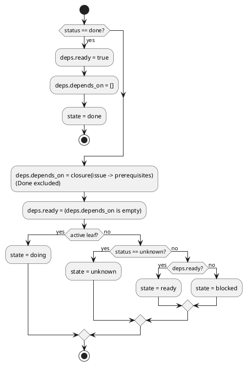
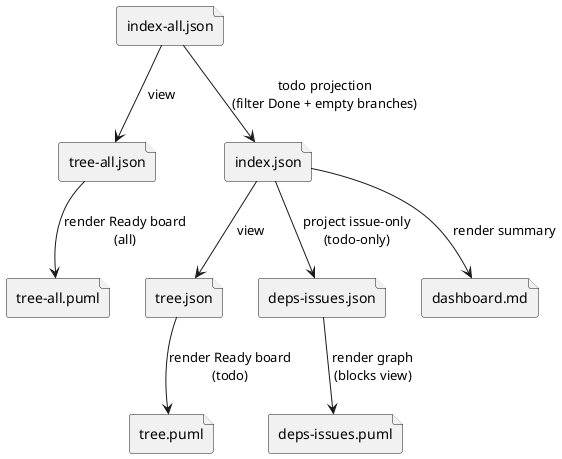
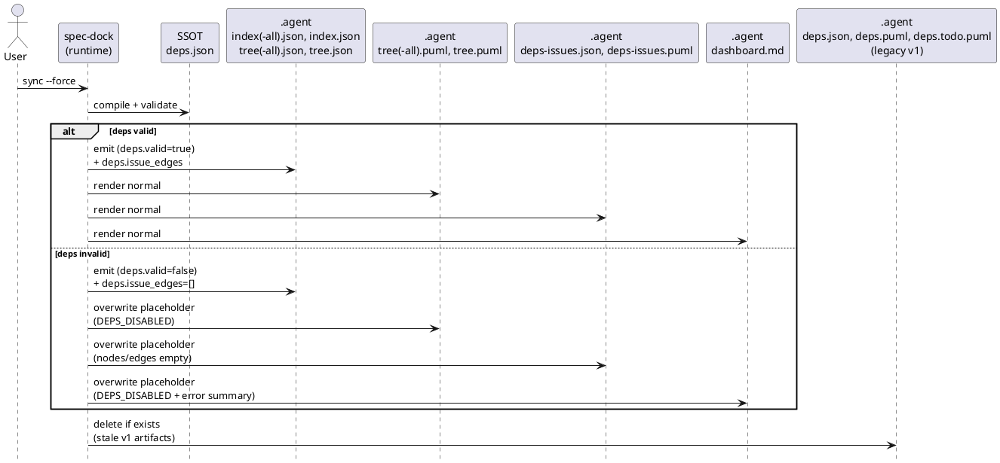
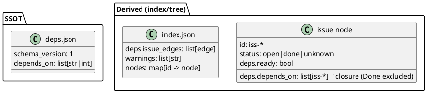
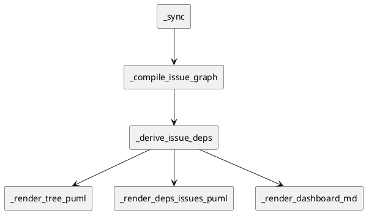
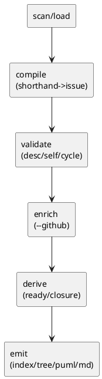

# iss-00010 deps v2: shorthand 依存（initiative/epic）を issue 依存へ還元し、Readyボード（矢印なしツリー）で一目瞭然にする — 設計（HOW）

## 目的・制約（要件から転記・圧縮） (必須)
- 目的:
  - 依存関係を “実作業単位=issue” に正規化し、`sync` の生成物から「次にやれる issue / ブロッカー」を即判断できるようにする。
- MUST（要件の圧縮）:
  - `deps.json` の shorthand（initiative/epic 指定）を **canonical issue→issue** へ compile し、ready 判定に使う（`deps check` / `active set` guard / `sync`）。
  - `sync` は以下の成果物を生成する（命名は ADR 準拠）:
    - 監査用（all）: `.agent/index-all.json`, `.agent/tree-all.json`, `.agent/tree-all.puml`
    - 作業用（todo）: `.agent/index.json`, `.agent/tree.json`, `.agent/tree.puml`, `.agent/deps-issues.json`, `.agent/deps-issues.puml`, `.agent/dashboard.md`
  - issue の派生状態（ready/blocked、ブロッカー、推移依存=closure、Done除外）を `index*.json` / `tree*.json` に統合する。
  - unknown は安全側（blocked）に倒す。出力順序は決定的（ソート）にする。
- MUST NOT:
  - `meta.json` のスキーマ拡張（依存は `deps.json` に分離）
  - runtime script に stdlib 以外の依存追加
  - GitHub Issue の更新操作（ラベル/本文/クローズ等）
- 前提:
  - “エージェントが読む主観測点” は `spec-dock/.agent/index.json`（todo）とする（PlantUML を仕様としてパースしない）。

---

## 既存実装/規約の調査結果（As-Is / 99.9%理解） (必須)
- 参照した規約/実装（根拠）:
  - `AGENTS.md`（repo root）: 会話日本語 / git操作制約 / commitメッセージ規約
  - runtime script: `src/spec_dock/assets/spec_dock/scripts/spec-dock`
    - `sync`: `_sync()`
    - deps v1: `_load_deps_json()` / `_resolve_dep_ref()` / `_build_effective_deps_map_all()` / `_build_deps_state()` / `_render_deps_puml()`
    - deps check: `_deps_check()` / `_deps_evaluate()`
  - docs: `src/spec_dock/assets/spec_dock/docs/reference_deps.md` / `reference_sync.md`
  - tests: `tests/test_cli.py`（runtime script の生成物や挙動を回帰で担保）
- 観測した現状（事実）:
  - `sync` は `.agent/index.json` / `.agent/tree.json`（schema_version=2）を生成する（現状は **all 相当**）。
  - deps v1 はノード直下の `deps.json` をロードし、`deps check` / `sync` が `.agent/deps.json` と `.agent/deps.puml` / `.agent/deps.todo.puml` を生成する。
  - deps v1 の可視化は “包含（initiative/epic/issue）” と “依存（矢印）” が混在し、Ready/Blocked の直感が崩れやすい。
  - `--github` を付けない場合、`.agent/index.json` のスナップショットから issue の `status` を best-effort で読み、unknown を補う。
- 採用するパターン:
  - 依存の入力は `deps.json` に集約し、派生SSOTを増やさない（派生の主観測点は `index*.json`）。
  - 決定的順序（既存の `sort_key()` の方針に準拠）。
  - `sync --force` は index/tree の更新を継続しつつ、deps派生物の stale 誤用を防ぐ（無効プレースホルダで上書き）。
- 採用しない/変更しない:
  - GUI/TUI は追加しない（生成物 + CLI で完結）。
  - PlantUML を “機械判定の正” にしない（JSON を正とする）。
- 影響範囲:
  - runtime script の `sync` / `deps check` / `active set` guard（依存判定の根拠が変わる）
  - docs（生成物と意味の更新）
  - tests（生成物名・スキーマ・exit code の回帰更新）

## 主要フロー（テキスト：AC単位で短く） (任意)
- Flow（sync / AC-001, 006, 011-013）:
  1) scan: `meta.json` を走査してノード索引（initiative/epic/issue）を構築
  2) load: 各ノード直下の `deps.json` をロード
  3) compile: shorthand を展開し、canonical issue→issue グラフ（direct edges）を生成
  4) validate: descendant/self/cycle を検出（`--force` の場合は deps 無効扱い）
  5) enrich: `--github` のときだけ GitHub state を取得（失敗は unknown）
  6) derive: issue ごとに `ready` / `deps.depends_on(closure, Done除外)` を計算
  7) emit:
     - `index-all.json` / `tree-all.json`（all）
     - `index.json` / `tree.json`（todo = Done issue 除外）
     - `tree(-all).puml`（Readyボード）
     - `deps-issues.json` / `deps-issues.puml`（issue-only, todo-only）
     - `dashboard.md`（todo-only）
- Flow（deps check / AC-002, 003, 007-009）:
  1) target 解決（node id / GitHub issue number / URL）
  2) compile + validate + enrich（必要なら）
  3) `ready` と blockers を返す（`--json` は構造化出力）

### UML（任意） (任意)


## データ・バリデーション（必要最小限） (任意)
### MODEL-001: 入力 `deps.json`（SSOT / schema_version=1）
- 目的: 依存の宣言をメタデータ（`meta.json`）と分離し、ノード単位で管理する。
- Schema:
  - `schema_version`: `1`（固定。v2 は作らない）
  - `depends_on`: `list[str | int]`
    - `str`: node id（`init-*`/`epic-*`/`iss-*`）または digits-only（GitHub issue number として解決）
    - `int`: GitHub issue number として解決
- Validation:
  - `schema_version!=1` は構造エラー（exit=1）
  - 参照が解決不能（node 不在 / GitHub番号が複数/未import等）は構造エラー（exit=1）
  - descendant 依存（親→配下）は構造エラー（exit=1）
  - shorthand 展開結果が空（epic/initiative配下 issue=0）は **エラーにしない**（warning を出す）

### MODEL-002: 依存グラフ（canonical issue graph）
- 内部表現（実装都合）:
  - `depends_on_edges`: `dict[issue_id, set[issue_id]]`（dependent -> prerequisites）
- 出力表現（観測点: `index*.json`）:
  - `deps.issue_edges`: `list[{\"from\": <issue_id>, \"to\": <issue_id>, \"kind\": \"depends_on\"}]`
    - 方向: **dependent -> prerequisite**（depends_on edge）
    - 理由: 要件の語彙（depends_on）と一致し、エージェントが `issue -> prerequisites` を素直に辿れるため（機械判定の正は JSON）
    - 備考:
      - PlantUML（`deps-issues.puml`）では見やすさのため **反転して描画**する（prereq -> dependent / blocks 表示。ADR-00007）
      - `depends_on_edges` は内部で保持し、描画時に反転できる

#### UML（shorthand 展開と矢印方向の対応） (任意)




### MODEL-003: issue の派生 deps（`index*.json` / `tree*.json`）
- issue ノードに追加するフィールド（例）:
  - `deps.ready`: `bool`
  - `deps.depends_on`: `list[issue_id]`（推移依存 closure、Done除外、決定的順序）
  - `deps.blockers_top`: `list[issue_id]`（最大N。表示用）
- 不変条件（混乱回避）:
  - `status == \"done\"` の issue は、`deps.ready=true` / `deps.depends_on=[]` とする（“着手可否”の観点では trivially ready）
  - `unknown` は `deps.ready=false` の評価に倒れる（依存先の unknown も Done ではない扱い）

#### UML（ready / state の導出） (任意)


### MODEL-004: `.agent/*` 生成物スキーマ（MVP）
> エージェントが読むのは `index.json`（todo）を第一とし、`deps-issues.json` は issue-only 投影として “読みやすさ” のために用意する。

#### `run_id` / `inputs_fingerprint`（取り違え防止）
- `run_id`: `uuid4` を採用する（1回の `sync` を一意に識別）
- `inputs_fingerprint`: `sha256` を採用し、少なくとも以下を含めて安定化する:
  - `meta.json`（全件）と `deps.json`（全件）の “内容ハッシュ” の集合（パスでソートして結合）
  - `sync` 実行時フラグ（`--github`, `--gh-limit`）
  - runtime script のバージョン識別子（例: `spec-dock` の `__version__` か git sha。無い場合は省略）

#### `spec-dock/.agent/index-all.json`（all）
```jsonc
{
  "schema_version": 3,
  "generated_at": "2026-03-01T00:00:00+00:00",
  "run_id": "uuid",
  "inputs_fingerprint": "sha256:....",
  "root": "spec-dock/initiatives",
  "active": { /* active.json と同型 */ },
  "warnings": ["gh_fetch_failed", "gh_index_incomplete", "deps_ref_expanded_to_empty"],
  "deps": {
    "valid": true,
    "issue_edges": [{ "from": "iss-00001", "to": "iss-00002", "kind": "depends_on" }],
    "edge_direction": "depends_on (dependent -> prerequisite)"
  },
  "nodes": {
    "iss-00001": {
      "type": "issue",
      "id": "iss-00001",
      "title": "...",
      "path": "...",
      "parent_id": "epic-...",
      "initiative_id": "init-...",
      "epic_id": "epic-...",
      "children": [],
      "status": "open|done|unknown",
      "deps": {
        "ready": false,
        "depends_on": ["iss-00002", "iss-00003"],
        "blockers_top": ["iss-00002", "iss-00003"]
      }
    }
  }
}
```

#### `spec-dock/.agent/index.json`（todo = Done issue 除外）
- `index-all.json` から以下を除外した投影（todo 観測点）:
  - `status=="done"` の issue
  - 配下に todo issue が 1件も残らない epic/initiative（MODEL-005 と同一）
- `deps.issue_edges` も todo-only にフィルタする（from/to が双方とも todo issue の edge のみ残す）。
- `index.json` と `tree.json` のノード集合（todo 集合）は一致させる（参照先により判断がぶれないため）。

#### `spec-dock/.agent/tree-all.json` / `tree.json`
- `tree*.json` は `index*.json` のビュー（投影）であり、追加情報は持たせない（同じ node item をネストした形）。

#### `spec-dock/.agent/deps-issues.json`（todo-only / issue-only）
- `deps-issues.json` は `index.json`（todo）の issue だけを抜き出した投影（epic/initiative は含めない）。
- `nodes` の集合は **`index.json` に含まれる todo issue 全件**と一致させる（孤立 issue を落とさない）。
- `edges` は todo issue 間の canonical issue 依存（depends_on edge）を載せる（端点が todo issue のもののみ）。
```jsonc
{
  "schema_version": 1,
  "generated_at": "2026-03-01T00:00:00+00:00",
  "run_id": "uuid",
  "source": { "index": "spec-dock/.agent/index.json", "schema_version": 3 },
  "deps": { "valid": true },
  "nodes": {
    "iss-00001": {
      "id": "iss-00001",
      "title": "...",
      "status": "open|unknown",
      "ready": true,
      "depends_on": [],
      "state": "doing|ready|blocked|unknown"
    }
  },
	  "edges": [{ "from": "iss-00010", "to": "iss-00020" }],
	  "edge_direction": "depends_on (dependent -> prerequisite)"
	}
	```

#### `spec-dock/.agent/dashboard.md`（todo-only）
- 少なくとも以下を含める:
  - “観測点” への導線（`index.json`, `tree.puml`, `deps-issues.puml`）
  - Ready（`ready=true`）の issue 上位 N 件（id/title）
  - Blocked の issue 上位 N 件（id/title + `blockers_top`）
  - Unknown（status=unknown）の issue 上位 N 件（id/title）

#### UML（生成物の派生関係） (任意)


### MODEL-005: todo フィルタ（Done 除外）のルール
- “Done” 判定は issue の `status=="done"` のみで行う（epic/initiative は progress で集計するが、todo 生成の除外判定には使わない）。
- todo 投影で除外するもの:
  - issue: `status=="done"` のもの
  - epic/initiative: 配下に todo issue が 1件も残らない場合は、`index.json` / `tree.json` の双方から除外する（todo 集合を一致させる）。
    - `index-all.json` / `tree-all.json` には残る（監査/完了済み含むビュー）。

### MODEL-006: deps 無効（`sync --force`）の扱い
- `deps.valid=false` を `index*.json` に明示する（例: `deps: { \"valid\": false, \"error\": \"...\" }`）。
- `sync --force` により deps が無効になった場合でも、MUST 生成物は **無効プレースホルダで上書き**して stale を残さない（ファイルの存在契約を安定化する）。
  - `.agent/index*.json` / `.agent/tree*.json`:
    - トップレベル `deps.valid=false` と `deps.error` を必ず出力する
    - `deps.valid=false` のときは `deps.issue_edges=[]`（空配列）を必ず出力し、直前実行の stale edge を残さない
    - issue ノードの `deps` は `null` を許容し、ready/closure を未計算として表現する（`deps.valid=true` のときのみ `deps.ready` 等が必須）
  - `.agent/tree*.puml`:
    - ヘッダに `DEPS_DISABLED` の note を表示する
    - issue の state は `done/doing/unknown` のみを用いる（ready/blocked は出さない）
  - `.agent/deps-issues.json` / `.agent/deps-issues.puml`:
    - `deps.valid=false` と error 要約のみを出し、`nodes/edges` は空で上書きする
  - `.agent/dashboard.md`:
    - `DEPS_DISABLED` と error 要約のみを出し、利用者が誤解しないよう「ready/blocked 集計は無効」と明記する

#### UML（`sync --force` の分岐と stale 防止） (任意)


### UML（任意） (任意)


## 判断材料/トレードオフ（Decision / Trade-offs） (任意)
- 論点: issue-only 依存グラフを all も出すか？
  - 決定: **todo-only のみ**出す（ADR-00008/00007）
  - 理由: 目的が “今やる順序” の把握であり、Done を混ぜるとノイズが増える。監査は `index-all.json` で担保する。
- 論点: focus 図（per issue）を生成物として常設するか？
  - 決定: 出さない（ADR-00008）
  - 理由: 生成物の種類増加は運用コスト/誤用（stale）を増やす。詳細は `deps check --json` に寄せる。
- 論点: エージェントが読む形式は？
  - 決定: JSON（`index.json` / `deps-issues.json`）を正とし、PlantUML は人間向けビューとする（ADR-00008）

## インターフェース契約（ここで固定） (任意)
### CLI（重要なものだけ）
- CLI-001: `sync [--github] [--gh-limit N] [--force]`
  - Success:
    - `.agent/index-all.json`, `.agent/tree-all.json`, `.agent/index.json`, `.agent/tree.json` を生成
    - `.agent/tree*.puml`, `.agent/deps-issues.{json,puml}`, `.agent/dashboard.md` を生成（deps 無効時はプレースホルダで上書き）
  - Failure:
    - deps の構造エラー（未解決参照/self/cycle 等）は exit=1（`--force` なら exit=0 で継続し、deps派生物は無効化プレースホルダにする）
- CLI-002: `deps check <target> [--github] [--gh-limit N] [--json]`
  - Success:
    - exit=0（ready） / exit=3（blocked）
    - `--json` は `ready`, `blockers`, `effective_depends_on`（closure）, `warnings` を返す（warnings は空配列を含め常に出す）
  - Failure:
    - deps の構造エラーは exit=1（原因と provenance を出す）
- CLI-003: `active set <target> [--github] [--gh-limit N] [--force]`
  - Success:
    - exit=0
    - `spec-dock/.agent/active.json` が更新される
    - blocked な target でも `--force` があれば警告（blockers）付きで更新する
  - Failure:
    - deps guard により blocked の target は exit=1（`--force` が無い場合）
    - このとき `spec-dock/.agent/active.json` は更新しない

### 関数・クラス境界（重要なものだけ）
- IF-001: `spec-dock::_compile_issue_graph(nodes) -> (depends_on_edges, warnings, provenance)`
  - Input: `_Node` map + `deps.json`
  - Output:
    - internal: `depends_on_edges`（dependent->prereq）
    - output: `deps.issue_edges` は depends_on edge（dependent->prereq）として生成物に載せる
    - view: PlantUML 描画では blocks edge（prereq->dependent）へ反転して描画できる（ADR-00007）
  - Errors: unresolved ref / descendant / self / cycle
- IF-002: `spec-dock::_derive_issue_deps(nodes, issue_status_by_id, depends_on_edges) -> per_issue_deps`
  - Output: `ready`, `depends_on(closure, Done除外)` 等
- IF-003: `spec-dock::_emit_agent_artifacts(...)`
  - Output: `index-*.json`, `tree-*.json`, `tree*.puml`, `deps-issues.*`, `dashboard.md`

### UML（任意） (任意)


### クラス/インターフェース詳細設計（主要なもの） (任意)
> この Issue を “単独の作業単位” として完結させるために、必要な範囲だけ詳細化する。

- この実装は runtime script 1ファイル運用のため、クラス新設よりも “小さな純関数” を追加して責務分割する。

#### UML（任意） (任意)


### 例外/エラー契約（重要なものだけ） (任意)
- ERR-001: `Unresolved dependency ref`
  - 発生条件: `deps.json` の参照が node/GitHub issue として解決できない
  - 返し方: exit=1（stderr に `deps.json` パスと ref を含める）
- ERR-002: `Descendant dependency forbidden`
  - 発生条件: 親→配下（descendant）依存が発生（shorthand 展開後も含む）
  - 返し方: exit=1（fail-fast）
- ERR-003: `Dependency cycle detected`
  - 発生条件: canonical issue グラフに cycle
  - 返し方: exit=1（代表 cycle と provenance）
- WARN-001: `deps_ref_expanded_to_empty`
  - 発生条件: `epic/init` shorthand の展開が空（配下 issue=0）
  - 返し方: warnings に追加（ブロックしない）
- WARN-002: `gh_fetch_failed`
  - 発生条件: `--github` 時に GitHub 取得（`gh`）が失敗
  - 返し方: warnings に追加し、該当 issue は `status=unknown` として安全側（blocked）に倒す
- WARN-003: `gh_index_incomplete`
  - 発生条件: `--github` 時に `--gh-limit` 等により linked issue の一部が取得できない
  - 返し方: warnings に追加し、missing は `status=unknown` として安全側（blocked）に倒す
- WARN-004: `deps_preflight_failed`
  - 発生条件: `sync --force` で deps の構造エラーを検出し、deps を無効化して継続
  - 返し方: warnings に追加し、deps 派生物は無効プレースホルダで上書きする（MODEL-006）

## 変更計画（ファイルパス単位） (必須)
- 追加（Add）:
  - （なし。設計としては runtime script 内の関数追加で完結させる）
- 変更（Modify）:
  - `src/spec_dock/assets/spec_dock/scripts/spec-dock`
    - `sync` の生成物を v2（index/tree all/todo + tree puml + deps-issues.* + dashboard）へ更新
    - deps compile を “issue→issue へ還元” するロジックに置換
    - legacy: `.agent/deps.json` / `.agent/deps.puml` / `.agent/deps.todo.puml` の生成を廃止し、`sync` 実行時に存在していれば削除する（stale 誤読防止）
  - `src/spec_dock/assets/spec_dock/docs/reference_sync.md` / `reference_deps.md`
    - v2 の生成物と意味を反映（実装と同時に更新）
  - `tests/test_cli.py`
    - `sync` の生成物/スキーマ変更に追従
    - `deps check` / `active set` guard / `sync --force` の境界を回帰で担保
- 削除（Delete）:
  - （なし。legacy の削除は runtime output（`spec-dock/.agent/`）側で行う）
- 参照（Read only）:
  - `spec-deps/current/requirement.md`
  - `spec-deps/current/adrs/*.md`

## マッピング（要件 → 設計） (必須)
- AC-001 → `_sync()` / `index-*.json` / `tree-*.json`（`src/spec_dock/assets/spec_dock/scripts/spec-dock`）
- AC-004/005 → `active set` の deps guard（同上）
- AC-006 → `tree(-all).puml` render（同上）
- AC-011/012 → `deps-issues.{json,puml}`（同上）
- AC-013 → `dashboard.md`（同上）
- AC-002/003/009 → deps compile/validate（同上）
- AC-007/008 → `--github` と snapshot/cached status（同上）
- AC-010 → `sync --force` の deps 無効化・stale 防止（同上）
- EC-001..004 → deps.json schema / unresolved / self / cycle（同上）
- EC-005 → `gh` 失敗時の warn + unknown=blocked（同上）
- 非交渉制約（stdlib only / GH更新しない）→ runtime script 内の実装制約として維持

## テスト戦略（最低限ここまで具体化） (任意)
- 追加/更新するテスト（すべて `python -m unittest discover -v` で回す）:
  - `tests/test_cli.py` を拡張し、temp repo 上で runtime `spec-dock/scripts/spec-dock` を実行して成果物を検証する。
  - `generated_at` / `run_id` などの非決定値は “存在と形式” のみを検証し、値一致のアサートはしない（フレーク防止）。
  - “決定的順序” の担保として、配列フィールド（`warnings`, `deps.issue_edges`, `deps.depends_on`, `deps.blockers_top` 等）が安定ソートされることをテストで検証する。
- どのAC/ECをどのテストで保証するか（案）:
  - AC-001 → `test_sync_emits_index_all_and_todo_views_and_contains_deps_fields`（新規）
  - AC-002 → `test_deps_check_expands_shorthand_to_issue_edges`（新規）
  - AC-003 → `test_deps_check_warnings_include_expanded_to_empty`（新規）
  - AC-003 → `test_sync_warnings_include_expanded_to_empty`（新規）
  - AC-004 → `test_active_set_is_blocked_when_deps_not_ready`（新規）
  - AC-005 → `test_active_set_force_overrides_deps_guard`（新規）
  - AC-006 → `test_sync_emits_tree_puml_ready_board`（新規）
  - AC-007 → `test_sync_without_github_uses_index_snapshot_for_status`（新規/更新）
  - AC-008 → `test_sync_github_limit_warns_incomplete_and_unknown_blocks`（新規）
  - AC-009 → `test_sync_fails_on_deps_structural_error_without_force`（新規）
  - AC-011/012 → `test_sync_emits_deps_issues_json_and_puml_todo_only`（新規）
  - AC-013 → `test_sync_emits_dashboard_md`（新規）
  - AC-010 → `test_sync_force_sets_deps_valid_false_and_emits_placeholders`（新規/更新）
  - AC-010 → `test_sync_force_removes_legacy_deps_artifacts`（新規）
  - 決定的順序 → `test_sync_outputs_are_deterministically_sorted`（新規）
  - EC-001 → `test_deps_json_schema_version_must_be_1`（新規）
  - EC-002 → `test_deps_unresolved_ref_is_error`（新規）
  - EC-003/004 → `test_deps_self_edge_and_cycle_are_errors`（新規）
  - EC-005 → `test_github_fetch_failed_warns_and_unknown_blocks`（新規）

### テストマトリクス（AC/EC → テスト） (任意)
- 実行コマンド:
  - `python -m unittest discover -v`

## リスク/懸念（Risks） (任意)
- R-001: shorthand 展開でエッジ数が増える
  - 対応: 出力は “todo-only” を主にし、図は issue-only と Readyボードに分離する。`deps-issues.json` は投影として最小化する。
- R-002: shorthand 展開で自己依存/循環が暗黙に生まれる
  - 対応: compile 後の canonical issue グラフで fail-fast（`--force` は deps 無効化で継続）
- R-003: `sync --force` 時の stale 誤用
  - 対応: deps 派生物を無効プレースホルダで上書きし、`index*.json` に `deps.valid=false` を明示する

## 未確定事項（TBD） (必須)
- 該当なし（本設計の論点は ADR 群で確定済み）

---

## ディレクトリ/ファイル構成図（変更点の見取り図） (任意)
```text
<repo-root>/
├── src/spec_dock/assets/spec_dock/scripts/spec-dock          # Modify (deps v2 + artifacts)
├── src/spec_dock/assets/spec_dock/docs/reference_sync.md     # Modify (artifacts)
├── src/spec_dock/assets/spec_dock/docs/reference_deps.md     # Modify (deps v2)
├── tests/test_cli.py                                         # Modify (regression)
└── spec-deps/current/design.md                               # Modify (this doc)

# runtime outputs (generated; not committed)
<target-repo>/spec-dock/.agent/
├── index-all.json
├── tree-all.json
├── tree-all.puml
├── index.json
├── tree.json
├── tree.puml
├── deps-issues.json
├── deps-issues.puml
├── dashboard.md
└── active.json
```

## 省略/例外メモ (必須)
- 該当なし
