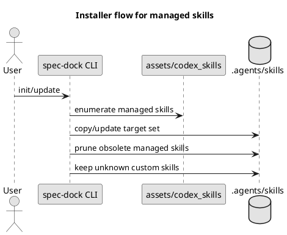
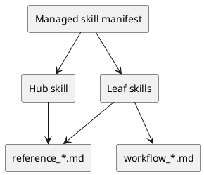
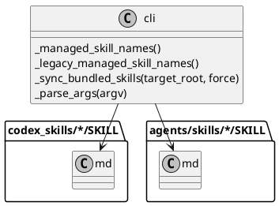

# iss-00016 Codex skills を hub + leaf 構成へ再編する — 設計（HOW）

## 目的・制約（要件から転記・圧縮） (必須)
- 目的:
  - Codex CLI 向け skill を 1 本構成から **hub + 4 leaf** へ再編し、routing を単純化する
  - 共通運用ルールは独立 skill にせず、**reference layer** として docs 正本へ集約する
  - `init/update` で常に skill を導入し、`--no-skill` を廃止する
  - issue 実装 governance を docs / template / skill に分担配置し、review loop / docs refresh / final diff gate を標準化する
- MUST:
  - 初期 full set を 5 skill に固定する
  - hub / leaf の routing 契約を満たす
  - `update` の `.agents/skills/` 所有境界を守る
  - issue plan template に review/fix/re-review と docs impact / final gate を実行可能な形で持たせる
- MUST NOT:
  - `runtime-operations` のような抽象 skill を追加しない
  - unknown custom skill を `update` で削除しない
- 非交渉制約:
  - hub 名は `spec-driven-tdd-workflow` を維持する
  - docs は正本、skill はルーターとする
  - `workflow_*` / `reference_*` は安定層として再利用する
  - governance の規範本体は docs、実行形は template、short reminder は skill に置く
- 前提:
  - この issue では Codex CLI の外部仕様変更は扱わない
  - 複数 skill 併存時の Codex 側解決順は repo 外仕様であり、本設計では「hub を主入口として配布する」前提で扱う

---

## 既存実装/規約の調査結果（As-Is / 99.9%理解） (必須)
- 参照した規約/実装（根拠）:
  - `src/spec_dock/cli.py`: installer の管理対象同期、skill 導入、CLI オプションの正本
  - `src/spec_dock/assets/codex_skills/spec-driven-tdd-workflow/SKILL.md`: 現行 single-skill の内容と安全注意の置き方
  - `src/spec_dock/assets/spec_dock/docs/README.md`: 配布 docs の入口構造
  - `src/spec_dock/assets/spec_dock/docs/workflow_*.md`: workflow 単位の正本 docs
  - `src/spec_dock/assets/spec_dock/docs/reference_*.md`: 共通運用ルールの正本 docs
  - `tests/test_cli.py`: `init/update` と skill 配布の現行観測点
  - `README.md`: 利用者向け導入手順と生成物一覧
- 観測した現状（事実）:
  - skill 配布は `src/spec_dock/cli.py` の `_install_skill()` が 1 本だけをコピーする
  - `init/update` は `--no-skill` を持ち、skill 無効状態を許容する
  - docs はすでに workflow / reference に責務分離済みで、skill だけが巨大入口になっている
  - tests は単一 skill と `--no-skill` を前提にしている
  - `update` は managed file を上書きするが、skill については unknown custom skill との境界が未定義
  - `templates/issue/plan.md` には step ごとのテスト/報告/コミットはあるが、review ループ・docs refresh step・final diff gate は標準化されていない
  - `workflow_issue.md` は TDD の流れを持つが、plan upfront approval と step result approval の役割分担、branch 全体 final gate の規範は未定義
- 採用するパターン（命名/責務/例外/DI/テストなど）:
  - assets 配下に配布正本を置き、installer が repo へ同期する既存方式を維持する
  - docs ファイル自体は極力移動せず、skill 側の routing と README 導線で責務を明確化する
  - テストは `unittest` の temp dir ベースを継続し、FS 観測で skill 導入結果を保証する
- 採用しない/変更しない（理由）:
  - runtime script (`./spec-dock/scripts/spec-dock`) のコマンド体系変更は行わない
  - `workflow_*` / `reference_*` のファイル名変更は行わない
  - 外部の Codex skill 解決アルゴリズムには依存しない設計にする
- 影響範囲（呼び出し元/関連コンポーネント）:
  - installer CLI: `src/spec_dock/cli.py`
  - skill assets: `src/spec_dock/assets/codex_skills/**`
  - 配布 docs: `src/spec_dock/assets/spec_dock/docs/**`
  - 利用者 README: `README.md`
  - テスト: `tests/test_cli.py`

## 主要フロー（テキスト：AC単位で短く） (任意)
- Flow for AC-001 / AC-003:
  1) `init` が spec-dock 管理ファイルを同期する
  2) installer が managed skill manifest を走査して hub + 4 leaf を `.agents/skills/` へ配置する
  3) hub skill が 4 leaf と 4 つの `reference_*` を直接列挙する
- Flow for AC-002 / AC-002b / AC-009:
  1) `update` が `spec-dock/` 管理対象を上書き更新する
  2) skill 同期処理が managed target set を再構成する
  3) spec-dock 管理対象の旧 skill は除去し、unknown custom skill は保持する
- Flow for AC-004 / AC-005 / AC-005b:
  1) leaf skill が自身の主要 workflow doc を先頭導線として示す
  2) 操作トリガーに応じて必要な `reference_*` を直接列挙する
  3) 利用者/Codex は詳細仕様を docs 正本で確認する
- Flow for AC-011 / AC-012 / AC-014:
  1) 開発者/Codex が `workflow_issue.md` と `templates/issue/plan.md` を開く
  2) 各 step は review loop と docs impact 判定を持つ形で記述される
  3) 終盤で docs refresh step と final diff review quality gate が独立 step として実行される

### UML（任意） (任意)


## データ・バリデーション（必要最小限） (任意)
- MODEL-001: Managed skill manifest
  - Entity: installer が管理する skill 名の集合
  - Fields:
    - `target_skill_names: tuple[str, ...]`
    - `legacy_managed_skill_names: tuple[str, ...]`
  - Constraints/Validation:
    - `target_skill_names` は requirement に定義した 5 skill と一致する
    - `legacy_managed_skill_names` は spec-dock が過去に配布した skill 名のみを含む
  - Concrete values:
    - `target_skill_names = (`
      - `"spec-driven-tdd-workflow",`
      - `"spec-dock-initiative-planning",`
      - `"spec-dock-epic-planning",`
      - `"spec-dock-issue-execution",`
      - `"spec-dock-adr-facilitation",`
      - `)`
    - `legacy_managed_skill_names = ("spec-driven-tdd-workflow",)`
    - したがって、この issue の migration では **obsolete legacy managed skill は実質 0 件**であり、主要な移行は「leaf の追加」と「unknown custom の保持」である
- MODEL-002: Skill routing contract
  - Entity: 各 skill が直接列挙すべき docs 群
  - Fields:
    - `skill_name`
    - `primary_workflow_doc`
    - `reference_docs`
    - `trigger_groups`
    - `usage_description`
  - Constraints/Validation:
    - hub は 4 leaf + 4 reference docs を持つ
    - leaf は requirement の routing 契約を満たす
    - 本設計で固定するのは **trigger group -> 最小完全 direct doc set** の対応である
- MODEL-003: Issue governance contract
  - Entity: issue execution における step governance
  - Fields:
    - `review_verdict`
    - `docs_impact`
    - `base_branch`
    - `final_gate_scope`
  - Constraints/Validation:
    - `review_verdict` は `approved | changes_requested | waived_by_user` を基本語彙とする
    - `docs_impact` は `none | user-facing | shipped-assets | workflow` のいずれかとする
    - `final_gate_scope` は `git diff <base>...HEAD` 相当の branch 全体 diff を指す
    - 実差分がない step は commit の代わりに report no-op 記録を許可する

### routing trigger matrix

| skill | primary | trigger group | direct references |
|---|---|---|---|
| `spec-driven-tdd-workflow` | なし（hub） | 初回 routing / 共通運用ルール確認 | 4 leaf 全て + `reference_github.md` + `reference_deps.md` + `reference_sync.md` + `reference_naming.md` |
| `spec-dock-initiative-planning` | `workflow_initiative.md` | GitHub 連携 / import / naming / sync が必要 | `reference_github.md` + `reference_sync.md` + `reference_naming.md` |
| `spec-dock-epic-planning` | `workflow_epic.md` | GitHub 連携 / import / naming / sync が必要 | `reference_github.md` + `reference_sync.md` + `reference_naming.md` |
| `spec-dock-issue-execution` | `workflow_issue.md` | `active set` / `deps check` / `sync` / `validate` / issue GitHub 操作が必要 | `reference_deps.md` + `reference_sync.md` + `reference_github.md` + `reference_naming.md` |
| `spec-dock-adr-facilitation` | `workflow_adr.md` | ADR の配置 / 命名 / 親ノードとの関係確認が必要 | `reference_naming.md` + 親 workflow への戻り導線 |

### UML（任意） (任意)


## 判断材料/トレードオフ（Decision / Trade-offs） (任意)
- 論点: skill 配布同期を 1 本ずつ個別コピーするか、manifest ベースで集合同期するか
  - 選択肢A: `_install_skill()` を 5 回呼ぶ
    - Pros:
      - 差分が小さく見える
    - Cons:
      - ownership boundary や obsolete managed skill の除去が表現しにくい
  - 選択肢B: managed skill manifest を導入して集合同期する
    - Pros:
      - target set / legacy set / unknown custom の境界を設計に落としやすい
      - `update` の prune 方針を実装しやすい
    - Cons:
      - `_install_skill` より少し抽象度が上がる
  - 決定: B
  - 理由: 今回の本質は single file copy ではなく managed set の再構成だから
- 論点: docs ファイルを skill 名に合わせて新設/分割するか
  - 選択肢A: leaf ごとに専用 docs を増やす
  - 選択肢B: 既存 `workflow_*` / `reference_*` を維持し、skill 側の導線だけ変更する
  - 決定: B
  - 理由: docs 正本の変更面積を抑え、reference layer の安定性を保つ

## インターフェース契約（ここで固定） (任意)
### 関数・クラス境界（重要なものだけ）
- IF-001: `src/spec_dock/cli.py::_managed_skill_names() -> tuple[str, ...]`
  - Input: なし
  - Output: target set の skill 名一覧
  - Errors/Exceptions: なし
- IF-002: `src/spec_dock/cli.py::_legacy_managed_skill_names() -> tuple[str, ...]`
  - Input: なし
  - Output: 過去に spec-dock が管理対象として配布していた skill 名一覧
  - Errors/Exceptions: なし
  - Concrete value:
    - この issue 時点では `("spec-driven-tdd-workflow",)` に固定する
- IF-003: `src/spec_dock/cli.py::_sync_bundled_skills(target_root: Path, *, force: bool) -> None`
  - Input:
    - `target_root`: 導入先 repo
    - `force`: `init --force` または `update` で上書き許可
  - Output: `.agents/skills/` が managed target set と整合する
  - Errors/Exceptions:
    - asset 欠損時は `RuntimeError`
    - コピー失敗時は例外を上位へ伝播
  - Contract:
    - target set の skill は導入/更新する
    - obsolete managed skill は除去する（ただし本 issue の legacy set では実質 0 件）
    - unknown custom skill は保持する
    - 実行順序は **copy/update -> verify target presence -> prune managed obsolete** とする
    - 中断時は自動 rollback しないが、`spec-dock update` の再実行で target state に収束させる
- IF-004: `src/spec_dock/cli.py::_parse_args(argv: list[str]) -> argparse.Namespace`
  - Input: CLI 引数
  - Output: `init/update` の引数 namespace
  - Errors/Exceptions: argparse 標準
  - Contract:
    - `--no-skill` は削除する
    - help は skill 常時導入前提になる

### UML（任意） (任意)


### 例外/エラー契約（重要なものだけ） (任意)
- ERR-001: Missing bundled skill asset
  - 発生条件:
    - manifest にある skill ディレクトリまたは `SKILL.md` が assets に存在しない
  - 呼び出し元への返し方:
    - `RuntimeError` として `main()` まで伝播し、exit code 1
  - ログ/監視:
    - stderr に asset path を含むエラーを出す
- ERR-002: Managed skill sync interrupted
  - 発生条件:
    - copy/remove 中の OS エラー
  - 呼び出し元への返し方:
    - 例外として終了
  - ログ/監視:
    - 自動 rollback は持たないので、report/plan で明記する

## 変更計画（ファイルパス単位） (必須)
- 追加（Add）:
  - `src/spec_dock/assets/codex_skills/spec-dock-initiative-planning/SKILL.md`: initiative leaf skill
  - `src/spec_dock/assets/codex_skills/spec-dock-epic-planning/SKILL.md`: epic leaf skill
  - `src/spec_dock/assets/codex_skills/spec-dock-issue-execution/SKILL.md`: issue leaf skill
  - `src/spec_dock/assets/codex_skills/spec-dock-adr-facilitation/SKILL.md`: ADR leaf skill
- 変更（Modify）:
  - `src/spec_dock/cli.py`: managed skill manifest と multi-skill sync を実装、`--no-skill` 削除
  - `src/spec_dock/assets/codex_skills/spec-driven-tdd-workflow/SKILL.md`: hub 化
  - `src/spec_dock/assets/spec_dock/docs/README.md`: multi-skill 入口へ更新
  - `src/spec_dock/assets/spec_dock/docs/workflow_initiative.md`: initiative leaf から参照される前提に沿って導線を明確化
  - `src/spec_dock/assets/spec_dock/docs/workflow_epic.md`: epic leaf から参照される前提に沿って導線を明確化
  - `src/spec_dock/assets/spec_dock/docs/workflow_issue.md`: issue leaf の運用導線に合わせて整理
  - `src/spec_dock/assets/spec_dock/docs/workflow_adr.md`: ADR leaf 導線に合わせて整理
  - `README.md`: `--no-skill` 削除、生成物、複数 skill 導線へ更新
  - `tests/test_cli.py`: multi-skill 導入・migration・custom skill 保持テストへ更新
  - `src/spec_dock/assets/spec_dock/templates/issue/plan.md`: issue execution governance を標準化
  - `src/spec_dock/assets/spec_dock/docs/workflow_issue.md`: issue governance の正本ルールを追加
  - `src/spec_dock/assets/codex_skills/spec-dock-issue-execution/SKILL.md`: docs impact と final gate の reminder を追加
- 削除（Delete）:
  - なし（skill の置換は削除ではなく managed sync による再構成で扱う）
- 移動/リネーム（Move/Rename）:
  - なし（docs ファイル名は維持）
- 参照（Read only / context）:
  - `pyproject.toml`: package-data に assets が含まれる前提確認
  - `spec-deps/current/requirement.md`: routing / ownership boundary の契約正本
  - `spec-deps/current/discussions/disc-00002-skills-full-set-composition.md`: skill 構成判断の背景

## マッピング（要件 → 設計） (必須)
- AC-001 → IF-001, IF-003, `src/spec_dock/cli.py`, `tests/test_cli.py`
- AC-002 / AC-002b → IF-002, IF-003, `src/spec_dock/cli.py`, `tests/test_cli.py`, `README.md`, `src/spec_dock/assets/spec_dock/docs/README.md`, `src/spec_dock/assets/spec_dock/docs/workflow_*.md`
- AC-003 → hub skill 設計, `src/spec_dock/assets/codex_skills/spec-driven-tdd-workflow/SKILL.md`
- AC-004 → issue leaf skill 設計, `workflow_issue.md`, `reference_*`
- AC-005 / AC-005b → initiative/epic/adr leaf skill 設計, `workflow_*`, `reference_*`
- AC-006 / AC-008 → `README.md`, `src/spec_dock/assets/spec_dock/docs/README.md`, `_parse_args`
- AC-009 / EC-005 → IF-003, ownership boundary 設計, `tests/test_cli.py`
- AC-011 / AC-014 → `src/spec_dock/assets/spec_dock/templates/issue/plan.md`, `src/spec_dock/assets/spec_dock/docs/workflow_issue.md`
- AC-012 → `src/spec_dock/assets/spec_dock/docs/workflow_issue.md`
- AC-013 → `src/spec_dock/assets/codex_skills/spec-dock-issue-execution/SKILL.md`
- 非交渉制約（hub 名維持 / docs 正本 / custom skill 保持） → skill asset 配置方針, manifest 設計, docs stable 設計

## テスト戦略（最低限ここまで具体化） (任意)
- 追加/更新するテスト:
  - Unit/installer:
    - `init` が 5 skill を配置する
    - `update` が旧 single-skill repo を 5 skill へ移行する
    - `update` が旧 `--no-skill` repo に 5 skill を導入する
    - `update` が unknown custom skill を保持する
    - CLI help / parser から `--no-skill` が消える
  - Docs/asset validation:
    - hub skill が 4 leaf + 4 reference docs + 各 leaf の説明を含む
    - leaf skill が requirement の routing 契約と **trigger group -> 最小完全 direct doc set** 対応を満たす
    - root `README.md` と配布 docs `README.md` から single-skill / `--no-skill` の旧導線が除去されている
    - old single-skill repo / old `--no-skill` repo へ `update` した後の配布 docs 導線が new skill set と整合する
    - issue plan template が review loop / docs refresh / final diff gate を持つ
    - workflow_issue が governance の正本として template と整合する
    - issue-execution skill が docs 正本を崩さず short reminder に留まる
  - Migration safety:
    - copy/update の途中失敗を模擬したあと `update` を再実行すると target state に収束する
- どのAC/ECをどのテストで保証するか:
  - AC-001 → `tests/test_cli.py::test_init_creates_expected_structure`
  - AC-002 → `tests/test_cli.py::test_update_keeps_initiatives_by_default` の拡張または後継テスト
  - AC-002b → 新規 `update_from_no_skill_repo_installs_full_set`
  - AC-003 → hub skill content assertion
  - AC-004 / AC-005 / AC-005b → leaf skill content assertion（trigger group -> 最小完全 direct doc set 対応を含む）
  - AC-006 / AC-008 → parser/help assertion + README 文面 assertion
  - AC-009 / EC-005 → custom skill preserve test
  - AC-010 / EC-006 → failure-injection 後の `update` 再実行 convergence test

### テストマトリクス（AC/EC → テスト） (任意)
- AC-001:
  - Integration: temp repo に対する `init`
- AC-002 / EC-001:
  - Integration: 旧 single-skill repo へ `update` し、`.agents/skills/` と配布 docs の両方を観測
- AC-002b / EC-001b:
  - Integration: `.agents/skills` 不在 repo へ `update` し、`.agents/skills/` と配布 docs の両方を観測
- AC-003:
  - Asset assertion: hub `SKILL.md`
- AC-004:
  - Asset assertion: issue leaf `SKILL.md`（`active/GitHub`, `deps`, `sync/validate` の各 trigger group の参照先）
- AC-005:
  - Asset assertion: initiative/epic leaf `SKILL.md`（`GitHub/import` と `naming/sync` の trigger group の参照先）
- AC-005b:
  - Asset assertion: ADR leaf `SKILL.md`（`配置/命名` と `親 workflow` の trigger group の参照先）
- AC-006:
  - Doc assertion: `README.md` と `src/spec_dock/assets/spec_dock/docs/README.md`
- AC-008:
  - CLI parser assertion: `--help` / parse failure
- AC-009 / EC-005:
  - Integration: unknown custom skill 付き repo へ `update`
- Migration safety:
  - Failure injection: skill copy 途中で例外を発生させ、その後 `update` を再実行して target set 収束と custom skill 保持を確認する
- 非交渉制約（requirement.md）をどう検証するか:
  - 制約: docs 正本・skill ルーター
    - 検証方法: leaf skill が docs 参照を持ち、詳細説明を複製しすぎていないことを reviewer とテストで確認
  - 制約: custom skill 保持
    - 検証方法: `.agents/skills/custom-*` が update 後も存在
- 実行コマンド:
  - `python -m unittest discover -v`
- 変更後の運用（必要なら）:
  - 移行手順:
    - 旧 single-skill repo / 旧 `--no-skill` repo / custom skill 混在 repo いずれも `spec-dock update` で target state へ収束させる
  - ロールバック:
    - 自動 rollback は持たない
    - managed skill 変更は Git 差分または更新前バックアップで復元する
  - 中断時の回復契約:
    - `_sync_bundled_skills` は **copy/update を先に完了**してから managed obsolete の prune に進む
    - そのため失敗時は「不要 skill が残る」ことはあっても、copy 済み target skill を prune で失う順序にはしない
    - recovery の正式手段は `spec-dock update` の再実行とする

## リスク/懸念（Risks） (任意)
- R-001: skill manifest と assets 実体の不一致
  - 影響: init/update が失敗する
  - 対応: asset existence check を実装し、テストでも skill 数を固定観測する
- R-002: docs 導線更新漏れ
  - 影響: routing 契約違反
  - 対応: hub/leaf content assertion と reviewer で検出する
- R-003: ownership boundary 実装ミス
  - 影響: custom skill 削除、または旧 managed skill 取り残し
  - 対応: unknown preserve test と managed prune test を入れる
- R-004: `--no-skill` 削除漏れ
  - 影響: requirement と CLI/doc が不整合になる
  - 対応: parser/help/README を同時に更新し、テストで確認する
- R-005: update 中断時の部分更新
  - 影響: skill セットが一時的に中途半端になる
  - 対応: copy/update -> verify -> prune の順序に固定し、再実行で収束する設計にする
- R-006: governance 規範が docs / template / skill で drift する
  - 影響: agent と人間で参照先がズレる
  - 対応: docs を正本、template を実行形、skill を reminder に限定する

## 未確定事項（TBD） (必須)
- 現時点では、設計着手に必要な重大な未確定事項はない。
- design は requirement に定義済みの routing 契約と ownership boundary を具体的なファイル/関数/テストへ落とし込むことに専念する。

---

## ディレクトリ/ファイル構成図（変更点の見取り図） (任意)
```text
<repo-root>/
├── src/spec_dock/
│   ├── cli.py                                     # Modify
│   └── assets/
│       ├── codex_skills/
│       │   ├── spec-driven-tdd-workflow/SKILL.md  # Modify (hub)
│       │   ├── spec-dock-initiative-planning/SKILL.md   # Add
│       │   ├── spec-dock-epic-planning/SKILL.md         # Add
│       │   ├── spec-dock-issue-execution/SKILL.md       # Add
│       │   └── spec-dock-adr-facilitation/SKILL.md      # Add
│       └── spec_dock/docs/
│           ├── README.md                          # Modify
│           ├── workflow_initiative.md            # Modify
│           ├── workflow_epic.md                  # Modify
│           ├── workflow_issue.md                 # Modify
│           └── workflow_adr.md                   # Modify
├── tests/
│   └── test_cli.py                               # Modify
└── README.md                                     # Modify
```

## 省略/例外メモ (必須)
- Codex 側の複数 skill 解決順そのものは repo 外仕様のため、本設計では skill 配布と routing 記述の品質に責務を限定する。
