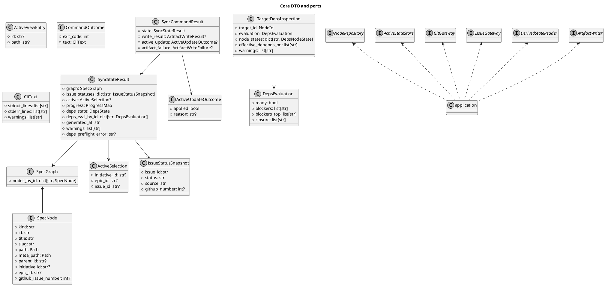
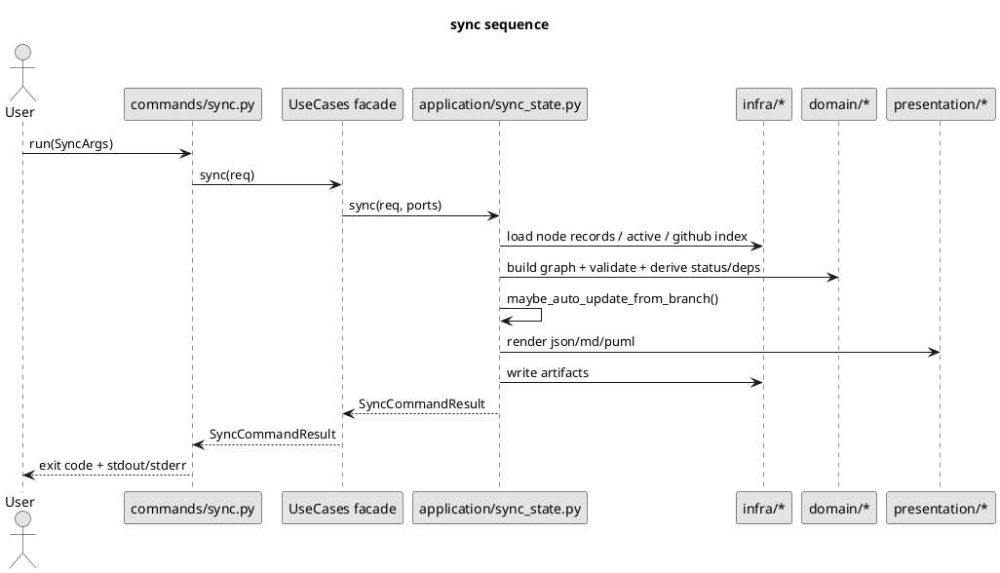
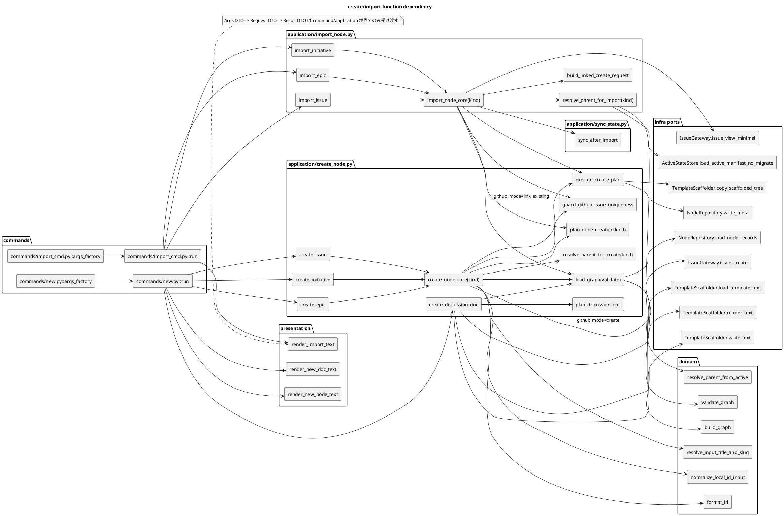
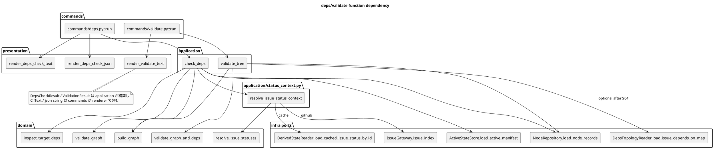

# issue-25 巨大な app.py を複数 module に分割し tests/test_cli.py を領域別に再編する — 設計（HOW）

## 目的・制約
- 目的:
  - approved 済み requirement と accepted 済み ADR に基づき、runtime CLI を `cli / commands / application / domain / infra / presentation` の layered architecture へ具体化する。
  - `app.py` を thin entrypoint へ縮小し、shared rule と workflow を durable な層へ移す。
  - `tests/test_cli.py` の再編方針を、実装 layer と整合する test taxonomy として固定する。
- MUST / MUST NOT:
  - MUST:
    - `commands` `application` `domain` `infra` `presentation` を物理導入する。
    - `new/import/active/sync/deps/validate` の command 入口を `commands` に移す。
    - `spec graph` の shared rule を `domain` に移す。
    - artifact 生成を `presentation` に寄せる。
    - CLI 契約、artifact 契約、exit code 契約を維持する。
  - MUST NOT:
    - `helpers.py` / `utils.py` 的な雑多モジュールを導入しない。
    - `domain` から `subprocess` `gh` `git` `Path.write_text` `print` を呼ばない。
    - `application` を飛ばして workflow を `commands` 側へ押し戻さない。
- 非交渉制約:
  - `app.py` は委譲中心に縮小する。
  - `application` は pass-through 層ではなく workflow orchestration を担う。
  - `dict[str, Any]` は JSON の read/write 境界にだけ許容し、公開 DTO と layer 間契約は dataclass で表現する。
  - 移行中は `app.py` から新 module への薄い委譲を残し、段階的に置換する。
- 前提:
  - architecture 方針は [adr-001-runtime-cli-layered-architecture.md](/srv/mount/spec-dock/spec-deps/current/adrs/adr-001-runtime-cli-layered-architecture.md) で accepted。
  - requirement は [requirement.md](/srv/mount/spec-dock/spec-deps/current/requirement.md) で approved。
  - 設計対象は runtime asset とその CLI tests。新機能追加は行わない。
  - requirement では詳細 interface 固定を避け、design で具体的な interface / DTO / module 契約を固定する。

## 既存実装 / 規約の理解
- 参照した実装 / docs:
  - [app.py](/srv/mount/spec-dock/src/spec_dock/assets/spec_dock/scripts/spec_dock_runtime/app.py)
  - [ids.py](/srv/mount/spec-dock/src/spec_dock/assets/spec_dock/scripts/spec_dock_runtime/ids.py)
  - [io_json.py](/srv/mount/spec-dock/src/spec_dock/assets/spec_dock/scripts/spec_dock_runtime/io_json.py)
  - [github.py](/srv/mount/spec-dock/src/spec_dock/assets/spec_dock/scripts/spec_dock_runtime/github.py)
  - [render_md.py](/srv/mount/spec-dock/src/spec_dock/assets/spec_dock/scripts/spec_dock_runtime/render_md.py)
  - [render_puml.py](/srv/mount/spec-dock/src/spec_dock/assets/spec_dock/scripts/spec_dock_runtime/render_puml.py)
  - [active.py](/srv/mount/spec-dock/src/spec_dock/assets/spec_dock/scripts/spec_dock_runtime/active.py)
  - [nodes.py](/srv/mount/spec-dock/src/spec_dock/assets/spec_dock/scripts/spec_dock_runtime/nodes.py)
  - [test_cli.py](/srv/mount/spec-dock/tests/test_cli.py)
  - [001-disc-runtime-cli-refactor-analysis.md](/srv/mount/spec-dock/spec-deps/current/discussions/001-disc-runtime-cli-refactor-analysis.md)
  - [002-disc-runtime-cli-architecture-v2.md](/srv/mount/spec-dock/spec-deps/current/discussions/002-disc-runtime-cli-architecture-v2.md)
- 現状理解:
  - [app.py](/srv/mount/spec-dock/src/spec_dock/assets/spec_dock/scripts/spec_dock_runtime/app.py) は `main` / `_parse_args` に加え、`_new_*` `_import_*` `_active_*` `_sync` `_deps_check` `_validate`、deps 計算、render、git/gh/fs 操作を抱えている。
  - `sync` は workflow・domain rule・render・write が一関数に混在しており、最大ホットスポットである。
  - `ids.py` `github.py` `io_json.py` `render_md.py` `render_puml.py` はすでに分離済みだが、layer としてはまだ未整理である。
  - `active.py` `nodes.py` は小さく、`app.py` との責務重複が残っている。
  - `tests/test_cli.py` は helper と installer/runtime tests が単一ファイル・単一クラスに集中している。
- 採用するパターン:
  - `functional core, imperative shell`
  - dataclass DTO + module-level functions
  - thin command wrappers + explicit use case functions
  - read/compute/render/write の分離
- 採用しないもの:
  - class-first 設計の乱用
  - repository base class の乱立
  - いきなり完全な hexagonal/DDD の全面導入
  - `commands` 間の直接依存
- 影響範囲:
  - runtime package: `src/spec_dock/assets/spec_dock/scripts/spec_dock_runtime/**`
  - runtime tests: `tests/test_cli.py` と分割先 test files
  - shipped artifact outputs: `index*.json`, `tree*.json`, `deps-issues.*`, `dashboard.md`, active state files

## 採用方針 / トレードオフ
- 論点:
  - 第一級境界を command に置くか、layer に置くか。
  - shared rule をどこまで `domain` に昇格させるか。
  - `application` を独立層として設けるか。
- 選択肢:
  - Option A:
    - pure command-first
  - Option B:
    - pure domain-first
  - Option C:
    - hybrid layered
- 決定:
  - Option C を採用する。
- 理由:
  - user-facing 入口は command のまま保ちたいが、shared rule は `spec graph` を中心に `domain` で守る必要がある。
  - `application` を独立させることで、現在 `app.py` に集中している workflow orchestration を command から外せる。
  - `presentation` を独立させることで、`sync` から render/write 混在を外せる。
- 技術的な補足:
  - `ids.py` は util ではなく domain shared kernel として扱う。
  - `io_json.py` / `github.py` / `git` helper は infra adapter として扱う。
  - `render_md.py` / `render_puml.py` は presentation として扱う。

## インターフェース契約

### Top-level package tree
```text
src/spec_dock/assets/spec_dock/scripts/spec_dock_runtime/
  app.py
  cli/
    __init__.py
    parser.py
    registry.py
    bootstrap.py
    dispatch.py
  commands/
    __init__.py
    contracts.py
    new.py
    import_cmd.py
    active.py
    sync.py
    deps.py
    validate.py
  application/
    __init__.py
    create_node.py
    import_node.py
    status_context.py
    set_active.py
    sync_state.py
    check_deps.py
    validate_tree.py
    contracts.py
    ports.py
  domain/
    __init__.py
    models.py
    ids.py
    tree.py
    deps.py
    active.py
    status.py
    validation.py
  infra/
    __init__.py
    contracts.py
    deps_reader.py
    fs_repo.py
    template_scaffolder.py
    active_store.py
    git_cli.py
    github_cli.py
    derived_state_reader.py
    json_store.py
    artifact_writer.py
    clock.py
  presentation/
    __init__.py
    contracts.py
    json_state.py
    markdown.py
    puml.py
    cli_text.py
```

## ディレクトリ/ファイル構成図（変更点の見取り図） (任意)
```text
├── src/spec_dock/assets/spec_dock/scripts/spec_dock_runtime/
│   ├── app.py                                         # Modify
│   ├── ids.py                                         # Move/Rename (to domain/ids.py)
│   ├── io_json.py                                     # Move/Rename (to infra/json_store.py)
│   ├── github.py                                      # Move/Rename (to infra/github_cli.py)
│   ├── render_md.py                                   # Move/Rename (to presentation/markdown.py)
│   ├── render_puml.py                                 # Move/Rename (to presentation/puml.py)
│   ├── active.py                                      # Move/Rename (split to domain/*, application/*, infra/active_store.py)
│   ├── nodes.py                                       # Move/Rename (split to domain/*, application/*)
│   ├── cli/                                           # Add
│   │   ├── __init__.py                                # Add
│   │   ├── parser.py                                  # Add
│   │   ├── registry.py                                # Add
│   │   ├── bootstrap.py                               # Add
│   │   └── dispatch.py                                # Add
│   ├── commands/                                      # Add
│   │   ├── __init__.py                                # Add
│   │   ├── contracts.py                               # Add
│   │   ├── new.py                                     # Add
│   │   ├── import_cmd.py                              # Add
│   │   ├── active.py                                  # Add
│   │   ├── sync.py                                    # Add
│   │   ├── deps.py                                    # Add
│   │   └── validate.py                                # Add
│   ├── application/                                   # Add
│   │   ├── __init__.py                                # Add
│   │   ├── contracts.py                               # Add
│   │   ├── ports.py                                   # Add
│   │   ├── status_context.py                          # Add
│   │   ├── create_node.py                             # Add
│   │   ├── import_node.py                             # Add
│   │   ├── set_active.py                              # Add
│   │   ├── sync_state.py                              # Add
│   │   ├── check_deps.py                              # Add
│   │   └── validate_tree.py                           # Add
│   ├── domain/                                        # Add
│   │   ├── __init__.py                                # Add
│   │   ├── models.py                                  # Add
│   │   ├── ids.py                                     # Add
│   │   ├── tree.py                                    # Add
│   │   ├── deps.py                                    # Add
│   │   ├── active.py                                  # Add
│   │   ├── status.py                                  # Add
│   │   └── validation.py                              # Add
│   ├── infra/                                         # Add
│   │   ├── __init__.py                                # Add
│   │   ├── contracts.py                               # Add
│   │   ├── deps_reader.py                             # Add
│   │   ├── fs_repo.py                                 # Add
│   │   ├── template_scaffolder.py                     # Add
│   │   ├── active_store.py                            # Add
│   │   ├── git_cli.py                                 # Add
│   │   ├── github_cli.py                              # Add
│   │   ├── derived_state_reader.py                    # Add
│   │   ├── json_store.py                              # Add
│   │   ├── artifact_writer.py                         # Add
│   │   └── clock.py                                   # Add
│   └── presentation/                                  # Add
│       ├── __init__.py                                # Add
│       ├── contracts.py                               # Add
│       ├── json_state.py                              # Add
│       ├── markdown.py                                # Add
│       ├── puml.py                                    # Add
│       └── cli_text.py                                # Add
├── tests/
│   ├── test_cli.py                                    # Modify
│   ├── test_init_update.py                            # Add
│   ├── cli_runtime/                                   # Add
│   │   ├── harness.py                                 # Add
│   │   ├── test_new.py                                # Add
│   │   ├── test_active.py                             # Add
│   │   ├── test_sync.py                               # Add
│   │   ├── test_deps.py                               # Add
│   │   ├── test_import.py                             # Add
│   │   ├── test_validate.py                           # Add
│   │   └── test_wrappers.py                           # Add
│   ├── domain_runtime/                                # Add
│   │   ├── test_ids.py                                # Add
│   │   ├── test_tree.py                               # Add
│   │   ├── test_deps.py                               # Add
│   │   └── test_active.py                             # Add
│   └── presentation_runtime/                          # Add
│       ├── test_markdown.py                           # Add
│       ├── test_puml.py                               # Add
│       └── test_json_state.py                         # Add
└── spec-deps/current/design.md                        # Modify (this file)
```

### ファイル変更分類
- 新規作成:
  - `cli/`, `commands/`, `application/`, `domain/`, `infra/`, `presentation/` 配下の runtime module 一式
  - `tests/cli_runtime/`, `tests/domain_runtime/`, `tests/presentation_runtime/`, `tests/test_init_update.py`
- 修正:
  - [app.py](/srv/mount/spec-dock/src/spec_dock/assets/spec_dock/scripts/spec_dock_runtime/app.py)
  - [test_cli.py](/srv/mount/spec-dock/tests/test_cli.py)
- move/rename:
  - [ids.py](/srv/mount/spec-dock/src/spec_dock/assets/spec_dock/scripts/spec_dock_runtime/ids.py) 相当を `domain/ids.py` へ再配置
  - [io_json.py](/srv/mount/spec-dock/src/spec_dock/assets/spec_dock/scripts/spec_dock_runtime/io_json.py) 相当を `infra/json_store.py` へ再配置
  - [github.py](/srv/mount/spec-dock/src/spec_dock/assets/spec_dock/scripts/spec_dock_runtime/github.py) 相当を `infra/github_cli.py` へ再配置
  - [render_md.py](/srv/mount/spec-dock/src/spec_dock/assets/spec_dock/scripts/spec_dock_runtime/render_md.py) 相当を `presentation/markdown.py` へ再配置
  - [render_puml.py](/srv/mount/spec-dock/src/spec_dock/assets/spec_dock/scripts/spec_dock_runtime/render_puml.py) 相当を `presentation/puml.py` へ再配置
  - [active.py](/srv/mount/spec-dock/src/spec_dock/assets/spec_dock/scripts/spec_dock_runtime/active.py) / [nodes.py](/srv/mount/spec-dock/src/spec_dock/assets/spec_dock/scripts/spec_dock_runtime/nodes.py) の責務を `domain/*`, `application/*`, `infra/active_store.py` へ分解再配置
- 削除:
  - 現時点では削除対象なし
  - stage 5 で旧 helper 群の削除を許容するが、本 issue の設計時点では rollback のため保持する

### UML（推奨: module / dependency）

```plantuml
@startuml
skinparam monochrome true
top to bottom direction
title Runtime layered modules

package "cli" {
  [parser.py]
  [registry.py]
  [bootstrap.py]
  [dispatch.py]
}
package "commands" {
  [contracts.py]
  [new.py]
  [import_cmd.py]
  [active.py]
  [sync.py]
  [deps.py]
  [validate.py]
}
package "application" {
  [contracts.py]
  [ports.py]
  [create_node.py]
  [import_node.py]
  [status_context.py]
  [set_active.py]
  [sync_state.py]
  [check_deps.py]
  [validate_tree.py]
}
package "domain" {
  [models.py]
  [ids.py]
  [tree.py]
  [deps.py]
  [active.py]
  [status.py]
  [validation.py]
}
package "infra" {
  [contracts.py]
  [fs_repo.py]
  [template_scaffolder.py]
  [active_store.py]
  [git_cli.py]
  [github_cli.py]
  [derived_state_reader.py]
  [json_store.py]
  [artifact_writer.py]
  [clock.py]
}
package "presentation" {
  [contracts.py]
  [json_state.py]
  [markdown.py]
  [puml.py]
  [cli_text.py]
}

[app.py] --> [parser.py]
[app.py] --> [registry.py]
[app.py] --> [bootstrap.py]
[app.py] --> [dispatch.py]
[bootstrap.py] --> [contracts.py]
[bootstrap.py] --> [ports.py]
[dispatch.py] --> [new.py]
[dispatch.py] --> [import_cmd.py]
[dispatch.py] --> [active.py]
[dispatch.py] --> [sync.py]
[dispatch.py] --> [deps.py]
[dispatch.py] --> [validate.py]
[new.py] --> [contracts.py]
[import_cmd.py] --> [contracts.py]
[active.py] --> [contracts.py]
[sync.py] --> [contracts.py]
[deps.py] --> [contracts.py]
[validate.py] --> [contracts.py]
[new.py] --> [create_node.py]
[import_cmd.py] --> [import_node.py]
[active.py] --> [set_active.py]
[sync.py] --> [sync_state.py]
[deps.py] --> [check_deps.py]
[validate.py] --> [validate_tree.py]
[set_active.py] --> [status_context.py]
[sync_state.py] --> [status_context.py]
[check_deps.py] --> [status_context.py]
[create_node.py] --> [contracts.py]
[import_node.py] --> [contracts.py]
[status_context.py] --> [contracts.py]
[set_active.py] --> [contracts.py]
[sync_state.py] --> [contracts.py]
[check_deps.py] --> [contracts.py]
[validate_tree.py] --> [contracts.py]
[create_node.py] --> [ports.py]
[import_node.py] --> [ports.py]
[status_context.py] --> [ports.py]
[set_active.py] --> [ports.py]
[sync_state.py] --> [ports.py]
[check_deps.py] --> [ports.py]
[validate_tree.py] --> [ports.py]
[create_node.py] --> [domain]
[import_node.py] --> [domain]
[status_context.py] --> [domain]
[set_active.py] --> [domain]
[sync_state.py] --> [domain]
[check_deps.py] --> [domain]
[validate_tree.py] --> [domain]
[fs_repo.py] ..> [ports.py] : implements
[template_scaffolder.py] ..> [ports.py] : implements
[active_store.py] ..> [ports.py] : implements
[git_cli.py] ..> [ports.py] : implements
[github_cli.py] ..> [ports.py] : implements
[derived_state_reader.py] ..> [ports.py] : implements
[json_store.py] ..> [ports.py] : implements
[clock.py] ..> [ports.py] : implements
[sync_state.py] --> [presentation]
[set_active.py] --> [presentation]
[sync_state.py] --> [presentation/contracts.py]
@enduml
```


### `app.py`
- 責務:
  - `main(argv: Sequence[str] | None = None) -> int`
  - `find_specdock_dir() -> Path`
  - CLI entrypoint と parser / bootstrap / dispatch の起動
  - parser 構築前または dispatch 呼び出し前に起きた entrypoint-level failure のみ `1` へ正規化する
  - staged migration の互換維持に必要な dormant compatibility helper を暫定保持してよい
- 禁止:
  - `main()` / `cli/bootstrap.py` / `commands/*` から到達する command workflow 実装本体
  - `cli/bootstrap.py` の composition root を `app.py` へ逆流させること
  - 新規 workflow や新規 lower-layer 実装を `app.py` へ追加すること

### `cli/bootstrap.py`
- 公開関数:
  - `build_runtime(specdock_dir: Path, repo_root: Path) -> BootstrapContext`
- dataclass:
  - `BootstrapContext(use_cases: UseCases)`
- 責務:
  - runtime の composition root を一箇所へ固定する
  - `infra/*` concrete adapter を生成し `Ports` へ束ねる
  - `UseCases` facade を組み立てる
  - `dispatch()` や各 command module が bootstrap を重複所有しないようにする
  - `specdock_dir` / `repo_root` を runtime-bound context として use case closure 側へ束縛し、command-facing request DTO へ露出させない
- 所有ルール:
  - `CommandSpec` / `CommandRegistry` の定義は `commands/contracts.py`
  - `UseCases` の定義は `application/contracts.py`
  - concrete adapter の生成責務は `cli/bootstrap.py` のみが持つ
  - `Ports` は bootstrap 内部の wiring detail とし、`commands/*` へ露出しない

### `cli/parser.py`
- 公開関数:
  - `build_parser(registry: CommandRegistry) -> argparse.ArgumentParser`
  - `parse_args(parser: argparse.ArgumentParser, argv: Sequence[str]) -> argparse.Namespace`
- 責務:
  - immutable `CommandRegistry` から parser を組み立てる唯一の assembler
  - `CommandSpec.add_arguments` が定義した option/help を argparse に反映する
  - parser 全体構造（top-level command tree）の正本
  - repo 非依存の static contract として `--help` / argparse error を処理する

### `cli/registry.py`
- 公開関数:
  - `build_registry() -> CommandRegistry`
- 責務:
  - static command catalog の唯一の owner
  - command 一覧、登録順序、`command_key` の正本
  - parser と dispatch が同じ registry を共有できるようにする
  - `argparse.set_defaults(command_key=...)` へ流す key を一元化し、command identity の重複定義を防ぐ

### `cli/dispatch.py`
- 公開関数:
  - `dispatch(ns: argparse.Namespace, registry: CommandRegistry, use_cases: UseCases) -> int`
- 契約:
  - `CommandSpec` は `add_arguments(parser) -> None`, `args_factory(ns) -> XxxCommandArgs`, `run(args, uc) -> CommandOutcome` を持つ immutable descriptor とする。
  - `CommandRegistry` は `CommandRegistry(items: dict[str, CommandSpec])` とし、`items` の key は `new_initiative`, `new_epic`, `new_issue`, `new_doc`, `import_initiative`, `import_epic`, `import_issue`, `active_set`, `active_show`, `active_clear`, `sync`, `deps_check`, `validate` の固定文字列とする。
  - 各 parser の `set_defaults(command_key=...)` は `build_parser()` が `registry.items` の key から注入し、同じ key を手書きで二重定義しない。
- 責務:
  - `Namespace` を command 固有 dataclass へ変換
  - `CommandSpec.run(args, use_cases)` 呼び出し
  - `CommandOutcome.exit_code` と `CommandOutcome.text` を CLI 終端へ渡す
  - 例外分類を exit code に正規化する
- exit code 契約:
  - argparse validation failure -> `2`
  - uncaught runtime failure -> `1`
  - business outcome は `commands` が `CommandOutcome.exit_code` として返す
  - `deps check` not ready は `commands/deps.py` が `CommandOutcome.exit_code=3` を返す
  - 成功 -> `0`
  - `dispatch` は `2` と uncaught failure の fallback `1` を所有し、business outcome の `0/1/3` は `commands` が所有する
  - `application` `domain` `presentation` は exit code を返さない
  - `warnings` は `dispatch` が `CommandOutcome.text.warnings` を `stderr` へ順序付きで出力する最終 owner とし、`stdout_lines` へ畳み込まない
  - `dispatch` の stderr emission order は `CommandOutcome.text.stderr_lines` を先、`CommandOutcome.text.warnings` を後とする
  - `args_factory` / command-local parse / command-local validation failure は business failure `1` として `CommandOutcome(text=CliText(stderr_lines=[...]))` へ正規化する
- command-specific business exit code:
  - `new initiative|epic|issue|doc`: success=`0`, duplicate/preflight/template validation failure=`1`
  - `import initiative|epic|issue`: success=`0`, duplicate/preflight/lookup validation failure=`1`
  - `active set`: success=`0`, deps guard blocked/unknown or branch policy failure=`1`
  - `active show`: success=`0`
  - `active clear`: success=`0`
  - `sync`: success=`0`, preflight failure without `--force`=`1`
  - `deps check`: ready=`0`, not ready=`3`, invalid target/lookup failure=`1`
  - `validate`: valid=`0`, structural/deps validation error=`1`

### `commands/*`
- 共通公開契約:
  - `SPEC: CommandSpec`
- 共通責務:
  - `CommandSpec.add_arguments` で command 固有 option を宣言する
  - `CommandSpec.args_factory` で typed args を構築する
  - `CommandSpec.run` で use case を呼ぶ
  - use case result と `CliText` を `CommandOutcome` に束ねる
  - `new/import` では command 開始時点で no-write preflight 契約を尊重し、repo 状態不変のまま失敗できることを保証する
  - raw CLI target を `TargetRef` へ parse するのは `commands/*` の責務であり、`application` 以降へ raw string を渡さない
- 単一正本ルール:
  - option 定義と help 文言は `CommandSpec.add_arguments` が正本
  - `build_parser()` は `CommandSpec` を集約するだけで、自前で option shape を持たない
  - `dispatch()` は `command_key` と `CommandSpec.args_factory` / `CommandSpec.run` にだけ依存する
  - `dispatch` は argparse option shape を再定義しない
- 個別 module:
  - `commands/new.py`
    - `NewInitiativeArgs`
    - `NewEpicArgs`
    - `NewIssueArgs`
    - `NewDocArgs`
      - `doc_type` は `adr|disc|research|note`
      - scope は `initiative|epic|issue` のいずれか 1 つを取る
  - `commands/import_cmd.py`
    - `ImportInitiativeArgs`
    - `ImportEpicArgs`
    - `ImportIssueArgs`
  - `commands/active.py`
    - `ActiveSetArgs`
    - `ActiveShowArgs`
    - `ActiveClearArgs`
  - `commands/sync.py`
    - `SyncArgs`
  - `commands/deps.py`
    - `DepsCheckArgs`
  - `commands/validate.py`
    - `ValidateArgs`
- command args -> request 正規化ルール:
  - `new initiative|epic|issue` の mutually exclusive flags (`--create-github-issue` / `--github-issue` / `--no-github`) は `commands/new.py` が `CreateNodeRequest.github_mode` と `github_issue_number` へ正規化する
  - `import *` の `target` は `commands/import_cmd.py` が GitHub issue number へ正規化し、`title` / `slug` / optional parent を `ImportNodeRequest` へ詰め替える
  - `active set` / `deps check` の raw target は `commands/active.py` / `commands/deps.py` が `TargetRef` へ正規化する
  - `active show` / `active clear` / `validate` の zero-input command はそれぞれ `ShowActiveRequest()` / `ClearActiveRequest()` / `ValidateTreeRequest()` へ正規化する

### 公開 API の完備性ルール
- command-facing 公開 API は「現行 CLI から受け取る意味的入力」を過不足なく保持する
- 同じ意味の入力を複数 DTO に重複して持ち込まない
- `specdock_dir` / `repo_root` のような runtime wiring 情報は request DTO ではなく bootstrap-bound context が所有する
- command が順序制御まで知る必要のある低水準 helper は `UseCases` facade の公開 API に昇格させない

### `commands/contracts.py`
- dataclass:
  - `CommandArgs`
  - `CommandSpec(add_arguments: Callable[[argparse.ArgumentParser], None], args_factory: Callable[[argparse.Namespace], CommandArgs], run: Callable[[CommandArgs, UseCases], CommandOutcome])`
  - `CommandRegistry(items: dict[str, CommandSpec])`
  - `CommandOutcome(exit_code: int, text: CliText)`
- 所有ルール:
  - shared contract は `CommandSpec` / `CommandRegistry` / `CommandOutcome` のみを持つ
  - command-specific Args dataclass は各 `commands/*.py` module が所有する
  - `command_key` の正本は `CommandRegistry.items` の key のみとし、`CommandSpec` 内には重複保持しない

### `application/contracts.py`
- dataclass:
  - `TargetRef(kind: Literal["node_id","github_issue"], node_id: str | None, github_issue_number: int | None)`
  - `CreateNodeRequest(title: str, slug: str | None, parent_id: str | None, requested_node_id: str | None, github_mode: Literal["create","link_existing","local_only"], github_issue_number: int | None)`
  - `CreatePlan(meta: StoredMetaRecord, dest_dir: Path, replacements: dict[str, str], planned_paths: list[Path])`
  - `CreateNodeResult(node: SpecNode, created_paths: list[Path], warnings: list[str])`
  - `CreateDiscussionDocRequest(doc_type: Literal["adr","disc","research","note"], scope_node_id: str, title: str, slug: str | None)`
  - `CreateDiscussionDocResult(doc_id: str, doc_type: str, scope_node_id: str, path: Path, warnings: list[str])`
  - `ImportNodeRequest(issue_number: int, title: str, slug: str | None, parent_id: str | None)`
  - `ImportNodeResult(node: SpecNode, imported_issue: IssueSnapshot, post_import_sync: SyncCommandResult, warnings: list[str])`
  - `SetActiveRequest(target: TargetRef, force: bool, checkout: bool, use_github: bool, issue_limit: int)`
  - `ActiveSetResult(selection: ActiveSelection, branch: BranchDecision | None, manifest_written: bool, pointer_updated: bool, warnings: list[str])`
  - `ShowActiveRequest()`
  - `ActiveViewEntry(id: str | None, path: str | None)`
  - `ActiveViewResult(initiative: ActiveViewEntry, epic: ActiveViewEntry, issue: ActiveViewEntry, source: Literal["agent.active","legacy.work.active","legacy.work.current","none"], warnings: list[str])`
  - `ClearActiveRequest()`
  - `ActiveClearResult(cleared: bool, previous: ActiveSelection | None, warnings: list[str])`
  - `SyncRequest(force: bool, github_enabled: bool, issue_limit: int, update_active_from_branch: bool)`
  - `SyncStateResult(graph: SpecGraph, active: ActiveSelection | None, issue_statuses: dict[str, IssueStatusSnapshot], progress: ProgressMap, deps_state: DepsState, deps_eval_by_id: dict[str, DepsEvaluation], generated_at: str, warnings: list[str], deps_preflight_error: str | None)`
  - `ActiveUpdateOutcome(applied: bool, reason: str | None)`
  - `ArtifactWriteFailure(status: Literal["failed_before_write","failed_partial_or_stale"], reason: str)`
  - `SyncCommandResult(state: SyncStateResult, write_result: ArtifactWriteResult | None, active_update: ActiveUpdateOutcome | None, artifact_failure: ArtifactWriteFailure | None)`
  - `CheckDepsRequest(target: TargetRef, use_github: bool, issue_limit: int)`
  - `DepsCheckResult(target: TargetRef, inspection: TargetDepsInspection)`
  - `ValidateTreeRequest()`
  - `ValidationResult(report: ValidationReport, checked_node_count: int)`
  - `ArtifactWriteResult(index_all_path: str, index_todo_path: str, tree_all_path: str, tree_todo_path: str, tree_all_puml_path: str, tree_todo_puml_path: str, deps_issues_json_path: str, deps_issues_puml_path: str, dashboard_md_path: str)`
- `TargetRef` 不変条件:
  - `kind="node_id"` の場合は `node_id` 必須、`github_issue_number` は `None`
  - `kind="github_issue"` の場合は `github_issue_number` 必須、`node_id` は `None`
  - invalid `TargetRef` は `commands/*` で生成してはならず、生成失敗は command-local validation failure `1` として返す
  - raw CLI target string は `commands/*` の local scope に留め、`TargetRef` 自体には保持しない
- facade dataclass:
  - `UseCases(create_initiative, create_epic, create_issue, create_discussion_doc, import_initiative, import_epic, import_issue, set_active, show_active, clear_active, sync, check_deps, validate_tree)`
  - `UseCases` は `Ports` 束縛済みの callable facade とし、`commands/*` は `UseCases` facade と `presentation` renderer だけを受け取る
  - `UseCases` は `specdock_dir` / `repo_root` 束縛済みの runtime-bound facade とし、command-facing request DTO に path を持ち込まない
  - `commands/*` は runtime path を知らず、CLI 引数を domain/application 向けの request DTO へ正規化することに専念する
  - non-CLI sub-workflow policy は facade の公開 request DTO へ露出させず、application internal helper が所有する
- 別ファイル:
  - `application/ports.py`
    - `NodeRepository`
    - `TemplateScaffolder`
    - `ActiveStateStore`
    - `IssueGateway`
    - `DerivedStateReader`
    - `DepsTopologyReader`
    - `GitGateway`
    - `JsonStore`
    - `Clock`
    - `ArtifactWriter`
- port 契約:
  - `NodeRepository.load_node_records(specdock_dir: Path) -> list[StoredMetaRecord]`
  - `NodeRepository.write_meta(dest_dir: Path, record: StoredMetaRecord) -> None`
  - `TemplateScaffolder.render_text(text: str, replacements: dict[str, str]) -> str`
  - `TemplateScaffolder.load_template_text(src_path: Path) -> str`
  - `TemplateScaffolder.copy_scaffolded_tree(src_dir: Path, dest_dir: Path, replacements: dict[str, str]) -> list[Path]`
  - `TemplateScaffolder.write_text(dest_path: Path, text: str) -> None`
  - `ActiveStateStore.load_active_manifest(specdock_dir: Path) -> ActiveManifestLoadResult`
  - `ActiveStateStore.load_active_manifest_no_migrate(specdock_dir: Path) -> ActiveManifestLoadResult`
  - `ActiveStateStore.write_active_manifest(specdock_dir: Path, manifest: ActiveManifest) -> ActiveManifest`
  - `ActiveStateStore.apply_active_pointers(specdock_dir: Path, manifest: ActiveManifest | None, rendered_context_pack: str) -> None`
  - `ActiveStateStore.patch_agent_state_active_fields(specdock_dir: Path, manifest: ActiveManifest | None) -> None`
  - `ActiveStateStore.snapshot_current_state(specdock_dir: Path) -> ActiveStateSnapshot`
  - `ActiveStateStore.restore_previous_state(specdock_dir: Path, snapshot: ActiveStateSnapshot) -> None`
  - `IssueGateway.issue_index(repo_root: Path, limit: int) -> list[StoredIssueSnapshot]`
  - `IssueGateway.issue_create(repo_root: Path, title: str, body: str) -> int`
  - `IssueGateway.issue_view_minimal(repo_root: Path, issue_number: int) -> StoredIssueSnapshot`
  - `IssueGateway.issue_checkout(repo_root: Path, issue_number: int) -> None`
  - `DerivedStateReader.load_cached_issue_status_by_id(specdock_dir: Path) -> dict[str, str]`
  - `DepsTopologyReader.load_issue_depends_on_map(specdock_dir: Path, graph: SpecGraph) -> DepsTopologyLoadResult`
  - `GitGateway.require_clean_working_tree(repo_root: Path) -> None`
  - `GitGateway.current_branch_or_none(repo_root: Path) -> str | None`
  - `GitGateway.local_branch_exists(repo_root: Path, branch: str) -> bool`
  - `GitGateway.checkout_branch(repo_root: Path, branch: str) -> None`
  - `GitGateway.check_ref_format_branch(repo_root: Path, branch: str) -> bool`
  - `JsonStore.load_json(path: Path) -> Any`
  - `JsonStore.write_json(path: Path, data: Any) -> None`
  - `Clock.now_iso() -> str`
  - `Clock.today() -> str`
  - `ArtifactWriter.write(specdock_dir: Path, bundle: ArtifactBundle) -> ArtifactWriteResult`
  - 各 Protocol の失敗は `RuntimeError` 系で上位へ送出し、exit code 正規化は `cli/dispatch.py` が行う
  - `JsonStore` は raw JSON read/write helper に留め、artifact path/name の正本は `ArtifactWriter` が持つ
  - `ActiveStateStore.load_active_manifest()` は supported legacy input を `.work/active.json` と `.work/current.json` に限定し、read-time / in-memory で current shape へ正規化してよいが、この read path 自体は write-back を行わない
  - `ActiveStateStore.load_active_manifest_no_migrate()` は import parent fallback 専用とし、supported legacy input を `.work/active.json` と `.work/current.json` に限定したうえで legacy manifest shape をそのまま読む
  - `ActiveManifestLoadResult.source` は `agent.active` / `legacy.work.active` / `legacy.work.current` / `none` のいずれかを返す
  - `ActiveManifestLoadResult.warnings` は migration/normalization に伴う user-visible warning の搬送路とする
  - 競合時優先順位は `spec-dock/.agent/active.json` > `.work/active.json` > `.work/current.json` とする
- 所有ルール:
  - `Ports` dataclass と各 Protocol は `application/ports.py` が正本
  - concrete adapter は `infra/*` が実装する
  - `application/*` use case は `application/ports.py` の Protocol / `Ports` にのみ依存し、`infra/*` concrete module を直接 import しない

### `application/status_context.py`
- internal helper:
  - `resolve_issue_status_context(graph: SpecGraph, *, github_enabled: bool, issue_limit: int, ports: Ports) -> dict[str, IssueStatusSnapshot]`
- 責務:
  - `ports.issue_gateway` と `ports.derived_state_reader` の source selection を一元化する
  - `domain.status.resolve_issue_statuses()` を呼び、`sync` / `deps check` / `active set` で同じ readiness 入力を再利用できるようにする
  - active issue context (`active_issue_id`) 自体は返さず、呼び出し側が active manifest / active selection から抽出して state decoration 系 helper にのみ渡す

### `presentation/contracts.py`
- dataclass:
  - `CliText(stdout_lines: list[str], stderr_lines: list[str], warnings: list[str])`
  - `IndexArtifact(all_json_text: str, todo_json_text: str)`
  - `TreeArtifact(all_json_text: str, todo_json_text: str, all_puml_text: str, todo_puml_text: str)`
  - `DepsIssuesArtifact(json_text: str, puml_text: str)`
  - `DashboardArtifact(markdown_text: str)`
  - `ArtifactBundle(index: IndexArtifact, tree: TreeArtifact, deps_issues: DepsIssuesArtifact, dashboard: DashboardArtifact)`

### `application/create_node.py`
- 公開関数:
  - `create_initiative(req: CreateNodeRequest, ports: Ports) -> CreateNodeResult`
  - `create_epic(req: CreateNodeRequest, ports: Ports) -> CreateNodeResult`
  - `create_issue(req: CreateNodeRequest, ports: Ports) -> CreateNodeResult`
  - `create_discussion_doc(req: CreateDiscussionDocRequest, ports: Ports) -> CreateDiscussionDocResult`
- internal helper:
  - `load_graph(ports: Ports, *, validate: bool) -> SpecGraph`
  - `resolve_parent_for_create(req: CreateNodeRequest, graph: SpecGraph, *, kind: Literal["initiative","epic","issue"]) -> NodeId | None`
  - `guard_github_issue_uniqueness(graph: SpecGraph, github_issue_number: int | None) -> None`
  - `plan_node_creation(req: CreateNodeRequest, graph: SpecGraph, *, kind: Literal["initiative","epic","issue"]) -> CreatePlan`
  - `execute_create_plan(plan: CreatePlan, ports: Ports) -> list[Path]`
  - `plan_discussion_doc(req: CreateDiscussionDocRequest, graph: SpecGraph) -> tuple[Path, Path, dict[str, str]]`
  - `create_node_core(req: CreateNodeRequest, ports: Ports, *, kind: Literal["initiative","epic","issue"]) -> CreateNodeResult`
- 主な使用ロジック:
  - `ports.node_repo.write_meta(...)`
  - `ports.template_scaffolder.render_text(...)`
  - `ports.template_scaffolder.copy_scaffolded_tree(...)`
  - `ports.template_scaffolder.write_text(...)`
  - discussion sequence helper は `create_discussion_doc()` 専用とし、initiative/epic/issue create core からは分離する
- mapper 責務:
  - `StoredMetaRecord` <-> `SpecNodeSeed` 変換は `application` で行い、`domain` に infra 保存形を渡さない
  - `new doc` は `SpecNode` を増やさず scope 配下の discussion document を生成する workflow として扱う
  - `requested_node_id` は現行 `--id` の意味を保持し、未指定時は `domain/ids.py` で採番する
  - `github_mode` は `create` / `link_existing` / `local_only` の 3 値に正規化し、create/link/local の分岐ロジックを command 側の flag 組み合わせから切り離す
  - `CreatePlan` は `meta`, `dest_dir`, `replacements`, `planned_paths` を一体で持ち、full no-write preflight と executor seam の正本とする
  - kind ごとの GitHub mode default は initiative/epic=`local_only`, issue=`create` を正本とする
- preflight / no-write 契約:
  - `new/import` は `.meta.json` と scaffold 出力を含む全 target path を事前検査し、衝突がある場合は command 全体として無書き込みで失敗する
  - `planned_paths` には `.meta.json`、nested scaffold path、placeholder path を含む全 candidate output を含める
  - 書き込み順序は `copy_scaffolded_tree -> write_meta` とし、partial write rollback を設計対象にしない
  - 回帰テストは `meta 未作成` と `scaffold 未生成` を同時観測点に含める

### `application/import_node.py`
- 公開関数:
  - `import_initiative(req: ImportNodeRequest, ports: Ports) -> ImportNodeResult`
  - `import_epic(req: ImportNodeRequest, ports: Ports) -> ImportNodeResult`
  - `import_issue(req: ImportNodeRequest, ports: Ports) -> ImportNodeResult`
- internal helper:
  - `import_node_core(req: ImportNodeRequest, ports: Ports, *, kind: Literal["initiative","epic","issue"]) -> ImportNodeResult`
  - `resolve_parent_for_import(req: ImportNodeRequest, graph: SpecGraph, ports: Ports, *, kind: Literal["initiative","epic","issue"]) -> NodeId | None`
  - `build_linked_create_request(req: ImportNodeRequest, parent_id: NodeId | None) -> CreateNodeRequest`
- 責務:
  - import preflight
  - `ports.issue_gateway` 経由の GitHub issue lookup
  - duplicate github issue guard
  - import 後の `application.sync_state.sync_after_import()` 呼び出し
- preflight / no-write 契約:
  - `import` は GitHub lookup 完了後、`create_node` 相当処理へ入る前に `.meta.json` と scaffold 出力の全 target path 衝突を検査する
  - collision / duplicate / invalid parent のいずれでも command 全体として無書き込みで失敗する
  - `sync_after_import()` は import create が成功した後にのみ起動する
- mapper 責務:
  - `StoredIssueSnapshot` を `IssueSnapshot` へ変換してから `domain` に渡す
  - `ImportNodeRequest.title` / `slug` は現行 CLI の `--title` / `--slug` 契約を保持し、GitHub issue title を暗黙採用しない
  - import 後の再生成結果は `post_import_sync: SyncCommandResult` へ束ね、`sync` の内部 helper 境界を再露出しない
  - `sync_after_import()` は `update_active_from_branch=False` と `active_manifest_mode="no_migrate"` を internal policy として固定する
  - `parent_id is None` の場合は `load_active_manifest_no_migrate().manifest -> ActiveSelection -> domain.tree.resolve_parent_from_active()` で fallback を解決する
  - `import_node_core()` は `build_linked_create_request()` で `ImportNodeRequest -> CreateNodeRequest(github_mode="link_existing")` を明示変換したうえで、`plan_node_creation()` と `execute_create_plan()` の lower-level helper を再利用して二重 graph load を避ける

### `application/set_active.py`
- 公開関数:
  - `set_active(req: SetActiveRequest, ports: Ports) -> ActiveSetResult`
  - `show_active(req: ShowActiveRequest, ports: Ports) -> ActiveViewResult`
  - `clear_active(req: ClearActiveRequest, ports: Ports) -> ActiveClearResult`
- internal helper:
  - `build_active_manifest(selection: ActiveSelection, graph: SpecGraph) -> ActiveManifest`
  - `commit_active_state(*, persisted_manifest: ActiveManifest, patch_manifest: ActiveManifest | None, ports: Ports, context_pack_text: str) -> ActiveManifest`
- 責務:
  - `TargetRef` を `NodeId` へ解決する
  - `ports.deps_topology_reader` から canonical `issue_depends_on_map` を取得し、`domain.deps.validate_deps_cycles()` で invalid/cyclic topology を fail-fast する
  - deps guard
  - branch decision / checkout policy
  - active state 書込と pointer 更新 orchestration
  - `ActiveStateStore.snapshot_current_state()` による rollback snapshot 取得と `restore_previous_state()` の起動判断
  - `show_active()` は `ActiveManifestLoadResult` を受けて manifest entry の `id/path` を `ActiveViewEntry` へ正規化し、source/warnings を `ActiveViewResult` へ搬送しつつ current CLI の `id (path)` 表示契約を支える
  - legacy manifest を読む場合も `show_active()` の観測面は current CLI と同じ `id/path/source/warnings` を返し、migration は read-only/in-memory 正規化として扱う
  - deps guard は `domain.deps.evaluate_readiness()` の pure 判定で閉じ、`active_issue_id` は `inspect_target_deps()` / state decoration 側にのみ渡す
- 成功時の厳密順序:
  1. `SpecGraph` と current active manifest をロードする
  2. target を解決し、active chain を計算する
  3. `force=False` の場合は deps guard を評価し、blocked/unknown ならここで失敗する
  4. branch decision を計算し、必要な git checkout を完了する
  5. `build_active_manifest()` で新しい active manifest をメモリ上で構築する
  6. 新 manifest 向け context pack text を render する
  7. `commit_active_state()` が `snapshot_current_state() -> write_active_manifest() -> apply_active_pointers() -> patch_agent_state_active_fields()` を正本順序で実行する
- 失敗時の扱い:
  - step 7 より前の失敗では永続変更を行わない
  - `commit_active_state()` 内で write/apply/patch が失敗した場合、`ActiveStateSnapshot` を使って旧 manifest / 旧 pointer / 旧 context-pack / 旧 agent state へ best-effort rollback し、rollback 失敗時は原失敗と rollback 失敗の両方を報告する
  - git checkout は manifest 書込より前に終えるため、active state rollback は git state rollback を伴わない
- `clear_active()` の副作用契約:
  - `build_active_manifest(empty selection)` 相当の placeholder manifest を `persisted_manifest` として `commit_active_state()` に渡して永続化する
  - pointer/context-pack は placeholder 状態へ更新する
  - agent state active fields は `patch_manifest=None` を使って `patch_agent_state_active_fields(..., manifest=None)` へ明示的に伝える

### `application/sync_state.py`
- 公開関数:
  - `sync(req: SyncRequest, ports: Ports) -> SyncCommandResult`
- internal helper:
  - `collect_sync_state(req: SyncRequest, ports: Ports, *, active_manifest_mode: Literal["migrate","no_migrate"] = "migrate") -> SyncStateResult`
  - `maybe_auto_update_from_branch(state: SyncStateResult, ports: Ports) -> tuple[SyncStateResult, ActiveUpdateOutcome | None]`
  - `write_sync_artifacts(result: SyncStateResult, ports: Ports) -> ArtifactWriteResult`
  - `sync_after_import(ports: Ports) -> SyncCommandResult`
- `sync()` の責務:
  - `collect_sync_state()` と `write_sync_artifacts()` の順序制御を command から隠蔽する
  - sync command に必要な workflow 全体を単一 use case として提供する
  - `maybe_auto_update_from_branch()` を `write_sync_artifacts()` より前に適用し、最終 active 状態を含む artifact と `ActiveUpdateOutcome` を同時に確定する
  - active 更新後に artifact write が失敗した場合は `SyncCommandResult.artifact_failure` へ `reason` と `failed_partial_or_stale` を束ね、CLI 側が `exit=1` と failure reason を user-visible にできるようにする
- `collect_sync_state()` の責務:
  - preflight
  - node load
  - `ports.deps_topology_reader` から canonical `issue_depends_on_map` を取得する
  - `domain.deps.validate_deps_cycles(issue_depends_on_map)` による topology fail-fast
  - `domain.validation.validate_graph_and_deps(graph, issue_depends_on_map=...)` を用いた structural/deps preflight
  - issue status resolve
  - progress / deps derivation
  - active inference
  - `active_manifest_mode` に従って `load_active_manifest()` / `load_active_manifest_no_migrate()` を使い分ける
  - `SyncStateResult` の生成まで
- `write_sync_artifacts()` の責務:
  - `presentation` から `ArtifactBundle` を組み立てる
  - `ports.artifact_writer` 経由の artifact write orchestration
  - 成功時は `ArtifactWriteResult` を返し、失敗時は `ArtifactWriteFailure` を `sync()` へ返せるよう failure reason を保持する
- mapper 責務:
  - `StoredMetaRecord` -> `SpecNodeSeed`
  - `StoredIssueSnapshot` -> `IssueSnapshot`
  - `ActiveManifest` -> `ActiveSelection`
  - presentation 入力の正本は `SyncStateResult` `DepsCheckResult` `ValidationResult` `ActiveViewResult` `ActiveClearResult` `ActiveSelection` とし、presentation 専用 input DTO は追加しない

### `application/check_deps.py`
- 公開関数:
  - `check_deps(req: CheckDepsRequest, ports: Ports) -> DepsCheckResult`
- 責務:
  - node graph load と structural validation
  - `ports.deps_topology_reader` から canonical `issue_depends_on_map` を取得する
  - `domain.deps.validate_deps_cycles(issue_depends_on_map)` による topology fail-fast
  - `TargetRef` を `NodeId` へ解決する
  - `ports.issue_gateway` と `ports.derived_state_reader` の使い分け
  - active manifest を読み、active issue context は deps state decoration にのみ使う
  - readiness / blockers 計算
  - `DepsCheckResult` の構築
- mapper 責務:
  - cached index / github snapshots を `IssueSnapshot` へ正規化してから `domain` に渡す
  - `deps.json` / shorthand / ref resolution から得た topology の正本は `issue_depends_on_map: dict[str, list[str]]` とし、`application / infra` が構築して `domain` へ渡す
  - `deps check --json` が現行 payload を再現できるよう、target-scoped `node_states` と `effective_depends_on` を `DepsCheckResult` へ詰める
  - issue source 正規化は `application/status_context.py::resolve_issue_status_context()` で一元化し、command 間で readiness の解釈がずれないようにする

### `application/validate_tree.py`
- 公開関数:
  - `validate_tree(req: ValidateTreeRequest, ports: Ports) -> ValidationResult`
- 責務:
  - node graph load
  - `ports.deps_topology_reader` が束縛されている場合は canonical `issue_depends_on_map` を取得する
  - `domain.validation.validate_graph_and_deps(graph, issue_depends_on_map=...)` を 1 回呼び、topology 未束縛時は structural-only、束縛時は deps-aware validation を行う
  - validate command の user-facing seam は `app.py -> validate_tree -> render_validate_text` のまま維持する

### `domain/models.py`
- dataclass:
  - `SpecNodeSeed(kind: Literal["initiative","epic","issue"], id: str, title: str, slug: str, path: Path, meta_path: Path, parent_id: str | None, initiative_id: str | None, epic_id: str | None, github_issue_number: int | None)`
  - `NodeId(value: str)`
  - `SpecNode(kind: Literal["initiative","epic","issue"], id: str, title: str, slug: str, path: Path, meta_path: Path, parent_id: str | None, initiative_id: str | None, epic_id: str | None, github_issue_number: int | None)`
  - `SpecGraph(nodes_by_id: dict[str, SpecNode])`
  - `BranchDecision(desired: str, candidates: tuple[str, str], warnings: tuple[str, ...])`
  - `IssueSnapshot(issue_number: int, state: str, title: str, labels: list[str], updated_at: str, url: str)`
  - `ActiveSelection(initiative_id: str | None, epic_id: str | None, issue_id: str | None)`
  - `IssueStatusSnapshot(issue_id: str, status: str, source: str, github_number: int | None)`
  - `ProgressMap(by_node_id: dict[str, str], counts: dict[str, int])`
  - `DepsNodeState(node_id: str, status: str, ready: bool, blockers_top: list[str], effective_depends_on: list[str])`
  - `DepsState(nodes: list[DepsNodeState], warnings: list[str])`
  - `DepsEvaluation(ready: bool, guard_reason: Literal["ready","blocked","unknown"], blockers: list[str], blockers_top: list[str], closure: list[str])`
  - `TargetDepsInspection(target_id: NodeId, evaluation: DepsEvaluation, node_states: dict[str, DepsNodeState], effective_depends_on: list[str], warnings: list[str])`
  - `ValidationReport(errors: list[str], warnings: list[str])`
- 境界:
  - `SpecGraph` は initiative / epic / issue のみを保持する
  - discussion docs (`adr|disc|research|note`) は `SpecNode` に含めず、`CreateDiscussionDocResult` 側で扱う

### `infra/contracts.py`
- dataclass:
  - `StoredMetaRecord(kind: str, id: str, title: str, slug: str, path: str, parent_id: str | None, initiative_id: str | None, epic_id: str | None, github_issue_number: int | None, meta_path: str)`
  - `DepsTopologyLoadResult(issue_depends_on_map: dict[str, list[str]], warnings: list[str])`
  - `ActiveManifestEntry(id: str, path: str)`
  - `ActiveManifest(initiative: ActiveManifestEntry | None, epic: ActiveManifestEntry | None, issue: ActiveManifestEntry | None)`
  - `ActiveManifestLoadResult(manifest: ActiveManifest | None, source: Literal["agent.active","legacy.work.active","legacy.work.current","none"], warnings: list[str])`
  - `ActiveStateSnapshot(manifest: ActiveManifest | None, pointer_targets: dict[str, str], context_pack_text: str | None, agent_state_files: dict[str, str | None])`
  - `StoredIssueSnapshot(number: int, state: str, title: str, labels: list[str], updated_at: str, url: str)`

### `domain/ids.py`
- 既存 `ids.py` を昇格して正本化
- stable 公開関数:
  - `resolve_input_title_and_slug`
  - `normalize_local_id_input`
  - `parse_id`
  - `format_id`
  - `deps_node_sort_key`
- internal helper:
  - `validate_input_title`
  - `validate_input_slug_kebab`
  - `normalize_id_input`
  - `resolve_id_input`
  - `slugify`

### `domain/tree.py`
- 公開関数:
  - `build_graph(seeds: list[SpecNodeSeed]) -> SpecGraph`
  - `resolve_active_node(graph: SpecGraph, entry_id: str | None, expected_kind: str) -> SpecNode | None`
  - `resolve_parent_from_active(graph: SpecGraph, child_kind: str, active: ActiveSelection) -> str`
  - `select_active_chain(graph: SpecGraph, target_id: NodeId) -> ActiveSelection`
- internal helper:
  - `scan_nodes(seeds: list[SpecNodeSeed]) -> dict[str, SpecNode]`

### `domain/deps.py`
- 公開関数:
  - `evaluate_readiness(graph: SpecGraph, issue_depends_on_map: dict[str, list[str]], target_id: NodeId, issue_statuses: dict[str, IssueStatusSnapshot]) -> DepsEvaluation`
  - `inspect_target_deps(graph: SpecGraph, issue_depends_on_map: dict[str, list[str]], target_id: NodeId, issue_statuses: dict[str, IssueStatusSnapshot], active_issue_id: str | None) -> TargetDepsInspection`
  - `build_deps_state(graph: SpecGraph, effective_deps_map: dict[str, list[str]], issue_statuses: dict[str, IssueStatusSnapshot], active: ActiveSelection | None, warnings: list[str]) -> DepsState`
  - `validate_deps_cycles(issue_depends_on_map: dict[str, list[str]]) -> None`
- internal helper:
  - `build_effective_deps_map(graph: SpecGraph, issue_depends_on_map: dict[str, list[str]]) -> dict[str, list[str]]`
  - `collect_reachable_issue_ids(issue_depends_on_map: dict[str, list[str]], start_issue_ids: list[str]) -> list[str]`
- 所有ルール:
  - `domain/deps.py` は graph から dependency topology を compile しない
  - canonical `issue_depends_on_map` の正本は `application / infra` が持ち、`domain/deps.py` はそれを受けて readiness / inspection / state を pure に導出する
  - `effective_deps_map` は `SpecGraph` と canonical `issue_depends_on_map` から parent merge を含めて pure に導出する

### `domain/status.py`
- 公開関数:
  - `resolve_issue_statuses(graph: SpecGraph, github_enabled: bool, issue_snapshots: list[IssueSnapshot] | None, cached_issue_status_by_id: dict[str, str]) -> dict[str, IssueStatusSnapshot]`
  - `build_progress_map(graph: SpecGraph, issue_statuses: dict[str, IssueStatusSnapshot]) -> ProgressMap`

### `domain/validation.py`
- 公開関数:
  - `validate_graph(graph: SpecGraph, repo_root: Path | None = None) -> ValidationReport`
  - `validate_graph_and_deps(graph: SpecGraph, issue_depends_on_map: dict[str, list[str]] | None = None, repo_root: Path | None = None) -> ValidationReport`
  - `validate_github_issue_numbers_unique(graph: SpecGraph, repo_root: Path | None = None) -> None`
- 境界:
  - `issue_depends_on_map is None` の場合は structural validation のみを行う
  - deps validation は explicit topology が supplied されたときのみ行う

### `domain/active.py`
- 公開関数:
  - `resolve_branch_decision(node: SpecNode, current_branch: str | None) -> BranchDecision`
  - `infer_active_node_from_branch(graph: SpecGraph, branch: str) -> tuple[SpecNode | None, str | None]`
- 備考:
  - raw target string の parse は CLI grammar に属するため `commands/active.py` が担当し、`domain` は typed target だけを受け取る

### `infra/*`
- `infra/fs_repo.py`
  - `load_node_records(specdock_dir: Path) -> list[StoredMetaRecord]`
  - `write_meta(dest_dir: Path, record: StoredMetaRecord) -> None`
- 責務:
  - node record の read/write
  - `.meta.json` の shape の正本
- `infra/deps_reader.py`
  - `load_issue_depends_on_map(specdock_dir: Path, graph: SpecGraph) -> DepsTopologyLoadResult`
- 責務:
  - `deps.json` の read
  - shorthand / ref resolve
  - canonical issue-direct dependency map と warning の構築
  - dependency topology の external data source を `application` へ供給する
- `infra/template_scaffolder.py`
  - `load_template_text(src_path: Path) -> str`
  - `render_text(text: str, replacements: dict[str, str]) -> str`
  - `copy_scaffolded_tree(src_dir: Path, dest_dir: Path, replacements: dict[str, str]) -> list[Path]`
  - `write_text(dest_path: Path, text: str) -> None`
- 責務:
  - template 読み出し
  - placeholder 置換
  - scaffold ファイルの実書き込み
- 単一正本ルール:
  - template の複製と文字列置換は `template_scaffolder.py` のみが持つ
  - `fs_repo.py` は template 展開責務を持たない
- scaffold compatibility contract:
  - `src_dir` 配下の相対パス構造はそのまま `dest_dir` 配下へ複製する
  - placeholder 置換は既存テンプレートで置換対象として扱っているテキストファイルにのみ適用し、非対象ファイルは byte-identical に複製する
  - wrapper / script file は既存 executable bit を保持する
  - 既存ファイルが存在する場合は fail-fast とし、暗黙上書きしない
  - fail-fast 判定は書き込み前に全対象 path で行い、衝突時は無書き込みで失敗する
  - テンプレート外ファイルの生成は行わない
  - 返却 `list[Path]` は実際に生成したファイルのみを `src_dir` からの相対パス昇順で返す
  - `new/import` の created_paths 回帰テストはこの返却順序と生成ファイル集合を観測点とする
- `infra/active_store.py`
  - `load_active_manifest(specdock_dir: Path) -> ActiveManifestLoadResult`
  - `load_active_manifest_no_migrate(specdock_dir: Path) -> ActiveManifestLoadResult`
  - `snapshot_current_state(specdock_dir: Path) -> ActiveStateSnapshot`
  - `write_active_manifest(specdock_dir: Path, manifest: ActiveManifest) -> ActiveManifest`
  - `write_pathfile(active_dir: Path, name: str, target: Path) -> None`
  - `apply_active_pointers(specdock_dir: Path, manifest: ActiveManifest | None, rendered_context_pack: str) -> None`
  - `patch_agent_state_active_fields(specdock_dir: Path, manifest: ActiveManifest | None) -> None`
  - `restore_previous_state(specdock_dir: Path, snapshot: ActiveStateSnapshot) -> None`
- authoritative side-effect order:
  - `active set` / `active clear` の永続副作用順序は `write_active_manifest -> apply_active_pointers -> patch_agent_state_active_fields` を正本とする
  - `apply_active_pointers` は symlink/pathfile と context-pack の両方を更新する
  - rollback 対象は `manifest / pointer / context-pack / agent state` の 4 要素であり、git state は含めない
  - `snapshot_current_state` は managed agent state 4 files `index-all.json` `tree-all.json` `index.json` `tree.json` の「存在有無」と `active` 旧値を file ごとに保持する
  - managed agent state file が invalid JSON の場合は step 7 前に fail し、partial rollback 対象へ入れない
  - `restore_previous_state` は snapshot に従って file ごとに rewrite または delete し、context-pack も同時に戻す
- `infra/git_cli.py`
  - `ensure_git_available() -> None`
  - `require_clean_working_tree(repo_root: Path) -> None`
  - `current_branch(repo_root: Path) -> str`
  - `current_branch_or_none(repo_root: Path) -> str | None`
  - `local_branch_exists(repo_root: Path, branch: str) -> bool`
  - `checkout_branch(repo_root: Path, branch: str) -> None`
  - `check_ref_format_branch(repo_root: Path, branch: str) -> bool`
- `infra/github_cli.py`
  - `ensure_gh_available() -> None`
  - `issue_index(repo_root: Path, limit: int) -> list[StoredIssueSnapshot]`
  - `issue_create(repo_root: Path, title: str, body: str) -> int`
  - `issue_view_minimal(repo_root: Path, issue_number: int) -> StoredIssueSnapshot`
  - `issue_checkout(repo_root: Path, issue_number: int) -> None`
- `infra/derived_state_reader.py`
  - `load_cached_issue_status_by_id(specdock_dir: Path) -> dict[str, str]`
  - `spec-dock/.agent/index*.json` から cached issue status を読む read-side adapter とする
- `infra/json_store.py`
  - `load_json(path: Path) -> Any`
  - `write_json(path: Path, data: Any) -> None`
- `infra/artifact_writer.py`
  - `write(specdock_dir: Path, bundle: ArtifactBundle) -> ArtifactWriteResult`
  - `cleanup_legacy_outputs(specdock_dir: Path) -> None`
- `infra/clock.py`
  - `now_iso() -> str`
  - `today() -> str`

### `presentation/*`
- `presentation/json_state.py`
  - `render_index_artifact(result: SyncStateResult) -> IndexArtifact`
  - `render_tree_artifact(result: SyncStateResult) -> TreeArtifact`
  - `render_deps_issues_artifact(result: SyncStateResult) -> DepsIssuesArtifact`
  - `render_deps_check_json(result: DepsCheckResult) -> str`
  - `render_context_pack(active_selection: ActiveSelection | None) -> str`
  - `render_deps_check_json()` は current CLI と互換な `nodes` state map / `effective_depends_on` を JSON payload に含める
- `presentation/markdown.py`
  - `render_dashboard(result: SyncStateResult, *, top_limit: int = 10) -> DashboardArtifact`
- `presentation/puml.py`
  - `presentation/json_state.py` から呼ばれる pure helper を提供し、公開 API は `render_tree_artifact` / `render_deps_issues_artifact` に集約する
- `presentation/cli_text.py`
  - `render_new_node_text(result: CreateNodeResult) -> CliText`
  - `render_new_doc_text(result: CreateDiscussionDocResult) -> CliText`
  - `render_import_text(result: ImportNodeResult) -> CliText`
  - `render_active_set_text(result: ActiveSetResult) -> CliText`
  - `render_sync_text(result: SyncCommandResult) -> CliText`
  - `render_deps_check_text(result: DepsCheckResult) -> CliText`
  - `render_validate_text(result: ValidationResult) -> CliText`
  - `render_active_show_text(result: ActiveViewResult) -> CliText`
  - `render_active_clear_text(result: ActiveClearResult) -> CliText`
  - `render_sync_text()` は `ActiveUpdateOutcome` を参照して `sync: active updated (...)` / `sync: active unchanged (...)` 互換の stderr 行を生成する
  - `render_sync_text()` は `artifact_failure.status="failed_partial_or_stale"` の場合、stale-or-partial 許容 failure であることを stderr の user-visible line に含める
- dataclass:
  - `CliText(stdout_lines: list[str], stderr_lines: list[str], warnings: list[str])`
- 所有ルール:
  - user-facing stdout/stderr/warnings の正本は `presentation/cli_text.py`
  - `commands/*` は文字列を直接組み立てず、`CliText` を `CommandOutcome` へ束ねるだけに留める
  - 例外として command-local validation failure のみは `commands/*` または `cli/dispatch.py` が最小 `CliText(stderr_lines=[...])` を直接構築してよい

## クラス / インターフェース詳細設計

### コア dataclass 群
- `SpecNode`
  - responsibility:
    - normalized な spec tree node を表す immutable value
  - collaboration:
    - `SpecGraph` に格納される
    - `domain.ids`, `domain.validation`, `domain.deps`, `domain.active` が利用する
- `SpecGraph`
  - responsibility:
    - node 集合と lookup を保持する immutable aggregate
  - collaboration:
    - `application` 層が infra の record load 後に構築する
- `CommandOutcome`
  - responsibility:
    - command 実行結果の CLI 表現直前 DTO
  - collaboration:
    - `commands` が返し、`cli.dispatch` が最終出力へ変換する
- `CliText`
  - responsibility:
    - user-facing stdout/stderr/warnings の唯一の text contract
  - collaboration:
    - `presentation/cli_text.py` が生成し、`CommandOutcome.text` に束ねられる
- `SyncStateResult`
  - responsibility:
    - `sync` の workflow が導出した domain 状態と warnings を集約する
  - collaboration:
    - `presentation` がこれを入力として artifact 群を描画する
- `SyncCommandResult`
  - responsibility:
    - `sync` command が terminal 出力と artifact write の両方へ必要とする結果を束ねる
  - collaboration:
    - `commands/sync.py` と `presentation/cli_text.py` が利用する
- `ActiveViewResult`
  - responsibility:
    - `active show` が id と path の両方を current CLI 互換で表示するための view DTO
  - collaboration:
    - `presentation/cli_text.py::render_active_show_text()` が利用する

### UML（任意: class / interface）


## 主要フロー設計

### `sync`
1. `commands/sync.py::run()` が `SyncArgs` を `SyncRequest` に変換する。
2. `application/sync_state.py::sync()` が `collect_sync_state()` を呼び、`Ports` から node records / active manifest / issue index を読み込む。
3. `domain/tree.py` で `SpecGraph` を構築し、`ports.deps_topology_reader` から canonical `issue_depends_on_map` を取得する。
4. `domain.deps.validate_deps_cycles(issue_depends_on_map)` で topology を fail-fast 検証する。
5. `domain/validation.py::validate_graph_and_deps(graph, issue_depends_on_map=...)` で preflight を検証する。
6. `domain/status.py` と `domain/deps.py` で issue status / progress / deps state を導出する。
7. `update_active_from_branch=True` の場合、`maybe_auto_update_from_branch()` が branch から active を推定し、必要なら `commit_active_state()` を経由して active state を先に更新する。
8. `application/sync_state.py::write_sync_artifacts()` が final active を含む `SyncStateResult` をもとに `presentation/json_state.py` と `presentation/markdown.py` を呼び、`ArtifactBundle` を構築する。
9. 同じ `write_sync_artifacts()` が `ports.artifact_writer.write()` へ bundle を渡し、既存 path/name 契約に従って保存する。
10. `sync()` は branch 由来 active auto-update の適用有無を `ActiveUpdateOutcome` として返す。
11. `commands/sync.py` が `CommandOutcome` を返す。

### `active set`
1. `commands/active.py::run()` が `ActiveSetArgs` を `SetActiveRequest` に変換する。
2. `application/set_active.py::set_active()` が graph と active manifest を読む。
3. `application/set_active.py` が `ports.deps_topology_reader` から canonical `issue_depends_on_map` を取得する。
4. `domain.deps.validate_deps_cycles(issue_depends_on_map)` で invalid/cyclic topology を fail-fast 検証する。
5. `domain/active.py` と `domain/deps.py` が target / branch / readiness を評価する。
6. `infra/git_cli.py` が必要なら branch 操作を行う。
7. `presentation/json_state.py::render_context_pack()` が context pack content を生成する。
8. `build_active_manifest()` が永続化対象 manifest を構築する。
9. `commit_active_state()` が `snapshot_current_state() -> write_active_manifest() -> apply_active_pointers() -> patch_agent_state_active_fields()` を実行する。
10. `commit_active_state()` 内で失敗した場合は `restore_previous_state()` が manifest / pointer / context-pack / agent state を best-effort restore する。
11. `commands/active.py` が `CommandOutcome` を返す。

### `import issue`
1. `commands/import_cmd.py::run()` が `ImportIssueArgs` を `ImportNodeRequest` に変換する。
2. `application/import_node.py` が preflight / duplicate guard / GitHub lookup を実施する。
3. `application/create_node.py` 相当の meta/template write を再利用する。
4. `application/sync_state.py::sync_after_import()` を内部再利用し、`update_active_from_branch=False` と `active_manifest_mode="no_migrate"` の policy を command-facing API の外に閉じ込めたまま import 後の再生成契約を維持する。

### UML（任意: sequence）


## 関数依存設計

### 設計ルール
- `commands/*` は `Args DTO -> Request DTO -> UseCases -> renderer -> CommandOutcome` に限定し、`domain` / `infra` を直接呼ばない。
- `application/*` は public use case と internal helper を分け、cross-command で共有したい依存連鎖は internal helper として明示する。
- `domain/*` は pure function 群として扱い、function dependency 図では stateful port を持たない。
- DTO / dataclass は function dependency 図では note として扱い、呼び出し先そのものにはしない。

### create / import 関数依存
- `commands/new.py::run()` は request 正規化と renderer 選択だけを持ち、node create と doc create を public use case に振り分ける。
- `application/create_node.py` は initiative/epic/issue を `create_node_core()` に寄せ、doc 作成だけは `plan_discussion_doc() -> load_template_text() -> render_text() -> write_text()` の別枝に保つ。
- `application/import_node.py` は `import_node_core()` から `build_linked_create_request() -> plan_node_creation(..., github_mode="link_existing") -> execute_create_plan()` と `sync_after_import()` を再利用する。
- parent fallback は `load_active_manifest_no_migrate().manifest -> ActiveSelection -> resolve_parent_from_active()` に固定する。



### active / sync 関数依存
- `commands/active.py` と `commands/sync.py` は public use case を呼ぶだけに留める。
- active state 永続副作用は `commit_active_state()` に一元化し、`set_active` / `clear_active` / branch 由来 active auto-update が同じ rollback 契約を共有する。
- `sync()` は `maybe_auto_update_from_branch()` を `write_sync_artifacts()` より前に実行し、最終 active を含む artifact を生成する。

```plantuml
@startuml
skinparam monochrome true
title active/sync function dependency

actor User

package "commands" {
  rectangle "commands/active.py::run_set" as CmdActiveSet
  rectangle "commands/active.py::run_show" as CmdActiveShow
  rectangle "commands/active.py::run_clear" as CmdActiveClear
  rectangle "commands/sync.py::run" as CmdSync
}

package "application/set_active.py" {
  rectangle "set_active" as AppSetActive
  rectangle "show_active" as AppShowActive
  rectangle "clear_active" as AppClearActive
  rectangle "build_active_manifest" as AppBuildManifest
  rectangle "commit_active_state" as AppCommitActive
}

package "application/sync_state.py" {
  rectangle "sync" as AppSync
  rectangle "collect_sync_state" as AppCollectSync
  rectangle "maybe_auto_update_from_branch" as AppAutoActive
  rectangle "write_sync_artifacts" as AppWriteArtifacts
}

package "application/status_context.py" {
  rectangle "resolve_issue_status_context" as AppStatusCtx
}

package "domain" {
  rectangle "build_graph" as DomGraph
  rectangle "validate_graph_and_deps" as DomValidateAll
  rectangle "select_active_chain" as DomSelectChain
  rectangle "resolve_branch_decision" as DomBranchDecision
  rectangle "infer_active_node_from_branch" as DomInferActive
  rectangle "evaluate_readiness" as DomReadiness
  rectangle "resolve_issue_statuses" as DomStatuses
  rectangle "build_progress_map" as DomProgress
  rectangle "build_deps_state" as DomDepsState
}

package "infra ports" {
  rectangle "NodeRepository.load_node_records" as PortNodes
  rectangle "DerivedStateReader.load_cached_issue_status_by_id" as PortCachedStatuses
  rectangle "IssueGateway.issue_index" as PortIssueIndex
  rectangle "ActiveStateStore.load_active_manifest" as PortLoadActive
  rectangle "ActiveStateStore.snapshot_current_state" as PortSnapshot
  rectangle "ActiveStateStore.write_active_manifest" as PortWriteManifest
  rectangle "ActiveStateStore.apply_active_pointers" as PortApplyPointers
  rectangle "ActiveStateStore.patch_agent_state_active_fields" as PortPatchAgent
  rectangle "ActiveStateStore.restore_previous_state" as PortRestore
  rectangle "GitGateway.current_branch_or_none" as PortCurrentBranch
  rectangle "GitGateway.require_clean_working_tree" as PortRequireClean
  rectangle "GitGateway.check_ref_format_branch" as PortCheckBranch
  rectangle "GitGateway.local_branch_exists" as PortBranchExists
  rectangle "GitGateway.checkout_branch" as PortCheckout
  rectangle "ArtifactWriter.write" as PortWriteArtifacts
}

package "presentation" {
  rectangle "render_context_pack" as PreContextPack
  rectangle "render_sync_text" as PreSyncText
  rectangle "render_active_set_text" as PreActiveSetText
  rectangle "render_active_show_text" as PreActiveShowText
  rectangle "render_active_clear_text" as PreActiveClearText
  rectangle "render_index_artifact" as PreIndexArtifact
  rectangle "render_tree_artifact" as PreTreeArtifact
  rectangle "render_deps_issues_artifact" as PreDepsArtifact
  rectangle "render_dashboard" as PreDashboard
}

User --> CmdActiveSet
User --> CmdActiveShow
User --> CmdActiveClear
User --> CmdSync

CmdActiveSet --> AppSetActive
CmdActiveShow --> AppShowActive
CmdActiveClear --> AppClearActive
CmdSync --> AppSync

AppSetActive --> PortNodes
AppSetActive --> DomGraph
AppSetActive --> PortLoadActive
AppSetActive --> AppStatusCtx
AppSetActive --> DomSelectChain
AppSetActive --> DomReadiness
AppSetActive --> PortCurrentBranch
AppSetActive --> DomBranchDecision
AppSetActive --> PortRequireClean
AppSetActive --> PortCheckBranch
AppSetActive --> PortBranchExists
AppSetActive --> PortCheckout
AppSetActive --> AppBuildManifest
AppSetActive --> PreContextPack
AppSetActive --> AppCommitActive
CmdActiveSet --> PreActiveSetText

AppShowActive --> PortLoadActive
CmdActiveShow --> PreActiveShowText

AppClearActive --> AppBuildManifest
AppClearActive --> PreContextPack
AppClearActive --> AppCommitActive
CmdActiveClear --> PreActiveClearText

AppStatusCtx --> PortIssueIndex : github
AppStatusCtx --> PortCachedStatuses : local cache
AppStatusCtx --> DomStatuses

AppCommitActive --> PortSnapshot
AppCommitActive --> PortWriteManifest
AppCommitActive --> PortApplyPointers
AppCommitActive --> PortPatchAgent
AppCommitActive --> PortRestore : on failure

AppSync --> AppCollectSync
AppSync --> AppAutoActive
AppSync --> AppWriteArtifacts
CmdSync --> PreSyncText

AppCollectSync --> PortNodes
AppCollectSync --> DomGraph
AppCollectSync --> DomValidateAll
AppCollectSync --> PortLoadActive
AppCollectSync --> AppStatusCtx
AppCollectSync --> DomProgress
AppCollectSync --> DomDepsState

AppAutoActive --> PortCurrentBranch
AppAutoActive --> DomInferActive
AppAutoActive --> DomSelectChain
AppAutoActive --> AppBuildManifest
AppAutoActive --> PreContextPack
AppAutoActive --> AppCommitActive

AppWriteArtifacts --> PreIndexArtifact
AppWriteArtifacts --> PreTreeArtifact
AppWriteArtifacts --> PreDepsArtifact
AppWriteArtifacts --> PreDashboard
AppWriteArtifacts --> PortWriteArtifacts
@enduml
```



### deps / validate 関数依存
- `commands/deps.py` は renderer 選択と exit code 決定だけを持ち、`check_deps` の result を再計算しない。
- `application/check_deps.py` は `presentation` へ依存せず、`inspect_target_deps()` の返り値で `DepsCheckResult` を組み立てる。
- `application/validate_tree.py` は `domain.validation.validate_graph_and_deps(graph, issue_depends_on_map=...)` を 1 回呼ぶだけに寄せる。`S02` 段階では `issue_depends_on_map=None` で structural validation のみを行う。



## 変更計画
- Add:
  - `cli/` package
  - `commands/` package
  - `application/` package
  - `domain/` package
  - `infra/` package
  - `presentation/` package
  - 分割後の tests modules
- Modify:
  - [app.py](/srv/mount/spec-dock/src/spec_dock/assets/spec_dock/scripts/spec_dock_runtime/app.py)
  - [ids.py](/srv/mount/spec-dock/src/spec_dock/assets/spec_dock/scripts/spec_dock_runtime/ids.py) 相当の移設
  - [io_json.py](/srv/mount/spec-dock/src/spec_dock/assets/spec_dock/scripts/spec_dock_runtime/io_json.py) 相当の移設
  - [github.py](/srv/mount/spec-dock/src/spec_dock/assets/spec_dock/scripts/spec_dock_runtime/github.py) 相当の移設
  - [render_md.py](/srv/mount/spec-dock/src/spec_dock/assets/spec_dock/scripts/spec_dock_runtime/render_md.py) 相当の移設
  - [render_puml.py](/srv/mount/spec-dock/src/spec_dock/assets/spec_dock/scripts/spec_dock_runtime/render_puml.py) 相当の移設
  - [test_cli.py](/srv/mount/spec-dock/tests/test_cli.py)
- Delete:
  - 該当なし
- Move/Rename:
  - 現 helper 群を layer 配下へ再配置
  - `tests/test_cli.py` を installer/runtime + command unit へ分割
- Read only:
  - user-facing command names
  - generated artifact names/path contracts

## 要件 → 設計マッピング
- AC-001 -> `app.py` thin entrypoint + six-layer physical tree
- AC-002 -> shared rule/workflow/render/infra の layer 分離
- AC-003 -> installer/runtime + runtime command test split
- AC-004 -> command outcome contracts + presentation outputs + backward-compatible write paths
- AC-005 -> migration ordering and test strategy
- EC-001 -> thin wrapper / delegated path for staged migration
- EC-002 -> `application/import_node.py` から `application/sync_state.py` 再利用
- EC-003 -> `domain/deps.py` と `application/set_active.py` の責務分離
- EC-004 -> `presentation/*` への render 集約
- constraint: CLI/artifact/exit-code compatibility -> `commands` and `presentation` contracts

## Ownership Matrix
- CLI assembly:
  - `app.py`: entrypoint
  - `cli/parser.py`: argparse tree assembly
  - `cli/bootstrap.py`: composition root
  - `cli/dispatch.py`: runtime dispatch and terminal emission
- command contract:
  - `commands/contracts.py`: `CommandSpec`, `CommandRegistry`, `CommandOutcome`
  - `commands/*`: command-specific option 定義と command-to-usecase translation
- use case contract:
  - `application/contracts.py`: request/result DTO, `UseCases`, `ArtifactWriteResult`
  - `application/ports.py`: Protocol boundary
- domain contract:
  - `domain/models.py`: pure domain dataclass
  - `domain/*`: pure rule / derivation
- artifact contract:
  - `presentation/contracts.py`: content DTO (`ArtifactBundle`)
  - `presentation/*`: artifact content rendering
  - `infra/artifact_writer.py`: file path/name ownership と persistence

## Bootstrap Sequence
1. `app.py::main()` が static `CommandRegistry` を組み立てる。
2. `cli/parser.py` が `registry` から parser tree を組み立て、`parse_args()` で `--help` / argparse error を先に処理する。
3. parse 成功後に `app.py::main()` が `find_specdock_dir()` と `repo_root` を解決する。
4. `cli/bootstrap.py::build_runtime()` が concrete adapter を生成し `Ports` と `UseCases` facade を構築する。
5. `cli/dispatch.py` は static `registry` と runtime `use_cases` を受けて command 実行と terminal emission を行う。

## Artifact Appendix
- path ownership:
  - `infra/artifact_writer.py` が次の path/name を固定で書き込む
  - `spec-dock/.agent/index-all.json`
  - `spec-dock/.agent/index.json`
  - `spec-dock/.agent/tree-all.json`
  - `spec-dock/.agent/tree.json`
  - `spec-dock/.agent/deps-issues.json`
  - `spec-dock/tree-all.puml`
  - `spec-dock/tree.puml`
  - `spec-dock/deps-issues.puml`
  - `spec-dock/dashboard.md`
  - active state files は別途 `Active State Appendix` の path ownership に従う
- legacy cleanup:
  - `infra/artifact_writer.py` は legacy work dir 配下の `index.json` `tree.json` と `spec-dock/.agent/deps.todo.puml` を cleanup 対象として持つ
- required top-level keys:
  - `index-all.json` / `index.json`: `schema_version`, `generated_at`, `root`, `active`, `warnings`, `deps`, `nodes`
  - `tree-all.json` / `tree.json`: `schema_version`, `generated_at`, `root`, `active`, `warnings`, `deps`, `tree`
  - `deps-issues.json`: `schema_version`, `generated_at`, `source`, `deps`, `nodes`, `edges`, `edge_direction`
- nested schema invariants:
  - `index*.json.nodes[<id>]` は少なくとも `type`, `id`, `title`, `path`, `parent_id`, `initiative_id`, `epic_id`, `children` を持つ
  - issue node は追加で `status` を持ち、`deps` は `ready`, `depends_on`, `blockers_top`, `closure` を保持できる
  - `github` 情報がある場合は `issue_number` を必須とし、`state`, `url`, `updated_at`, `labels` は任意拡張とする
  - `tree*.json.tree[*]` の各 node item は `index*.json.nodes[<id>]` と同じ基本 shape を持ち、initiative は `epics[]`、epic は `issues[]` を追加する
  - `deps-issues.json.nodes[<id>]` は少なくとも `id`, `title`, `status`, `ready`, `depends_on`, `state` を持つ
  - `deps-issues.json.edges[*]` は少なくとも `from`, `to` を持ち、`kind` は任意とする
- schema compatibility:
  - `index*.json` / `tree*.json` の `schema_version` は `2` を維持する
  - `deps-issues.json` の `schema_version` は `1` を維持する
  - required keys の追加削除、top-level key rename、path rename は今回行わない
- placeholder semantics:
  - `sync --force` で deps preflight failed の場合も `index*.json` / `tree*.json` / `deps-issues.json` / `tree*.puml` / `dashboard.md` は生成する
  - この場合 `deps.valid=false` と `deps.error=<message>` を保持し、PUML/Markdown は disabled placeholder を描画する
- ordering contract:
  - node / edge の並び順は既存 `_deps_node_sort_key` と同じ順序規則を維持する
  - stdout/stderr/warnings の行順は既存 CLI と互換な順序を維持する
- Markdown / PUML invariants:
  - `dashboard.md` は少なくとも `index`, `tree`, `deps graph` への参照行を保持する
  - `dashboard.md` は `Ready`, `Blocked`, `Unknown` の要約セクションを保持する
  - `tree-all.puml` / `tree.puml` は title と node/edge の階層表現を保持し、disabled 時は deps disabled placeholder title を描画する
  - `deps-issues.puml` は title, issue nodes, dependency edges を保持し、表示方向は `prereq -> dependent`、`skinparam linetype ortho` を維持し、disabled 時は `DEPS_DISABLED` title を描画する
  - placeholder 時のエラーメッセージは `deps.error` と同一意味の文言を Markdown/PUML へ反映する
  - human-facing artifact は `spec-dock/.gitignore` で ignore される契約を維持する

## Terminal Output Contract
- owner:
  - command ごとの user-facing stdout/stderr/warnings は `presentation/cli_text.py` が正本
  - `commands/*` は renderer を選択して `CommandOutcome` へ束ねるだけとし、行テキストを直接生成しない
- covered commands:
  - `new initiative|epic|issue` -> `render_new_node_text`
  - `new doc` -> `render_new_doc_text`
  - `import initiative|epic|issue` -> `render_import_text`
  - `active set` -> `render_active_set_text`
  - `active show` -> `render_active_show_text`
  - `active clear` -> `render_active_clear_text`
  - `sync` -> `render_sync_text`
  - `deps check` -> `render_deps_check_text`
  - `deps check --json` -> `render_deps_check_json` の戻り文字列を `commands/deps.py` が `CliText(stdout_lines=[...])` へ包む
  - `validate` -> `render_validate_text`

## Active State Appendix
- path ownership:
  - `infra/active_store.py` が次の path/name を固定で扱う
  - `spec-dock/.agent/active.json`
  - `spec-dock/active/initiative`
  - `spec-dock/active/epic`
  - `spec-dock/active/issue`
  - `spec-dock/active/context-pack.md`
  - symlink 非対応環境では `spec-dock/active/{initiative,epic,issue}.path`
  - `spec-dock/.agent/active.json` の `initiative.path` / `epic.path` / `issue.path` は repo-relative path を canonical とし、`spec-dock/...` 形式で保存する
  - read/write の正本は repo-relative path であり、absolute filesystem path は persistence shape として採用しない
- method ownership:
  - `write_active_manifest()` -> `spec-dock/.agent/active.json`
  - `apply_active_pointers()` -> `spec-dock/active/{initiative,epic,issue}` と `context-pack.md`
  - `patch_agent_state_active_fields()` -> `spec-dock/.agent/index-all.json`, `tree-all.json`, `index.json`, `tree.json`

## Relative Path Canonicalization Appendix
- canonical rule:
  - persisted JSON / generated artifact に格納する node path は repo-relative を canonical とする
  - canonical format は `spec-dock/...` の POSIX path とする
  - machine-local absolute path は persistence / artifact schema に含めない
- applies to:
  - `spec-dock/.agent/active.json`
  - `spec-dock/.agent/index-all.json`
  - `spec-dock/.agent/index.json`
  - `spec-dock/.agent/tree-all.json`
  - `spec-dock/.agent/tree.json`
- ownership:
  - active manifest の repo-relative 化は `application/set_active.py` が正本責務を持つ
  - state artifact の repo-relative 化は `presentation/json_state.py` が正本責務を持つ
  - actual filesystem access が必要な時だけ `infra/active_store.py` が repo root を基準に absolute path へ解決する
- compatibility:
  - `spec-dock/.agent/active.json` の read path は、過去に書かれた legacy absolute path を best-effort 互換として受理してよい
  - ただし write path / generated artifact は canonical repo-relative へ収束させ、absolute path を再生成しない
  - `index-all.json` / `index.json` / `tree-all.json` / `tree.json` は migration read を持たず、generate 時点で canonical repo-relative shape を出力する

## テスト戦略
- Unit:
  - `domain` pure function tests
  - `presentation` renderer tests
  - `application` request/result orchestration tests with stubbed ports
- Integration:
  - `commands` integration tests with runtime temp repo
  - `sync` / `active` / `deps` / `import` compatibility tests
  - parser/help/arg tree regression tests
  - terminal output regression tests for `new` `import` `active` `sync` `deps` `validate`
  - `active set` の side-effect order / rollback failure-injection tests
  - `copy_scaffolded_tree` の overwrite 拒否 / binary passthrough / created_paths order tests
- E2E / manual:
  - `python -m unittest discover -v`
  - local smoke for runtime script if needed
- migration / rollback / feature flag if needed:
  - stage 1 では `app.py` から新 layer への委譲を残す
  - `app.py / cli/parser.py / cli/bootstrap.py / cli/dispatch.py` の CLI wiring 一式を戻せば旧経路へ戻れるように維持する

### 推奨 test tree
```text
tests/
  test_init_update.py
  cli_runtime/
    harness.py
    test_new.py
    test_active.py
    test_sync.py
    test_deps.py
    test_import.py
    test_validate.py
    test_wrappers.py
  domain_runtime/
    test_ids.py
    test_tree.py
    test_deps.py
    test_active.py
  presentation_runtime/
    test_markdown.py
    test_puml.py
    test_json_state.py
```

## 要件 / 例外 -> verification mapping
- AC-001 -> filesystem tree assertions + `app.py` body smoke review
- AC-002 -> import dependency assertions + domain no-I/O tests
- AC-003 -> test module existence + command grouping assertions
- AC-004 -> regression tests for `sync --force`, `deps check`, `active set`, `import -> sync`, artifact contents
  - parser/help tree snapshot assertions
  - stdout/stderr/warnings regression assertions
  - `active clear` zero-input / exit `0` / clear-text regression assertions
- AC-005 -> full unittest suite green
- EC-001 -> staged delegation path tests
- EC-002 -> import then sync artifacts assertions
- EC-003 -> active/deps readiness guard tests
  - `active set` step 7-9 失敗注入で manifest / pointer / context-pack / agent state restore を観測する tests
  - `active clear` placeholder manifest / pointer / context-pack / active-field clear assertions
- EC-004 -> markdown/puml/json path/name snapshot assertions + content snapshot assertions
  - `copy_scaffolded_tree` の fail-fast no-write / byte-identical copy / created_paths ordering assertions

## リスク / 移行 / ロールバック
- リスク:
  - `application` が pass-through 層になり、設計が形骸化する
  - `domain` に I/O が漏れて循環依存が発生する
  - `presentation` に writer まで入って render/write 混在が再発する
  - `dict[str, Any]` を層間 DTO に流して型崩れを見逃す
  - `active.py` / `nodes.py` の重複を放置して二重実装が残る
- 移行:
  1. `cli` / `commands` を導入して `app.py` を委譲化
  2. `infra` 抽出で gh/git/fs/json/time を隔離
  3. `domain` 抽出で `SpecGraph` rule を pure 化
  4. `application` へ use case orchestration を集約
  5. `presentation` へ render を集約
  6. 重複 helper を削除して `app.py` を薄化完了
- interface catalog と導入順:
  - 本設計書の dataclass / public interface 一覧は final-state の正本であり、各 symbol を同一 step で一括導入することは要求しない
  - 実装時の導入順と最初の消費者 step は `plan.md` を正本とし、shared contract / stored-shape は additive に導入する
- 中間状態で許容する seam:
  - stage 1:
    - `app.py` は delegation owner のまま、pure core (`domain/ids.py`, `domain/tree.py`, `domain/validation.py`, `domain/status.py`, `domain/deps.py`) の additive 導入を許容する
    - stage-1 では `cli/*` / `commands/*` をまだ必須とせず、旧 helper から新 pure core への委譲だけを先に導入してよい
  - stage 2:
    - `app.py` 配下の staged delegation を維持したまま、read-side / active-side / sync-side / create-side の vertical slice を layered use case へ置き換え始める
    - parser/help/dispatch ownership はまだ `app.py` に残っていてよい
  - stage 3:
    - `app.py -> use case` seam で staged delegated smoke を維持し、`application` / `domain` / `infra` / `presentation` の責務境界を固める
    - workflow の新規追加を `app.py` / `commands/*` に書き戻してはならない
  - stage 4:
    - `cli/*` / `commands/*` を導入して parser/help/dispatch の正本を移し、`commands/*` は `UseCases` facade と `presentation` renderer だけを見る
    - この時点で layered invariant を enforce するが、rollback 基準の切替はまだ行わない
  - ロールバック:
  - stage 1 から stage 3 の間は、各 vertical slice ごとに `app.py -> new use case / renderer` seam を staged rollback unit として切り戻せることを rollback 保証とする
  - stage 4 では `app.py` / `cli/parser.py` / `cli/registry.py` / `cli/bootstrap.py` / `cli/dispatch.py` / `commands/*` / `commands/contracts.py` / `application/contracts.py` / `application/ports.py` / `presentation/contracts.py` の CLI wiring 一式を rollback 単位とする
  - `dispatch` 単体の差し戻しだけではなく、parser/help 正本を含む CLI wiring 一式が rollback 単位である
  - stage 5 で旧 helper を削除した後に rollback は import 差し戻しではなく git revert / commit rollback へ切り替わる
  - `active set` は manifest 書込後の pointer 更新失敗に備えて旧 manifest / 旧 pointer を best-effort restore する

## 未確定事項
なし

## 設計確定事項
- JSON artifact version field:
  - 今回の issue では各 JSON artifact に `version` フィールドを追加しない。
  - requirement の artifact compatibility を優先し、既存 consumer への影響を避ける。
- application / infra boundary:
  - `application` は `application/ports.py` の Protocol と `Ports` dataclass にのみ依存する。
  - `infra` は Protocol 実装を提供する adapter 層であり、use case から concrete adapter import を行わない。
- presentation type ownership:
  - `presentation` は `application` / `domain` 所有の DTO だけを入力とし、`infra/contracts.py` の保存形 dataclass を直接受け取らない。
  - renderer の入力正本は `SyncStateResult` `DepsCheckResult` `ValidationResult` `ActiveViewResult` `ActiveClearResult` `ActiveSelection` とし、presentation 専用 input DTO は今回追加しない。
- bootstrap ownership:
  - composition root は `cli/bootstrap.py` に一元化し、`app.py` `cli/dispatch.py` `commands/*` が別々に adapter / use case を組み立てない。
  - `app.py` は live wiring surface ではなく、`cli/bootstrap.py` が application module を直接束ねる。
- artifact ownership:
  - content shape は `presentation/contracts.py` が所有する。
  - file path/name と legacy cleanup は `infra/artifact_writer.py` が所有する。
- exit code ownership:
  - business exit code `0` / `3` は `commands` が `CommandOutcome` で所有する。
  - `cli/dispatch.py` は argparse failure `2` と uncaught runtime `1` を所有する。
  - `app.py` は parser / dispatch 起動前の entrypoint-level failure のみ `1` に正規化する。
- dormant legacy compatibility rule:
  - `app.py` に残る legacy helper は rollback/history 互換のために許容してよいが、`main()` / `cli/bootstrap.py` / `commands/*` から到達してはならない。
  - final gate では「wrapper 不在」「bootstrap からの `app.py` wiring 不在」「main call-site の thinness」を検証対象とする。
- warnings ownership:
  - `CliText.warnings` は `presentation/cli_text.py` が構築し、`commands` はそれを `CommandOutcome.text` として返すだけに留める。
  - `cli/dispatch.py` が `CommandOutcome.text.warnings` を `stderr` へ出力する最終 owner とし、`stdout_lines` へ混在させない。
