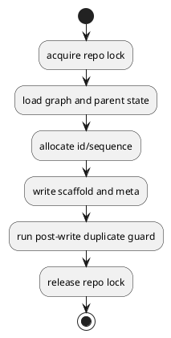
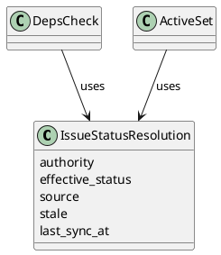
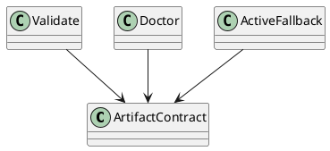
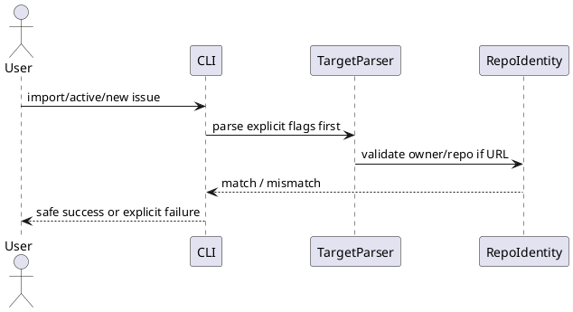

# issue-28-runtime-regression-bugs manual regression で見つかった runtime の整合性/GitHub連携不具合を修正する — 設計（HOW）

## 全体方針

今回の bugfix は、10 個の症状を個別パッチで散発的に直すのではなく、次の 4 つの設計テーマに束ねて修正する。

1. `create transaction`
2. `status/readiness contract`
3. `artifact/repair contract`
4. `GitHub targeting and CLI intent surface`

この構造にする理由は、manual regression で見つかった不具合の多くが「個別コマンド固有」ではなく「契約が弱い」ことに起因しているためである。

## 設計原則

- first fix は既存 file-based runtime を維持した additive change とする
- create の race は post-facto 検知ではなく予防を優先する
- status は `authority` と `projection/cache` を混同しない
- CLI は human 向けの簡便さより、agent/human が誤操作しにくい explicit surface を優先する
- validate / doctor / create / deps / active / import が同じ contract を共有する

## 修正テーマ

## 1. create transaction

対象:

- B01 create allocator race
- B02 discussion sequence race

### 変更方針

- `new initiative|epic|issue|doc` を共通の create transaction として扱う
- transaction の先頭で repo-global create lock を取得する
- lock 区間内で次を実施する
  - graph 読み取り
  - next id / next sequence 採番
  - scaffold 書き込み
  - post-write duplicate guard
  - result 確定

### 意図

- `load -> max+1 -> write` の gap をなくす
- id allocator と discussion sequence allocator を別物にせず、同一の safety model に揃える

### lock/failure contract

- lock scope は repo-global とする
  - node kind ごとの細分化は行わない
- lock file は spec-dock の system-internal runtime state 配下に置く
- lock acquire は bounded wait とし、取得失敗時は create を failure にする
- stale lock / crash 後 lock は `doctor` で検知・案内できるようにする
- doctor は create lock path / metadata を読める範囲で露出し、stale create lock を他の repairable finding と同じ supported path で扱う
- post-write duplicate guard failure 時は自動 rollback しない
  - file delete を伴う rollback は second failure を招きやすいため
  - transaction failure として終了し、repair guidance を返す

### 構造

### 実装境界

- application:
  - create use case に transaction 境界を追加
- infra:
  - file lock 実装
- domain:
  - id / sequence uniqueness rule は現状維持しつつ、post-write guard で再確認

### トレードオフ

- create の完全並列性は失われる
- ただし prototype 段階では correctness を優先する

## 2. status/readiness contract

対象:

- B03 local-only deps/active inconsistency
- B09 stale projection

### 変更方針

- issue status を次の概念で分離する
  - `authority`
  - `effective_status`
  - `source`
  - `stale`
  - `last_sync_at`
- local-only issue は `authority=local`、初期 `effective_status=open`、初期 `source=local`、`stale=false`
- GitHub-linked issue は `authority=github` を基本としつつ、`--github` なしの読み取りでは cached projection を返してよい
- ただし cached projection には `source=cache` を必ず伴わせる
- prototype 段階では、GitHub authority を `--github` なしで読んだ場合は `stale=true` を安全側既定とする
- `deps check` と `active set` は同じ readiness 判定を参照する
  - 最小 rule は `blockers=[]` かつ `effective_status=open`

### 意図

- `unknown` と `not ready` を混同しない
- linked issue の cached 状態を authoritative と誤認させない
- 今後の `close/reopen` や `link/unlink` に耐える status 土台を先に整える

### 構造

### 実装境界

- domain:
  - status resolution model を拡張
- application:
  - deps / active use case が共通 resolution を参照
- presentation:
  - stale/source/last_sync_at を text と json の両方へ反映

### トレードオフ

- status surface はやや複雑になる
- ただし「複雑さを隠して誤認させる」より「複雑さを contract として表に出す」方が安全

## 2.1 current repo slug parity for github-aware commands

### 変更方針

- `sync --github` だけでなく `active set --github` と `deps check --github` も同じ current repo slug-aware status resolution を使う
- current repo issue が unscoped、snapshot 側が repo-scoped の場合でも、application が current repo slug を渡せる限り current repo snapshot を正しく再結合する
- current repo slug が解決できない場合は既存の fail-closed / unknown 側へ倒す

### 意図

- command ごとの status resolution drift をなくす
- foreign repo support の追加で、通常の current repo linked issue が壊れる回帰を防ぐ

### 実装境界

- application:
  - current repo slug 解決 helper の共通化または parity 整備
  - `set_active` / `check_deps` / `sync` / `doctor` の status/validation context を揃える
- domain:
  - current repo slug を受け取った時の repo-aware snapshot binding 契約は維持

## 2.2 repo-aware numeric deps resolution

### 変更方針

- `deps.json` の bare numeric ref は後方互換のため継続して許容する
- current repo slug が解決できる場合、bare numeric ref `123` は current repo issue `current/repo#123` を優先解決する
- current repo slug を解決できず、scoped/unscoped が混在する場合だけ fail-closed にする

### 意図

- foreign overlap 許容で既存 numeric deps ref を壊さない
- `123` を current repo issue shorthand として使ってきた運用を維持する

### 実装境界

- infra:
  - `deps_reader` の bare numeric ref 解決を repo-aware 化する
- legacy app:
  - 同じ bare issue number 解決ロジックがある場合は parity を取る
- tests:
  - overlap 導入後も既存 numeric deps ref が current repo issue を指し続ける回帰を固定する

## 2.3 indexed target dedup for same-repo URL-linked GitHub reads

### 変更方針

- `sync --github` は current repo 全体を `issue_index()` で先に取得し、その snapshot key `(repo_slug, issue_number)` を indexed key として保持する
- same-repo URL-linked node でも、index に未掲載であれば fallback の `issue_view_snapshot()` を許可する
- 逆に same-repo / same issue number が index にすでに載っている場合は、per-issue `issue_view_snapshot()` を skip する
- この skip 判定は helper 化し、`sync_state` / `check_deps` / `set_active` の GitHub-aware read path で同じ基準を使う

### 意図

- same-repo URL import を foreign fetch と同列に扱ってしまうことで発生する N+1 fetch を止める
- 単純な `repo_slug == current_repo_slug` 除外ではなく、index incomplete 時の fallback fetch を残す
- current repo と foreign repo の混在 read でも、取得効率と repo-aware correctness を両立する

### 実装境界

- application:
  - indexed snapshot key 集合を作る shared helper を追加する
  - `sync_state` / `check_deps` / `set_active` で same-repo indexed target を skip し、missing target だけ `issue_view_snapshot()` する
- checked-in dogfooding runtime:
  - `spec-dock/scripts/...` に同じ helper/read path が存在する場合は parity を取る
- tests:
  - same-repo URL-linked issue が index 済みなら view fetch しない回帰
  - same-repo URL-linked issue が index 未掲載なら fallback fetch する回帰
  - mixed same-repo + foreign target でも foreign fetch が維持される回帰
  - helper を共通利用する command parity の回帰

## 3. artifact/repair contract

対象:

- B04 validate gap
- B05 repair gap
- B06 active-not-set pathway gap

### 変更方針

- node kind ごとの required artifact matrix を明文化する
- `validate` は matrix に基づき required artifact 欠損を failure とする
- 今回の issue では `doctor` コマンドを新設する
  - duplicate id/seq
  - broken meta
  - missing required artifact
  - stale active pointer
- `doctor` が graph validation を再利用する箇所では、`validate` / `sync` と同じ current repo identity context を渡し、repo-aware uniqueness 契約と診断結果が矛盾しないようにする
- active 未設定時は filesystem と CLI の両方で fallback 導線を統一する
  - `spec-dock/active` は常に解決可能な symlink とする
  - `active show` は fallback path と次アクションを返す

## 3.1 stale active pathfile healing

### 変更方針

- symlink 制限環境で通常 fallback として使う `spec-dock/active/*.path` も self-healing 対象に含める
- `_resolve_existing_active_entrypoint()` が `None` を返した stale `.path` は残置せず、一度除去したうえで既存 recovery ロジックへ流す
- persisted manifest / recovered target が有効ならそこへ、そうでなければ placeholder へ戻す

### 意図

- `update` を symlink 環境だけでなく pathfile fallback 環境でも self-healing path にする
- stale pathfile があるだけで recovery が止まる自己矛盾をなくす

### 実装境界

- installer:
  - `_ensure_active_fallback_entrypoints()` の stale pathfile 分岐を追加
- tests:
  - symlink 制限環境の stale pathfile recovery を固定する

### 意図

- validation は「壊れているか」を判断する契約
- doctor は「どう直すか」を案内する契約
- active 未設定も broken state ではなく、案内可能な known state として扱う

### required artifact matrix

- initiative:
  - `.meta.json`
  - `requirement.md`
  - `design.md`
  - `plan.md`
  - `report.md`
- epic:
  - `.meta.json`
  - `requirement.md`
  - `design.md`
  - `plan.md`
  - `report.md`
- issue:
  - `.meta.json`
  - `requirement.md`
  - `design.md`
  - `plan.md`
  - `report.md`
- discussion:
  - required artifact presence の対象外
  - discussion markdown/integrity contract（markdown file 本体の存在と seq uniqueness）を validate 対象とする

### 構造

### 実装境界

- domain:
  - graph/deps/linkage の structural invariant
- application:
  - required artifact matrix preflight
  - validate / doctor / active fallback orchestration
- presentation:
  - failure message / repair guidance / fallback guidance

### トレードオフ

- `doctor` を入れるとコマンド面は増える
- ただし read-only `.meta.json` を維持する以上、supported repair path は不可欠
- artifact matrix を application 側へ寄せるぶん preflight 呼び出し箇所は増える
- ただし domain validation API の純度と synthetic graph の検証可能性を保つ方が価値が高い

## 4. GitHub targeting and CLI intent surface

対象:

- B07 import wrong-repo risk
- B08 create UX asymmetry
- B10 numeric target ambiguity

### 変更方針

- GitHub URL を受け取るコマンドは `owner/repo` を parse し、current repo と一致検証する
- foreign repo を許す場合のみ explicit opt-in を設ける
- foreign repo を import した node には `owner/repo` identity を persisted metadata として保持し、後続の sync/deps/status refresh でも current repo と混線しないようにする
- linked GitHub uniqueness は `issue_number` 単独ではなく `normalized repo identity + issue_number` で扱い、foreign repo 同番号を same-repo duplicate と誤認しないようにする
- sync/export が保持する GitHub snapshot lookup も同じ repo-aware identity に従い、同一 `issue_number` の current/foreign snapshot が後勝ちで上書きされないようにする
- `new issue` に `--create-github-issue` を additive alias として追加する
- target 解釈が曖昧なコマンドに explicit flags を追加する
  - `--id <node-id>`
  - `--github-issue <n>`
- `--github-issue <n>` は convenience selector として残すが、repo-aware uniqueness 導入後に複数 match がありうる場合は ambiguous fail とし、確定 selector は `--id` とする
- 裸の数値は本 issue では互換維持する
  - fail 化は out of scope
  - warning または help で explicit 形へ寄せる

### 意図

- `number only` と `URL` で安全性差があることを表に出す
- implicit default を残しつつ、script/agent は explicit に指定できるようにする

### 構造

### 実装境界

- commands:
  - argparse surface の拡張
- application:
  - repo identity validation
  - persisted foreign repo identity の read/write と repo-aware refresh
  - repo-aware uniqueness preflight
- domain:
  - repo-aware GitHub linkage uniqueness validation
- presentation:
  - ambiguity / mismatch error message
  - ambiguous `--github-issue` guidance

## active entrypoint recovery

### 変更方針

- installer/update の active recovery は placeholder 再生成だけで終わらせず、persisted active manifest が健全なら `spec-dock/active/{initiative,epic,issue}` の entrypoint 自体を実 node に戻す
- `context-pack.md` は raw persisted manifest ではなく、最終的に解決できた active entrypoint 実体を source of truth として再生成する
- 既存 symlink/pathfile が健全に残っている場合も、その実体から active id を再計算し、persisted manifest 欠損・破損・stale に引きずられて `context-pack.md` だけ退行しないようにする
- persisted manifest が壊れている、または path が解決できない場合だけ placeholder fallback に落とす

### 意図

- `context-pack.md` では active に見えるのに、主導線の `spec-dock/active/*` は placeholder を向く、という recovery の自己矛盾を防ぐ
- `spec-dock update` を self-healing path として成立させる

## dogfooding runtime parity

### 変更方針

- provider-side assets で command surface を広げた時は、この repo に checked-in されている consumer workspace `spec-dock/scripts/` も同じ surface へ refresh する
- provider-side assets で repo-scoped GitHub linkage / snapshot resolution のロジックを直した時も、checked-in consumer workspace `spec-dock/scripts/` の対応 runtime file を同じ contract へ refresh する
- parity は単なる file copy の一致ではなく、`python spec-dock/scripts/spec-dock doctor --help` のような executable smoke で確認する
- `spec doctor` のように recovery guidance から直接案内される command は、dogfooding repo 上でも即座に実行できる状態を維持する
- parity regression は CLI surface だけでなく、cross-repo overlap のような runtime behavior でも checked-in consumer 実行系で固定する

### 意図

- provider 側だけ直っていて consumer mirror が古い、という dogfooding 特有の誤判定を防ぐ
- operator guidance と実際の checked-in runtime surface を一致させる
- provider-side runtime では直っているのに checked-in consumer runtime では cross-repo overlap が再発する、という parity drift を防ぐ

### checked-in runtime parity の対象

- `cli/parser.py` / `cli/registry.py` の command surface
- `application/create_node.py` の GitHub linkage uniqueness
- `application/sync_state.py` の repo-aware snapshot aggregation / resolution
- 上記を provider-side source of truth と同じ contract へ refresh し、checked-in runtime 実行テストで固定する

### トレードオフ

- flags は増える
- ただし machine-usable contract としては明示指定の方が価値が高い

## コンポーネント別の変更マップ

### commands

- `new issue` の explicit create flag 対応
- `active set` などの explicit target flags 対応
- import URL の repo-aware 解析
- `active show` の fallback guidance 強化

### application

- create transaction orchestration
- status resolution orchestration
- validate / doctor orchestration
- repo identity / target validation

### domain

- issue status resolution model
- readiness contract
- artifact contract

### infra

- repo-level file lock
- cached status / sync metadata の保持

### presentation

- stale/source/repair guidance の可視化
- ambiguity / wrong-repo / missing artifact のエラー表現

## 非採用案

- DB や常駐サービスを導入して transaction を解決する
  - prototype bugfix として過剰
- linked issue では常に GitHub fetch を強制する
  - offline/local-first と相性が悪い
- warning だけで wrong-repo import を許容する
  - silent corruption 系のリスクが高い
- `.meta.json` を単純に writable に戻す
  - 平時の accidental edit を増やすだけで、repair contract を整えない

## 検証方針

- local/stub manual regression を再実行し、duplicate id/seq と local-only readiness 不整合が再発しないことを確認する
- GitHub live manual regression を再実行し、wrong-repo risk、stale 誤認、CLI ambiguity の改善を確認する
- `validate` で required artifact 欠損が failure になることを確認する
- active 未設定時に path と CLI の両面で fallback guidance が機能することを確認する

## open questions

- なし。freshness contract は本 issue で `source / stale / last_sync_at` を必須 field として扱う
