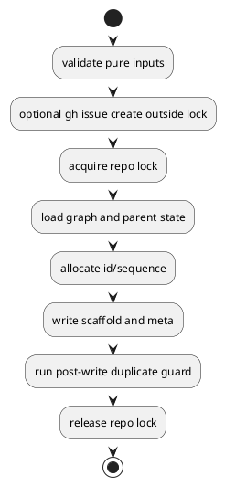
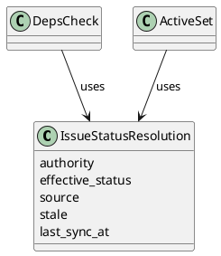
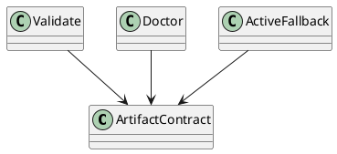
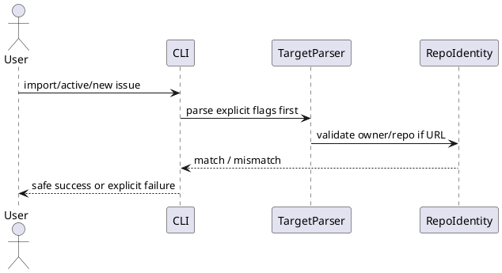

# issue-28-runtime-regression-bugs manual regression で見つかった runtime の整合性/GitHub連携不具合を修正する — 設計（HOW）

## 全体方針

今回の bugfix は、10 個の症状を個別パッチで散発的に直すのではなく、次の 4 つの設計テーマに束ねて修正する。

1. `create transaction`
2. `status/readiness contract`
3. `artifact/repair contract`
4. `GitHub targeting and CLI intent surface`

この構造にする理由は、manual regression で見つかった不具合の多くが「個別コマンド固有」ではなく「契約が弱い」ことに起因しているためである。

## 設計原則

- first fix は既存 file-based runtime を維持した additive change とする
- create の race は post-facto 検知ではなく予防を優先する
- status は `authority` と `projection/cache` を混同しない
- CLI は human 向けの簡便さより、agent/human が誤操作しにくい explicit surface を優先する
- validate / doctor / create / deps / active / import が同じ contract を共有する

## 修正テーマ

## 1. create transaction

対象:

- B01 create allocator race
- B02 discussion sequence race
- create-like import write path の atomicity gap

### 変更方針

- `new initiative|epic|issue|doc` と create-like な `import issue` を共通の create transaction として扱う
- repo-global create lock は local graph-derived mutation boundary にだけ適用する
- `new initiative|epic|issue` の create mode で実行される `gh issue create` は lock 外で実行し、lock 内には入れない
- lock 区間内で次を実施する
  - graph 読み取り
  - next id / next sequence 採番
  - create-like import の uniqueness 再検証
  - scaffold 書き込み
  - post-write duplicate guard
  - result 確定
- `import issue` では次を lock の外に残す
  - URL / repo identity 解析
  - required artifact preflight
  - GitHub issue metadata fetch
- `new initiative|epic|issue` の create mode でも次を lock の外に残す
  - pure input validation
  - read-only graph preflight で判定できる stable tree/parent validation
  - graph-independent minimal body による GitHub issue create
- pure input validation には少なくとも次を含める
  - `--id` と GitHub mode の併用禁止
  - required parent selector (`--initiative` / `--epic`) の欠落
  - `github_repo_owner` / `github_repo_name` の片側欠落
- pre-GitHub graph preflight には少なくとも次を含める
  - `load_graph(...)` により判定できる stable tree viability
  - `new epic` の parent initiative existence
  - `new issue` の parent epic existence
- ただし pre-GitHub graph preflight は advisory ではなく no-side-effect fail-fast に使う一方、authoritative な parent resolution と uniqueness 判定は lock 内で再実行する
- ただし、graph 依存の uniqueness 判定と node planning は lock 内で再実行する
- `new initiative|epic|issue` の create mode で `gh issue create` 完了後に local create が失敗した場合は、phase を問わず created GitHub issue number を含む failure surface と kind-aware retry/link guidance を返す
- ただし `gh issue create` 後の failure surface は一枚岩ではなく、outcome class ごとに guidance を分ける
  - `remote-only failure` と `local-write-committed cleanup failure` を同じ rerun hint で扱わない

### 意図

- `load -> max+1 -> write` の gap をなくす
- import/create 間で stale graph を共有したまま uniqueness check をすり抜ける gap をなくす
- id allocator と discussion sequence allocator を別物にせず、同一の safety model に揃える
- external GitHub latency を repo-wide local create contention に拡大しない

### lock/failure contract

- lock scope は repo-global とする
  - node kind ごとの細分化は行わない
- lock file は spec-dock の system-internal runtime state 配下に置く
- lock acquire は bounded wait とし、取得失敗時は create を failure にする
- stale lock / crash 後 lock は `doctor` で検知・案内できるようにする
- doctor は create lock path / metadata を読める範囲で露出し、stale create lock を他の repairable finding と同じ supported path で扱う
- create lock 系の failure message は repo-local shortcut `./spec` や repo-root-relative path を前提にせず、managed repo root から導出した cwd-independent な doctor command surface を案内する
- post-write duplicate guard failure 時は自動 rollback しない
  - file delete を伴う rollback は second failure を招きやすいため
  - transaction failure として終了し、repair guidance を返す
- post-write duplicate guard は full graph invariant を再検証するものではない
  - 役割は「書いた node id が reread で materialize していること」と exact duplicate id の異常を最終境界で検知すること
  - repo-aware GitHub linkage uniqueness などの graph 依存判定は lock 内の pre-write uniqueness 再検証で担保する
- `gh issue create` 後の error surface は outcome matrix として扱う
  - `pre_github_fail`
  - `post_github_remote_only_fail`
  - `post_github_local_write_fail`
  - `post_github_local_write_success_cleanup_fail`
  - `post_github_body_and_cleanup_fail`
- guidance 生成は exception site ごとの ad-hoc 分岐ではなく、上記 outcome class と evidence から組み立てる
- evidence には少なくとも次を含める
  - `created_github_issue_number`
  - `kind`
  - `title`
  - parent selector 再構成に必要な request context
  - local write committed 済みか
  - cleanup failure の有無
- `post_github_remote_only_fail`
  - rerun/link guidance を返してよい
- `post_github_local_write_fail`
  - local write 未コミット枝では rerun/link guidance を返してよい
  - local write committed 済み枝では doctor-first guidance を返し、blind rerun を促さない
- `post_github_local_write_success_cleanup_fail`
  - raw `release_error` へ退行させない
  - `create は成功している可能性が高い` と明示し、blind rerun ではなく local node / `doctor` 確認を優先させる
- `post_github_body_and_cleanup_fail`
  - primary local failure と cleanup failure を併記しつつ、outcome class に応じた guidance を返す

### 構造

### 1.1 create intermediate state model

### 変更方針

- create-like write の local progress は単一 bool ではなく phase として扱う
  - `none`
  - `scaffold_copied`
  - `meta_written`
  - `post_write_verified`
- post-create guidance は `どこで例外が起きたか` ではなく `どこまで local state が進んだか` で分岐する
- `execute_create_plan()` 途中失敗でも partial local write を evidence として保持できるようにする
- 同じ phase model を `new` と create-like `import` の両方で再利用する

### 意図

- `copy 成功 / meta 失敗` を remote-only failure と誤分類しない
- blind rerun が unsafe になる枝を phase contract で明示化する

### state evidence

- application:
  - phase evidence の収集
  - outcome/guidance builder への phase 伝播
- infra:
  - copy / meta write の事実を返す
- tests:
  - partial write / meta failure / post-write verify failure を別ケースで固定する

### 実装境界

- application:
  - create use case に transaction 境界を追加
- infra:
  - file lock 実装
- domain:
  - id / sequence uniqueness rule は現状維持しつつ、post-write guard で再確認

### トレードオフ

- create の完全並列性は失われる
- ただし prototype 段階では correctness を優先する
- `gh issue create` 後に local write が失敗すると orphan issue は残りうる
  - ただし現行でも local write failure 後の remote rollback は未実装であり、今回の corrective fix は lock scope 是正を優先する
- pre-GitHub graph precheck は stable parent absence を減らすが、lock 取得後の graph 変化までは防げない
- `new initiative|epic|issue` の create mode で `gh issue create` 完了後の lock acquire timeout / stale failure、parent/uniqueness revalidation failure、write failure でも remote-only side effect は起こりうる
  - そのため error には created issue number を含め、managed repo root から導出した CLI entrypoint を prefix にしたうえで、`--title` と必要な parent selector を含む runnable な retry/link guidance を返す
- pre-lock GitHub body は graph-independent minimal body とする
  - 少なくとも kind は表現する
  - `Epic:` / `Initiative:` など graph 依存の親文脈は pre-lock body に入れない
- outcome matrix を導入すると create failure surface の実装は少し厚くなる
  - ただし review-driven な枝修正を繰り返すより、message / guidance / parity test を中央集約した方が再発率を下げられる

## 2. status/readiness contract

対象:

- B03 local-only deps/active inconsistency
- B09 stale projection

### 変更方針

- issue status を次の概念で分離する
  - `authority`
  - `effective_status`
  - `source`
  - `stale`
  - `last_sync_at`
- local-only issue は `authority=local`、初期 `effective_status=open`、初期 `source=local`、`stale=false`
- GitHub-linked issue は `authority=github` を基本としつつ、`--github` なしの読み取りでは cached projection を返してよい
- ただし cached projection には `source=cache` を必ず伴わせる
- prototype 段階では、GitHub authority を `--github` なしで読んだ場合は `stale=true` を安全側既定とする
- `deps check` と `active set` は同じ readiness 判定を参照する
  - 最小 rule は `blockers=[]` かつ `effective_status=open`
- `deps check` の `target_status` は target 自身の resolved status を返し、initiative / epic target でも `unknown/stale` へ退行しない

### 意図

- `unknown` と `not ready` を混同しない
- linked issue の cached 状態を authoritative と誤認させない
- 今後の `close/reopen` や `link/unlink` に耐える status 土台を先に整える

### 構造

### 実装境界

- domain:
  - status resolution model を拡張
- application:
  - deps / active use case が共通 resolution を参照
- presentation:
  - stale/source/last_sync_at を text と json の両方へ反映

### トレードオフ

- status surface はやや複雑になる
- ただし「複雑さを隠して誤認させる」より「複雑さを contract として表に出す」方が安全
- `deps check` inspection には issue graph の node states と target 自身の status payload が混在する
  - ただし presentation 側で別経路解決するより、inspection 契約に target status を含める方が責務が明確

## 2.1 current repo slug parity for github-aware commands

### 変更方針

- `sync --github` だけでなく `active set --github` と `deps check --github` も同じ current repo slug-aware status resolution を使う
- current repo issue が unscoped、snapshot 側が repo-scoped の場合でも、application が current repo slug を渡せる限り current repo snapshot を正しく再結合する
- current repo slug が解決できない場合は既存の fail-closed / unknown 側へ倒す

### 意図

- command ごとの status resolution drift をなくす
- foreign repo support の追加で、通常の current repo linked issue が壊れる回帰を防ぐ

### 実装境界

- application:
  - current repo slug 解決 helper の共通化または parity 整備
  - `set_active` / `check_deps` / `sync` / `doctor` の status/validation context を揃える
- domain:
  - current repo slug を受け取った時の repo-aware snapshot binding 契約は維持

## 2.2 repo-aware numeric deps resolution

### 変更方針

- `deps.json` の bare numeric ref は後方互換のため継続して許容する
- current repo slug が解決できる場合、bare numeric ref `123` は current repo issue `current/repo#123` を優先解決する
- current repo slug を解決できず、scoped/unscoped が混在する場合だけ fail-closed にする

### 意図

- foreign overlap 許容で既存 numeric deps ref を壊さない
- `123` を current repo issue shorthand として使ってきた運用を維持する

### 実装境界

- infra:
  - `deps_reader` の bare numeric ref 解決を repo-aware 化する
- legacy app:
  - 同じ bare issue number 解決ロジックがある場合は parity を取る
- tests:
  - overlap 導入後も既存 numeric deps ref が current repo issue を指し続ける回帰を固定する

## 2.3 indexed target dedup for same-repo URL-linked GitHub reads

### 変更方針

- `sync --github` は current repo 全体を `issue_index()` で先に取得し、その snapshot key `(repo_slug, issue_number)` を indexed key として保持する
- same-repo URL-linked node でも、index に未掲載であれば fallback の `issue_view_snapshot()` を許可する
- 逆に same-repo / same issue number が index にすでに載っている場合は、per-issue `issue_view_snapshot()` を skip する
- この skip 判定は helper 化し、`sync_state` / `check_deps` / `set_active` の GitHub-aware read path で同じ基準を使う

### 意図

- same-repo URL import を foreign fetch と同列に扱ってしまうことで発生する N+1 fetch を止める
- 単純な `repo_slug == current_repo_slug` 除外ではなく、index incomplete 時の fallback fetch を残す
- current repo と foreign repo の混在 read でも、取得効率と repo-aware correctness を両立する

### 実装境界

- application:
  - indexed snapshot key 集合を作る shared helper を追加する
  - `sync_state` / `check_deps` / `set_active` で same-repo indexed target を skip し、missing target だけ `issue_view_snapshot()` する
- checked-in dogfooding runtime:
  - `spec-dock/scripts/...` に同じ helper/read path が存在する場合は parity を取る
- tests:
  - same-repo URL-linked issue が index 済みなら view fetch しない回帰
  - same-repo URL-linked issue が index 未掲載なら fallback fetch する回帰
  - mixed same-repo + foreign target でも foreign fetch が維持される回帰
  - helper を共通利用する command parity の回帰

## 2.4 current-repo fallback fetch for unscoped initiative/epic links

### 変更方針

- `collect_repo_scoped_issue_view_targets()` は persisted `repo_owner/repo_name` を持つ node だけでなく、current repo slug が解決できる unscoped linked `initiative` / `epic` / `issue` も fallback fetch 対象へ含める
- indexed key 判定は引き続き `(repo_slug, issue_number)` で行い、current repo index 済み target は skip し、index 未掲載 target だけ `issue_view_snapshot(repo_slug=current_repo_slug)` を送る
- この helper は `sync_state` / `set_active` / `check_deps` の GitHub-aware read path で共通利用し、current repo linked epic / initiative でも fallback fetch の解決基準を揃える

### 意図

- `new ... --create-github-issue` で作られた unscoped current-repo linked epic / initiative が index limit 超過時に `unknown/stale` へ退行するのを防ぐ
- same-repo indexed target dedup 契約を壊さず、missing current-repo target にだけ cheap で明示的な fallback fetch を許す
- `gh_index_incomplete` warning 自体は既存どおり issue-centric な surface に留め、今回の corrective scope では status recovery 契約だけを拡張する

### 実装境界

- application:
  - `github_issue_targets` helper に `current_repo_slug` を受け渡し、unscoped current-repo linked node を `(current_repo_slug, issue_number)` として fallback target 化する
  - `sync_state` / `set_active` / `check_deps` から同 helper へ `current_repo_slug` を渡す
- checked-in dogfooding runtime:
  - 同 helper / call site が checked-in runtime に存在する場合は parity を取る
- tests:
  - unscoped current-repo linked epic / initiative が index 未掲載時に view fetch fallback で status を回復する回帰
  - foreign same-number coexistence でも current-repo fallback と foreign scoped fetch が混線しない回帰

## 2.5 current-repo-aware numeric branch inference

### 変更方針

- `infer_active_node_from_branch()` の numeric fallback は bare `github_issue_number` 一致だけで候補集合を作らず、`current_repo_slug` が解決できるときは `(current_repo_slug or explicit repo slug, issue_number)` を使って current repo candidate を優先する
- `current_repo_slug` が解決できる場合、current repo scope candidate が 0 件なら foreign-only numeric match へは落ちず fail-closed にする
- `current_repo_slug` が解決できる場合、current repo scope candidate が複数なら scoped ambiguity として fail-closed にする
- branch 文字列に explicit node id がある場合の優先順位は維持し、numeric fallback のみ repo-aware 化する
- `sync_state.maybe_auto_update_from_branch()` は current repo slug を解決して domain inference へ渡し、slug 不明時だけ既存の ambiguity / no-match fail-closed を維持する

### 意図

- foreign overlap 許容で numeric branch naming (`123-fix-login`, `issue-123`) を壊さない
- current repo issue を対象にした既存の active auto-update 導線を、repo-aware uniqueness 導入後も保つ

### 実装境界

- domain:
  - branch inference の numeric fallback を repo-aware candidate selection へ更新する
- application:
  - `sync_state` から current repo slug を伝播する
- checked-in dogfooding runtime:
  - checked-in runtime に同 inference path がある場合は parity を取る
- tests:
  - current repo `#123` と foreign `other/repo#123` が共存しても numeric branch が current repo node を指し続ける回帰
  - current repo slug が既知で foreign-only numeric match しかない場合は fail-closed に倒れる回帰

## 2.6 no-origin continuity via current-repo linkage normalization

### 変更方針

- current repo slug を解決できる write path では、current-repo linked node を unscoped のまま保存せず、`github.repo_owner/name` を current repo slug で明示保存する
- current corrective scope では、bulk `sync --github` のような target-less mutate path を trusted current-repo evidence source と扱わず、legacy unscoped linkage の sync-time backfill contract を持たない
- legacy unscoped linkage に対する mutate-time backfill を将来再導入するなら、explicit request intent または persisted provenance のような trusted context がある場合に限って safe backfill を行う
- no-origin では新しい heuristic 推測を増やさず、正規化済み metadata を使って repo-aware validation / deps / sync を継続させる
- current repo slug を解決できず、なお mixed scoped/unscoped が残る graph だけ fail-closed を維持する

### safe backfill predicate

- eligible:
  - node が `github.issue_number` を持つ
  - `github.repo_owner` / `github.repo_name` が両方 absent で、partial scope ではない
  - current repo slug を解決できる
  - explicit request intent または persisted provenance のような trusted context がある
  - trusted context は current repo 所属を positive に示すものであり、「current repo と仮定しても衝突しない」だけでは足りない
- ineligible:
  - current repo slug を解決できない
  - lone unscoped legacy linkage を bulk `sync --github` のような target-less mutate path から扱う場合
  - `github.repo_owner` または `github.repo_name` の片側だけが入った partial scope
  - `current_repo_slug` 単独、issue-number uniqueness、same-number foreign scoped coexistence、current repo `issue_index()` の存在しか evidence がなく、current repo 所属を positive に示せない場合
  - same `(current_repo_slug, issue_number)` に属しうる unscoped node が複数ある
  - explicit current-repo scoped duplicate が既に存在する
  - backfill 後も effective current-repo linkage key が一意にならない

### normalization flow

- write-time normalization:
  - create / import / link のように current repo issue を新規に persisted metadata へ書く path では、slug が解決できる限り最初から explicit scope を保存する
- mutate-time backfill:
  - current corrective scope では、bulk `sync --github` は metadata 更新責務を持っていても trusted current-repo evidence を生成できないため、legacy unscoped node を mutate しない
  - mutate-time backfill を再導入するなら、explicit target intent か persisted provenance を request contract として渡せる call path に限定する
  - backfill は metadata normalization に限定し、target selection convenience や no-origin heuristic 推測は増やさない
- read-side continuity:
  - no-origin では正規化済み explicit scope をそのまま読み、validation / deps / doctor / sync preflight の repo-aware uniqueness を継続する
  - safe predicate を満たさない legacy mixed scope は従来どおり fail-closed に残し、「正規化できない曖昧 graph」であることを error/doctor guidance へ渡す

### metadata permission contract

- `.meta.json` は persisted metadata として readonly lock policy を持ち、write-time create と helper-level metadata mutation が同じ lock/unlock 契約を共有する
- readonly 化は `write_meta()` だけのローカル事情ではなく、将来 explicit trusted context を伴う mutate path や isolated helper verification が一時 writable 化して更新し、成功後に意図した lock state へ戻せることまで含めた contract とする
- current corrective scope では Windows を含む cross-platform 契約として扱い、`write_meta()` が readonly 化した `.meta.json` を `backfill_github_repo_scope()` helper が OS 差分だけで書き換え不能にしない
- successful create/helper-backfill 後の final `.meta.json` lock state は「その時点の persisted metadata は readonly に揃える」を正とし、`write_meta()` / `backfill_github_repo_scope()` とも成功時に same final readonly state を残す
- permission helper は汎用 filesystem abstraction ではなく `.meta.json` mutation 専用に留め、次の責務だけを持つ
  - 現在の lock state / mode を読む
  - 必要なら一時 writable 化する
  - metadata write を実行する
  - 成功後に final readonly lock state へ戻す
  - restore/relock failure は既存 `readonly_lock_failed` warning surface と整合する形で返し、metadata write 自体が成功している場合は warning として観測できる
- bulk `sync --github` 自体は current corrective scope で helper を呼ばないが、permission helper failure を silent skip せず failure surface に乗せてよい、という helper-level 契約は維持する
- conflicting scope / partial scope / ambiguous candidate の fail-closed policy と、permission helper の writable/readonly 制御は別責務として保つ

### 意図

- fail-closed safety を崩さずに、copy / temp checkout / exported workspace の継続運用性を確保する
- current repo と確定できる linkage は write-time に explicit scope 化し、no-origin で自滅する状態を防ぐ
- positive evidence がない legacy linkage を current repo へ silent mutation しない
- readonly metadata lock policy と supported mutate path の契約 drift を防ぎ、Windows でも self-healing を同じ surface で使えるようにする

### 実装境界

- write path:
  - current repo issue を link/create/import する時点で explicit `repo_owner/name` を保存する
- normalization path:
  - current corrective scope では bulk `sync --github` の dead sync-time backfill path を撤去し、legacy unscoped current-repo linkage は fail-closed / manual remediation に残す
  - 将来の mutate-time backfill は explicit trusted context を運べる call path に限る
- permission path:
  - `write_meta()` と `backfill_github_repo_scope()` は `.meta.json` mutation 専用 helper を共有し、Windows / posix の両方で readonly file を一時 writable 化して更新後に lock state を戻す
- validation / deps / doctor:
  - no-origin では normalized metadata を用いて継続し、真に不明な mixed scope のみ fail-closed に残す
- tests:
  - current-origin で write-time normalize 済み metadata が no-origin copy 後も `sync --github` / `validate` / `doctor` で継続できる回帰
  - 同じ正規化済み metadata を使って no-origin `deps check` も継続できる回帰
  - create/import 直後の newly persisted current-repo linkage が explicit scope を持つ回帰
  - lone unscoped legacy linkage は bulk `sync --github` で current repo scope へ silent backfill されない回帰
  - same-number foreign scoped coexistence があるだけでは lone unscoped node を backfill しない回帰
  - current repo `issue_index()` の存在だけでは lone unscoped node を backfill しない回帰
  - overlap 下でも canonical GitHub URL target と `--id` selector は no-origin 継続で exact resolution を維持する回帰
  - normalized metadata がある状態でも bare numeric / `--github-issue` の overlap fail-closed は維持される回帰
  - truly ambiguous legacy mixed scope graph は no-origin で引き続き fail-closed に倒れる回帰
  - current repo scope に複数 numeric match がある場合は scoped ambiguity として fail-closed に倒れる回帰
  - current repo slug 不明時は ambiguity fail-closed を維持する回帰
  - readonly `.meta.json` backfill helper 自体は isolated helper contract として Windows 相当契約でも成功し、更新後に final lock state を維持する回帰
  - relock/restore failure が起きても metadata write 成功時は `readonly_lock_failed` warning surface で観測できる回帰
  - checked-in dogfooding runtime でも readonly `.meta.json` backfill の permission contract が parity を保つ回帰

## 3. artifact/repair contract

対象:

- B04 validate gap
- B05 repair gap
- B06 active-not-set pathway gap

### 変更方針

- node kind ごとの required artifact matrix を明文化する
- `validate` は matrix に基づき required artifact 欠損を failure とする
- 今回の issue では `doctor` コマンドを新設する
  - duplicate id/seq
  - broken meta
  - missing required artifact
  - stale active pointer
- `doctor` が graph validation を再利用する箇所では、`validate` / `sync` と同じ current repo identity context を渡し、repo-aware uniqueness 契約と診断結果が矛盾しないようにする
- active 未設定時は filesystem と CLI の両方で fallback 導線を統一する
  - `spec-dock/active` は常に解決可能な symlink とする
  - `active show` は fallback path と次アクションを返す

## 3.1 create-in-progress / partial-write diagnosis

### 変更方針

- `load_node_records()` の missing `.meta.json` 判定は create state と切り離して扱わない
- create lock が存在し、node-like directory の `.meta.json` が未生成な場合は `create_in_progress` / `stale_create_lock` 系の診断へ寄せる
- lock が無い missing `.meta.json` は従来どおり corruption / missing artifact として扱う
- `doctor` / `validate` / `sync` は reader 側 classification を共有し、create 中間相に対して misleading な corruption guidance を出さない

### 意図

- create 中の一時状態と恒久 corruption を分ける
- stale create lock と partial write を同じ state model で観測できるようにする

### 実装境界

- infra:
  - reader が create lock と missing meta を合わせて分類する
- application:
  - doctor / validate / sync が分類結果を supported guidance へ写像する
- tests:
  - read-only command と in-progress scaffold の race を固定する

## 3.2 stale active pathfile healing

### 変更方針

- symlink 制限環境で通常 fallback として使う `spec-dock/active/*.path` も self-healing 対象に含める
- `_resolve_existing_active_entrypoint()` が `None` を返した stale `.path` は残置せず、一度除去したうえで既存 recovery ロジックへ流す
- persisted manifest / recovered target が有効ならそこへ、そうでなければ placeholder へ戻す

### 意図

- `update` を symlink 環境だけでなく pathfile fallback 環境でも self-healing path にする
- stale pathfile があるだけで recovery が止まる自己矛盾をなくす

### 実装境界

- installer:
  - `_ensure_active_fallback_entrypoints()` の stale pathfile 分岐を追加
- tests:
  - symlink 制限環境の stale pathfile recovery を固定する

### 意図

- validation は「壊れているか」を判断する契約
- doctor は「どう直すか」を案内する契約
- active 未設定も broken state ではなく、案内可能な known state として扱う

### required artifact matrix

- initiative:
  - `.meta.json`
  - `requirement.md`
  - `design.md`
  - `plan.md`
  - `report.md`
- epic:
  - `.meta.json`
  - `requirement.md`
  - `design.md`
  - `plan.md`
  - `report.md`
- issue:
  - `.meta.json`
  - `requirement.md`
  - `design.md`
  - `plan.md`
  - `report.md`
- discussion:
  - required artifact presence の対象外
  - discussion markdown/integrity contract（markdown file 本体の存在と seq uniqueness）を validate 対象とする

### 構造

### 実装境界

- domain:
  - graph/deps/linkage の structural invariant
- application:
  - required artifact matrix preflight
  - validate / doctor / active fallback orchestration
- presentation:
  - failure message / repair guidance / fallback guidance

### トレードオフ

- `doctor` を入れるとコマンド面は増える
- ただし read-only `.meta.json` を維持する以上、supported repair path は不可欠
- artifact matrix を application 側へ寄せるぶん preflight 呼び出し箇所は増える
- ただし domain validation API の純度と synthetic graph の検証可能性を保つ方が価値が高い

## 4. GitHub targeting and CLI intent surface

対象:

- B07 import wrong-repo risk
- B08 create UX asymmetry
- B10 numeric target ambiguity

### 変更方針

- GitHub URL を受け取るコマンドは `owner/repo` を parse し、current repo と一致検証する
- foreign repo を許す場合のみ explicit opt-in を設ける
- foreign repo を import した node には `owner/repo` identity を persisted metadata として保持し、後続の sync/deps/status refresh でも current repo と混線しないようにする
- linked GitHub uniqueness は `issue_number` 単独ではなく `normalized repo identity + issue_number` で扱い、foreign repo 同番号を same-repo duplicate と誤認しないようにする
- sync/export が保持する GitHub snapshot lookup も同じ repo-aware identity に従い、同一 `issue_number` の current/foreign snapshot が後勝ちで上書きされないようにする
- `new issue` に `--create-github-issue` を additive alias として追加する
- target 解釈が曖昧なコマンドに explicit flags を追加する
  - `--id <node-id>`
  - `--github-issue <n>`
- `--github-issue <n>` は convenience selector として残すが、repo-aware uniqueness 導入後に複数 match がありうる場合は ambiguous fail とし、確定 selector は `--id` とする
- 裸の数値は本 issue では互換維持する
  - fail 化は out of scope
  - warning または help で explicit 形へ寄せる

### 意図

- `number only` と `URL` で安全性差があることを表に出す
- implicit default を残しつつ、script/agent は explicit に指定できるようにする

### 構造

### 実装境界

- commands:
  - argparse surface の拡張
- application:
  - repo identity validation
  - persisted foreign repo identity の read/write と repo-aware refresh
  - repo-aware uniqueness preflight
- domain:
  - repo-aware GitHub linkage uniqueness validation
- presentation:
  - ambiguity / mismatch error message
  - ambiguous `--github-issue` guidance

## 4.1 repo-scoped exact target surface

### 変更方針

- `TargetRef` は bare number と repo-scoped URL target を同じ shape に潰さず、repo scope を保持できる値オブジェクトへ拡張する
- `parse_active_like_target()` は canonical GitHub URL のときだけ `owner/repo` を抽出して target に保持する
- `active set` / `deps check` の target 解決は repo scope がある場合 exact match、ない場合だけ従来の unscoped selector として扱う

### 意図

- foreign URL target を current repo の同番号 node と取り違えない
- bare numeric selector の後方互換を保ちつつ、URL が持つ disambiguation 情報を失わない

### 実装境界

- commands:
  - target parser と explicit flag surface
- application:
  - repo-aware target resolution
- tests:
  - same-number current/foreign coexistence 下の URL target exact resolution

## 4.2 scoped dependency reference contract

### 変更方針

- bare numeric dependency ref は current-repo-only shorthand として維持する
- foreign issue を dependency にしたい場合の explicit syntax を追加する
  - `owner/repo#123`
  - canonical GitHub issue URL
- docs / error message は bare shorthand と scoped ref の意味差を明示する

### 意図

- overlap ambiguity を fail-closed のまま保ちつつ、foreign issue dependency の表現力を持たせる
- current repo 向け shorthand を silent foreign fallback に変えない

### 実装境界

- infra:
  - deps ref parser / resolver
- docs:
  - dependency ref syntax を reference docs へ反映する
- tests:
  - bare shorthand current-repo-only
  - scoped ref exact-foreign resolution

## 4.3 manual verification topology for repo scope and active recovery

### 変更方針

- 今回ラウンドの手動テストは、local baseline、mixed live current-origin、no-origin copied、pathfile parity の 4 workspace を分離し、`current_repo_slug` あり/なし、foreign repo URL、`.path` fallback の条件を切り分けて観測する
- `active set` / `deps check` の canonical GitHub URL target は、`origin` がある時は current/foreign repo scope を exact に見分け、`origin` がない時は URL 自体が持つ `owner/repo` 情報を失わずに unique linked node を解決できるかを確認対象に含める
- `spec-dock update` の active recovery は、persisted active manifest の `path` が same-layer の別 node を指す stale 条件でも wrong-node repoint を起こさず、id-based recovery か placeholder fallback に倒れることを手動でも確認する
- 手動テスト成果物は `manual-tests/` 配下の round-specific workspace / report に分離し、`checklist.md` / `execution-log.md` / `summary.md` の 3 点セットで evidence を残す

### トポロジ

- workspace A: local baseline
  - fresh local repo
  - create / validate / doctor / local-only deps / active の基線確認
- workspace B: mixed live current-origin
  - `origin` を持つ fresh GitHub test repo
  - same-repo URL import、same-repo numeric/bare target、current-repo scoped resolution を確認する主 workspace
  - foreign repo fixture URL もこの workspace B から扱い、`MT-00` の fixture seed と `MT-02` から `MT-04` の same-repo / foreign-repo / live churn cases を実行する
- workspace C: no-origin copy
  - workspace B を copy し、`git remote origin` を外した派生 repo
  - workspace B で作った same-number overlap fixture と imported linked node を引き継いだまま、`MT-05` の no-origin continuation と `MT-07` の resume-after-copy-update phase を実行する
  - canonical GitHub URL target が no-origin 条件でも unscoped linked node を解決できるか、foreign-only fallback や hard mismatch に誤って倒れないかを確認する
- workspace D: no-origin pathfile parity
  - workspace C を複製した dedicated parity workspace
  - helper launcher で active entrypoint write 時だけ `os.symlink` を `OSError` に倒し、`MT-06` の `.path` fallback evidence を isolation して採る

### fixture contract

- current repo role と foreign repo role には、少なくとも同じ issue number を 4 組以上作る
  - exploratory round では minimum を引き上げ、各 repo に少なくとも 6 issue を作る
  - 推奨: current `#1` から `#4`、foreign `#1` から `#4` を overlap 比較用、`#5` / `#6` を live churn 用に使う
- same-repo / foreign / no-origin の live case は、同じ overlap issue pair を再利用して repo-scope・freshness・identity 保持を比較する
- `MT-06` では stale active manifest の wrong-id path と、`expected_id` が解決できるケース / 解決できないケースの両方を作る
- exploratory long-run case では、複数 initiative / epic / issue を跨ぎ、issue だけでなく epic にも dependency を登録し、close / reopen / import / copy / update をまたぐ churn を観測する

### completion contract

- repo-scoped URL verification は `active set <canonical-url>` と `deps check <canonical-url>` の両方で evidence を残す
- live GitHub verification では `sync --github` と status/readiness 観測を mutation 前後で必須化する
- stale active recovery は id-based recovery と placeholder fallback の両分岐を別 evidence として残す
- active entrypoint parity は symlink / `.path` fallback の両方で `context-pack.md` と `spec-dock/active/*` の一致を記録する
- recovery / parity evidence は generic 成功ログではなく、`context-pack.md` と `spec-dock/active/{initiative,epic,issue}` の対応関係を case record に明示する
- organic long-run session は 1 本で終わらせず、build-up / churn / resume-after-copy-update の 3 checkpoint を持つ

### 意図

- 自動テストで通っている条件に加えて、実運用で起きやすい「コピーした workspace」「stale active path」「same-number current/foreign coexistence」を操作列として再現する
- GitHub review で指摘された repo-scope / no-origin 境界を、実 repo / 実 issue / 実 persisted state で確認できる状態を先に作る

### 実装境界

- issue docs:
- 手動テストの scope / topology / completion contract を固定する
- manual-tests:
  - workspace scaffold 4 種
  - checklist / execution log / summary template
- live fixtures:
  - current-repo role 用 GitHub repo 1 つ
  - foreign-repo role 用 GitHub repo 1 つ
  - overlap corpus と churn corpus を分けて seed する

## active entrypoint recovery

### 変更方針

- installer/update の active recovery は placeholder 再生成だけで終わらせず、persisted active manifest が健全なら `spec-dock/active/{initiative,epic,issue}` の entrypoint 自体を実 node に戻す
- `spec-dock/system/active-none/{layer}` を向く placeholder entrypoint は healthy active state ではなく recoverable fallback と扱い、persisted active manifest から実 node を解決できる時は `continue` せず張り替える
- `context-pack.md` は raw persisted manifest ではなく、最終的に解決できた active entrypoint 実体を source of truth として再生成する
- 既存 symlink/pathfile が健全に残っている場合も、その実体から active id を再計算し、persisted manifest 欠損・破損・stale に引きずられて `context-pack.md` だけ退行しないようにする
- persisted manifest が壊れている、または path が解決できない場合だけ placeholder fallback に落とす
- persisted manifest の `path` は prefix-based fallback (`iss-` / `epic-` / `init-`) だけで信用せず、`.meta.json` の `id` / `type` が manifest entry と一致する時だけ recovery target として採用する
- same-layer の別 node を誤採用しないため、`path` が存在しても id mismatch なら `path` fallback は破棄し、`expected_id` による探索か placeholder fallback へ倒す

### 意図

- `context-pack.md` では active に見えるのに、主導線の `spec-dock/active/*` は placeholder を向く、という recovery の自己矛盾を防ぐ
- `spec-dock update` を self-healing path として成立させる

## dogfooding runtime parity

### 変更方針

- provider-side assets で command surface を広げた時は、この repo に checked-in されている consumer workspace `spec-dock/scripts/` も同じ surface へ refresh する
- provider-side assets で repo-scoped GitHub linkage / snapshot resolution のロジックを直した時も、checked-in consumer workspace `spec-dock/scripts/` の対応 runtime file を同じ contract へ refresh する
- parity は単なる file copy の一致ではなく、`python spec-dock/scripts/spec-dock doctor --help` のような executable smoke で確認する
- `spec doctor` のように recovery guidance から直接案内される command は、dogfooding repo 上でも即座に実行できる状態を維持する
- parity regression は CLI surface だけでなく、cross-repo overlap のような runtime behavior でも checked-in consumer 実行系で固定する

### 意図

- provider 側だけ直っていて consumer mirror が古い、という dogfooding 特有の誤判定を防ぐ
- operator guidance と実際の checked-in runtime surface を一致させる
- provider-side runtime では直っているのに checked-in consumer runtime では cross-repo overlap が再発する、という parity drift を防ぐ

### checked-in runtime parity の対象

- `cli/parser.py` / `cli/registry.py` の command surface
- `application/create_node.py` の GitHub linkage uniqueness
- `application/sync_state.py` の repo-aware snapshot aggregation / resolution
- `application/import_node.py` の preflight validate 契約
- `presentation/json_state.py` の repo-aware GitHub snapshot fallback rendering
- `infra/deps_reader.py` の repo-aware numeric dependency resolution
- 上記を provider-side source of truth と同じ contract へ refresh し、checked-in runtime 実行テストで固定する

### checked-in runtime parity の実行証跡

- checked-in consumer runtime の parity は importable helper の unit test だけで閉じたとみなさない
- `spec-dock/scripts/spec-dock` を subprocess 実行し、少なくとも次を固定する
  - `import issue <url>` が required artifact 欠損時に create 前の preflight で止まり、新規 node を残さない
  - `sync --force` が required artifact 欠損時に warning degradation しつつ `.agent/index.json` / `.agent/tree.json` の `deps.valid=false` と `deps.error` を保持する
  - structure error と artifact 欠損が同時にある時、`validate` / `doctor` / `sync` は structure error を優先する

### トレードオフ

- flags は増える
- ただし machine-usable contract としては明示指定の方が価値が高い

## コンポーネント別の変更マップ

### commands

- `new issue` の explicit create flag 対応
- `active set` などの explicit target flags 対応
- import URL の repo-aware 解析
- `active show` の fallback guidance 強化

### application

- create transaction orchestration
- status resolution orchestration
- validate / doctor orchestration
- repo identity / target validation

### domain

- issue status resolution model
- readiness contract
- artifact contract

### infra

- repo-level file lock
- cached status / sync metadata の保持

### presentation

- stale/source/repair guidance の可視化
- ambiguity / wrong-repo / missing artifact のエラー表現

## 非採用案

- DB や常駐サービスを導入して transaction を解決する
  - prototype bugfix として過剰
- linked issue では常に GitHub fetch を強制する
  - offline/local-first と相性が悪い
- warning だけで wrong-repo import を許容する
  - silent corruption 系のリスクが高い
- `.meta.json` を単純に writable に戻す
  - 平時の accidental edit を増やすだけで、repair contract を整えない

## 検証方針

- local/stub manual regression を再実行し、duplicate id/seq と local-only readiness 不整合が再発しないことを確認する
- GitHub live manual regression を再実行し、wrong-repo risk、stale 誤認、CLI ambiguity の改善を確認する
- `validate` で required artifact 欠損が failure になることを確認する
- active 未設定時に path と CLI の両面で fallback guidance が機能することを確認する

## open questions

- なし。freshness contract は本 issue で `source / stale / last_sync_at` を必須 field として扱う
