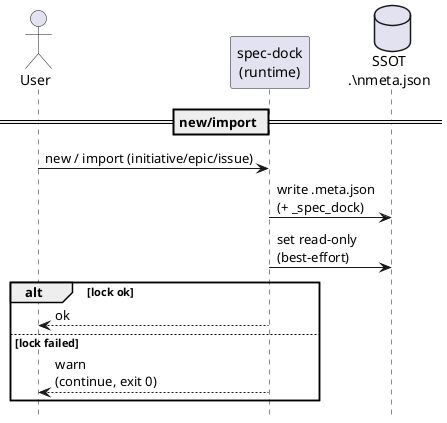
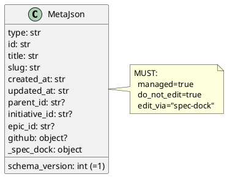
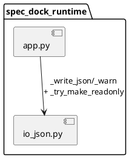

# iss-00012 メタデータ（.meta.json等）をコーディングエージェントから保護するガードレールを追加する — 設計（HOW）

## 目的・制約（要件から転記・圧縮） (必須)
- 目的:
  - SSOT の `spec-dock/initiatives/**/.meta.json` を tool-managed と自己記述し、かつ read-only（best-effort）にすることで、ローカルでの誤編集事故率を下げる。
  - メタファイルを dotfile 化（`.meta.json`）し、ユーザー操作ファイルと混ざりにくくする。
- MUST:
  - `.meta.json` に `_spec_dock` を追加し、最小スキーマ（`managed/do_not_edit/edit_via`）を満たす。
  - `new/import` で `.meta.json` を生成した直後に read-only 化を試行する（best-effort）。
  - read-only 化が失敗しても warn のみで継続（exit code 0）。
  - レガシー `meta.json` は `.meta.json` に移行（リネーム）できる（best-effort、内容は変更しない）。
- MUST NOT / OUT OF SCOPE:
  - CI / CODEOWNERS / pre-commit 等は追加しない（別 Issue）。
  - 既存ノードのメタデータ内容（JSONフィールド）を後追いで書き換えない（例: `_spec_dock` の backfill）。
- 非交渉制約:
  - 依存追加なし（stdlib only）。
  - `schema_version=1` を維持し、本 Issue は後方互換な追加のみ。
- 前提:
  - POSIX では write bit の除去を確認可能。
  - non-POSIX は best-effort の試行＋warn による可視化で良い。

---

## 既存実装/規約の調査結果（As-Is / 99.9%理解） (必須)
- 参照した規約/実装（根拠）:
  - `AGENTS.md`: runtime は stdlib only、tests は `unittest`、assets は scaffold API として扱う。
  - `src/spec_dock/assets/spec_dock/scripts/spec_dock_runtime/app.py`:
    - `_write_meta()`（.meta.json 生成箇所）
    - `_new_{initiative,epic,issue}()` / `_import_{initiative,epic,issue}()`（生成フロー）
  - `src/spec_dock/assets/spec_dock/scripts/spec_dock_runtime/io_json.py`:
    - `_write_json()`（JSON write、現状は権限操作なし）
- 観測した現状（事実）:
  - `.meta.json` は通常の JSON として作られ、read-only 化などのガードはない。
  - warn の標準フォーマットは `_warn()` が担っている（`spec-dock: (warn) ...`）。
- 採用するパターン（命名/責務/例外/DI/テストなど）:
  - best-effort で OS 依存操作を行う場合は、例外で落とさず warn を出して継続する。
  - runtime script の “安定した warn prefix” を守る（`_warn()` を利用）。
- 採用しない/変更しない（理由）:
  - 既存ノードのメタデータ内容の後追い更新（sync/validate での強制修正）は採用しない（スコープ外 + 予期せぬ副作用）。
  - CI / フック / CODEOWNERS の追加は採用しない（スコープ外）。
- 影響範囲（呼び出し元/関連コンポーネント）:
  - runtime asset の `app.py`（meta 生成）と `io_json.py`（I/O 補助）。
  - `uvx spec-dock init/update` でインストールされる runtime に影響するため、生成物のテストで差分検証が必要。

## 主要フロー（テキスト：AC単位で短く） (任意)
- Flow for AC-001:
  1) `new initiative|epic|issue` がノード用テンプレートをコピーする
  2) `_write_meta()` が meta dict を構築し、`.meta.json` を書き出す（`_spec_dock` を含む）
  3) `_write_meta()` が read-only 化を試行し、失敗時は warn のみで継続する
- Flow for AC-002:
  1) `import initiative|epic|issue` がテンプレートをコピーする
  2) `_write_meta()` が meta dict を構築し、`.meta.json` を書き出す（`_spec_dock` を含む）
  3) AC-001 と同様に read-only 化を試行する

### UML（任意） (任意)


## データ・バリデーション（必要最小限） (任意)
- MODEL-001: `.meta.json`（dotfile）
  - Fields（既存）:
    - `schema_version`（=1）
    - `type`（initiative|epic|issue）
    - `id` / `title` / `slug`
    - `created_at` / `updated_at`
    - `parent_id` / `initiative_id` / `epic_id`
    - `github.issue_number`（任意）
  - Fields（追加）:
    - `_spec_dock`（object）
      - `managed: true`（MUST）
      - `do_not_edit: true`（MUST）
      - `edit_via: "spec-dock"`（MUST）
  - Validation:
    - `_spec_dock` は “存在するだけ” ではなく、上記キー/値を満たすこと（受け入れ条件で検証）。
  - Legacy:
    - `meta.json`（旧ファイル名）は移行対象（`.meta.json` にリネームされうる）。内容は同一スキーマ。

### UML（任意） (任意)


## 判断材料/トレードオフ（Decision / Trade-offs） (任意)
- 論点: read-only の “成功判定” をどう扱うか（POSIX vs non-POSIX）
  - 選択肢A: `chmod` が例外を投げなければ成功扱い（検証しない）
    - Pros: 実装が単純、OS/FS 差を吸収しやすい
    - Cons: POSIX でも実際に write bit が残る可能性を見逃す
  - 選択肢B: POSIX のみ、chmod 後に write bit が外れたか検証する（外れていなければ warn）
    - Pros: POSIX での要件（write bit 除去）を確実に満たす
    - Cons: 実装が少し増える
  - 決定: **選択肢B**
  - 理由: 要件が POSIX では write bit 除去を観測可能としているため

- 論点: read-only 失敗時の扱い
  - 決定: warn のみで継続（exit code 0）
  - 理由: best-effort を要件で固定しているため

## インターフェース契約（ここで固定） (任意)
### API（ある場合）
- （なし）runtime CLI の外部インターフェース追加は行わない。

### 関数・クラス境界（重要なものだけ）
- IF-001: `spec_dock_runtime/app.py::_write_meta(dest_dir: Path, ...) -> None`
  - 役割: meta dict の構築、`.meta.json` 書き込み、read-only 化（best-effort）
  - Errors/Exceptions:
    - JSON write（I/O）で失敗する場合は現状どおり例外（新規作成の根幹のため）
    - read-only 化の失敗は例外にしない（warn）
- IF-002: `spec_dock_runtime/io_json.py::_try_make_readonly(path: Path) -> tuple[bool, str | None]`
  - Input: `.meta.json` の `Path`
  - Output:
    - `ok`: read-only 化が成功した
      - POSIX（Linux/macOS 等）: write bit が外れた（`chmod a-w` 相当）
      - non-POSIX（Windows 等）: read-only 化を試行し、例外なく完了した（検証不能な場合は “試行できた” を成功扱い）
    - `error_message`: 失敗時の原因（OSError 等の文字列）
  - Errors/Exceptions: 例外は外に投げず、呼び出し側が warn を出せる形で返す

### UML（任意） (任意)


### クラス/インターフェース詳細設計（主要なもの） (任意)
> この Issue を “単独の作業単位” として完結させるために、必要な範囲だけ詳細化する。

- この Issue は既存の関数追加/変更で完結する（新規クラス/Protocol は追加しない）。

### 例外/エラー契約（重要なものだけ） (任意)
- ERR-001: `.meta.json` write 失敗
  - 発生条件: `Path.write_text` などが失敗（ディスク/権限/パス不正）
  - 返し方: 既存どおり例外でコマンド失敗（生成そのものが成立しないため）
- ERR-002: read-only 化 失敗（best-effort）
  - 発生条件: `chmod` が失敗、または（POSIX）chmod 後も write bit が残る
  - 返し方: warn のみで継続（exit code 0）
  - ログ: `spec-dock: (warn) ...`（read-only 化失敗を示す文言を含める）

## 変更計画（ファイルパス単位） (必須)
- 追加（Add）:
  - なし
- 変更（Modify）:
  - `src/spec_dock/assets/spec_dock/scripts/spec_dock_runtime/app.py`: `_write_meta()` に `_spec_dock` を追加し、read-only 化を試行する（`.meta.json` へ出力）
  - `src/spec_dock/assets/spec_dock/scripts/spec_dock_runtime/io_json.py`: read-only 化ヘルパー（例: `_try_make_readonly`）を追加し、warn に必要な情報を返す
  - `src/spec_dock/assets/spec_dock/templates/**`: wrapper が参照するメタファイル名を `.meta.json` に更新する
  - `src/spec_dock/assets/spec_dock/docs/**`: `meta.json` 表記を `.meta.json` に更新する
- 削除（Delete）:
  - なし
- 移動/リネーム（Move/Rename）:
  - SSOT: node directory の `meta.json` → `.meta.json`（best-effort の移行を追加）
- 参照（Read only / context）:
  - `spec-deps/current/requirement.md`: 受け入れ条件・スコープの SSOT
  - `spec-deps/current/adrs/adr-00002-ssot-meta-dotfile.md`: 意思決定（dotfile 化 + 自己記述 + read-only）
  - `spec-deps/current/adrs/adr-00001-meta-json-tool-managed-readonly.md`: 旧ADR（superseded、経緯参照）

## マッピング（要件 → 設計） (必須)
- AC-001 → IF-001, IF-002, `app.py::_write_meta`, `io_json.py::_try_make_readonly`
- AC-002 → IF-001, IF-002（import も `_write_meta` を通る）
- EC-001 → `io_json.py::_try_make_readonly`（失敗理由の収集）+ `app.py`（warn と継続）
- EC-002 → 実装方針（sync/validate はレガシーのリネーム移行のみ行い、内容/backfill/relock は行わない）
- 非交渉制約（依存追加なし）→ `io_json.py` に stdlib のみで実装

## テスト戦略（最低限ここまで具体化） (任意)
- 追加/更新するテスト:
  - Unit（unittest）:
    - `new issue` 等の生成結果として `.meta.json` が `_spec_dock` を含むこと
    - （POSIX）`.meta.json` の write bit が外れていること（環境差がある場合は skip か best-effort）
    - read-only 化が失敗した場合に warn が出ること（prefix: `spec-dock: (warn)` / モックで `chmod` を失敗させる）
    - レガシー `meta.json` が `.meta.json` へ移行され、内容が不変であること（移行時に後追い lock/backfill をしない）
    - `.meta.json` と `meta.json` が共存する場合に `.meta.json` を正として扱い、`.meta.json` を上書きしないこと（warn を出す）
- どのAC/ECをどのテストで保証するか:
  - AC-001/AC-002 → `tests/*`（runtime 生成物検証）
  - EC-001 → `tests/*`（chmod 失敗時 warn + exit code 0 の検証）
  - EC-002 → `tests/*`（既存 `meta.json` が `.meta.json` へ移行され、内容と write bit が不変であること）

### テストマトリクス（AC/EC → テスト） (任意)
- AC-001:
  - Unit: meta の `_spec_dock` 検証 + （POSIX）mode 検証
- AC-002:
  - Unit: import 経由でも `_spec_dock` 検証
- EC-001:
  - Unit: chmod 失敗をモックし、warn（prefix: `spec-dock: (warn)`）+ exit 0 を検証
- EC-002:
  - Unit:
    - Case1: レガシー `meta.json` のみ存在する場合に、`sync/validate` により `.meta.json` へ移行されること、かつ内容/backfill/relock が発生しないことを検証
    - Case2: `.meta.json` と `meta.json` が共存する場合に、`.meta.json` を上書きしないこと + warn が出ることを検証
- 非交渉制約（requirement.md）をどう検証するか:
  - 制約: 依存追加なし
    - 検証方法: `pyproject.toml` の依存増加が無いことをレビューで確認
  - 制約: schema_version=1 維持
    - 検証方法: meta の出力をテストで確認
- 実行コマンド（該当するものを記載）:
  - `python -m unittest discover -v`
- 変更後の運用（必要なら）:
  - ロールバック: read-only 化処理を無効化する（コード側の revert）

## リスク/懸念（Risks） (任意)
- R-001: read-only が正当な修正の妨げになる
  - 影響: ユーザーが `.meta.json` を更新できず混乱する可能性
  - 対応: 本 Issue では unlock/lock CLI は追加しないが、必要なら別 Issue で導線を追加する
- R-002: 環境差で read-only の保証が弱い
  - 影響: 事故を完全には防げない
  - 対応: best-effort を前提に、自己記述 + warn で可視化する

## 未確定事項（TBD） (必須)
- なし（requirement.md / ADR で意思決定済み）

---

## ディレクトリ/ファイル構成図（変更点の見取り図） (任意)
```text
<repo-root>/
├── src/spec_dock/assets/spec_dock/scripts/spec_dock_runtime/
│   ├── app.py                         # Modify: _write_meta に _spec_dock + lock 追加
│   └── io_json.py                     # Modify: _try_make_readonly を追加
└── spec-deps/current/
    ├── requirement.md                 # Read only (SSOT)
    ├── design.md                      # This
    └── adrs/
        ├── adr-00001-*.md             # Read only (decision; superseded)
        └── adr-00002-*.md             # Read only (decision; current)
```

## 省略/例外メモ (必須)
- 該当なし
